# 存算一体编译器对接底层编译器（GML）技术文档

日期：2026-09-15

---

## 1. 概述

### 1.1 目标

在现有链路末端新增一条出口，产出目标平台底层编译器可直接消费的图文件与运行时二进制。

原链路：


新增出口：

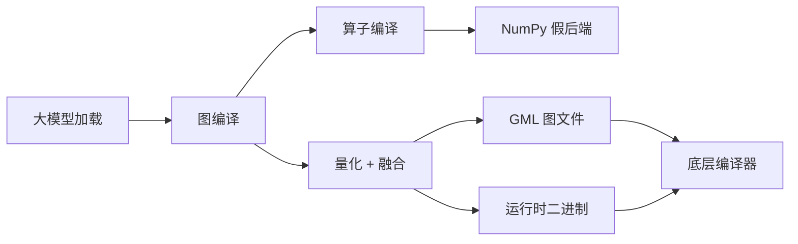

### 1.2 交付物

产物存放在仓库的相对路径 `gml-artifacts/<模型>_<层数>_<序列长度>/` 下。
当前已导出一份：

```
gml-artifacts/llama2_7b_layers2_seq128/
├── README.md                  产物说明与校验命令
├── relay2gml_graph.gml        计算图，35792 字节
├── weight_buffer_*.bin        15 个定点 4 位权重
├── weight_sf_*.bin            15 个权重缩放系数
├── input_buffer_*.bin         95 个数据缓冲区
└── input_sf_*.bin 等          94 个激活缩放系数
```

共 221 个文件、570 MB。已加入版本忽略清单，不入版本库。

| 产物 | 内容 |
| --- | --- |
| `relay2gml_graph.gml` | 整算子级计算图，文件名与参考产物一致 |
| `*.bin` | 权重、量化参数、数据缓冲区 |

### 1.3 参考资料

**基准是 llama2 的实物**，它与本方案的目标模型一致。

| 资料 | 规模 | 定位 |
| --- | --- | --- |
| **llama2 W4A8 的 GML** | 200 节点 / 331 边，3235 个文件 | **主基准**：目标模型，量化方式与算子细节以它为准 |
| ResNet50 的 GML | 74 节点 / 89 边，1171 个二进制文件 | 辅助：早期用于归纳格式基本规则 |
| 格式规范文档 | 20 页 | 字段含义 |
| 对接问题答复 | 8 条 | 边界约束 |

为什么以 llama2 为准：两份实物的量化方式相反（ResNet50 全静态、llama2 全动态），
结构也不同（单入口单出口对多入口多出口）。**凡有冲突以 llama2 为准**——早期从
ResNet50 归纳的三条规则已被它推翻，见 9.1 节。

llama2 实物的路径：

```
/media/disk/fengjingge/src/xinfangzhou-resource/llama2_w4a8_decode_block_0/
├── parser_output/relay2gml_graph.gml    计算图
├── parser_output/*.bin                  3235 个运行时文件
└── prepare_out/txt_files/               424 个参数文本
```

### 1.4 当前状态

**能产出格式合法的 GML 与二进制，权重数值可证；但与目标模型的实物相比，
注意力部分的表达粒度不同，动态定标尚未实现。**

分三句说清：

| 方面 | 状态 |
| --- | --- |
| 格式与结构 | 合法且自洽，通过五条规则与第三方解析 |
| 权重数值 | **可证**，与真实权重反量化比对通过 |
| 覆盖完整度 | **不足**，以节点数计约为实物的四分之一，见 9.1 节 |

不能说「产物正确」，只能说「格式与权重在可验证范围内未发现错误，覆盖面有明确缺口」。
边界见第 9 章与第 10 章。

一处需要特别说明：**本方案只受量化与算子融合影响**。图编译器既有的切分、放置、
内存规划、通信计划对 GML 生成**零贡献**——不是遗漏，而是 GML 格式本身不表达这些，
详见 9.2 节。

### 1.5 关键结论

底层编译器的输入是 GML，且**当前不支持存算一体的布局映射与代码生成**。这意味着
存算一体语义必须由 GML 属性携带，不能假设下游理解。

同时，对方明确答复不支持跨设备通信与跨设备地址空间，所以切分与放置信息**不下推**，
继续留在主机编排器。

---

## 2. 原理

### 2.1 三重错位

把 GML 与现有两级编译器摆在一起，差距不是缺少若干算子。

| 维度 | GML（终点） | 图编译器（原状） | 存算中间表示（原状） |
| --- | --- | --- | --- |
| 粒度 | 整算子，已融合 | 整算子 | 分块级 |
| 数值 | 定点 4 位与 8 位 | 浮点 | 浮点 |
| 量化参数 | 每算子 6 至 8 组 | 无 | 无 |
| 融合 | 强制 | 无 | 无 |
| 单元配置 | 三段模式 | 无 | 无 |
| 激活实现 | 查找表 | 算术 | 算术 |
| 权重 | 已量化二进制 | 浮点分片 | 不涉及 |
| 硬件放置 | **不表达** | 有，多余 | 有，多余 |

三重错位：

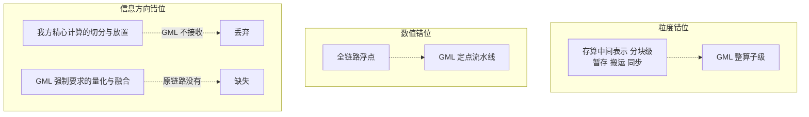

第三条最易被忽略：实测扫描全部硬件放置字段在 GML 中均不存在，唯一命中的是卷积
分组数与矩阵乘的操作数标记。

### 2.2 架构选择

三种方案：

| 方案 | 做法 | 问题 |
| --- | --- | --- |
| 甲 | 图编译器直接产出 GML，算子编译器不参与 | 最省事，但扩充中间表示原语的目标落空 |
| 乙 | 图编译器发中间表示文本，算子编译器全权产出 | 大量二进制需穿过中间表示，不可行 |
| **丙（采用）** | **中间表示承载语义，图编译器拥有数据** | 需保证两侧命名一致 |

分界线：**中间表示表达「算什么、如何配置单元」，图编译器负责「数据是什么」。**

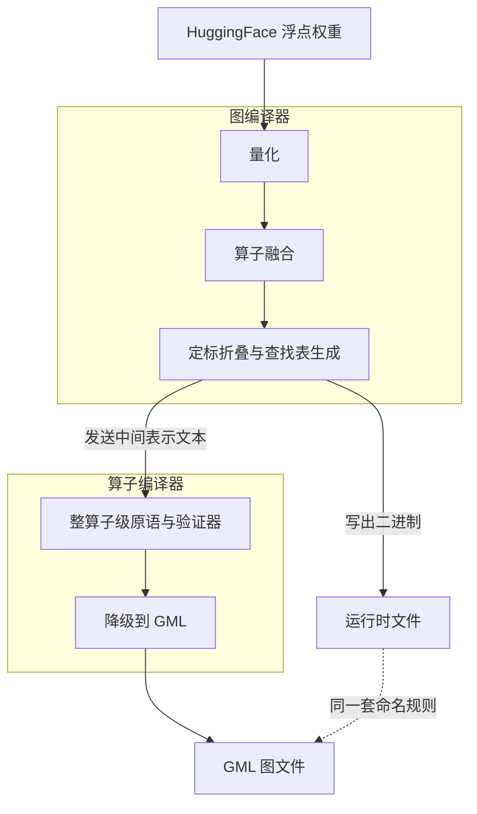

二进制不进入中间表示，两侧靠同一套命名规则对齐。这是方案丙唯一的结构性风险，
应对措施见 5.4 节。

### 2.3 为什么量化参数是操作数而非属性

矩阵乘的缩放系数、零点、偏置都设计成静态单赋值操作数，只有「布局」放在属性里。

理由：缩放系数是**真实数据**，放在属性里会让它对普通数据流分析不可见；而它的布局
（整张量共享、按通道、按分组）是**机器配置**，属性才是正确位置。

### 2.4 为什么两个层级的原语并存

| 层级 | 原语 | 服务的下游 |
| --- | --- | --- |
| 分块级 | 数据搬运、暂存分配、同步屏障、点积 | 生成 C 代码，NumPy 执行 |
| 整算子级 | 矩阵乘、查找表、归一化，加数据通路属性 | GML，底层编译器 |

分块级信息在 GML 里**没有落点**，反之整算子级的窗口几何、按通道缩放在原有中间表示里
**不存在**。两层不是替代关系，是并列的两个出口。

这也决定了整算子级原语的**生产者是图编译器，不是原有的降级流程**。

---

## 3. GML 格式规则

全部规则由脚本从两份参考产物逐条验证得出，不是从规范文档推测的。

### 3.1 五条结构规则

#### 规则一：融合是强制的

参考产物里激活算子**从不作为独立节点出现**，全部折在主算子的融合块内。

ResNet50 的融合形态：

| 主算子 | 融合块内 | 次数 |
| --- | --- | ---: |
| 卷积 | 激活 | 32 |
| 逐元素加 | 激活 | 16 |
| 卷积 | 激活 加 池化 | 1 |

最后一行说明**一个融合块可装两个算子**。规范文档那句「激活节点**或**卷积后的池化」里
的「或」不是互斥，两者可同时折入，顺序是主算子、激活、池化。

所以产出 GML 之前必须完成融合，否则结果不可表达。

#### 规则二：缓冲区按消费者编号

最反直觉的一条。某节点的输出缓冲区文件名里写的是它**下游**节点的编号，因为缓冲区
代表的是「边」而不是「某节点的输出」。

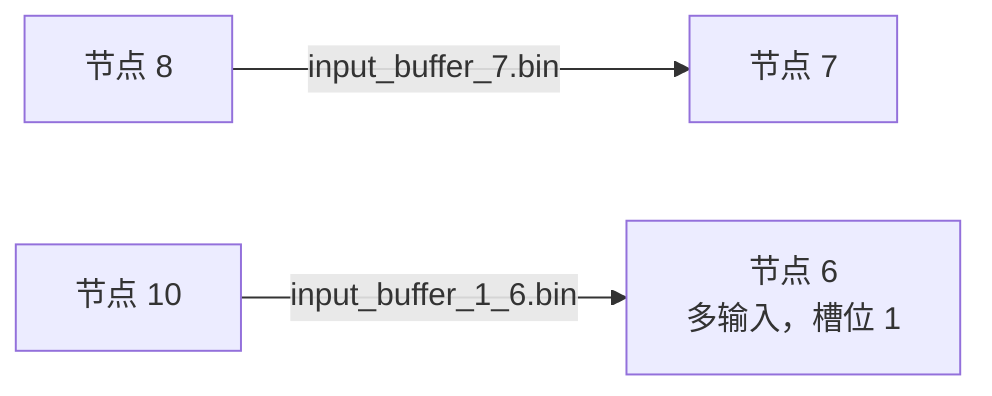

命名格式：

| 情形 | 格式 |
| --- | --- |
| 单输入消费者 | `input_buffer_<消费者编号>.bin` |
| 多输入消费者 | `input_buffer_<槽位>_<消费者编号>.bin` |

llama2 实物里还存在**第二种约定**：动态定标类节点用 `output_buffer_<自身编号>.bin`，
即按生产者命名。两种并存。

#### 规则三：形状只在边上

节点内不带任何形状字段，形状全部在边的属性里，格式形如 `1x64x56x56`。
边不是可省的装饰，是唯一的形状来源。

#### 规则四：边是数据流方向，编号不含顺序

边的方向是数据流方向，但节点编号**反向**。ResNet50 的 89 条边里 84 条是编号递减方向。

生成时不能假设编号递增等于执行顺序。执行顺序由对方的分析器自行推导。

对入口出口的要求：**每个入口与出口都必须是缓冲区节点**。不要求恰好一个——
llama2 的解码块有 7 个入口（隐藏状态、键值缓存、掩码等）和 3 个出口。

#### 规则五：不产出的字段

| 字段类别 | 规范文档说明 | 实测出现次数 |
| --- | --- | ---: |
| 虚拟输入输出 | 由分析器自行推导 | 0 |
| 前后任务 | 由分析器确定执行流 | 0 |
| 执行编号 | 规范文档说需要它 | **0** |
| 子网络 | 当前未使用 | 0 |
| 残差输入缓冲区 | 标注为「无关」 | **139** |
| 残差输出缓冲区 | 标注为「无关」 | **89** |

两处不一致值得注意：残差缓冲区字段被规范文档称作「无关」，但实测大量存在，且验证
规则二时正是靠它确认缓冲区归属。所以**照实测产出，不照规范省略**。

### 3.2 运行时二进制的构成

以 ResNet50 的一个卷积节点为例，每个字节都能被形状解释：

| 文件 | 字节数 | 解释 |
| --- | ---: | --- |
| 权重 | 2359296 | 512×512×3×3 定点权重 |
| 输入激活 | 25088 | 512×7×7 定点激活 |
| 偏置 | 2048 | 512 个 32 位整数 |

关键区分——**输入与权重的量化是整张量共享一个标量，累加后的定标是按通道的数组**：

```
输入缩放系数      2 字节    ← 标量
权重缩放系数      2 字节    ← 标量（ResNet50）
按通道定标系数    1024 字节 ← 512 个，等于输出通道数
按通道偏置        2048 字节 ← 512 个
```

### 3.3 单算子的完整数据通路

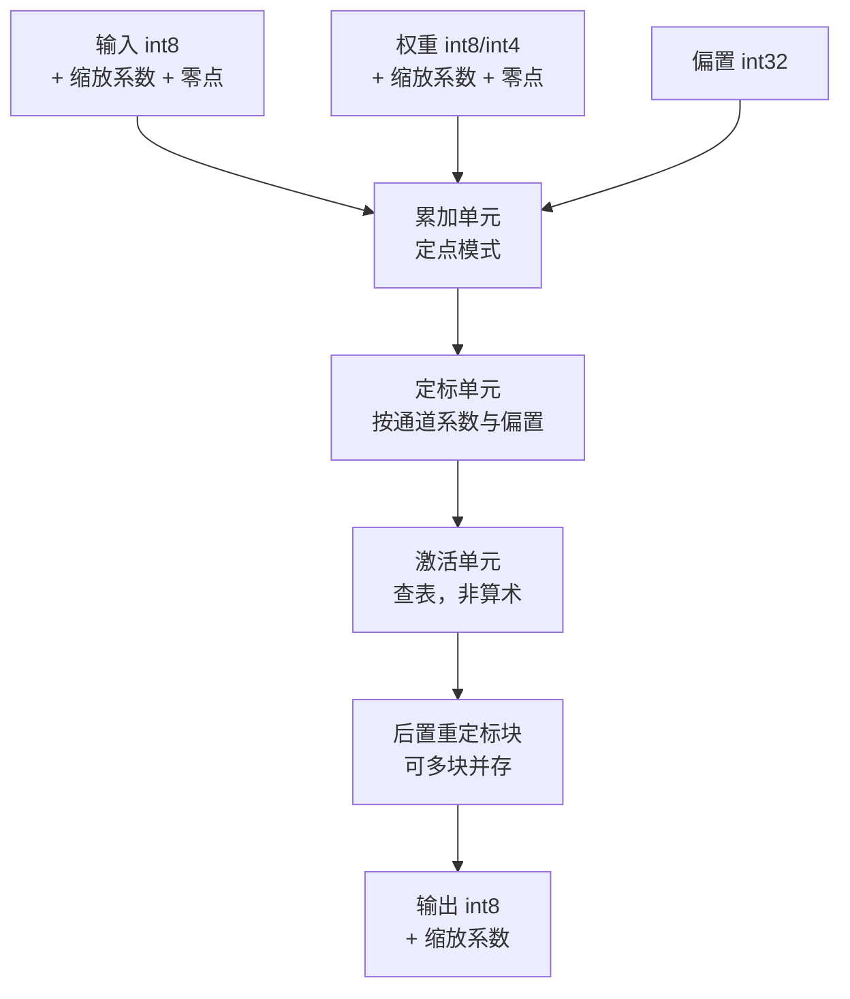

各段模式的实测取值：

| 字段 | ResNet50 | llama2 |
| --- | --- | --- |
| 累加模式 | 定点 | 定点 |
| 定标模式 | 定点 | 定点 |
| 后置重定标 | 标量 | 标量 |
| 激活寻址 | 常规 | 常规 |

### 3.4 参考产物差异对照

llama2 实物与 ResNet50 的关键差异，直接决定实现取向。

| 维度 | ResNet50 | llama2 W4A8 |
| --- | --- | --- |
| 量化方式 | **全静态** | **全动态** |
| 权重位宽 | 8 位 | **4 位** |
| 权重量化粒度 | 整张量 | **按 128 分组** |
| 缓冲区命名 | 仅按消费者 | 消费者与生产者两种 |
| 入口出口数 | 各 1 个 | 7 个与 3 个 |
| 后置重定标块 | 仅甲块 | **甲乙两块** |
| 激活查找表 | 稀疏，26 项非零 | **密集，约 100 项** |
| 算子种类 | 8 种 | 17 种 |

---

## 4. 实现

### 4.1 四段流水线

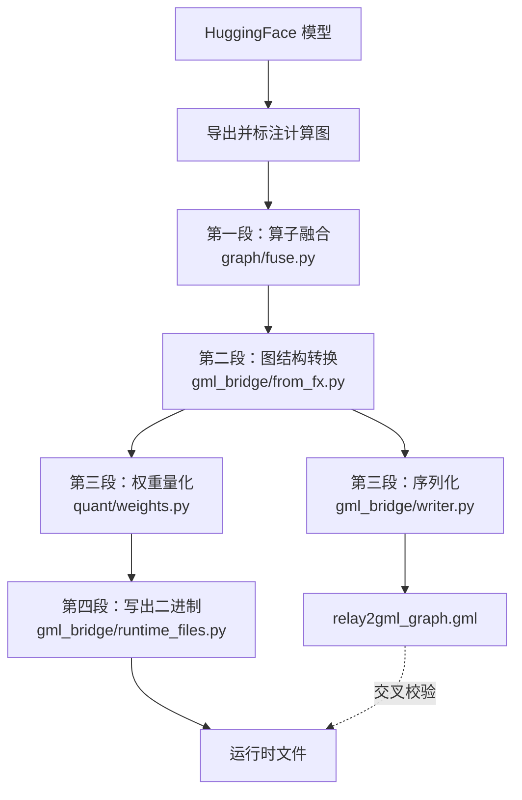

| 段 | 职责 | 归属 |
| --- | --- | --- |
| 一 | 把激活与池化折进主算子 | 图编译器与算子编译器各一份 |
| 二 | 计算图转成整算子节点与边 | 图编译器 |
| 三 | 序列化成文本；权重量化 | 图编译器 |
| 四 | 按命名规则写出二进制，交叉校验 | 图编译器 |

### 4.2 算子编译器侧：中间表示扩充

在原有分块级原语之外，新增整算子级分层。

新增枚举 9 个：

| 枚举 | 取值 | 对应硬件概念 |
| --- | --- | --- |
| 功能单元 | 矩阵、向量、激活、搬运 | 哪个单元执行该算子 |
| 数值模式 | 浮点、定点、定点转浮点 | 数据通路格式 |
| 数据扩展 | 有符号、无符号、浮点 | 补足中间表示整型无符号性缺失 |
| 量化粒度 | 整张量、按通道、按分组 | 缩放系数布局 |
| 后置重定标模式 | 6 种 | 重定标块配置 |
| 激活种类 | 11 种 | 查找表求值的函数 |
| 查找表寻址 | 常规、偶、奇 | 两算子共用一张物理表 |
| 逐元素种类 | 6 种 | 二元逐元素运算 |
| 池化种类 | 最大、平均、全局平均 | 池化归约 |

新增属性 8 个：

| 属性 | 描述内容 |
| --- | --- |
| 量化规格 | 缩放系数集合的布局，含分组大小与轴 |
| 数据通路 | 累加与定标模式，加后置重定标块列表 |
| 后置重定标块 | 单个物理块的配置，含块标识 |
| 激活规格 | 折入主算子的激活配置 |
| 池化规格 | 折入主算子的池化配置 |
| 窗口几何 | 卷积与池化的核、步长、填充、扩张、分组 |
| 一级缓存空间 | 功能单元私有存储 |
| 二级缓存空间 | 单设备内共享存储 |

新增算子 22 个，按用途归类：

| 类别 | 算子 |
| --- | --- |
| 量化 | 量化、反量化 |
| 计算 | 矩阵乘、卷积、逐元素、池化、按轴归约 |
| 激活与归一化 | 查找表、归一化、归一化指数 |
| 注意力 | 旋转位置编码、掩码、键值缓存搬运、按头切分 |
| 形状 | 转置、重塑、切分、拼接 |
| 参数 | 命名参数引用 |
| 片上存储 | 缓冲区分配、缓冲区拷贝、权重解压 |

新增编译阶段一个：把主算子后跟的激活与池化折成单节点。

### 4.3 图编译器侧：模块职责

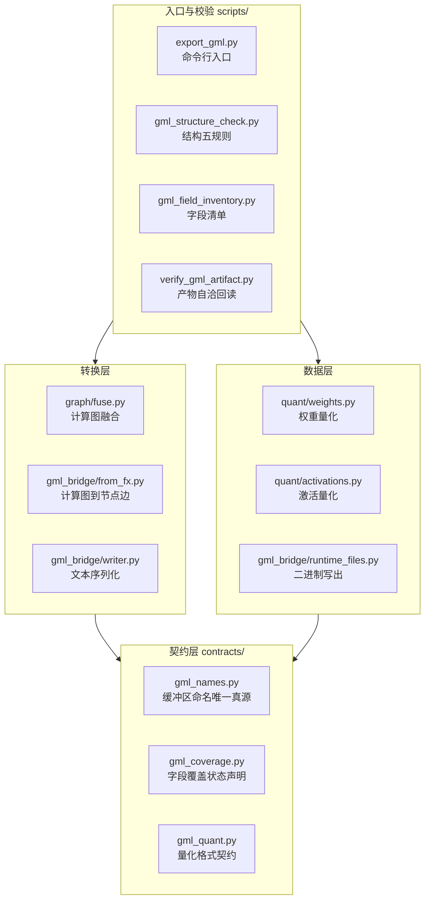

### 4.4 关键设计取舍

#### 融合用属性而非区域

融合块只装主算子加激活加可选池化，所以给主算子加两个可选属性即可，不需要区域，
不需要新算子，与 GML 一一对应。激活前的中间态在静态单赋值形式里就是主算子结果值的
类型，天然表达。

#### 定标系数不是量化因子

这是排查过程中最关键的一处认识修正。参考产物里的定标系数字段承载的是**算子自身的
数学缩放**，不是输入乘权重除输出的量化因子。

llama2 实物的定标系数取值分布：

| 取值 | 数量 | 含义 |
| --- | ---: | --- |
| 注意力头维度的负平方根 | 32 | 与注意力头数一致，是缩放因子 |
| 1.0 | 37 | 不缩放 |
| 0.5 与 0.25 | 各 1 | 二的幂次修正 |
| 2.0 | 2 | 键值缓存搬运 |

量化定标全部由按分组的权重缩放系数与整张量的输入输出缩放系数承担。

#### 定点权重一字节一值

实测权重缓冲区的字节数等于元素数，值域严格落在 4 位有符号范围，16 个值全覆盖。
所以是一字节存一个值，**不打包**，高 4 位是符号扩展。

#### 激活缩放系数发占位是正确的

两条依据：计算图的元数据是伪张量，编译期取不到激活数值；实物里 30% 的输入缩放系数
就是 1.0，配合动态量化标志全为 1，说明真值由硬件在归约阶段算出。

---

## 5. 改动清单

### 5.0 三个仓库的改动总览

本方案涉及三个仓库，改动量差异很大。

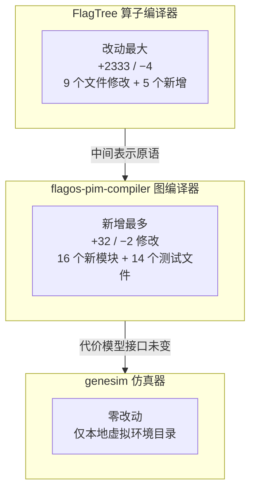

| 仓库 | 修改既有文件 | 新增文件 | 本方案是否触碰核心逻辑 |
| --- | --- | --- | --- |
| FlagTree | 9 个，`+2333 / −4` | 5 个，共 1000 行 | 是，新增整算子级分层 |
| flagos-pim-compiler | 5 个，`+32 / −2` | 26 个：模块 2422 行 + 测试 2259 行 | 是，新增完整出口 |
| **genesim** | **0** | **0** | **否** |

说明：FlagTree 的 `+2333` 是 `git diff` 统计的既有文件净增量；1000 行是五个新增文件
（一个编译阶段实现加四个测试文件）的行数，两者不重叠。

#### FlagTree 改了什么

新增整算子级中间表示分层，与原有分块级并列。原有的分块级原语、四个编译阶段中的三个
（显式搬运、按预算分块、降级到 C 代码）**一行未动**。

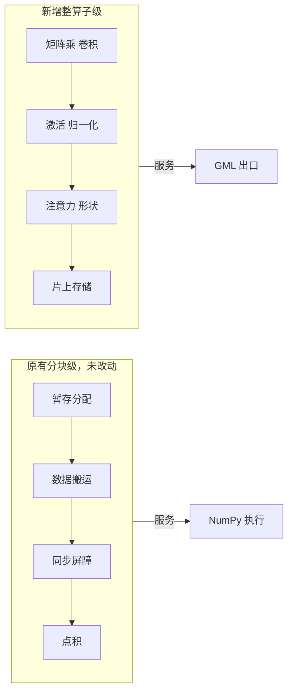

#### flagos-pim-compiler 改了什么

四个既有文件的改动都很小，且都是增量：

| 文件 | 改动 | 内容 | 是否影响既有行为 |
| --- | ---: | --- | --- |
| `genesim_bridge/paths.py` | `+22` | 两个参考产物目录的解析函数 | 否，未触碰任何既有解析函数 |
| `paths.json` | `+4 / −1` | 两个参考产物路径配置 | 否，仅新增键 |
| `contracts/graph_meta.py` | `+2` | 融合结果的元数据键 | 否，仅新增常量 |
| `CLAUDE.md` | `+2 / −1` | 把算子融合从后续阶段移出 | 否，是约束说明的修正 |

其余全是新增文件，不影响任何既有路径。

#### genesim 为什么零改动

三条依据：

| 依据 | 实测 |
| --- | --- |
| 仓库状态 | 只有本地虚拟环境目录，无代码改动 |
| 桥接模块 | 仅新增两个解析函数，既有接口未变 |
| 全流程闭环 | 代价模型输出 1418.109，与既有基线**完全一致** |

原因是架构上 GML 与仿真器是**两个独立出口**：仿真器消费的是分块级中间表示里的
计算量与访存量，GML 消费的是整算子级的图与量化参数。两者互不依赖。

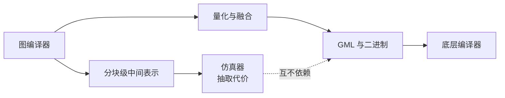

### 5.1 算子编译器（FlagTree）

净改动 `+2333 / −4`，共 9 个文件修改、5 个文件新增。

| 文件 | 改动 | 内容 |
| --- | ---: | --- |
| `include/triton/Dialect/TritonPIM/IR/PIMOps.td` | +726 | 22 个整算子级原语定义 |
| `include/triton/Dialect/TritonPIM/IR/PIMAttrDefs.td` | +408 | 9 个枚举、8 个属性、2 个存储空间 |
| `include/triton/Dialect/TritonPIM/IR/PIMTypes.td` | +14 | 片上存储的类型约束 |
| `include/triton/Dialect/TritonPIM/IR/Dialect.h` | +19 | 存储资源与模块属性名 |
| `include/triton/Dialect/TritonPIM/Transforms/Passes.td` | +39 | 融合阶段声明 |
| `lib/Dialect/TritonPIM/IR/Ops.cpp` | +658 | 22 个原语的验证器 |
| `lib/Dialect/TritonPIM/IR/Dialect.cpp` | +159 | 属性验证器与模块属性查找 |
| `lib/Dialect/TritonPIM/IR/Types.cpp` | +9 | 存储空间判定 |
| `lib/Dialect/TritonPIM/Transforms/CMakeLists.txt` | +1 | 接入新文件 |
| `lib/Dialect/TritonPIM/Transforms/FuseActivation.cpp` | **新增 142** | 融合阶段实现 |
| `test/Dialect/TritonPIM/operator_ops.mlir` | **新增 81** | 量化与数据通路往返 |
| `test/Dialect/TritonPIM/operator_shape_ops.mlir` | **新增 216** | 激活、形状、注意力原语往返 |
| `test/Dialect/TritonPIM/operator_ops_negative.mlir` | **新增 359** | 30 条非法输入必须被拒绝 |
| `test/Dialect/TritonPIM/fuse_activation.mlir` | **新增 202** | 融合的 9 个场景 |

关键函数：

| 位置 | 函数 | 职责 |
| --- | --- | --- |
| `FuseActivation.cpp` | `isFusionTarget` | 判断算子能否持有融合块 |
| `FuseActivation.cpp` | `activationSpecOf` | 把独立激活转成属性 |
| `FuseActivation.cpp` | `fuse` | 折叠并改接结果类型 |
| `Ops.cpp` | `verifyQuantOperand` | 缩放系数数量与粒度是否相符 |
| `Ops.cpp` | `verifyComputeUnit` | 拒绝把计算派给搬运单元 |
| `Ops.cpp` | `normalizeAxis` | 负轴规范化，绕开无符号取值陷阱 |
| `Dialect.cpp` | `DatapathAttr::verify` | 重定标块不得重复配置 |

### 5.2 图编译器（flagos-pim-compiler）

净改动 `+32 / −2`（5 个文件），新增 16 个模块共 2422 行。

#### 契约层

| 文件 | 行数 | 主要接口 |
| --- | ---: | --- |
| `contracts/gml_names.py` | 137 | `data_buffer`、`weight_buffer`、`weight_scale`、`fpsu_scale`、`activation_lut` 等 21 个命名函数 |
| `contracts/gml_coverage.py` | 113 | `all_declared`、`undeclared`，以及四类字段族声明 |
| `contracts/gml_quant.py` | 135 | `QuantLayout`、`attention_scale`、`lut_identity`、`lut_placeholder` |

#### 转换层

| 文件 | 行数 | 主要接口 |
| --- | ---: | --- |
| `graph/fuse.py` | 154 | `fuse_graph`、`format_fusions`、`FusedTail` |
| `gml_bridge/from_fx.py` | 291 | `convert`，内部含 `_tensor_inputs`、`_contraction_of`、`_weight_param_of` |
| `gml_bridge/writer.py` | 102 | `write_gml`、`Node`、`Edge` |

#### 数据层

| 文件 | 行数 | 主要接口 |
| --- | ---: | --- |
| `quant/weights.py` | 73 | `quantize_weight`、`quantization_error`、`QuantizedWeight` |
| `quant/activations.py` | 80 | `quantize_activation`、`QuantizedActivation` |
| `gml_bridge/runtime_files.py` | 137 | `write_weight`、`write_data_buffer`、`write_identity_lut`、`verify_against_graph` |

#### 入口与校验

| 文件 | 行数 | 主要接口 |
| --- | ---: | --- |
| `gml_bridge/export.py` | 223 | `export_graph`、`export_llama2`、`write_artifact`、`write_runtime_files` |
| `scripts/export_gml.py` | 130 | 命令行入口，含 `_check_structure` |
| `scripts/gml_structure_check.py` | 253 | 五条规则的检查函数 |
| `scripts/gml_field_inventory.py` | 186 | `field_families`、`classify`、`normalize` |
| `scripts/verify_gml_artifact.py` | 408 | 10 项自洽性回读检查 |

#### 修改的既有文件

| 文件 | 改动 | 说明 |
| --- | --- | --- |
| `contracts/graph_meta.py` | +2 | 新增融合结果的元数据键 |
| `genesim_bridge/paths.py` | +22 | 两个参考产物目录的解析函数，纯增量 |
| `paths.json` | +4 | 两个参考产物路径配置 |
| `CLAUDE.md` | +2 / −1 | 把算子融合从后续阶段移出，GML 强制要求 |

### 5.3 测试清单

| 文件 | 用例数 | 覆盖内容 |
| --- | ---: | --- |
| `tests/test_fuse.py` | 10 | 融合的正例与四类拒绝条件 |
| `tests/test_gml_names.py` | 8 | 命名规则双向校验 |
| `tests/test_gml_writer.py` | 8 | 文本格式细节 |
| `tests/test_gml_from_fx.py` | 10 | 计算图到 GML 的端到端 |
| `tests/test_gml_export.py` | 11 | 导出入口与权重落盘 |
| `tests/test_gml_coverage.py` | 7 | 字段覆盖声明与实现一致 |
| `tests/test_gml_reference.py` | 8 | ResNet50 实物的规则校验 |
| `tests/test_gml_llama2_reference.py` | 11 | llama2 实物的规则与算子覆盖 |
| `tests/test_gml_quant.py` | 12 | 量化契约与实物交叉验证 |
| `tests/test_quant_weights.py` | 8 | 权重量化 |
| `tests/test_quant_activations.py` | 10 | 激活量化 |
| `tests/test_runtime_files.py` | 11 | 二进制写出与交叉校验 |
| `tests/test_verify_gml_artifact.py` | 12 | 自洽性检查器本身会失败 |
| `tests/test_export_gml_cli.py` | 5 | 命令行入口 |
| **合计** | **131** | |

### 5.4 跨语言一致性的应对

方案丙的唯一结构性风险：文件名由算子编译器（C++）写进 GML，文件本身由图编译器
（Python）写出，两侧不一致就是悬空引用，而这**不会在我方报错**，要到对方的解析器才暴露。

三道措施：

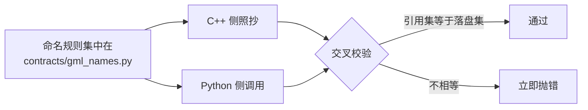

| 措施 | 实现 |
| --- | --- |
| 单一真源 | 全部命名逻辑集中在一个文件，C++ 侧照抄 |
| 双向校验 | `verify_against_graph` 检查引用集与落盘集完全相等，两个方向都查 |
| 覆盖率验证 | 命名规则必须能生成参考产物的全部文件名 |

---

## 6. 验证

### 6.1 核心难题：产物无法执行

底层编译器不支持存算一体，也没有硬件，所以产物交出去之后我方无法运行。
「生成得对不对」只能从三个角度逼近。

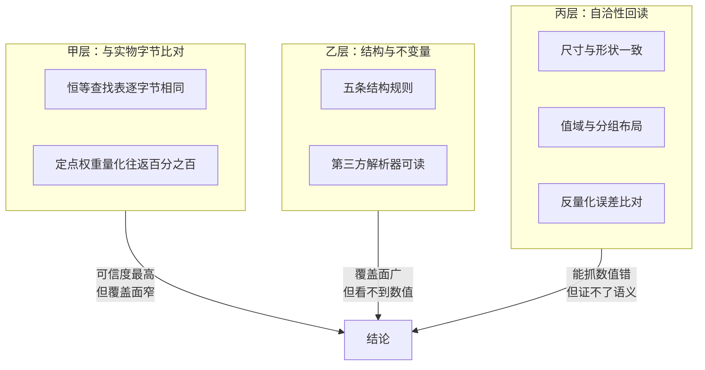

三层的能力边界：

| 层 | 能抓什么 | **抓不到什么** |
| --- | --- | --- |
| 甲 | 一切 | 只对语义已确认的部分可行 |
| 乙 | 格式、拓扑、命名 | **二进制内容与数值** |
| 丙 | 尺寸、值域、布局、张量对应关系 | 语义是否符合硬件预期 |

乙层最易产生虚假信心：**结构校验只看图，不看二进制**。一个把缓冲区尺寸写错一半、
或缩放系数与权重错位的产物，乙层照样五条全过。

### 6.2 甲层：字节级比对

只有两处可做，因为它们不依赖尚未确认的采样规则。

| 项 | 结果 |
| --- | --- |
| 恒等查找表与实物比对 | **逐字节完全相同** |
| 定点权重量化往返 | **16777216 / 16777216 = 100%** |

第二条同时验证三件耦合的事：分组大小为 128、每组一个半精度缩放系数、一字节一个
定点值。三者只有全对才可能达到百分之百。

### 6.3 乙层：结构与独立解析

#### 五条结构规则

三份 GML 同时通过是这套规则可靠的最强证据。单一样本上成立的规则很可能只是那个样本
的特性。

| 对象 | 规模 | 结果 |
| --- | --- | --- |
| ResNet50 实物 | 74 节点 / 89 边 | **5/5** |
| llama2 W4A8 实物 | 200 节点 / 331 边 | **5/5** |
| 我方产物 | 43 节点 / 50 边 | **5/5** |

#### 第三方解析器

GML 格式本身就是给通用图库设计的（规范文档注明标签字段是该库所需），所以用它读一遍
是独立证据：**解析器不是我方所写**，不会因为我方理解错格式而一起错。

```
ResNet50 实物    74 节点 / 89 边，有向
llama2 实物      200 节点 / 331 边，有向
我方产物         43 节点 / 50 边，有向
```

更进一步，属性值也读对了：

| 检查 | 结果 |
| --- | --- |
| 算子类型可读出 | 41 个节点 |
| 重复键聚合成列表 | 7 个多输入节点，35 个单输入 |
| 输出缓冲区指向下游 | 全部符合规则二 |

#### 字段覆盖率

参考产物的 118 个字段族全部表态，未表态为零。

| 归类 | 族数 | 说明 |
| --- | ---: | --- |
| 已产出 | 31 | 结构与权重相关字段 |
| 待量化路径 | 62 | 缩放系数、定标、重定标、查找表 |
| 待卷积路径 | 8 | llama2 用不到，接视觉模型时映射 |
| 显式不适用 | 14 | 各带理由，如调试副本、哈希校验 |

覆盖率声明是**可执行断言**：声明已产出的必须真在产物里，声明不适用的必须真不在，
声明待补的现在必须还没出现。声明与实现脱节，测试就失败。

### 6.4 丙层：自洽性回读

这是本方案最后补上的一层。产物写出去后原本没有任何东西回读它们。

`scripts/verify_gml_artifact.py` 共 10 项检查：

| 序号 | 检查 | 能抓的错误 |
| ---: | --- | --- |
| 1 | 第三方解析器可读 | 语法不合法 |
| 2 | 属性值可读出 | 字段写法不合规 |
| 3 | 重复键正确聚合 | 数组展开写法错 |
| 4 | 引用的文件全部存在 | 悬空引用 |
| 5 | 无多余文件 | 两侧命名发散 |
| 6 | 缓冲区尺寸与形状一致 | 尺寸算错 |
| 7 | 定点值域不越界 | 位宽用错 |
| 8 | 分组缩放系数数量正确 | 系数与权重错位 |
| 9 | 缩放系数有限非零 | 除零留下的非数 |
| 10 | **反量化能匹配回原始张量** | **张量拿错、转置、错位** |

第 10 项最有价值——它是唯一能抓「张量拿错」的手段，而这类错误结构校验完全看不见。

### 6.5 反量化误差的解读

对真实 7B 权重（1 层，8 个张量）实测，最大相对误差 0.0711。

**这个数字等于定点 4 位量化的理论上限，不是实现缺陷。** 推导：

```
值域 [-8, 7]，缩放系数取 max|w| / 7
→ 量化步长 = max|w| / 7
→ 舍入最大误差 = 步长 / 2 = max|w| / 14 ≈ 0.0714 × max|w|
```

实测 0.0711 恰好贴住 0.0714，说明量化实现**没有引入任何额外损失**。

但「最大误差」是最悲观的指标。同一批数据的完整画面：

| 指标 | 数值 | 说明 |
| --- | ---: | --- |
| 最大误差比 | 0.0714 | 理论上限，只有个别元素触及 |
| **平均误差比** | **0.0187** | 更能代表整体 |
| 中位误差比 | 0.0184 | |
| **相对二范数误差** | **0.1173** | 张量整体偏差 |
| **余弦相似度** | **0.9932** | 方向保持程度 |

余弦相似度 0.9932 是更贴近实感的判据。

误差量级的对照，说明 0.07 处在什么位置：

| 位宽 | 理论最大误差比 | 说明 |
| --- | ---: | --- |
| 定点 8 位 | 1/254 ≈ 0.0039 | 实测激活量化 0.0039，贴合 |
| **定点 4 位** | **1/14 ≈ 0.0714** | **实测权重量化 0.0711，贴合** |
| 定点 2 位 | 1/2 = 0.5 | 已不可用 |

所以 0.07 不是实现问题，而是**选择 4 位权重的必然代价**。真正需要担心的不是这个
数字，而是 9.3 节的问题：32 层累积后端到端精度掉多少——那要能执行才能测。

### 6.6 为什么这个误差判据可信

关键在于它有**分辨力**。同一张量做四种对照：

| 情形 | 相对误差 | 与正确值之比 |
| --- | ---: | ---: |
| **正确匹配** | **0.0714** | 1 倍 |
| 拿错张量 | 1.3785 | 19 倍 |
| 张量转置 | 1.3692 | 19 倍 |
| 错位一个元素 | 1.4312 | 20 倍 |

相差约 19 倍。所以「误差落在 0.07 量级」等价于「确实是同一张量、没转置、没错位」。

已固化为断言：三种错误的误差都必须至少是正确值的 5 倍。判据若哪天变得不敏感，
这条测试会失败。

### 6.7 激活量化：特征对照

激活无法做字节级比对——实物未交付量化前的浮点副本。但激活缓冲区本身带真实数据，
能提供可对照的特征。

实测 114 个激活缓冲区：

| 观测 | 数值 | 推断 |
| --- | --- | --- |
| 全局值域 | 完整占满 8 位有符号范围 | 对称量化，系数按最大绝对值除以 127 |
| 饱和率中位 | 0.0034 | 不做裁剪保护 |
| 输入缩放系数字节数 | 2 | 整张量共享，非按通道 |

我方产出的同组特征：

| 输入 | 值域 | 饱和率 | 相对误差 |
| --- | --- | ---: | ---: |
| 正态 128×4096 | 用满正端 | 0.0000 | 0.00394 |
| 正态 1×4096 | 用满正端 | 0.0002 | 0.00393 |
| 含 8 倍离群值 | 用满正端 | 0.0000 | 0.00394 |

**这是特征匹配，不是公式验证。** 能排除的错误：系数用 128 而非 127、系数过大导致
精度浪费、误用按通道粒度。**不能排除的**：符号约定相反、零点不为零、舍入方式不同。

### 6.8 检查器本身必须会失败

自洽性检查器的 12 个测试里，8 个是「构造违规产物，断言被抓到」。

| 违规 | 构造方式 |
| --- | --- |
| 引用了但文件不存在 | 用空目录跑检查 |
| 写了盘但没引用 | 放一个无人引用的文件 |
| 缓冲区尺寸错 | 把每个二进制截成 1 字节 |
| 定点值域越界 | 写入 8 位全量程 |
| 系数数量与分组不符 | 256 个权重配 4 个系数 |
| 系数含非数 | 直接写入非数 |
| 图语法畸形 | 未闭合的括号 |
| 独立激活节点 | 违反规则一 |

不做这一步，检查器可能只是恰好在正常产物上不报错，真出问题时也不报错。

---

## 7. 结果

### 7.1 产物

用真实 7B 权重导出（取 1 层，序列长度 16）：

| 项 | 数值 |
| --- | ---: |
| 图节点 | 43 |
| 图边 | 50 |
| 运行时文件 | 115 |
| 总大小 | 327 MB |

权重尺寸核对，印证一字节一个定点值的布局：

| 文件 | 字节数 | 对应张量 |
| --- | ---: | --- |
| 前馈层权重 | 45088768 | 11008 × 4096 |
| 注意力投影权重 | 16777216 | 4096 × 4096 |

这两个数字正是 llama2 7B 的真实维度。

不同层数的实测规模，可用于估算完整模型：

| 层数 | 节点 | 边 | 二进制文件 | 大小 |
| ---: | ---: | ---: | ---: | ---: |
| 1 | 43 | 50 | 115 | 327 MB |
| 2 | 79 | 95 | 219 | 551 MB |
| 32（外推） | 约 1150 | 约 1400 | 约 3400 | 约 8.5 GB |

外推按每层增量 36 个节点、104 个文件、224 MB 计算。文件数量级与 llama2 参考产物
（单个解码块 3235 个文件）相符。**完整 32 层尚未实测**，见 11.3 节。

算子分布：

| 算子类型 | 数量 |
| --- | ---: |
| 逐元素乘 | 11 |
| 矩阵乘（含偏置） | 8 |
| 逐元素加 | 7 |
| 重塑 | 4 |
| 转置 | 4 |
| 均方根归一化 | 3 |
| 拼接 | 2 |
| 缓冲区节点 | 2 |
| 矩阵乘（注意力） | 1 |
| 门控激活 | 1 |

### 7.1b 产物存放位置

已导出一份正式产物：

```
gml-artifacts/llama2_7b_layers2_seq128/
├── README.md                  产物说明与校验方式
├── relay2gml_graph.gml        计算图，35792 字节
├── weight_buffer_*.bin        15 个定点权重
├── weight_sf_*.bin            15 个权重缩放系数
├── input_buffer_*.bin         95 个数据缓冲区
└── input_sf_*.bin 等          94 个激活缩放系数
```

共 220 个文件，570 MB。已加入版本忽略清单——单次导出数百 MB 至数 GB，不入版本库。

该产物的校验结果：

| 项 | 结果 |
| --- | --- |
| 结构五规则 | **5/5** |
| 自洽回读 | **11/11** |
| 第三方图库解析 | 79 节点 / 95 边，有向 |
| 交叉校验 | 引用集与落盘集完全相等 |
| 权重反量化比对 | 15 个全部对上，最大相对误差 **0.0714** |

误差 0.0714 等于定点 4 位理论上限，说明量化实现无额外损失。

需要其他规模时按 8.3 节命令重新导出。

### 7.2 验证结果汇总

| 层 | 项 | 结果 |
| --- | --- | --- |
| 编译 | 官方脚本构建 | **成功**，工具与包均已重新生成 |
| 编译 | 编译阶段数量 | **4 个**，新增融合阶段 |
| 单测 | 中间表示单元测试 | **12 通过**，含 30 条拒绝断言 |
| 单测 | 算子编译器全量单测 | 209 个，**208 通过**，1 个既有失败 |
| 结构 | ResNet50 实物 | **5/5** |
| 结构 | llama2 实物 | **5/5** |
| 结构 | 我方产物 | **5/5** |
| 字段 | 覆盖率声明 | **118 族全表态，未表态 0** |
| 命名 | 缓冲区名覆盖 | **1168 / 1168 = 100%** |
| 算子 | 算子类型覆盖 | 12 / 17 |
| 算子 | **按节点数覆盖** | **约 25%**，见 9.1 节 |
| 闭环 | 引用集与落盘集 | **完全相等** |
| 字节 | 恒等查找表 | **逐字节相同** |
| 字节 | 定点权重往返 | **100%** |
| 自洽 | 产物回读检查 | **10 / 10** |
| 回归 | 图编译器全量测试 | **420 通过**，基线 289 加新增 131 |
| 推理 | 7B 真实推理 | **3 通过**，含与参考实现逐元素对齐 |
| 闭环 | 全流程验证 | **通过**，代价模型输出与既有基线一致 |

### 7.3 既有基线未受影响

| 项 | 基线 | 当前 | 结论 |
| --- | --- | --- | --- |
| 图编译器全量测试 | 289 通过 | 420 通过 | 289 全部保留 |
| 7B 真实推理 | 通过 | 通过 | 逐元素对齐不变 |
| 全流程代价模型输出 | 1418.109 | 1418.109 | 完全一致 |
| 仿真器仓库 | 无改动 | 无改动 | 仅新增虚拟环境目录 |

仿真器桥接模块只有纯增量改动（两个配置项与两个解析函数），未触碰任何既有接口。

---

## 8. 复现步骤

### 8.1 环境准备

每个新终端都要先执行，否则模块导入失败。

```bash
source /media/disk/fengjingge/src/flagOS/flagOS-installed/pytorch/env-pytorch.sh
cd /media/disk/fengjingge/src/flagOS/flagos-pim-compiler
```

算子编译器的构建需要另一套环境：

```bash
source /media/disk/fengjingge/src/flagOS/flagOS-installed/flagTree/env-flagtree.sh
```

注意构建工具不在默认路径上，必须先执行上面这条，否则找不到命令。

### 8.2 算子编译器构建

**唯一生效的方式是官方安装脚本**，不要直接调用底层构建工具。

```bash
cd /media/disk/fengjingge/src/flagOS/flagOS-installers
ALLOW_DIRTY_FLAGTREE_SOURCE=1 bash 0-install-flagtree.sh --max-jobs 16
```

脚本会完成源码构建、打包、安装到统一前缀，并在结束时自检。约 30 分钟。

`ALLOW_DIRTY_FLAGTREE_SOURCE=1` 是脚本自带的本地开发开关：默认情况下它拒绝有未提交
修改的源码，而本方案的改动尚未提交，所以需要这个开关。

构建成功的判据（实测于 2026-09-15）：

| 检查 | 命令 | 预期 |
| --- | --- | --- |
| 工具已重新构建 | 查看 `build/flagtree-cmake/bin/triton-opt` 时间戳 | 与本次构建时间一致 |
| 包已重新打包 | 查看 `wheels/` 下最新文件时间戳 | 同上 |
| 编译阶段齐全 | 见下 | 4 个 |
| 真实调用可用 | `pytest tests/test_opcompiler_linear.py -q` | 19 通过 |

确认编译阶段已注册：

```bash
bin/triton-opt --help | grep -o "\-\-pim-[a-z-]*" | sort -u
```

预期输出 4 项：显式搬运、融合激活、降级到 C 代码、按预算分块。

运行中间表示单元测试：

```bash
$FLAGTREE_PREFIX/python-3.10.20/bin/lit -s test/Dialect/TritonPIM
```

预期 12 个测试全部通过。

### 8.3 产出 GML

```bash
# 快速验证：取 1 层，约 1 分钟
python scripts/export_gml.py --layers 1 --seq-len 16 --out-dir /tmp/gml_out

# 完整模型：32 层，需 13 GB 内存
python scripts/export_gml.py --seq-len 128 --out-dir /tmp/gml_full
```

导出后自动跑两道自检，任一不过就非零退出：

```
结构自检: 5/5 条规则通过
交叉校验: GML 引用集 == 落盘集
```

### 8.4 校验产物

```bash
# 结构五规则
python scripts/gml_structure_check.py /tmp/gml_out/relay2gml_graph.gml

# 自洽性回读，10 项检查
python scripts/verify_gml_artifact.py /tmp/gml_out

# 加上反量化比对，需指定模型目录与层数
python scripts/verify_gml_artifact.py /tmp/gml_out \
  --model /media/disk/fengjingge/src/flagOS/flagOS-installed/model-inference/models/Llama-2-7b-hf \
  --layers 1
```

最后一条会输出反量化误差，预期在 0.07 量级（定点 4 位的理论上限）。

### 8.5 校验参考产物

用实物验证校验器本身没有写松：

```bash
python scripts/gml_structure_check.py \
  /media/disk/fengjingge/src/xinfangzhou-resource/relay2gml_graph.gml

python scripts/gml_structure_check.py \
  /media/disk/fengjingge/src/xinfangzhou-resource/llama2_w4a8_decode_block_0/parser_output/relay2gml_graph.gml

python scripts/gml_field_inventory.py \
  /media/disk/fengjingge/src/xinfangzhou-resource/relay2gml_graph.gml
```

前两条应各输出 `5/5 条规则通过`，第三条应输出 118 族且退出码为零。

### 8.6 回归测试

```bash
# 快速回归，约 30 秒
python -m pytest tests/ -q -k "not llama2_7b"

# GML 相关测试，约 15 秒
python -m pytest tests/ -q -k "gml or fuse or quant or runtime_files"

# 7B 真实推理，约 4 分钟
python -m pytest tests/test_executor_llama2_7b.py tests/test_natural_prompt_llama2_7b.py -q

# 全量回归，约 34 分钟
python -m pytest tests/ -q

# 全流程闭环，约 10 分钟
python scripts/run_full_pipeline.py --num-stages 4
```

预期结果：

| 命令 | 预期 |
| --- | --- |
| 快速回归 | 378 通过 |
| GML 相关 | 131 通过 |
| 7B 推理 | 3 通过 |
| 全量回归 | 420 通过 |
| 全流程闭环 | 代价模型输出 1418.109 |

---

---

## 9. 作用范围边界

### 9.1 与参考产物的差异对照

只与 llama2 实物比对，不再参照 ResNet50。

#### 9.1.1 结构差异

| 维度 | 实物（单解码块） | 我方（2 层） | 说明 |
| --- | ---: | ---: | --- |
| 节点数 | 200 | 79 | 差距主要来自注意力表达粒度 |
| 边数 | 331 | 95 | 同上 |
| 缓冲区节点 | 10 | 2 | 实物含键值缓存的输入输出 |
| 带融合块的节点 | 2 | **0** | 我方图里可折激活已被独立节点取代 |

#### 9.1.2 算子类型对照

| 算子 | 实物 | 我方 | 状态 |
| --- | ---: | ---: | --- |
| 矩阵乘（注意力） | 64 | 2 | **粒度不同**，见下 |
| 掩码 | 32 | 0 | **未实现** |
| 归一化指数 | 32 | 0 | **未实现** |
| 动态定标 | 36 | 0 | **未实现** |
| 矩阵乘（带偏置） | 7 | 15 | 我方多，因为覆盖 2 层 |
| 均方根归一化 | 2 | 5 | 同上 |
| 转置 | 4 | 8 | 同上 |
| 重塑 | 2 | 8 | 同上 |
| 拼接 | 1 | 4 | 同上 |
| 逐元素加 | 2 | 13 | 同上 |
| 逐元素乘 | 1 | 20 | 同上 |
| 切分 | 3 | 0 | **未实现** |
| 键值缓存搬运 | 2 | 0 | **未实现** |
| 旋转位置编码及其变体 | 2 | 0 | **未实现** |
| 门控激活 | 0 | 2 | 我方作为独立节点，实物折在别处 |

#### 9.1.3 最关键的差异：注意力表达粒度

实物把 32 个注意力头**逐头展开成独立节点**：

```
mha_batch_matmul1_head0_qidx30_params_20
mha_masking_head0_qidx33_params_19
mha_softmax_head0_qidx34_params_18
mha_batch_matmul2_head0_qidx45_params_16
...共 32 组
```

实物 200 个节点的构成：

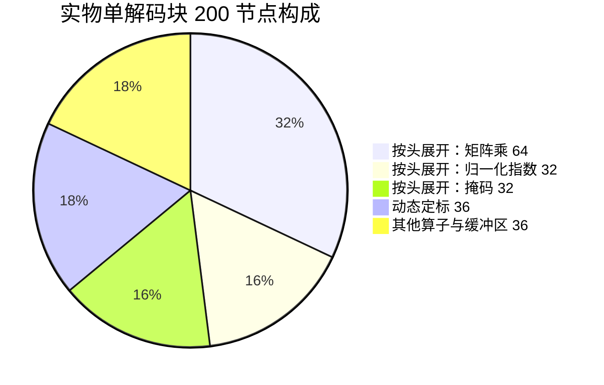

按头展开占 128 个，动态定标占 36 个，两者合计 164 个，占总数的 82%。

我方用**一个批量矩阵乘**表达整批注意力。若也逐头展开，2 层约需 400 个节点。

**这不是缺若干算子，而是注意力的表达粒度不同。** 以节点数计，当前覆盖率远低于按
算子类型计的 12/17。

### 9.2 影响 GML 生成的因素边界

这一节回答一个容易误判的问题：图编译器的哪些工作影响 GML。

#### 9.2.1 实测：既有工作对 GML 零引用

扫描 GML 出口对图编译器既有模块的引用次数：

| 既有模块 | 职责 | GML 出口引用次数 |
| --- | --- | ---: |
| 切分策略 | 张量并行与流水并行的策略 | **0** |
| 切分传播 | 张量规格沿图传播 | **0** |
| 张量规格 | 每个权重的切分与归属 | **0** |
| 内存蓝图 | 三区偏移规划 | **0** |
| 键值缓存布局 | 缓存区规划 | **0** |
| 通信计划 | 编译期通信表 | **0** |
| 执行计划 | 命令序列 | **0** |

GML 出口实际只消费两样：节点的形状元数据、以及融合标记。

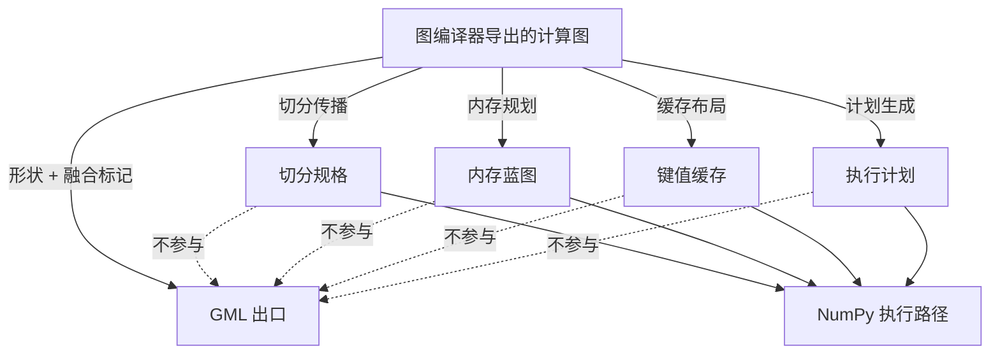

#### 9.2.2 根因：GML 格式不表达放置

实测扫描全部硬件放置字段，在实物中均为 0 次：

```
pu_id  npu_id  dpu_id  core  core_id  tile  tiling  shard
vpu_id  node_assign  device  placement  cluster  rank
```

配合对方答复「不支持跨设备通信」「不支持跨设备地址空间」，切分与放置信息在 GML 里
**无处可放**。执行顺序也由对方的分析器自行推导。

#### 9.2.3 结论

| 工作 | 是否影响 GML | 服务对象 |
| --- | --- | --- |
| 量化 | **是** | GML |
| 算子融合 | **是** | GML |
| 计算图导出 | 是，仅形状与拓扑 | 两者 |
| 切分策略与传播 | **否** | NumPy 执行、仿真器 |
| 内存与缓存规划 | **否** | NumPy 执行 |
| 通信与执行计划 | **否** | NumPy 执行 |

若后续要让切分影响 GML，可行方向是**用切分后的形状生成多份 GML**（每设备一份，
切分体现在张量形状而非节点属性上）。这需要先确认对方是否支持多份 GML 协同，
属于架构决策，见第 11 章。

### 9.3 算子编译器与 GML 的关系

#### 9.3.1 当前状态：新增原语未接入产出链路

实测三项：

| 检查 | 结果 |
| --- | --- |
| 中间表示生成的编译阶段序列 | 仍是原有四个，新增的融合阶段**零调用** |
| 实际产出的中间表示里出现的原语 | **只有原有分块级** |
| 22 个新增原语的出现次数 | **0** |

新增的原语与编译阶段通过了构建与单元测试，但**尚未接入任何实际产出链路**——
它们目前是「可用的定义」，不是「在用的实现」。

#### 9.3.2 算子编译器应向 GML 提供什么

两个实测事实决定了答案。

**其一，GML 里没有任何分块字段。** 扫描结果均为 0 次：

```
tile  Tile  block  Block  stride  Stride  Winograd  Sparsity
```

分块信息落在**参数文本**里，而非图文件：

```
Input Width: 4096      Input Stride X: 4096
Output Width: 4096     Output Stride Z: 4111
Is Winograd: false     Weight Compression Rate: 1.0
```

**其二，GML 里大量字段需要硬件知识才能填写。**

| 字段类别 | 实物出现次数 | 谁掌握这个信息 |
| --- | ---: | --- |
| 数据通路模式 | 335 | 算子编译器 |
| 定标粒度 | 221 | 算子编译器 |
| 硬件版本 | 37 | 硬件规格常量 |
| 功能单元绑定 | 4 | 算子编译器 |
| 浮点指数范围 | 3 | 算子编译器 |
| 激活实现方式 | 3 | 算子编译器 |

这些字段描述「硬件如何执行」，不是「计算什么」。图编译器只掌握计算图与权重，
填不出它们。

#### 9.3.3 已有的对接先例

算子编译器已经通过中间表示的模块属性向外提供信息，仿真器正在消费：

```
pim.tile-m   pim.tile-n   pim.tile-k
pim.tile-wram-bytes   pim.wram-bytes-used
pim.num-dpus   pim.num-tasklets   pim.dma-align
```

同一套属性可以喂给 GML 的参数文本生成，不必另建通道。这是最省力的接法。

---

## 10. 不足

### 10.1 唯一的硬阻塞：查找表采样规则

激活在目标硬件上用查表实现，每张表固定 288 字节即 144 个半精度值。**采样规则未知**。

已排除的假设：按等距采样激活函数。用门控激活函数在任意区间拟合，最大误差 0.27，
明显不成立。

两份实物的表结构还完全不同：

| 来源 | 非零项数 | 分布形态 |
| --- | ---: | --- |
| ResNet50 | 26 | 稀疏，几个短段 |
| llama2 密集型 | 98 至 102 | 三段，每段约 40 项 |
| llama2 恒等型 | 1 | 仅第 0 项为 1.0 |

需要对方明确四件事：

1. 144 项如何分段（三段约 40 项是观测，不是规范）
2. 采样点的横坐标如何确定（已排除等距）
3. 该节点的缩放系数如何折入表值
4. 恒等表用在哪些位置

在此之前只能发恒等表——它是实物里的合法值，且我方生成的与实物**逐字节相同**。

### 10.2 激活量化的公式无法确认

实物未交付量化前的浮点副本，所以只能做特征对照，不能做公式验证。

| 能排除 | 不能排除 |
| --- | --- |
| 系数用 128 而非 127 | 符号约定相反 |
| 系数过大导致精度浪费 | 零点不为零 |
| 误用按通道粒度 | 舍入方式不同（四舍五入与截断） |

后三类都会产出特征相同但数值不同的结果。

### 10.3 定点 4 位对模型精度的影响未知

6.5 节说明 0.0711 的误差是理论必然，但那只是**单张量的量化误差**。真正要关心的是
**端到端精度**——32 层累积后困惑度掉多少。

这需要能执行 GML 才能测。当前无法回答。

### 10.4 覆盖度不足

按算子类型计，llama2 实物 17 种已覆盖 12 种。但**这个指标偏乐观**——按节点数计
差距大得多。

| 计量方式 | 实物 | 我方 | 覆盖率 |
| --- | ---: | ---: | ---: |
| 算子类型 | 17 种 | 12 种 | 71% |
| **节点数**（单解码块对 2 层折算） | 200 | 79 | **约 25%** |

差距的构成：

| 缺口 | 实物节点数 | 说明 |
| --- | ---: | --- |
| 注意力未逐头展开 | 128 | **表达粒度不同**，不是缺算子。实物把 32 个头展开成独立节点，我方用一个批量矩阵乘 |
| 动态定标未实现 | 36 | 需要完整的多阶段流水 |
| 掩码与归一化指数未实现 | 64（含在上面 128 内） | 依附于逐头展开 |
| 键值缓存搬运未实现 | 2 | 需要与内存蓝图对接 |
| 旋转位置编码未实现 | 2 | 依赖 6 段定标单元配置的语义 |
| 切分未实现 | 3 | 按头切分 |

按节点数排序，**最大的缺口是注意力的逐头展开**（占实物节点的 64%），其次是动态定标
（18%）。这两项决定了后续工作的优先级。

独立查找表不计入缺口：它只作为融合项存在，不作为独立映射目标。

### 10.5 结构完整但数值不完整的部分

| 产物 | 结构 | 数值 |
| --- | --- | --- |
| 图文件 | 完整 | 不涉及 |
| 定点权重与分组系数 | 完整 | **已验证** |
| 数据缓冲区 | 尺寸正确 | 内容为零，运行时才有 |
| 激活缩放系数 | 格式正确 | 发占位 1.0，与实物一致 |
| 恒等查找表 | 完整 | **与实物逐字节相同** |
| 定标系数 | 语义已明 | 仅注意力位置有对照 |

### 10.6 两条出口各自导出一次计算图

GML 出口没有接进统一编译入口，是独立路径。这是有意的取舍：GML 用不到内存蓝图与
命令计划，混在一起会让 NumPy 执行路径承担无关成本。

代价是同一个模型要导出两次计算图。若要共享，先得解决「量化后的图能否走 NumPy 执行」
——目前不能，因为假后端是浮点的。

### 10.7 参考产物的局限

| 局限 | 影响 |
| --- | --- |
| llama2 实物只有一个解码块 | 跨块的连接方式、首尾层的处理未知 |
| ResNet50 与 llama2 量化方式相反 | 静态与动态两条路径不能相互印证 |
| 无嵌入层与输出层的实物 | 词表相关算子的表达未验证 |
| 卷积与池化路径已定义未验证 | llama2 用不到，接视觉模型时才能验 |

---

---

## 11. 遗留问题

### 11.1 需要对方答复的

按对方投入排序，第一项成本最低而信息量最大。

| 序号 | 问题 | 为什么需要 |
| ---: | --- | --- |
| 1 | **用对方解析器读一次我方 GML** | 一次性确认格式层面是否可接受，我方的第三方解析器只能证语法 |
| 2 | **查找表的采样规则** | 唯一的硬阻塞，见 10.1 节 |
| 3 | **提供一份带浮点副本的产物** | 有了量化前的值，激活量化就能做字节级验证 |
| 4 | 激活类型的编码表 | 多阶段流水里某个取值的含义未知 |
| 5 | 多个重定标块的分工 | 已确认甲乙两块并存，用途未知 |
| 6 | 动态定标各阶段的确切职责 | 已从参数文件反推出形态，语义待确认 |
| 7 | 硬件约束清单是否还有补充 | 规范文档只列了一条卷积改写要求 |

### 11.2 需要硬件才能验证的

| 项 | 验证方式 |
| --- | --- |
| 定点流水线的截断与舍入 | 逐层中间结果对拍 |
| 端到端精度损失 | 完整模型的困惑度测量 |
| 定标系数在非注意力位置的取值 | 与硬件实际使用的值比对 |
| 激活量化的确切公式 | 同上 |

### 11.3 本方案内部待完善的

按对覆盖度的影响排序。

| 优先级 | 项 | 影响的实物节点数 | 说明 |
| ---: | --- | ---: | --- |
| 1 | **注意力逐头展开** | 128（64%） | 最大缺口。实物把 32 个头展开成独立节点，我方用一个批量矩阵乘 |
| 2 | **动态定标节点** | 36（18%） | 结构已探明，等激活类型编码表 |
| 3 | 旋转位置编码 | 2 | 依赖 6 段定标单元配置的语义 |
| 4 | 键值缓存搬运 | 2 | 需要与既有内存规划模块对接 |
| 5 | 按头切分 | 3 | 依附于第 1 项 |
| — | 完整 32 层导出未实测 | — | 只测过 1 层与 2 层，完整模型约 8.5 GB |
| — | 卷积路径未验证 | — | 目标是 llama2，暂不需要 |
| — | 激活量化模块未接入导出路径 | — | 当前只服务校准与特征验证，定位见 4.4 节 |

### 11.4 新增原语尚未接入产出链路

这是一项需要单独说明的状态：算子编译器新增的 22 个原语与 1 个编译阶段
**通过了构建与单元测试，但未接入任何实际产出链路**。

| 检查 | 实测 |
| --- | --- |
| 中间表示生成的编译阶段序列 | 仍是原有四个，新增阶段零调用 |
| 实际产出的中间表示里的原语 | 只有原有分块级 |
| 22 个新原语的出现次数 | 0 |

它们目前是「可用的定义」，不是「在用的实现」。接入需要先确定图编译器是否直接构造
整算子级中间表示——这与 9.2 节的架构选择相关。

### 11.5 已解决的历史问题

排查过程中曾长期卡住的四点，均已澄清，记录在此避免重复排查。

| 问题 | 结论 |
| --- | --- |
| 定标系数如何由缩放系数算出 | **问题本身错了**——它不是量化因子，而是算子自身的数学缩放 |
| 动态量化各阶段参数从哪来 | 从实物的 424 个参数文件反推出形态 |
| 多个重定标块是否真实存在 | llama2 实物证实甲乙两块并存 |
| 定点 4 位如何存储 | 一字节一个值不打包，往返验证百分之百 |

第一条的排查教训值得记：最初按「定标系数等于输入乘权重除输出」拟合，53 个样本的
比值散布在 0.05 至 64 之间，毫无规律。根因是把按分组的权重缩放系数**数组**当成了
标量。若当时凑一个近似解释，产出的注意力分数会全错。

---

---

## 12. 附录：关键实现陷阱

排查中踩到的技术细节，重复踩会浪费时间。

### 12.1 中间表示定义层

| 陷阱 | 表现 | 处理 |
| --- | --- | --- |
| 操作数分段标记误用 | 只有一个可选操作数时加标记直接报错 | 两个以上可变操作数才需要 |
| 枚举属性默认格式不合法 | 默认输出裸关键字，属性字典不接受 | 显式覆盖为带尖括号形式 |
| 数组参数与结构化格式冲突 | 容器解析用逗号分隔，与参数分隔符无法区分 | 改用原生数组属性类型 |
| 整型属性取值无符号 | 负轴读出来是巨大正数，规范化逻辑走不到 | 按位重解释为有符号 |
| 浮点属性取值非原生类型 | 不能直接与浮点数比较 | 调用转换方法 |
| 可丢弃属性不属于契约 | 属性挂得上但不参与验证 | 在算子上显式声明 |

### 12.2 图结构转换层

| 陷阱 | 表现 | 处理 |
| --- | --- | --- |
| 滤掉不可映射算子会切碎图 | 入口出口数量激增 | 跨过而非丢弃，继续向上游找 |
| 注意力算子不能跨过 | 它的三个上游被下游误当作自己的输入 | 加入映射表作为真实节点 |
| 残差输入缓冲区是重复键 | 用字典存会被覆盖成单值 | 改用列表，序列化时展开 |
| 输出缓冲区按消费者命名 | 写盘时重复写同一文件 | 写盘阶段跳过该字段 |
| 融合表与映射表冲突 | 均方根归一化与门控激活一个都没产出 | 从融合表移出，它们是独立节点 |

### 12.3 校验器自身

| 陷阱 | 表现 | 处理 |
| --- | --- | --- |
| 规则从单一样本归纳 | 三条规则在第二份实物上不成立 | 两份实物同时验证 |
| 校验器比被校验对象更窄 | 误判正确产物为违规 | 修校验器，并回头确认实物仍通过 |
| 归一化把槽位号当实例号 | 每槽独立定标的区别被抹平 | 带槽位后缀的字段族单列 |
| 融合块子节点被当作字段 | 字段清单从 106 涨到 150 以上 | 按后跟符号排除 |

### 12.4 测试层

| 陷阱 | 表现 | 处理 |
| --- | --- | --- |
| 拒绝断言的位置对不上 | 属性验证器的报错落在属性所在行 | 把算子压成单行 |
| 级联诊断 | 内层属性失败后外层再追加一条 | 写两条期望 |
| 边界算子有元素数限制 | 真实卷积形状过不了 | 整算子图不用边界算子 |
| 断言与新语义脱节 | 7 个测试因语义修正而失败 | 按新语义重写断言，而非放宽标准 |
