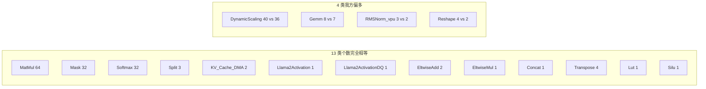
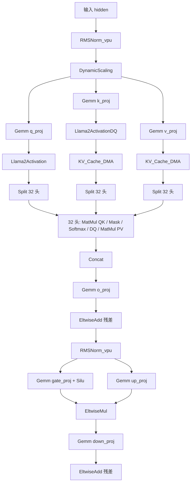
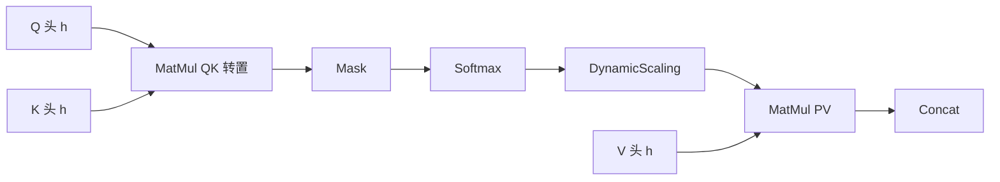
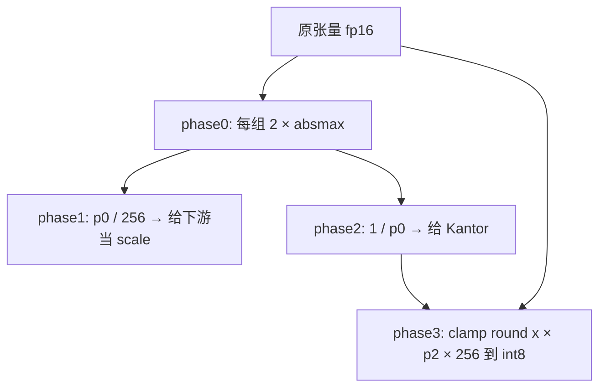
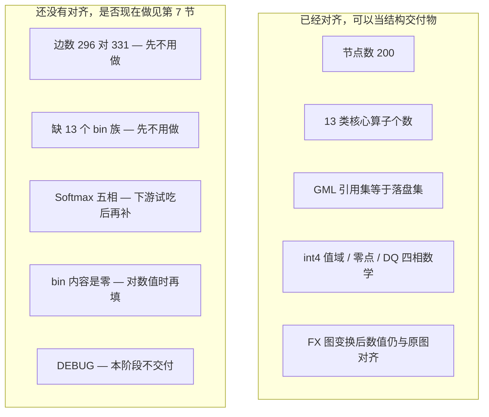
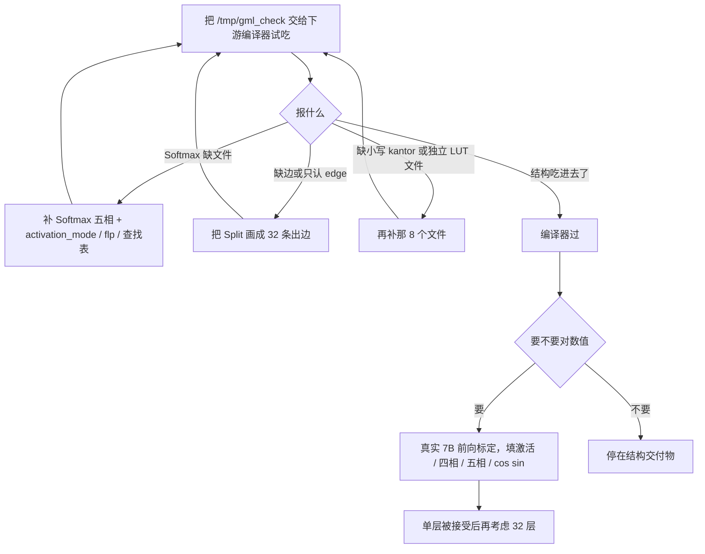

# GML 与 bin 交付物：当前状态

日期：2026-09-18。覆盖本仓相对 `main` 的全部未提交改动。

本文只说**现在产出什么、怎么工作、改了哪些代码、验证到哪、还差什么**。实施过程不记。

---

## 1. 一句话

图层编译器已经能从真实 Llama2-7B 导出一份与参考产物**同类**的 `relay2gml_graph.gml` + `.bin`：节点数对齐、13 类核心算子个数对齐、引用的 bin 全部落盘、量化约束自洽。还不是字节级副本。`prepare_out/` 不在本阶段。

---

## 2. 现在能交出什么

```
python scripts/export_gml.py --layers 1 --seq-len 16 --out-dir /tmp/gml_check
```

| 项 | 我方 | 参考产物 | 是否对齐 |
| --- | ---: | ---: | --- |
| 节点 | 200 | 200 | 是 |
| 边 | 296 | 331 | 否，差 35 |
| bin 文件 | 2409 | 3231 | 否，差 822 |
| bin 族 | 65 | 76 | 我方 65 族全部落在实物 76 族里 |
| 体积 | 约 349 MB | 约 246 MB | 否 |
| 校验器 | 20 / 20 | 24 / 25 | 我方全过 |

参考产物路径：

`/media/disk/fengjingge/src/xinfangzhou-resource/llama2_w4a8_decode_block_0/parser_output`

### 2.1 算子类型个数



偏多的 8 个节点来自导出范围：我方含模型末尾的 `norm` 和 `lm_head`，参考产物是纯 decode block。

### 2.2 一张 decode 层在图里长什么样



attention 里每一头是同一条链，共 32 份：



---

## 3. 修改原理

### 3.1 问题本质

参考产物是**硬件算子图**：一个节点对应一块硬件（向量单元、矩阵乘、四相量化流水线）。aten 图是**数学算子图**：RMSNorm 拆成 6 个算子，attention 藏在一个 `scaled_dot_product_attention` 里。

所以差距不是「字段没抄全」，而是**粒度**：要把数学图变成硬件图，再按硬件图的命名规则写 bin。

### 3.2 流水线（编译期，从左到右）


顺序不能乱，原因都是「后面的 pass 认前面留下的标记」：

| 顺序 | 函数 | 作用 | 为何在这里 |
| --- | --- | --- | --- |
| 1 | `fuse_rope` | RoPE 六算子折成一个节点 | 必须在拆头之前，否则链翻 32 倍 |
| 2 | `fuse_for_pim` | RMSNorm 六合一、Gemm+SiLU、吸收 1/√d | RMSNorm 链一旦被通用融合拆开就匹配不上 |
| 3 | `fuse_graph` | 通用「主算子 + 尾部激活」 | 服务 ResNet 那条路径 |
| 4 | `split_attention_heads` | 一个 SDPA 拆成 32 头 × 5 节点 | 产出角色标记，给后面的 DQ / Split 用 |
| 5 | `insert_kv_dma_and_split` | 插 KV 写回和显式 Split | 位置依赖拆头留下的头下标 |
| 6 | `insert_dynamic_scaling` | 在矩阵乘的激活输入上插 DQ | 规则依赖角色：matmul1 不插、matmul2 插 |

所有图变换同一口径：**打标记，不删节点**。FX 图仍能执行、数值与原图对齐。GML 侧靠 `ABSORBED_META_KEY` 跨过被吸收的算子。

### 3.3 量化契约（写每个权重 / 激活 bin 时用）

| 项 | 约定 | 依据 |
| --- | --- | --- |
| 激活 | int8 对称，动态、按组 128 | 硬件 DQ 四相 |
| 权重 | int4 对称，静态、沿最后一维按组 128 | 实测 58.5% 的组含 q = -8 |
| 零点 | 恒为 0 | 对称量化 |
| 除数 | `2^(bits-1)`，即 8 和 128 | 不是 7 / 127 |
| int4 峰值相对误差上界 | 0.125 | 正峰值量化到 8 再钳到 7，是整步不是半步 |

### 3.4 动态量化四相（一个节点里的字段族，不是四个节点）



phase1 和 phase2 **并行分叉自 phase0**，不是串行。phase2 的输入是 phase0 的输出，不是 phase1 的输出——写反会让倒数错 256 倍。

attention scores 整条当一组（`group_size = 1024`），hidden / MLP 按 128 切。

### 3.5 缓冲区归谁起名

一个 `.bin` 代表一条边。名字由边的哪一端来起，规则固定：

| 情形 | 文件名由谁起 | 例子 |
| --- | --- | --- |
| 普通数据边 | 消费者 | `input_buffer_15.bin` |
| 上游是四相 DQ | 生产者自己 | `output_buffer_12.bin` |
| 该路进下游权重通路 | 消费者，但用权重名 | `weight_buffer_176.bin` |
| 上游 DQ 那一路的 scale | 生产者的 phase1 输出 | `output_buffer_phase_1_12.bin` |
| 零点 | 始终消费者 | `input_zp_15.bin` |

第四条：消费者的 `input_sf` 直接指向上游 DQ 的 phase1 文件，因为 `p1 = p0 / 256` 就是这条边的 requant scale，不必另存一份。

**数据槽数不等于入边数。** `MatMul` 有两条入边，但第二个操作数走权重通路（`MatMul_input_as_weight 1`），只占一个数据槽，键名不带槽号。这条判据生产者和消费者必须共用同一个函数（`_data_slot_count`），各判一次就会一边写 `input_buffer_1_176.bin`、另一边只声明 `input_buffer`。

### 3.6 硬件字段从哪来

GML 里绝大部分硬件字段由 `(op_type, phase)` 唯一确定，查常量表即得，不需要算子编译器。实测 364 项里 353 项单值。会随节点变的只有：

| 字段 | 由什么决定 |
| --- | --- |
| `kantor_mode`（Gemm） | 输出 dtype |
| `weight_format`（MatMul） | 是不是 QK 转置 |
| DQ 的 `group_size` | 张量元素数、是不是 attention scores |
| `data_extension` | dtype 的编码（int8 → 1，float16 → 3） |
| `input_buffer_dtype` 等 | **沿边传播**：上游是 DQ 就吃 int8 |

`Llama2ActivationDQ` 的字段 = `Llama2Activation` 的字段 + 已有的 DQ 四相字段。两个变体与参考产物分别 80 / 80、140 / 140 逐项相等。

---

## 4. 改了哪些文件和函数

相对 `main`：已改 19 个文件净 `+2635 / -226`；新增 18 个源文件（不含文档）。

### 4.1 新增模块

| 文件 | 行数 | 对外接口 | 做什么 |
| --- | ---: | --- | --- |
| `graph/fuse_rope.py` | 154 | `fuse_rope(gm) -> RopeReport` | 把 `x*cos + rotate_half(x)*sin` 折成一个 RoPE 节点 |
| `graph/fuse_pim.py` | 344 | `fuse_for_pim(gm) -> FusionReport` | RMSNorm 六合一、Gemm+SiLU、吸收 1/√d |
| `graph/split_heads.py` | 284 | `split_attention_heads(gm) -> HeadExpansion` | 一个 SDPA 拆成逐头链，打角色标记 |
| `graph/quant_pass.py` | 203 | `insert_dynamic_scaling(gm) -> QuantReport` | 在矩阵乘的激活输入上插 DQ 占位节点 |
| `graph/kv_dma_pass.py` | 170 | `insert_kv_dma_and_split(gm) -> KvDmaReport` | 插入 KV 写回和显式 Split |
| `contracts/gml_hw_table.py` | 434 | `top_level_fields` / `phase_fields` / `rope_fields` | 硬件字段常量表 |
| `contracts/gml_lut.py` | 137 | `synth_identity` / `synth_reciprocal` / `synth_silu` | 合成查找表 |
| `gml_bridge/phase_data.py` | 245 | `dynamic_scaling` / `softmax` | 四相 / 五相数值 |

关键结构体（都在对应模块里，跨模块只通过 `node.meta` 传递）：

| 结构体 | 模块 | 含义 |
| --- | --- | --- |
| `RmsNormFusion` | `fuse_pim` | 一条 RMSNorm 链：eps、权重节点、被吃掉的算子 |
| `RopeMatch` | `fuse_rope` | 一条 RoPE：被旋转的张量、cos、sin |
| `DynamicScalingSpec` | `quant_pass` | 一个 DQ：组宽、元素数、是不是 attention scores |
| `KvDmaSpec` / `SplitSpec` | `kv_dma_pass` | KV 写回 / Split 的规格 |
| `HeadExpansion` | `split_heads` | 逐头展开的统计 |

标记键（都在 `node.meta` 上）：

| 键 | 谁写 | 谁读 |
| --- | --- | --- |
| `pim_absorbed` | 各融合 pass | `from_fx._is_emittable`，为真则不发射 |
| `pim_rms_norm` | `fuse_for_pim` | 发射成 `RMSNorm_vpu` |
| `pim_rope` | `fuse_rope` | 发射成 `Llama2Activation` 或 `Llama2ActivationDQ` |
| `pim_head_role` | `split_attention_heads` | 决定 MatMul / Mask / Softmax 的硬件配置 |
| `pim_dynamic_scaling` | `insert_dynamic_scaling` | 发射成 `DynamicScaling` 并写四相 bin |
| `pim_kv_cache_dma` / `pim_split` | `insert_kv_dma_and_split` | 发射成对应 op_type |

### 4.2 改过的已有模块

**`contracts/gml_quant.py`**

- 量化除数改为 8 / 128；激活和权重布局改为 per-group 128
- 新增 `PHASE_COUNTS`、`dq_group_size()`、`GML_VERSION`
- `lut_identity()` 改为调用 `synth_identity()`，去掉重复实现

**`contracts/gml_names.py`（+195）**

- 新增四相文件名、RoPE 子块文件名、KV 的 `updates_sf` / `updates_zp`
- `residual_buffer_key`：端口号 ≥ 10 时键名多一个下划线（复现参考产物的键名）
- `phase_output_buffer_self`：四相节点自命名的输出缓冲

**`contracts/gml_coverage.py`**

- 已产出的字段族从「待量化」挪到「已发射」：零点、FPSU 三族、四相、RoPE、沿边传播的 dtype

**`gml_bridge/from_fx.py`（+547）**

- `_is_emittable`：被吸收的算子不发射；带角色 / DQ / RoPE / KV / Split 标记的一律发射
- `_op_type_of`：按标记定 `op_type`，不按 aten 目标。K 路 RoPE（拓扑序第二条）走 `Llama2ActivationDQ`
- `_data_slot_count`：MatMul 的数据槽 = 入边数 − 1
- 发射硬件字段、四相引用、RoPE 子块引用、KV 的 `updates_*` 和 `L2A_ignore`
- 输出缓冲按 3.5 节的归属规则命名
- 上游是 DQ 时，消费者的 `input_buffer_dtype` 覆盖成 int8

**`gml_bridge/export.py`（+336）**

- `export_graph` 按 3.2 节顺序跑六个 pass
- `write_runtime_files` 按字段键分流写盘：四相、RoPE 子块、FPSU 三族、零点、权重
- 写盘必须用 GML 里声明的文件名，不能按消费者编号再推一遍——否则引用生产者文件时会一边悬空一边多余
- `"_sf" in key` 这条分派必须排除 `weight_sf`（子串包含）

**`gml_bridge/runtime_files.py`（+280）**

- `write_dq_phases`：四相输入输出、Kantor 三族、两张查找表。phase2 的输入写 phase0 的输出
- `write_rope_buffer`：按族选 fp16 / uint8 / fp32 / int32
- `write_named_buffer`：名字已由 GML 定好的缓冲（权重通路那一路）
- `write_scaling`：FPSU 三件套（fp16 + uint8 + fp32）
- `write_zero_point`：4 字节 int32 的 0
- `write_per_tensor_weight`：RMSNorm 的一维缩放，int8 + fp32 scale

**`gml_bridge/writer.py`**

- 支持一层嵌套块 `nested`（RMSNorm 的 `vpu_params`）
- 键名以 `pim_` 开头的内部字段不写入 GML 文本

**`quant/weights.py` / `quant/activations.py`**

- 权重 scale = 峰值 / 8
- 激活改为 per-group；`group_size=None` 表示整张一张一组

**`scripts/verify_gml_artifact.py`（+581）**

- 检查从 11 项扩到 25 项：三份连接信息、input_count 恒等式、归属规则（含键名 bug）、dtype 感知的尺寸、int4 / int8 分流、DQ 四相数学、零点全 0
- DEBUG 引用允许缺文件；孤立文件只把「文件名主干是真实 node_id」的算进去

**`scripts/gml_structure_check.py`**

- `consumed_buffers` 扫 32 个槽，不看 `input_count`（MatMul 会少报）

### 4.3 新增测试

| 文件 | 覆盖 |
| --- | --- |
| `tests/test_fuse_pim.py` | RMSNorm / SiLU 折叠、语义等价、幂等 |
| `tests/test_fuse_rope.py` | RoPE 两条链、KV 2 个、Split 3 个、GML 个数 |
| `tests/test_split_heads.py` | 每头完整链、1/√d 落在 matmul1、GML 比例 |
| `tests/test_quant_pass.py` | 插在哪、组宽、四相字节数、1/√d 进 Scaling |
| `tests/test_gml_hw_table.py` | 常量表与参考产物对拍 |
| `tests/test_gml_lut.py` | 四张查找表 |
| `tests/test_phase_data.py` | 四相 / 五相数值 |
| `tests/test_runtime_files_phases.py` | 落盘字节与参考产物比对 |
| `tests/test_verify_layers.py` | 校验器每一项都有反例 |

已有测试同步改了量化除数、int8 权重路径、32 槽扫描、phase 节点自命名例外。

---

## 5. 做到什么程度

用一张图概括「能交给下游的」和「还不能」：



| 能力 | 状态 |
| --- | --- |
| 从真实 7B 导出单层 GML + bin | 可以 |
| 结构被第三方解析器（networkx）独立读通 | 可以 |
| 三份连接信息（边 / outputN / inputN）一致 | 可以 |
| 量化权重值域和 scale 粒度 | 可以 |
| DQ 四相自洽 | 可以 |
| 与参考产物字节级相同 | 不可以 |
| 填真实中间态、给模拟器跑出正确数值 | 不可以 |
| 产出 `prepare_out/` | 本阶段不做 |
| 改 FlagTree | 本阶段不需要 |

---

## 6. 做了哪些验证

| 验证 | 命令 | 最近结果 |
| --- | --- | --- |
| 全量单测 | `python -m pytest tests/ -q` | **626 通过 / 0 失败**（约 35 分钟） |
| 产物自检 | `python scripts/verify_gml_artifact.py /tmp/gml_check` | **20 / 20** |
| 结构五条规则 + 引用集等于落盘集 | 导出脚本末尾自动跑 | 通过 |
| 与参考产物的 op_type 对照 | 见第 2.1 节 | 13 / 17 类个数相等 |
| RoPE 常量表对拍 | `test_gml_hw_table` | 两个变体 80 / 140 字段逐项相等 |
| 图变换语义 | 各 `test_fuse_*` / `test_split_heads` / `test_quant_pass` | 与原图逐元素对齐（误差在 fp32 噪声量级） |

手动验证：

```bash
source /media/disk/fengjingge/src/flagOS/flagOS-installed/pytorch/env-pytorch.sh
cd /media/disk/fengjingge/src/flagOS/flagos-pim-compiler

python scripts/export_gml.py --layers 1 --seq-len 16 --out-dir /tmp/gml_check
python scripts/verify_gml_artifact.py /tmp/gml_check
python -m pytest tests/ -q
```

已验证过的产物还在 `/tmp/g5` 和 `/tmp/gml_check`。

有一条既有测试 `test_opcompiler_e2e_llama2_7b.py` 会偶发失败（fp16 贪心解码遇到近似平局翻 token）。它的依赖和本改动文件集不相交，单独重跑通过，数值对拍 15360 次调用零次超容差。不是本改动引入的。

---

## 7. 当前不足

这些不是「方案步骤没做完」，而是**对齐到什么粒度**的问题。当前产物的定位是：结构能交、校验能过、还没到「模拟器跑出正确数」。

按「下游现在能不能用」分成四档：

| 档 | 不足 | 现在做吗 |
| --- | --- | --- |
| 下游解析器可能卡住 | Softmax 五相的字段和 bin | **交给下游编译器之前要补**，不是这一分钟，也不是永远不做 |
| 结构等价、形式不同 | 边数 296 对 331、Split 粒度 | **先不用做**，除非下游按「边条数」而不是按 `outputN` 解析 |
| 命名变体 / 范围差 | 缺 13 个 bin、字段族差、多 8 个节点 | **先不用做** |
| 数值 | bin 里中间态是 0 | **给模拟器对数值之前要做**；只过编译器结构则现在不用 |
| 方案里写明不做 | `prepare_out`、FlagTree、变长序列、32 层整网 | **本阶段不用考虑** |

建议顺序见 7.5：先把 `/tmp/gml_check` 交给下游试吃，用真实报错决定补哪一项，不要猜。

### 7.1 Softmax 五相：要做，但不是这一分钟

DQ 已经按四相写了字段和文件。Softmax 在参考产物里是**五相**（求 max、exp、求和、倒数、相乘），挂在同一个节点上，不是五个节点。

我方图里有 32 个 Softmax 节点（个数对），但五相字段和对应 bin **还没写**。

| 问 | 答 |
| --- | --- |
| 现在为什么没做 | 先把节点种类、连接、DQ 四相、RoPE / KV 对齐。五相是同一套「phase 字段 + 写盘」套路，只是还没接到 Softmax 上 |
| 要不要做 | 要。下游如果按参考产物去读 Softmax 的 `*_phase_*` 和查找表，缺文件会解析失败 |
| 何时做 | 把产物丢给下游试吃。若它抱怨 Softmax 缺文件，就补这一项。不必等别的 |

顺带：参考产物里 Softmax 顶层还有 `activation_mode`、`flp_*`、`activation_lut_file`。这些和五相绑在一起，**跟五相一起补，不要单独为字段而字段**。

### 7.2 边数 296 对 331：先不用做

差 35 条，主要是 Split：实物是「一个 Split、32 条出边」，我方是「一个 Split 节点 + 32 个 `outputN_node_id`」，部分头仍用 slice。

语义一样：32 头都接到了。三份连接信息（边 / `outputN` / `inputN`）校验是过的。

| 问 | 答 |
| --- | --- |
| 现在为什么没做 | 改的是边的画法，不是算子对不对 |
| 什么时候才要做 | 下游如果只扫 `edge [`、不认 `outputN`，才会卡住。先让下游试，再决定 |

### 7.3 缺 13 个 bin / 11 族：先不用做

我方 65 个 bin 族全部落在实物 76 族里，没有多造族。缺的 13 个文件拆开看：

| 缺什么 | 几个 | 要不要补 |
| --- | ---: | --- |
| `self_attn_Reshape_*_cos/sin.bin` | 4 | **不用**。对方按节点标签起的别名。我方 RoPE 节点已经有 `Llama2Activation_*` 的 cos / sin 文件 |
| 小写 `kantor_A_*` / `kantor_B_*` | 7 | **多半不用**。RoPE 用的是大写 `Kantor_A_*`（已对齐）。这 7 个是 Gemm 上另一套命名。Gemm 的 Kantor 模式字段已经有了 |
| `activation_lut_file_N.bin` | 1 | **看下游**。SiLU 已经折进 Gemm 的 contraction，也有 `Lut` 节点。若下游还要一张独立查找表文件，再补 |

### 7.4 GML 字段 209 对 261：大部分不用补

实物多的 53 族里：

- **18 个 `DEBUG_*`**：方案写明不交付。**不用做。**
- 其余不少是「不带编号」的写法（如 `fpsu_mode_N`），我方已经用带 phase / 带子块名的形式写了等价字段。
- 真正还缺、且和 Softmax 五相绑在一起的，见 7.1。

### 7.5 多 8 个节点：不用削

`DynamicScaling +4`、`Gemm +1`、`RMSNorm_vpu +1`、`Reshape +2`。

我方导出含模型末尾的 `norm` 和 `lm_head`，参考是纯 decode block。

| 问 | 答 |
| --- | --- |
| 现在为什么不截 | 对「一层完整前向」来说，我方更完整 |
| 什么时候才截 | 只有下游死卡「必须 200 个节点、不能多」时才截掉末尾 |
| 现在做吗 | **不用改导出范围** |

### 7.6 bin 内容是 0：分两头看

bin 里除了量化权重和常量（eps、1/√d、四相公式算出来的 scale）以外，**中间态是零占位**。字节数和 dtype 对，数值不对。

| 下游要干什么 | 现在这批 0 行不行 |
| --- | --- |
| 编译器解析图、对名字、对尺寸、对 dtype | **行**。校验器已经按这个标准过了 |
| 模拟器跑出和 PyTorch 对齐的数 | **不行**。激活、DQ 中间态、Softmax、RoPE 的 cos / sin 要按公式填真实值 |

参考产物自己也是合成数据（RMSNorm 权重全 127、RoPE 超出 [-1, 1]、int4 与真实权重相关性约 0），所以**不能拿它当数值金标准**。要数值，得用我们自己的 7B 跑一次前向标定。

| 问 | 答 |
| --- | --- |
| 现在为什么没填数 | 先把「文件在不在、尺寸对不对、图连得通不通」做死。内容是下一步 |
| 要不要做 | 要给模拟器对拍数值时再做。只过编译器结构，可以先放着 |

### 7.7 本阶段明确不做：不用考虑

| 项 | 为什么现在不考虑 |
| --- | --- |
| `prepare_out/`（层参数文本和 net.ini） | 方案一开始就排除 |
| FlagTree / 算子编译器 | GML 硬件字段由常量表决定，本阶段不改算子编译器 |
| 变长序列、自动切分、代价模型、异步 dispatch | 项目约束里的第 2 / 3 阶段 |
| 32 层整网导出 | 单层约 349 MB，32 层大约 8 GB。等单层被下游接受再扩 |

### 7.8 以后若要继续，按这个顺序

现在不必开新工。若继续，用下游的真实报错驱动，不要按「和参考产物差多少文件」驱动。



1. **先试吃**，不要先猜。
2. 报 Softmax 缺文件 → 补 7.1。
3. 报缺边 / 缺 Kantor 文件 → 再补 7.2、7.3。
4. 编译器过了、模拟器要对数值 → 再做 7.6。
5. 单层被接受 → 再考虑 32 层。

---

## 8. 代码怎么读

想改图结构，从 `gml_bridge/export.py` 的 `export_graph` 顺着六个 pass 往下看。想改某个算子在 GML 里的字段，看 `gml_bridge/from_fx.py` 的 `_op_type_of` 和对应标记分支。想改某个 `.bin` 的内容或名字，先看 `contracts/gml_names.py`，再看 `gml_bridge/runtime_files.py`。硬件常量只允许出现在 `contracts/gml_hw_table.py`。

各组之间只通过 `node.meta` 解耦，不私自约定字段。
