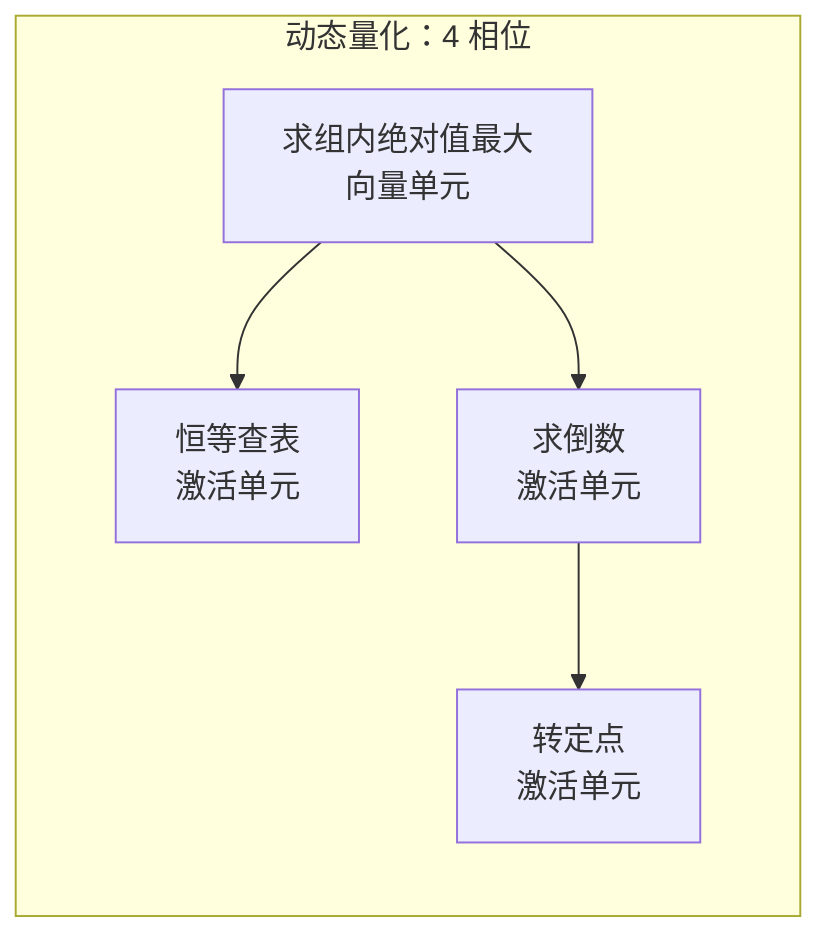
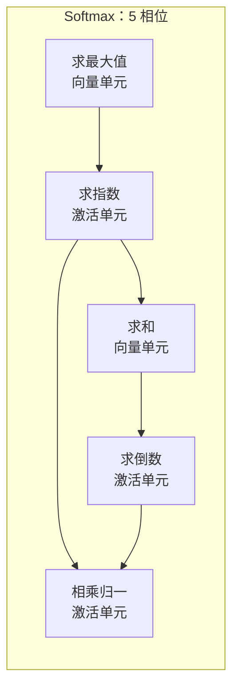
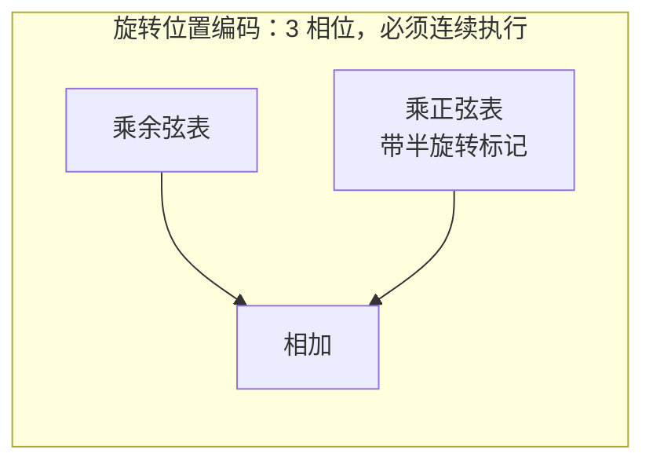
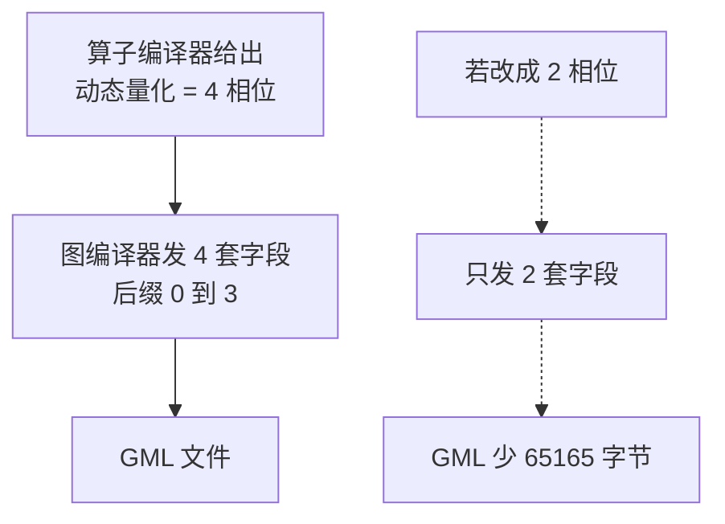
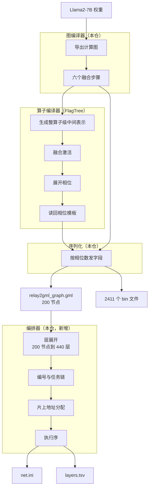
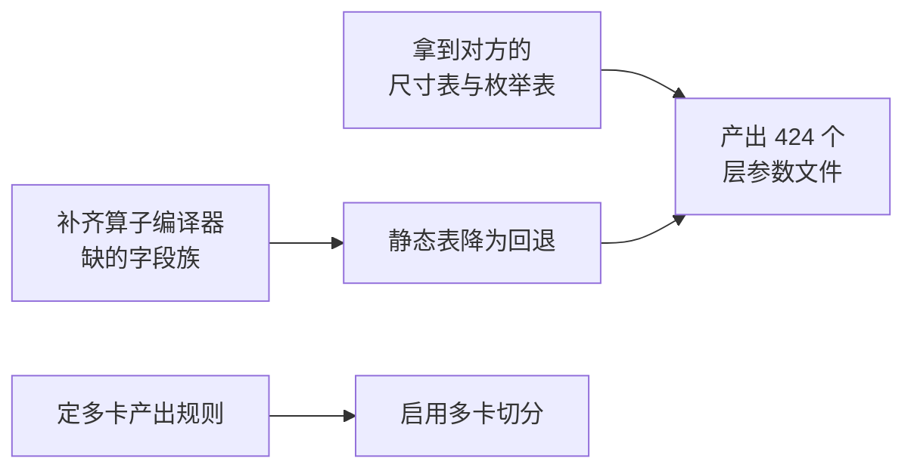

# 全链路打通：模型 到 图编译器 到 算子编译器 到 GML 到 编排器

日期：2026-09-19

---

## 1. 本次改动概述

一条命令跑通整条链路，并自带验证：

```bash
python scripts/export_gml.py --layers 1 --seq-len 16 \
    --out-dir /tmp/gml --use-opcompiler --orchestrate
```

改动前后的对比：

| 项 | 改动前 | 改动后 |
| --- | --- | --- |
| 算子编译器在链路上 | 不在。相位结构写死在图编译器的静态表里 | 在。相位数由算子编译器决定 |
| 真实模型能否走到算子编译器 | 不能。缺少从计算图生成中间表示的一环 | 能。76 个算子全部走通 |
| 层参数与执行序 | 完全没有 | 440 层、编号、片上地址、执行序 |
| 非 2 的整数次幂宽度 | 被拒（Llama2 的 11008 过不去） | 放开（仅对存算目标） |
| 脚本能否自证 | 不能。只能人工比对两次产出 | 能。13 项检查，一个总结论 |

三句话说清本次做了什么：

1. **算子编译器真正接进链路**。它把不透明的整算子展开成硬件相位，图编译器
   按它给的相位数生成 GML 字段。
2. **产物没有变化**。接入前后 GML 逐字节相同，这是硬性要求。
3. **新增编排器**。它在 GML 之后，负责 GML 表达不了的那部分：层展开、编号、
   片上地址分配、执行序。

---

## 2. 原理

### 2.1 硬件上没有「算子」这个东西

目标硬件的最小可执行单位不是算子，而是**一个引擎在存储层级之间的一次流式
遍历**。参考产物里 200 个算子节点对应 422 个「层」，多出来的 222 层几乎全是
动态量化的 4 个相位和 Softmax 的 5 个相位。

三条绕不过去的硬约束：

| 约束 | 原因 |
| --- | --- |
| 一个引擎只干一件事 | 矩阵单元管乘加，池化单元管归约，激活单元管查表，定点单元管重定标 |
| 归约必须扫完才有结果 | 求最大值、求和这类操作物理上无法与前一趟合并 |
| 精度要分段 | 统计量要 32 位浮点，数据是 16 位浮点，输出才是 8 位整数，而一个层只有一对输入输出类型 |

所以「一个算子拆成几个相位、每相位用哪个引擎」是硬件知识，属于算子编译器。

### 2.2 三类算子的相位展开



注意动态量化的第 1、2 相位**都读第 0 相位**，是扇出而不是串行链。写成串行会让
倒数算错 256 倍。





三个相位都带「必须连续执行」标记，中间结果不落主存。

### 2.3 相位数怎么影响 GML

GML 里每个多相位算子要发若干套带相位号后缀的字段。相位数变了，字段套数就变：



这就是「算子编译器真的决定 GML」的含义。

### 2.4 两条必须同时成立的性质

这两条缺一不可，是本次最关键的设计：

| 性质 | 少了它的后果 |
| --- | --- |
| 接入算子编译器前后，GML 逐字节相同 | 产物被改变，与之前版本不一致 |
| 改变算子编译器的输出，GML 跟着变 | 「相同」退化成「无关」，接线其实是假的 |

第二条是实验发现必须加的。把相位数查询函数改成完全无视算子编译器的输出（即
假接线），两条路径产出的文件**照样完全相同**，脚本**照样全绿**。所以单靠
「两次产出相同」证明不了接线为真。

反证的做法：把算子编译器给的相位数故意砍半，再生成一次，文件必须变化。

---

## 3. 整体数据流



关键点：链路是**串行三段**，不是回环。编排器的产物不回填 GML。

依据：参考产物的全部 616 个字段名里，搜索
`virt|task|order|layer|offset|addr|prev|next|sched|l2` 是**零命中**。对方文档
也注明 `in_virtual` 与 `out_virtual` 由下游工具自行推导，`prev_task` 与
`next_task` 由下游工具决定执行流。

## 4. 四方职责

| 责任方 | 决定什么 | 本次状态 |
| --- | --- | --- |
| 图编译器 | 拓扑、形状、数据类型、融合、节点编号、**切分** | 切分接口已铺好，默认单卡 |
| 算子编译器 | 相位模板：几个相位、哪个引擎、查表种类、每相位缓冲字节数 | **已接入链路** |
| 编排器 | 层展开、层编号、任务图、片上地址、执行序 | **本次新增** |
| 主机运行时 | 主存实地址、键值缓存物化 | 不在本链路 |

**切分归图编译器，不归编排器。** 切分决定「算什么、多大」，它通过**形状**进入
GML 而不是通过字段（GML 里没有任何设备或切分字段）。编排决定「片上怎么放、按
什么顺序走」。两者不重叠。

---

## 5. 修改的文件

两个仓库都有改动。

### 5.1 FlagTree（算子编译器）

新增文件：

| 文件 | 行数 | 作用 |
| --- | ---: | --- |
| `lib/Dialect/TritonPIM/Transforms/ExpandPhases.cpp` | 354 | 相位展开步骤的实现 |
| `test/Dialect/TritonPIM/expand_phases.mlir` | 103 | 正例：三类算子的展开结果 |
| `test/Dialect/TritonPIM/expand_phases_negative.mlir` | 15 | 反例：不合法输入被拒 |
| `test/Dialect/TritonPIM/tensor_size_pim.mlir` | 56 | 非 2 的整数次幂宽度的放开条件 |

改动文件：

| 文件 | 增删 | 改了什么 |
| --- | --- | --- |
| `include/.../TritonPIM/IR/PIMAttrDefs.td` | +14 −8 | 逐元素运算种类增加「绝对值最大」 |
| `include/.../TritonPIM/Transforms/Passes.td` | +42 | 声明 `pim-expand-phases` |
| `lib/Dialect/Triton/IR/Traits.cpp` | +44 −30 | 张量元素数校验按目标放开 2 的整数次幂限制 |
| `lib/Dialect/TritonPIM/Transforms/CMakeLists.txt` | +1 | 接入新文件 |

`ExpandPhases.cpp` 里的主要函数：

| 函数 | 作用 |
| --- | --- |
| `expandQuantize` | 动态量化展开成 4 相位，第 1、2 相位都读第 0 相位 |
| `expandSoftmax` | Softmax 展开成 5 相位 |
| `expandRope` | 旋转位置编码展开成 3 相位，打「必须连续执行」标记 |
| `setPhase` / `setPhaseBytes` | 给相位操作打相位号与逻辑缓冲字节数 |
| `isPIMModule`（在 `Traits.cpp`） | 判断当前模块是否以存算为目标，据此放开宽度限制 |

### 5.2 flagos-pim-compiler（图编译器与编排器）

新增文件：

| 文件 | 行数 | 作用 |
| --- | ---: | --- |
| `opcompiler_bridge/oplevel_emitter.py` | 393 | 计算图转整算子级中间表示 |
| `opcompiler_bridge/phase_plan.py` | 123 | 从展开结果读回相位模板 |
| `opcompiler_bridge/phase_source.py` | 185 | 调用算子编译器并与静态表对拍 |
| `gml_bridge/sharding.py` | 130 | 切分策略换算成本地形状 |
| `orchestrator/layer_expand.py` | 204 | 节点乘相位展开成层 |
| `orchestrator/layer_id.py` | 123 | 层编号与任务链 |
| `orchestrator/l2_alloc.py` | 239 | 片上地址分配 |
| `orchestrator/net_ini.py` | 64 | 执行序文件 |
| `orchestrator/plan.py` | 112 | 编排器入口 |
| `orchestrator/__init__.py` | 25 | 职责边界说明 |
| 八个测试文件 | 1563 | 共 89 项，见第 6 节 |

改动文件：

| 文件 | 增删 | 改了什么 |
| --- | --- | --- |
| `gml_bridge/from_fx.py` | +72 −15 | 相位数改由算子编译器决定；修一处改图副作用 |
| `gml_bridge/export.py` | +66 −20 | 拆分融合与序列化 |
| `scripts/export_gml.py` | +296 −13 | 新增两个开关与 13 项检查 |
| `tests/test_fuse_rope.py` 等三个 | +9 −9 | 跟随 `convert` 返回值变化 |

### 5.3 修改的函数（本仓）

`gml_bridge/from_fx.py`：

| 函数 | 变化 |
| --- | --- |
| `_phase_count_for` | **新增**。相位数优先查算子编译器，查不到退回静态表 |
| `convert` | 返回值从 3 元组改 4 元组，多返回一份额外的量化规格 |
| `_op_type_of` | 判断顺序改成**旋转位置编码先于动态量化** |

`gml_bridge/export.py`：

| 函数 | 变化 |
| --- | --- |
| `fuse_for_gml` | **新增**。只跑六个融合步骤，会改图，只能调一次 |
| `serialize_gml` | **新增**。只序列化，不改图，可重复调用 |
| `export_graph` | 保留为上面两者的组合，兼容既有调用方 |
| `_dq_specs` | 多接一个参数，合并 `convert` 返回的额外规格 |

`scripts/export_gml.py`：

| 函数 | 变化 |
| --- | --- |
| `Check` / `CheckLog` | **新增**。收集全部检查项，最后统一判定 |
| `_run_opcompiler` | 改为把结果记进检查表，不再中途返回错误码 |
| `_check_identical_without_opcompiler` | **新增**。同一次运行内比对两条路径 |
| `_prove_dependency` | **新增**。反证接线为真 |
| `_run_orchestrator` | 改为记录六项检查 |

---

## 6. 验证

### 6.1 FlagTree 构建与测试

改的是接口定义文件里的枚举，只编单个目标查不出对别处的影响，所以跑**完整**构建：

```bash
source /media/disk/fengjingge/src/flagOS/flagOS-installed/flagTree/env-flagtree.sh
BUILD=/media/disk/fengjingge/src/flagOS/flagOS-installed/flagTree/build/flagtree-cmake
ninja -C $BUILD

LIT=/media/disk/fengjingge/src/flagOS/flagOS-installed/flagTree/python-3.10.20/bin/lit
$LIT -s $BUILD/test                      # 全量
$LIT -s $BUILD/test/Dialect/TritonPIM    # 只看存算部分
```

| 项 | 结果 |
| --- | --- |
| 完整构建 | 通过（含动态库与五个可执行文件） |
| 存算部分测试 | **15 / 15 通过** |
| 全量测试 | 211 / 212（1 项是既有遗留，见第 7 节） |
| 新步骤是否注册 | `triton-opt --help` 里有 `--pim-expand-phases` |

扩展枚举为什么安全：全仓对这两个枚举只有等值比较（`Dialect.cpp:212` 与
`Ops.cpp:507` 各一处，都是跟「全局平均」比），没有穷举分支，所以加取值不会
打断别处。

### 6.2 图编译器测试

```bash
source /media/disk/fengjingge/src/flagOS/flagOS-installed/pytorch/env-pytorch.sh
python -m pytest tests/ -q -k "not llama2_7b"
```

结果：**673 项通过**。改动前基线 584 项，八个新测试文件共 89 项，584 + 89 = 673。

基线数字是把新测试文件临时移走后重新统计得到的，不是估算。

新增的八个测试文件：

| 文件 | 项数 | 守什么 |
| --- | ---: | --- |
| `test_oplevel_emitter.py` | 10 | 三类算子的形状口径、分派规则 |
| `test_oplevel_emitter_live.py` | 7 | 真实模型端到端，算子编译器真跑 |
| `test_phase_plan.py` | 14 | 相位模板解析，与静态表对拍 |
| `test_phase_plan_live.py` | 4 | 真调 `triton-opt` |
| `test_phase_source.py` | 10 | 对拍逻辑、融合幂等 |
| `test_gml_sharding.py` | 8 | 切分换算、单卡等价 |
| `test_orchestrator.py` | 27 | 层展开闭合、编号、地址分配 |
| `test_gml_depends_on_opcompiler.py` | 9 | 两条性质各自成立 |

### 6.3 脚本自带的 13 项检查

```bash
source /media/disk/fengjingge/src/flagOS/flagOS-installed/pytorch/env-pytorch.sh
python scripts/export_gml.py --layers 1 --seq-len 16 \
    --out-dir /tmp/gml --use-opcompiler --orchestrate
```

输出：

```
检查:
  [通过] GML 结构自检（5 条规则）: 5/5 通过
  [通过] GML 引用集 == 落盘集: 2411 个文件
  [通过] 接算子编译器前后 GML 逐字节相同: 347111 字节，节点 200
  [通过] 算子编译器真的决定 GML（反证）: 41 个 DQ 相位数 4→2，GML 少 65165 字节

编排器:
  [通过] 层展开: 440 层（非逐头 56、逐头 384）
  [通过] 全部 op_type 都能展开: 无未识别
  [通过] Layer ID 唯一: 440 个，唯一 440 个
  [通过] L2 offset 16 字节对齐: 440 块全对齐
  [通过] L2 地址分配: 440 块 → 5 槽（复用率 98.9%），数据区 338496 字节
  [通过] net.ini 列出全部层: 440 行 vs 440 层
  [通过] 编排器产物落盘: /tmp/gml/prepare_out/net.ini、layers.tsv

==============================================================
验证全部通过（13 项）
==============================================================
```

三种模式的项数：不带开关 2 项、加 `--use-opcompiler` 6 项、全链路 13 项。

### 6.4 失败场景

脚本不在中途退出，一次跑完能看到所有问题。三种故障都注入验证过：

| 注入的故障 | 脚本输出 |
| --- | --- |
| 假接线（相位数查询无视算子编译器） | `[未通过] 算子编译器真的决定 GML（反证）: 41 个 DQ 相位数砍半后 GML 没变`，判定 `1 / 13 项有问题`，其余 12 项照样跑完 |
| 算子编译器多给一个相位 | `[未通过] GML 序列化: ValueError: DynamicScaling 只有 4 相，没有第 4 相` |
| 算子编译器跑不起来 | `[未通过] 算子编译器可用: 跑不起来` 并附原因 |

第二种场景起初是未捕获异常直接抛出栈信息，退出码虽然是 1 但看不出哪一项不成立，
所以序列化与写盘都包进了检查项。

### 6.5 层数闭合验算

用本仓的每类算子层数表，套参考产物的节点数：

```
非逐头  归一化 2×1 + 动态量化 4×4 + 矩阵乘 7×1
        + 旋转编码 1×3 + 旋转编码带量化 1×7 + 加 2×1 + 乘 1×1  =  38
逐头    32 × (批量乘 + 掩码 + Softmax 5 + 动态量化 4 + 批量乘 = 12)  =  384
合计                                                              =  422
```

与对方文档的分项完全一致。

我方 440 层比 422 多 18，精确分解为：模型末尾的归一化 1 层 + 输出投影 1 层 +
其量化 16 层。原因是我方导出含模型末尾，参考产物是纯解码块。这个差是**预期的**。

**层展开必须按「是否逐头」分开算**，不能按算子类型统一乘系数。错法是把 36 个
动态量化全部乘 4，其中 32 个逐头的已经计在「每头 12 层」里，会重复计一次
（算出 418）。判据是层标签里的头序号，实测标签含 `head` 的 160 个节点正是逐头
的四类。

---

## 7. 过程中修掉的三个问题

这三个都是既有的隐性问题，被本次改造暴露出来。记下来是因为它们都曾让我得出
错误结论。

### 7.1 序列化会改图，导致不幂等

对同一份图调两次 `export_graph`，第二次变成 206 个节点而不是 200。两处原因：

| 副作用 | 后果 | 修法 |
| --- | --- | --- |
| 类型判断先查量化标记、后查旋转编码标记 | 第二次把「旋转编码带量化」降级成普通量化 | 改成**旋转编码先判** |
| 序列化时给旋转编码节点补写量化标记 | 第二次多认出一个量化节点，下游键值搬运的缩放系数字段指错 | 改成由 `convert` 返回，不写图 |

为什么必须修：算子编译器要吃融合后的图，而 GML 的相位字段又要等它的结果，两者
必须串在中间。序列化不幂等，这个顺序就没法成立。

修完 GML 有 6 行变化。查参考产物确认是**修正**而不是回退：

| 字段 | 参考产物 | 修复前 | 修复后 |
| --- | --- | --- | --- |
| 键值搬运的 `input_sf` | `input_sf_28.bin`（自己的编号） | `output_buffer_phase_1_183.bin`（上游编号） | `input_sf_182.bin` 正确 |
| `input_buffer_dtype` | 无此字段 | 多出 `"int8"` | 无 正确 |

因此基线更新：二进制文件从 2409 个变 2411 个（新增 `input_buffer_182.bin` 与
`input_sf_182.bin`），文件校验和从 `b145e16f7021c4bd` 变 `59fc734ed31550de`。

### 7.2 生成器消费了脏状态

旋转位置编码的 K 路要不要发量化，原先靠节点上有没有量化标记判断——而那个标记
正是 7.1 里序列化补上去的。所以老流程先跑序列化时报 41 个，改成只融合后变 40 个。

**40 是错的，41 才对**。改成用「图里第二条旋转编码链」判断，不看标记，结果不再
取决于序列化跑过没有。

### 7.3 我自己的一次验证错误

第一次对比两条路径时复用了同一份图，把「第二次调用的副作用」误当成「算子编译器
的影响」，得出 166 行差异的错误结论。正确做法是每条路径各用一份新图。7.1 修完
后这个陷阱本身也消失了。

---

## 8. 不足与遗留问题

### 8.1 静态表还没退役

GML 的相位**数**已由算子编译器决定，但字段的**取值**仍来自
`contracts/gml_hw_table.py`。因为静态表还独占一批算子编译器不产出的字段：

| 缺的字段族 | 静态表位置 | 需要算子编译器补什么 |
| --- | --- | --- |
| 浮点域配置三项 | 各相位 | 归到查表操作的属性上 |
| 查表文件名 | `from_fx.py:639` | 声明要几张表 |
| 定点重定标缓冲名 | `from_fx.py:642` | 同上 |
| 组池化字段 | 动态量化第 0 相位 | 已有绝对值最大与组大小，差字段名映射 |

补齐后才能把静态表降为回退路径。判据仍是逐字节相同——那时是「换了来源之后仍
相同」。

### 8.2 层参数文件还没产出

编排器目前只产出 `net.ini` 与 `layers.tsv`（层清单）。完整的 424 个层参数文本
缺两样前提：

- 对方文档 B7 那批「换形状要重测」的片上缓冲尺寸（512 的倍数，倍数
  1/2/14/56/112/151/152/302 对不上任何单一几何公式）
- 文档第 12 节列为最高优先级的枚举表：输入输出数据类型的完整编号、
  输入输出格式 0 到 7 的官方名称

没有这些只能填猜测值，所以先留清单。

### 8.3 片上地址复用率不能直接对比

我方算出 98.9%，参考产物是 96.4%，**不能据此判断谁对**。两者的缓冲**尺寸来源
不同**：参考产物按层类型查表，我方用闭合公式
`(向上取整到16(宽度) + 16) × 元素字节数`。尺寸分布不同，能塞进同一槽位的组合就
不同，槽位数自然不同。

这个数字的用途是**回归**：同一份图改了算法后复用率大幅变化，说明动到了实质
逻辑。要与参考产物逐格对齐，得先拿到 8.2 里那张表。

### 8.4 多卡切分未实际启用

`gml_bridge/sharding.py` 的接口已备好，默认单卡。启用前要先定「每个设备一份
GML」的产出规则（文件名、目录结构），这需要与对方对齐——参考产物是单卡的，
没有先例可抄。

### 8.5 旋转位置编码的半旋转只打了标记

目前只标 `pim.rotate-half`，没有真拆成切分、取负、拼接。硬件上它是定点重定标
子块的行为，等确认对方期望的表达形式再定：保持标记，还是在编排器里展开。

### 8.6 FlagTree 的一项既有测试失败

`Triton/invalid.mlir` 里原子比较交换操作的报错措辞不匹配（期望「指针类型匹配
比较值类型」，实际「比较值类型匹配指针类型」）。已用暂存改动的方式对照确认
**基线同样失败同一条**，与本链路无关。全量测试的判据按 211 / 212 算。

---

## 9. 下一步

按依赖顺序：



1. **补字段族**（8.1）。纯技术工作，不需要对方输入。
2. **产出层参数文件**（8.2）。需要对方先确认尺寸表与枚举表。
3. **启用多卡**（8.4）。需要先与对方定产出规则。
