# GML 生成的职责划分技术方案

日期：2026-09-15

本文回答两个问题：算子编译器应向 GML 提供哪些信息；图编译器的哪些工作影响 GML、
哪些不影响。全部结论基于对 llama2 实物的字段统计，不是推测。

---

## 1. 结论速览

### 1.1 两句话

**目标状态**：GML 需要「算什么」与「硬件怎么执行」两类信息。前者来自图编译器，
后者来自算子编译器。张量并行、流水并行、内存管理、键值缓存管理属于主机运行时，
不进 GML。

**当前状态**：四处缺口，从大到小。

| 缺口 | 实测差距 | 详见 |
| --- | --- | --- |
| **层参数文本完全未产出** | 参考 424 个文件加网络配置，我方 **0** | 第 10 章 |
| **二进制文件族缺失** | 参考 198 族 3231 个，我方 **10 族 219 个** | 10.6 节 |
| 算子编译器对交付物贡献为零 | 硬件执行类 54 族字段全缺 | 6.3 节 |
| 注意力表达粒度不同 | 节点覆盖率约 25% | 9.1 节 |

交付给底层编译器的**不只是图文件**，还有一份层参数文本，里面是每层的片上存储分配、
主存地址、步幅对齐、单元配置——这些正是算子编译器该做的事，而我方目前一项都没做。

### 1.2 职责边界图

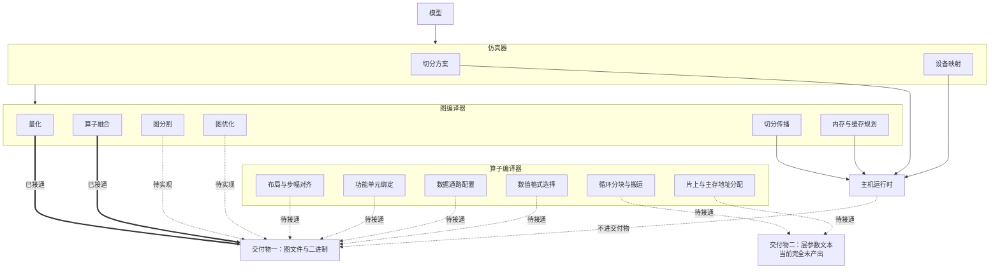

图中粗线是当前已接通的路径，虚线是待实现或待接通的。

**注意有两份交付物**：图文件与层参数文本。后者当前完全未产出，是最大的缺口。
算子编译器的内存分配与分块信息落在第二份里，不在图文件里。

### 1.3 三方归属总表

| 信息 | 归属 | 进 GML | 当前已实现 |
| --- | --- | --- | --- |
| 量化路径选择 | 图编译器 | **是** | **是** |
| 算子融合 | 图编译器 | **是** | **是** |
| 计算图拓扑与形状 | 图编译器 | **是** | **是** |
| 图分割（按设备边界） | 图编译器 | 部分：每设备一份 | 否 |
| 常量折叠、死代码消除、公共子表达式消除 | 图编译器 | 间接：改变节点集合 | 否 |
| 权重布局（是否转置） | **算子编译器** | **是** | **否** |
| 功能单元绑定 | **算子编译器** | **是** | **否** |
| 数据通路模式 | **算子编译器** | **是** | **否** |
| 定标粒度 | **算子编译器** | **是** | **否** |
| 数值格式与浮点指数范围 | **算子编译器** | **是** | **否** |
| 循环分块 | 算子编译器 | **否**，不外露 | 不需要 |
| 数据搬运与暂存复用 | 算子编译器 | **否**，不外露 | 不需要 |
| 切分方案与设备映射 | **仿真器** | **否** | 不需要 |
| 张量并行、流水并行 | 图编译器 | **否** | 不需要 |
| 内存三区规划 | 图编译器 | **否** | 不需要 |
| 键值缓存布局 | 图编译器 | 部分：仅搬运节点 | 否 |
| 通信计划、执行计划 | 图编译器 | **否** | 不需要 |

「不需要」表示该项本就不该进 GML，不算缺口。

---

## 2. 算子编译器应提供的信息

### 2.1 实测统计

对 llama2 实物做字段归类，属于「硬件如何执行」的字段共 **6 类**。

| 类别 | 字段族数 | 出现次数 | 代表字段 |
| --- | ---: | ---: | --- |
| 布局与步幅 | 12 | 402 | 权重格式、转置标志、轴序 |
| 数据通路模式 | 8 | 335 | 累加模式、定标模式、重定标模式 |
| 定标粒度 | 14 | 221 | 按通道标志、按分组标志、分组大小 |
| 数值格式 | 9 | 178 | 累加输出类型、数据扩展 |
| 浮点指数范围 | 6 | 143 | 最小指数、最大指数、尾数位宽 |
| 功能单元与硬件版本 | 5 | 41 | 单元参数、单元轴、硬件版本 |

合计 54 个字段族、1320 次出现。这些字段图编译器**填不出来**——它只掌握计算图与
权重，不掌握硬件的执行方式。

### 2.2 逐类说明

#### 2.2.1 布局：确实在 GML 里

这一类最容易被漏掉。实测发现 `weight_format` 字段：

| 取值 | 数量 | 含义 |
| --- | ---: | --- |
| `weight` | 32 | 权重按原始布局存放 |
| `weights_transpose` | 32 | 权重按转置布局存放 |

32 对 32 的分布对应注意力的两个矩阵乘——一个吃原始布局，一个吃转置布局。
**这是算子编译器根据矩阵单元的操作数要求决定的**，图编译器不知道哪种更优。

同一个矩阵乘节点上的布局相关字段：

```
weight_format               = weight
MatMul_input_as_weight      = 1
group_attention_data_num    = 32
group_attention_weight_num  = 32
```

后两个字段说明**注意力按头分组的数量**也在 GML 里，值为 32 即头数。

#### 2.2.2 循环分块：不进图文件，但必须产出在层参数文本里

实测 GML 图文件里**没有任何分块字段**：

```
tile  Tile  block  Block  stride  Stride  Winograd  Sparsity   全部 0 次
```

但分块信息**必须交付**，落点是 `prepare_out/` 目录下的层参数文本。见第 10 章——
那是本方案当前最大的缺口，我方完全没有产出。

早期曾误判 `prepare_out` 是对方工具链的中间产物，依据是它的时间戳早于 GML。
这个推理不成立：时间早只说明它在流水线上更靠前。真正的证据在 `net.ini.orig` 里的
原始路径配置，见 10.2 节。

#### 2.2.3 数据复用与片上暂存：不进 GML

GML 不表达片上存储层次。算子编译器为数据复用做的暂存分配、搬运调度、同步安排，
在 GML 里没有落点——这些是它自己降级到硬件指令时的内部决策。

这一条与分块不同：分块的**结果**（步幅、宽高）会体现在参数文本里，而复用策略
本身不外露。

#### 2.2.4 数据通路模式

三段模式，每段一个字段：

| 段 | 字段 | 实测取值 |
| --- | --- | --- |
| 累加单元 | 累加模式 | 定点或浮点 |
| 定标单元 | 定标模式 | 定点 |
| 后置重定标 | 重定标模式 | 标量、逐元素乘、浮点转定点等 6 种 |

这是硬件数据通路的配置，由算子编译器根据算子的数值需求选择。

#### 2.2.5 定标粒度

| 字段 | 含义 |
| --- | --- |
| 按通道标志 | 缩放系数是否按输出通道排列 |
| 按分组标志 | 是否按分组排列 |
| 分组大小 | 每组元素数，实测 128 |
| 缩放轴 | 沿哪个轴排列 |

多输入算子的**每个输入槽各有一套**，实测两输入算子带两份完整配置。

#### 2.2.6 浮点指数范围

```
flp_min_exp   最小指数
flp_max_exp   最大指数
flp_mantisa   尾数位宽
```

出现 143 次，全部在动态定标节点的各阶段上。这是硬件浮点单元的动态范围配置，
由算子编译器根据数值分布决定。

### 2.3 已有的对接通道

算子编译器已经通过中间表示的模块属性向外提供信息，仿真器正在消费：

```
pim.tile-m   pim.tile-n   pim.tile-k
pim.tile-wram-bytes   pim.wram-bytes-used
pim.num-dpus   pim.num-tasklets   pim.dma-align
```

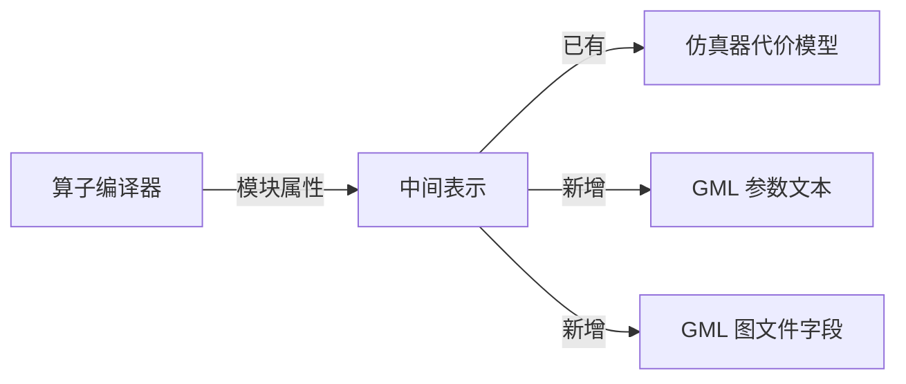

**建议复用这条通道，不另建接口。** 需要扩充的模块属性：

| 新增属性 | 对应 GML 字段 | 来源 |
| --- | --- | --- |
| 权重布局 | 权重格式 | 算子编译器的操作数布局选择 |
| 输入步幅、输出步幅 | 参数文本的步幅字段 | 分块结果 |
| 累加输出类型 | 累加模式 | 数值需求分析 |
| 浮点指数范围 | 三个指数字段 | 数值分布分析 |
| 单元绑定 | 单元参数、算子类型后缀 | 单元选择 |

---

## 3. 图编译器的哪些工作影响 GML

### 3.1 判据：GML 里有没有对应字段

一项工作是否影响 GML，取决于 GML 有没有承载它的字段。实测扫描后分成三类。

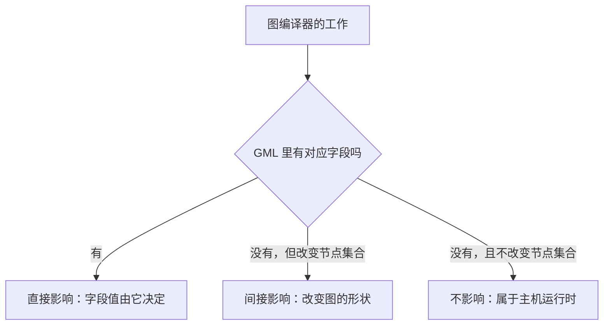

### 3.2 直接影响：量化与融合

| 工作 | GML 承载字段 | 实测出现次数 |
| --- | --- | ---: |
| 量化位宽选择 | 各缓冲区的数据类型 | 1389 |
| 量化参数生成 | 缩放系数、零点文件名 | 5178 |
| 动态量化开关 | 动态量化标志 | 72 |
| 算子融合 | 融合块 | 2 |

这两项是当前已实现的部分。

### 3.3 间接影响：改变节点集合的图优化

您提到的四类图优化，GML 里都**没有对应字段**，但它们改变最终的节点集合，
所以间接影响 GML。

| 优化 | GML 字段 | 影响方式 | 当前状态 |
| --- | --- | --- | --- |
| 常量折叠 | 无 | 折叠后节点消失，GML 少若干节点 | **未实现** |
| 死代码消除 | 无 | 同上 | **未实现** |
| 公共子表达式消除 | 无 | 重复计算合并，节点减少 | **未实现** |
| 算子融合 | 融合块 | 见 3.2，已实现 | 已实现 |

实测确认前三项在图编译器里均未实现（关键词扫描 `constant_fold`、`dead_code`、
`eliminate`、`cse` 均为 0 处）。

值得注意：**这三项不做也能产出合法 GML**，只是节点数偏多。所以优先级低于覆盖度缺口。

### 3.4 部分影响：图分割

图分割按设备边界切图。GML **不表达设备归属**，但可以「每设备一份 GML」——
切分结果体现在**张量形状**上，而非节点属性上。

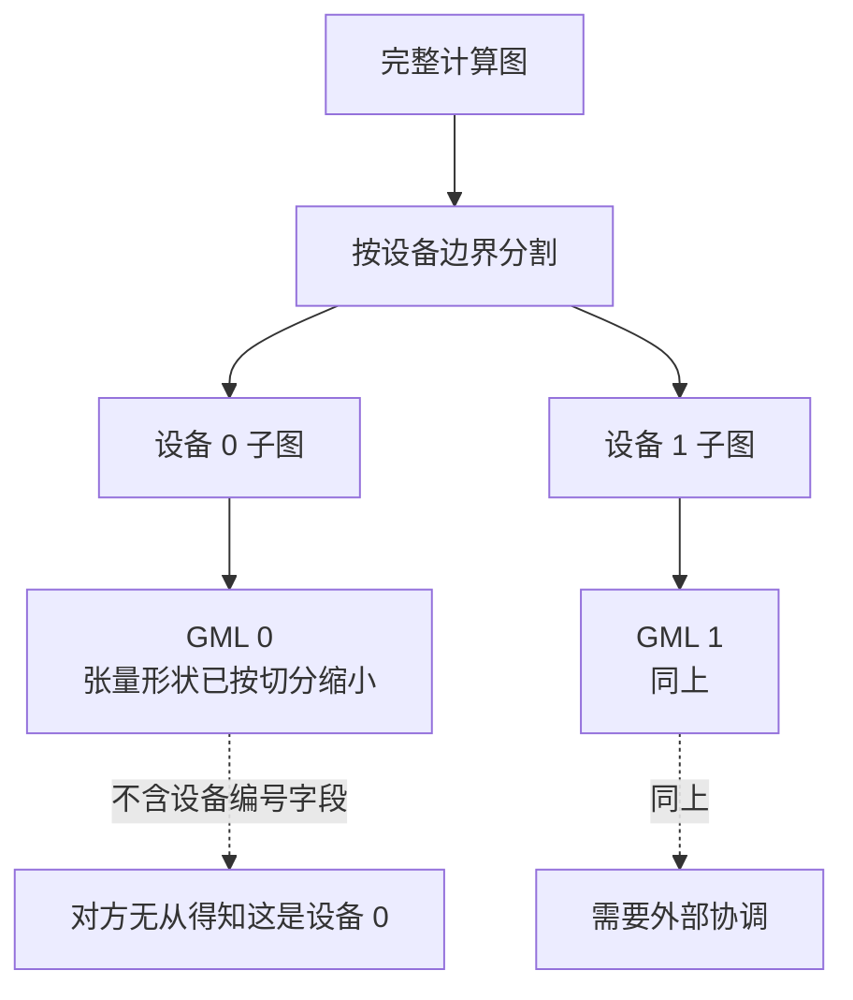

代价是**对方无从得知多份 GML 之间的关系**——GML 里没有设备编号，也没有跨设备通信
字段。所以这条路要先确认对方是否支持多份 GML 协同，属于待确认项。

### 3.5 不影响：主机运行时职责

您的判断是对的，这几项确实属于主机运行时。

| 工作 | 为什么不进 GML |
| --- | --- |
| 张量并行、流水并行 | GML 无设备编号字段，无跨设备通信字段 |
| 内存三区规划 | GML 只给缓冲区文件名，不给地址与偏移 |
| 键值缓存布局 | 缓存的地址规划不进；仅搬运动作作为节点存在 |
| 通信计划 | 对方明确答复不支持跨设备通信 |
| 执行计划 | 对方的分析器自行推导执行流 |

实测依据：扫描全部硬件放置字段在实物中均为 0 次。

```
pu_id  npu_id  dpu_id  core  core_id  tile  tiling  shard
vpu_id  node_assign  device  placement  cluster  rank
```

以及对方答复的三条硬约束：

| 问题 | 答复 |
| --- | --- |
| 是否支持分布式原语 | 不支持 |
| 是否支持跨设备通信 | 不支持 |
| 是否支持跨设备地址空间 | 不支持 |

### 3.6 键值缓存的特殊性

键值缓存值得单独说明，因为它一半进一半不进。

| 方面 | 是否进 GML |
| --- | --- |
| 缓存的读写**动作** | **进**，作为缓存搬运节点，实测 2 个 |
| 缓存的地址与偏移 | 不进 |
| 缓存的分块布局 | 不进 |
| 最大长度与有效长度 | 不进，体现在张量形状上 |

所以图编译器的键值缓存管理模块，只有「哪些位置需要搬运」这一点影响 GML，
具体布局不影响。

---

## 4. 量化路径的职责划分

您提到从浮点到多种定点的量化路径，这一项完全属于图编译器，但要区分两种。

### 4.1 静态与动态的分工

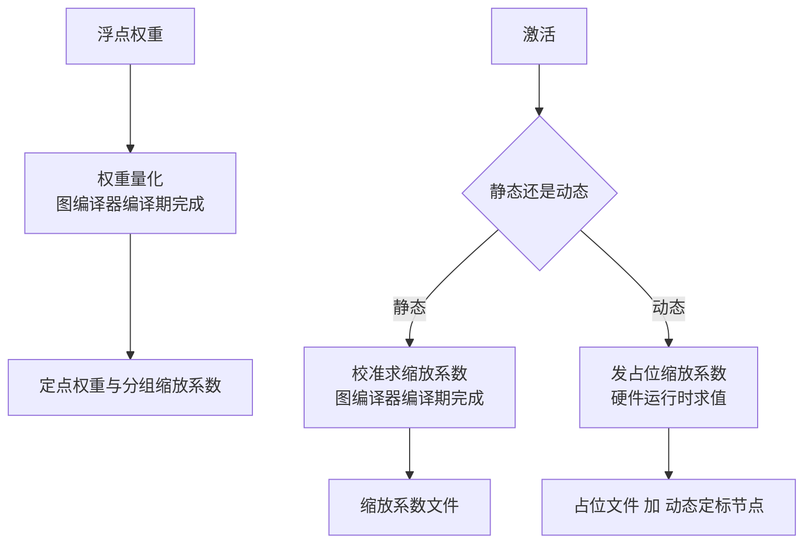

| 对象 | 谁量化 | 何时 | 实测依据 |
| --- | --- | --- | --- |
| 权重 | 图编译器 | 编译期 | 权重文件已是定点，值域严格 |
| 激活（静态） | 图编译器 | 编译期，需校准数据 | ResNet50 实物全静态 |
| 激活（动态） | **硬件** | 运行时 | llama2 实物动态标志全为 1，30% 缩放系数为占位值 |

llama2 走动态路径，所以**激活量化的数值不由图编译器决定**——它只负责发占位系数、
并产出动态定标节点让硬件知道在哪里求值。

### 4.2 位宽选择的归属

| 决策 | 归属 | 理由 |
| --- | --- | --- |
| 权重用几位 | 图编译器 | 精度与体积的权衡，属于模型层面 |
| 激活用几位 | 图编译器 | 同上 |
| 累加用几位 | **算子编译器** | 取决于硬件累加器宽度 |
| 中间态截断到几位 | **算子编译器** | 取决于数据通路 |

实测 llama2 的位宽组合：权重 4 位、激活 8 位、偏置 32 位、缩放系数半精度。
前两个是模型决策，后两个是硬件约束。

---

## 5. 完整通路：从仿真器到 GML

### 5.1 四段链路的实际形态

实测于全流程闭环日志。

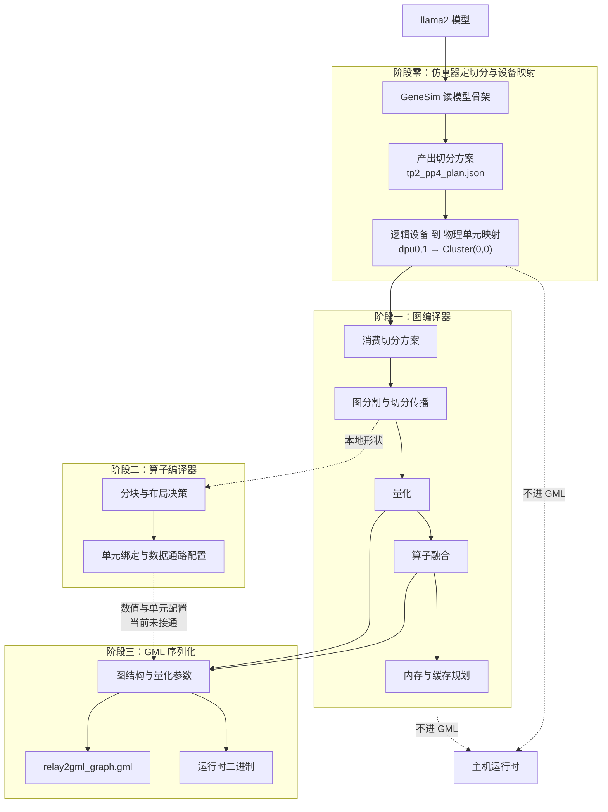

### 5.2 各阶段的输入输出

| 阶段 | 输入 | 输出 | 是否影响 GML |
| --- | --- | --- | --- |
| 零：仿真器 | 模型骨架 | 切分方案、设备映射 | **否**，止于主机运行时 |
| 一：图编译器 | 切分方案、模型权重 | 标注图、量化参数、融合结果、内存蓝图 | **部分**：量化与融合影响，其余不影响 |
| 二：算子编译器 | 本地形状、硬件参数 | 分块决策、布局选择、单元配置 | **应影响但当前未接通** |
| 三：序列化 | 图结构、量化参数 | GML 与二进制 | 是 |

### 5.3 设备映射的归属：由仿真器决定

这一点容易误判为图编译器的职责。实测闭环日志：

```
GeneSim: 切分方案已写入 models/llama2_7b_tp2_pp4_plan.json

方案: tp2_pp4（8 台设备 = 4 段 × 段内 2）
硬件: 8 设备 × 8 ClusterPU × 16 TensorPU
      ClusterPU 8192 MiB / TensorPU 512 MiB
模型: 32 层，每段 8 层
挑选依据: 每段权重 3088 MiB 小于 ClusterPU 容量 8192 MiB

逻辑设备到物理单元映射:
  stage0: dpu[0, 1] -> [(0, 0), (0, 0)]
  stage1: dpu[2, 3] -> [(0, 1), (0, 1)]
  stage2: dpu[4, 5] -> [(0, 2), (0, 2)]
  stage3: dpu[6, 7] -> [(0, 3), (0, 3)]

图编译器侧消费:
  python scripts/export_pp_placement.py --partition-plan ...
```

**切分方案与设备映射由仿真器产出，图编译器消费它。** 图编译器不做这个决策，
它按给定方案做切分传播与内存规划。

而 GML 里没有任何设备字段，所以这一层信息止于主机运行时，不进 GML。

### 5.4 一个双向的地方

大部分信息单向流动，但有一处双向：


图编译器把切分后的本地形状交给算子编译器；算子编译器按本地形状选分块，
把分块结果与代价交给仿真器；仿真器据此评估并给出切分方案。

这个环已经跑通——闭环日志里「算子编译器选出的分块 [128, 512]」就是这条路的产物，
仿真器的默认常量是 32，说明它确实采用了算子编译器的测量值。

**但这个环与 GML 无关。** 它服务的是切分决策与代价评估，不是 GML 生成。

---

## 6. 当前状态

本章说明截至 2026-09-15 的真实状态，包括两个编译器各自对 GML 生成起到的作用，
以及存在的问题。

### 6.1 一句话

**当前 GML 只由图编译器的量化与算子融合两项工作决定。算子编译器对 GML 生成的
贡献为零——它新增的原语与编译阶段虽已构建成功，但未接入任何产出链路。**

### 6.2 图编译器对 GML 的实际作用

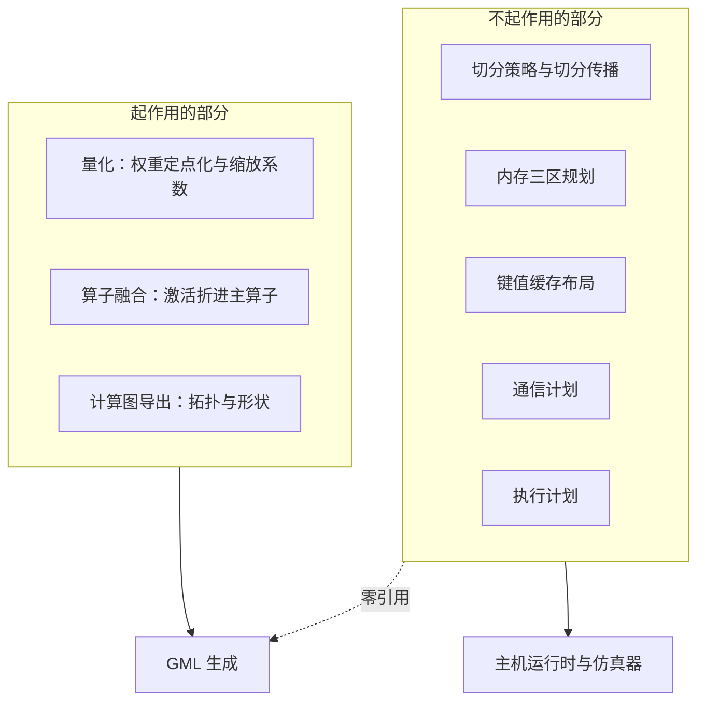

实测引用次数（扫描 GML 出口模块对图编译器既有模块的引用）：

| 图编译器模块 | 职责 | GML 出口引用次数 |
| --- | --- | ---: |
| 量化（本次新增） | 权重定点化 | 起作用 |
| 算子融合（本次新增） | 激活折入 | 起作用 |
| 计算图导出 | 拓扑与形状 | 起作用，仅形状元数据 |
| 切分策略 | 张量并行与流水并行策略 | **0** |
| 切分传播 | 张量规格沿图传播 | **0** |
| 张量规格 | 每个权重的切分与归属 | **0** |
| 内存蓝图 | 三区偏移规划 | **0** |
| 键值缓存布局 | 缓存区规划 | **0** |
| 通信计划 | 编译期通信表 | **0** |
| 执行计划 | 命令序列 | **0** |

**这不是遗漏，是 GML 格式使然。** 实测扫描全部硬件放置字段在实物中均为 0 次：

```
pu_id  npu_id  dpu_id  core  core_id  tile  tiling  shard
vpu_id  node_assign  device  placement  cluster  rank
```

配合对方答复的三条硬约束（不支持分布式原语、不支持跨设备通信、不支持跨设备
地址空间），切分与放置信息在 GML 里无处可放。

### 6.3 算子编译器对 GML 的实际作用：当前为零

本次工作在算子编译器侧新增了整算子级中间表示分层：

| 新增内容 | 数量 |
| --- | ---: |
| 原语 | 22 |
| 属性 | 8 |
| 枚举 | 9 |
| 片上存储空间 | 2 |
| 编译阶段 | 1 |

**但它们尚未接入实际产出链路。** 实测三项：

| 检查 | 实测结果 |
| --- | --- |
| 中间表示生成的编译阶段序列 | 仍是原有四个，新增的融合阶段**零调用** |
| 实际产出的中间表示里出现的原语 | 只有原有分块级（暂存分配、数据搬运、同步屏障、点积） |
| 22 个新增原语的出现次数 | **0** |

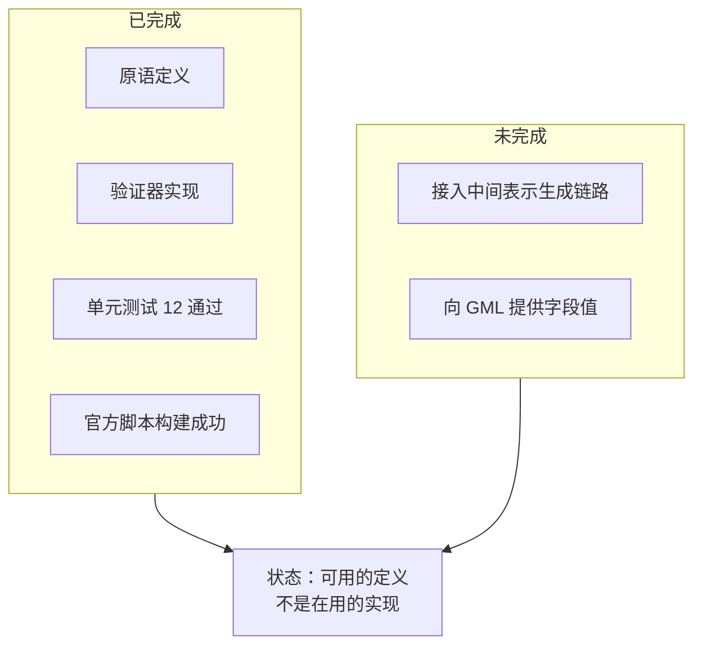

它们目前是「可用的定义」，不是「在用的实现」。

### 6.4 算子编译器应向 GML 提供的字段：当前全部缺失

实测 llama2 参考产物里属于「硬件如何执行」的字段共 54 族、1320 次出现，
占全部字段的 11%。**这部分当前完全缺失。**

| 类别 | 字段族 | 出现次数 | 实测取值示例 | 我方是否产出 |
| --- | ---: | ---: | --- | --- |
| 布局与步幅 | 12 | 402 | 权重格式取原始或转置 | **否** |
| 数据通路模式 | 8 | 335 | 累加单元跑浮点、定标单元跑单精度 | **否** |
| 定标粒度 | 14 | 221 | 按通道启用、按分组未启用、沿轴 1 | **否** |
| 数值格式 | 9 | 178 | 数据扩展取有符号或浮点 | **否** |
| 浮点指数范围 | 6 | 143 | 最小指数 9 或 10、尾数 3 位 | **否** |
| 功能单元与硬件版本 | 5 | 41 | 硬件版本 1.4、单元轴取 -1 | **否** |

其中硬件版本一项直接来自硬件配置常量，不需要算子编译器计算。

### 6.5 五个概念的实测含义

为避免概念含糊，逐个说明。

#### 布局：就是是否转置

GML 里只有一个字段承载布局：

| 取值 | 数量 | 含义 |
| --- | ---: | --- |
| 原始布局 | 32 | 权重按原始排列存放 |
| 转置布局 | 32 | 权重按转置排列存放 |

32 对 32 对应注意力的两个矩阵乘。**这是唯一进 GML 的布局信息，粒度很粗**——
只说转不转，不说单元内部怎么排列。

单元内部的排布优化属于算子编译器降级到硬件指令时的内部事务，GML 不表达。

#### 数据通路模式：三段流水线各用什么数值格式

| 字段 | 实测取值 | 说明 |
| --- | --- | --- |
| 累加单元模式 | 浮点，71 次 | 矩阵单元的输入输出格式 |
| 定标单元模式 | 单精度浮点 71 次、定点 2 次 | 定标段格式 |
| 后置重定标模式 | 关闭 116 次，另有 2 个启用 | 重定标块是否启用及方式 |

一处反直觉的实测结果：**这个模型的矩阵单元跑浮点，不是定点**。定点只用在权重存储。

#### 定标粒度：缩放系数按什么维度排列

| 字段 | 实测取值 | 含义 |
| --- | --- | --- |
| 按通道标志 | 1（启用），73 次 | 缩放系数按输出通道排列 |
| 按分组标志 | 0（未启用），73 次 | 不按分组排列 |
| 缩放轴 | 1，73 次 | 沿轴 1 排列 |
| 分组大小 | 128 | 权重侧使用 |

多输入算子的每个输入槽各有一套完整配置。

#### 数值格式：缓冲区的有符号性标记

| 字段 | 实测取值 |
| --- | --- |
| 输入数据扩展 | 有符号 82 次、浮点 111 次 |
| 输出数据扩展 | 有符号 50 次、浮点 143 次 |

存在的原因是整型本身不携带符号信息，必须显式标记。

#### 浮点指数范围：硬件的非标准窄浮点格式

| 字段 | 实测取值 |
| --- | --- |
| 最小指数 | 9 或 10 |
| 最大指数 | 16 或 17 |
| 尾数位宽 | 3 |

尾数仅 3 位、指数范围约 7，这是硬件专用的窄浮点格式，不是标准半精度。

### 6.6 循环分块与数据搬运：我方不产出

这一条曾被误判，实测更正。

GML 图文件里没有任何分块字段。分块信息确实存在于参数文本里，但**参数文本是对方
工具链的中间产物**：

| 证据 | 内容 |
| --- | --- |
| 时间顺序 | 网络配置 11:09:05、参数文本 11:09:39、GML 11:09:58 |
| 配置指向 | 网络配置里的输出路径配置指向参数文本目录 |

参数文本早于 GML 生成，且由对方的配置文件指定输出位置——它是对方生成的，
不是我方交付物。

**结论：**

| 项 | 是否进 GML | 谁做 | 是否外露 |
| --- | --- | --- | --- |
| 循环分块 | 否 | 算子编译器 | **不外露** |
| 数据搬运调度 | 否 | 算子编译器 | 不外露 |
| 片上暂存复用 | 否 | 算子编译器 | 不外露 |
| 布局（是否转置） | **是** | 算子编译器 | 外露 |

GML 的粒度是整算子级，装不下单元内部的分块与搬运细节。

### 6.7 当前产物与参考产物的差距

| 维度 | 参考产物（单解码块） | 我方（2 层） | 差距原因 |
| --- | ---: | ---: | --- |
| 节点数 | 200 | 79 | 注意力未逐头展开 |
| 边数 | 331 | 95 | 同上 |
| 带融合块的节点 | 2 | 0 | 我方图里可折激活已被独立节点取代 |
| 硬件执行类字段 | 54 族 | **0** | 算子编译器未接通 |

按节点数计的覆盖率约 25%，缺口构成：

| 缺口 | 影响节点数 | 占比 |
| --- | ---: | ---: |
| 注意力未逐头展开 | 128 | 64% |
| 动态定标未实现 | 36 | 18% |
| 其他（缓存搬运、旋转位置编码、按头切分） | 7 | 4% |

### 6.8 存在的问题

按严重程度排序。

| 序号 | 问题 | 性质 | 影响 |
| ---: | --- | --- | --- |
| 1 | 算子编译器对 GML 贡献为零 | **结构性** | 54 族硬件执行字段全部缺失 |
| 2 | 注意力表达粒度与参考产物不同 | **结构性** | 节点覆盖率仅 25% |
| 3 | 动态定标节点未实现 | 功能缺失 | 缺 36 个节点 |
| 4 | 查找表采样规则未知 | **外部阻塞** | 只能发恒等表 |
| 5 | 激活量化公式无法验证 | 外部阻塞 | 参考产物未交付浮点副本 |
| 6 | 图优化三项未实现 | 优化缺失 | 节点数偏多，不影响合法性 |
| 7 | 完整 32 层未实测 | 验证缺失 | 只测过 1 层与 2 层 |

第 1、2 项是本方案的主要问题，都在我方可控范围内。第 4、5 项需要对方答复。

### 6.9 已经可用的部分

避免只列问题造成误判，这些是已验证可用的。

| 项 | 状态 |
| --- | --- |
| GML 格式合法性 | 五条结构规则通过，第三方图库可解析 |
| 命名规则一致性 | 参考产物的 1168 个文件名全部可生成 |
| 权重量化数值 | 与真实权重反量化比对通过，误差等于理论上限 |
| 交叉校验机制 | 图引用集与落盘集完全相等 |
| 字段覆盖声明 | 参考产物 118 族全部表态，未表态为零 |
| 既有链路未受影响 | 全量回归保持基线，全流程闭环代价输出一致 |

---

## 7. 技术方案

### 7.1 分三期


| 期 | 目标 | 前置条件 |
| ---: | --- | --- |
| 一 | 节点覆盖率从 25% 提到 90% 以上 | 无，可立即开始 |
| 二 | 硬件执行类字段从 0 提到 54 族 | 需确认字段编码表 |
| 三 | 图优化与多设备 GML | 需对方确认多份协同 |

### 7.2 第一期：补齐覆盖度

按对节点数的影响排序。

| 序号 | 工作 | 影响节点数 | 归属 | 阻塞项 |
| ---: | --- | ---: | --- | --- |
| 1 | 注意力逐头展开 | 128（64%） | 图编译器 | 无 |
| 2 | 动态定标节点 | 36（18%） | 图编译器 | 激活类型编码表 |
| 3 | 按头切分节点 | 3 | 图编译器 | 依附第 1 项 |
| 4 | 键值缓存搬运节点 | 2 | 图编译器 | 无 |
| 5 | 旋转位置编码节点 | 2 | 图编译器 | 6 段定标配置语义 |

第 1 项是最大的单项收益：把一个批量矩阵乘展开成每头一组「矩阵乘、掩码、
归一化指数、矩阵乘」，节点数从 2 增到 128。

实现要点：图编译器已有按头切分的原语（按头切分算子），需要在计算图转换阶段
把批量注意力拆开，而不是保持批量形式。

### 7.3 第二期：接通算子编译器

复用已有的模块属性通道，分两步。

#### 第一步：扩充模块属性

在算子编译器的中间表示上增加模块属性，覆盖 6 类硬件执行信息。

| 新增属性 | 对应 GML 字段 | 谁决定 |
| --- | --- | --- |
| 权重布局 | 权重格式 | 矩阵单元的操作数要求 |
| 输入步幅、输出步幅、输出深度步幅 | 参数文本的步幅字段 | 分块结果 |
| 累加输出类型 | 累加模式、累加输出类型 | 数值需求 |
| 浮点指数范围三项 | 三个指数字段 | 数值分布 |
| 单元绑定 | 单元参数、算子类型后缀 | 单元选择 |
| 定标粒度四项 | 按通道、按分组、分组大小、缩放轴 | 定标策略 |

#### 第二步：图编译器读取并填入

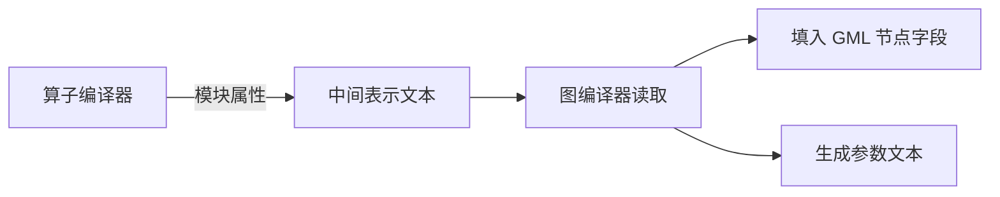

需要新增一个模块负责解析中间表示的模块属性并映射到 GML 字段。仿真器桥接里已有
类似的解析代码可以参考。

### 7.4 第三期：图优化与多设备

| 工作 | 收益 | 前置条件 |
| --- | --- | --- |
| 常量折叠 | 减少节点数 | 无 |
| 死代码消除 | 同上 | 无 |
| 公共子表达式消除 | 同上 | 无 |
| 每设备一份 GML | 支持多设备部署 | **需对方确认多份协同方式** |

前三项优先级低——不做也能产出合法 GML。第四项是架构决策，需要先问清对方。

### 7.5 不做的事

明确排除，避免返工。

| 不做 | 理由 |
| --- | --- |
| 把切分信息塞进 GML 节点属性 | GML 无对应字段，硬塞对方读不懂 |
| 把内存偏移写进 GML | GML 只要文件名，地址由对方分配 |
| 把通信计划写进 GML | 对方明确答复不支持 |
| 把片上暂存策略写进 GML | 属于算子编译器降级到指令的内部决策 |
| 在 GML 里表达执行顺序 | 对方的分析器自行推导 |

---

## 8. 待确认清单

按优先级排序。

| 序号 | 问题 | 阻塞哪一期 | 为什么需要 |
| ---: | --- | --- | --- |
| 1 | 请用对方解析器读一次我方 GML | 无，但成本最低 | 一次性确认格式可接受性 |
| 2 | 激活类型编码表 | 第一期第 2 项 | 动态定标节点的阶段配置 |
| 3 | 查找表采样规则 | 数值完整性 | 目前只能发恒等表 |
| 4 | 6 段定标单元的分工 | 第一期第 5 项 | 旋转位置编码的配置 |
| 5 | 是否支持多份 GML 协同 | 第三期 | 决定多设备方案可行性 |
| 6 | 浮点指数范围的取值规则 | 第二期 | 三个指数字段怎么填 |
| 7 | 权重布局的选择依据 | 第二期 | 什么情况用转置布局 |

---

## 9. 附录：字段归属完整清单

llama2 实物的字段按归属分类，用于核对遗漏。

| 归属 | 字段族数 | 出现次数 | 占比 |
| --- | ---: | ---: | ---: |
| 拓扑与身份（图编译器） | 70 | 2184 | 18% |
| 缓冲区文件名（图编译器） | 280 | 5178 | 43% |
| 数据类型（两者共同） | 58 | 1389 | 12% |
| **硬件执行（算子编译器）** | **54** | **1320** | **11%** |
| 几何与算子类型（图编译器） | 3 | 197 | 2% |
| 调试与其他 | 其余 | 其余 | 14% |

算子编译器负责的 11% 是当前完全缺失的部分。图编译器负责的部分已基本产出，
缺的是覆盖度而非字段类别。

---

## 10. 最大的缺口：层参数文本完全未产出

本章是本次对话最重要的更正。**交付给底层编译器的不只是图文件，还有一份层参数文本，
而我方完全没有产出它。**

### 10.1 交付物实际有两部分

参考产物的目录结构：

```
llama2_w4a8_decode_block_0/
├── parser_output/                     第一部分：图与二进制
│   ├── relay2gml_graph.gml            200 节点 / 331 边
│   └── *.bin                          3235 个运行时文件
└── prepare_out/                       第二部分：层参数文本（我方缺失）
    ├── net.ini                        网络配置，列出 422 个层
    ├── net.ini.orig                   配置模板
    └── txt_files/                      424 个层参数文本
```

| 部分 | 内容 | 我方是否产出 |
| --- | --- | --- |
| 图与二进制 | 计算图、权重、量化参数 | **是**，但覆盖度不足 |
| **层参数文本** | 每层的内存分配、步幅、单元配置 | **完全没有** |

### 10.2 为什么它是交付物而非中间产物

早期误判它是对方生成的，依据是时间戳。真正的证据在配置模板里：

```
net.ini.orig:
  dumps_bin_path = vbu_L2_analyzer_python_sim\files\scaleNshift
  dumps_txt_path = txt_files
```

`vbu_L2_analyzer_python_sim` 是**对方 L2 分析器的仿真目录**。说明网络配置与层参数
文本是**喂给它的输入**，对方是消费者。

内容本身也是证据。以掩码算子的参数文本为例：

| 信息 | 出现次数 | 性质 |
| --- | ---: | --- |
| L2 偏移与大小 | 13 处 | **物理地址分配** |
| 主存偏移与步幅 | 9 处 | 物理地址分配 |
| 缓冲区编号 | 4 处 | 资源分配 |

**只有做过内存规划的一方才能填这些数值。** 对方的分析器读取它们来生成硬件指令。

### 10.3 层参数文本的完整内容

以 `mha_masking_head18_qidx239_params_125.txt` 为例，158 行，分六类。

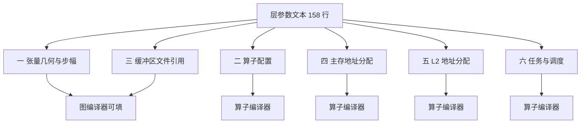

#### 第一类：张量几何与步幅

```
Input Width: 1024          Input Height: 1
Input Stride X: 1024       Output Stride X: 1024
Output Width: 1024         Output Stride Z: 1039
Number of frames: 1        Input Maps: 1
```

注意 `Output Stride Z` 是 1039 而 `Output Stride X` 是 1024——**差值 15 是对齐填充**。
这不是形状，是**布局决策**，由算子编译器根据硬件的对齐要求确定。

| 字段 | 谁决定 |
| --- | --- |
| 宽、高、映射数 | 图编译器，来自张量形状 |
| **X 方向步幅** | 算子编译器，含对齐 |
| **Z 方向步幅** | 算子编译器，含填充 |

#### 第二类：算子配置

```
Eltwise mode: 2            Kantor mode: 0
Activation Type: 0         Raster mode: 0
Quant_source: 0            Input Format: 0
Mask Buffer Index: 1       Output Format: 1
Use Clipping 0: 0          Use FPSU 0: 0
Input Fraction bits: 0     Output Fraction bits: 0
```

这一类与 GML 的字段重叠，但**粒度更细**：GML 只有模式名，这里还有定点小数位数、
是否启用裁剪、是否启用定标单元等开关。

#### 第三类：缓冲区文件引用

```
Datain file 0: input_buffer_0_125.bin
Datain file 1: input_buffer_1_190.bin
Dataout file: input_buffer_124.bin
output scale factor buffer: input_sf_124.bin
Residual input buffer 0: 126
Residual output buffer: 124
```

与 GML 的缓冲区命名一致，可以复用 `contracts/gml_names.py` 的命名规则。

#### 第四类：主存地址分配

```
DDR Input Width 0: 1024          DDR Input stride X 0: 1024
DDR Input start Col 0: 0         DDR Input stride Z 0: 1024
DDR Input start Row 0: 0         DDR Input buffer offset 0: 0
DDR Input start Map 0: 0         DDR Input buffer size 0: 0
DDR Input Orig Buffer Name 0: buffer117
Graph Input 0: 1
```

每个输入、输出各一组。**这是主存的物理地址与切片位置**，对应我方图编译器的内存
三区规划——但格式完全不同，需要转换。

#### 第五类：L2 地址分配

这一类是您问的 L1/L2 层级信息。

```
L2 qman buffer offset: 536805376     L2 qman buffer size: 65536
L2 input buffer offset 0: 0          L2 input buffer size 0: 2048
L2 input buffer offset 1: 536788928  L2 input buffer size 1: 2048
L2 output buffer offset: 2112        L2 output buffer size: 2080
L2 fpsu buffer offset 0: 536791040   L2 fpsu buffer size: 7168
L2 fpsu buffer offset 1: 536798208
L2 weights buffers per engine: 4
L2 input buffer id 0: 4              L2 input buffer id 1: 5
L2 output buffer id: 6               L2 fpsu buffer id: f2
Weights source: 3                    Fpsu source: 3
L2 input for DMA height 0: 1         L2 input for DMA width 0: 1024
L2 input slice maps offset 0: 0      L2 input slice num of maps 0: 1
```

逐项说明：

| 字段 | 含义 | 谁决定 |
| --- | --- | --- |
| 各类缓冲区偏移与大小 | 片上存储的物理布局 | **算子编译器** |
| 缓冲区编号 | 硬件缓冲区的资源分配 | **算子编译器** |
| **权重来源、定标来源** | 数据从哪一级存储取，实测均为 3 | **算子编译器** |
| 每引擎权重缓冲区数 | 权重在多引擎间的分配 | **算子编译器** |
| 搬运的高与宽 | 每次搬运的数据块尺寸 | **算子编译器**，来自分块 |
| 切片映射偏移与数量 | 数据切片的位置 | **算子编译器**，来自分块 |

您问的「权重来源、定标来源是不是布局信息」——**不是布局，是数据来源标识**：
告诉硬件从哪一级存储取数。同样只有做过内存规划的一方能填。

#### 第六类：任务与调度

```
Task ID: 0                 Prev task count: 0
Layer ID: 125              Next task count: 0
Is Macro Tile: False       Macro Tile ID: 1
Total number of MT: 1      Split Head Index: 18
Bytes in cycle internal memory read: 64
Bytes in cycle internal memory write: 64
Input data order 0: 0      Output data order: 0
After concat: false        Before concat: false
```

| 字段 | 含义 | 谁决定 |
| --- | --- | --- |
| 任务编号、层编号 | 执行单元的标识 | 算子编译器 |
| 宏分块标志与编号 | 大尺寸算子的二级分块 | **算子编译器** |
| **按头切分索引** | 这一层处理第几个注意力头 | 图编译器 |
| 每周期内存读写字节数 | 带宽配置 | 硬件规格 |
| **数据排布顺序** | 张量在存储中的排列方式 | **算子编译器** |
| 拼接前后标志 | 与相邻算子的关系 | 图编译器 |

### 10.4 粒度差异：422 个层对 200 个节点

| 产物 | 单位数 | 比值 |
| --- | ---: | ---: |
| 图文件 | 200 个节点 | 1.00 |
| 层参数文本 | 422 个层 | **2.11** |

层参数文本的粒度是图文件的两倍多。原因是**动态定标的每个阶段都是独立的层**：

```
dynamic_quantization_params_24_gp_dq_phase1_params_213
dynamic_quantization_params_24_act_dq_phase2_params_214
dynamic_quantization_params_24_act_dq_phase3_params_215
dynamic_quantization_params_24_act_dq_phase4_params_24
```

图文件里这是**一个**动态定标节点，层参数文本里是**四个**层。

### 10.5 我方产出的缺失清单

对照参考产物，我方缺失的内容。

#### 图文件与二进制部分

| 缺失项 | 参考产物数量 | 原因 |
| --- | ---: | --- |
| 输出缓冲区字段 | 197 处 | 我方按消费者命名，未产出生产者侧字段 |
| 查找表文件 | 139 个 | 采样规则未确认 |
| 各阶段定标系数 | 每阶段一组 | 动态定标未实现 |
| 旋转位置编码的正余弦参数 | 多组 | 该算子未实现 |
| 掩码、归一化指数节点 | 各 32 个 | 注意力未逐头展开 |

#### 层参数文本部分

| 缺失项 | 参考产物数量 | 严重程度 |
| --- | ---: | --- |
| **网络配置文件** | 1 个，列出 422 层 | **必需** |
| **层参数文本** | 424 个 | **必需** |
| L2 地址分配 | 每层 13 处以上 | 必需 |
| 主存地址分配 | 每层 9 处以上 | 必需 |
| 步幅与对齐 | 每层 4 处以上 | 必需 |

**整个层参数文本部分我方产出为零。**

### 10.6 二进制文件族的逐项差异

10.5 节给了定性清单，这里是实测的定量对照。

命令与产物：

```bash
python scripts/export_gml.py --layers 1 --seq-len 16 --out-dir /tmp/gml_out
```

| 对象 | 文件族数 | 文件数 |
| --- | ---: | ---: |
| 参考产物（单解码块） | **198** | **3231** |
| 我方产物（2 层） | **10** | **219** |

族数差距 19.8 倍。**我方只产出了输入侧的数据与缩放系数，输出侧、量化零点、
定标系数、查找表、动态定标各阶段全部缺失。**

#### 我方已产出的十族

| 文件族 | 数量 | 说明 |
| --- | ---: | --- |
| `input_buffer` | 63 | 单输入算子的数据缓冲区 |
| `input_sf` | 62 | 单输入算子的缩放系数 |
| `input_buffer_0` / `_1` / `_2` | 15 / 15 / 2 | 多输入算子各槽位的数据缓冲区 |
| `input_0_sf` / `_1_sf` / `_2_sf` | 15 / 15 / 2 | 多输入算子各槽位的缩放系数 |
| `weight_buffer` | 15 | 定点权重 |
| `weight_sf` | 15 | 权重的分组缩放系数 |

#### 缺失的一百八十八族，按原因归类

| 原因 | 缺失族数 | 缺失文件数 | 代表文件族 |
| --- | ---: | ---: | --- |
| **动态定标各阶段** | 31 | **1789** | 各阶段的输入输出缓冲区、定标系数、偏置、查找表 |
| **量化零点** | 42 | 381 | 输入零点、权重零点、输出零点 |
| **累加后定标** | 3 | 219 | 定标系数、后移位量、定标偏置 |
| **输出侧缩放系数** | 1 | 146 | 输出缩放系数 |
| 旋转位置编码 | 37 | 67 | 正弦余弦常量与其缩放系数 |
| 后置重定标 | 6 | 8 | 重定标块的系数、偏置、移位量 |
| 独立查找表 | 1 | 1 | 非阶段的激活查找表 |
| 其他 | 67 | 117 | 调试副本、激活前中间态等 |

按文件数排序，**动态定标各阶段占缺失总量的 66%**——它是最大的单项缺口。

#### 四个具体缺失项的说明

您提到的四项，逐个说明原因。

| 缺失项 | 参考数量 | 原因 |
| --- | ---: | --- |
| 输出缓冲区 | 146 组 | 我方只按消费者命名产出输入侧；生产者侧的输出缩放系数与零点未产出 |
| 各阶段查找表 | 69 个 | 动态定标节点未实现，且采样规则未确认 |
| 旋转位置编码的正余弦零点 | 各若干 | 该算子未实现 |
| 各阶段后移位量 | 69 个 | 动态定标节点未实现 |

前两项与后两项的性质不同：

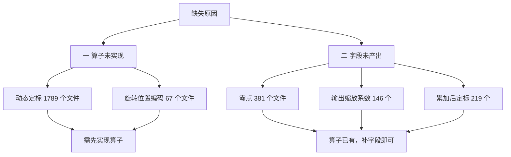

**第二类相对容易**：算子节点已经产出，只是没写对应的二进制。零点恒为零、
输出缩放系数可从下游节点的输入缩放系数推得、累加后定标的系数需要量化流程补齐。

**第一类需要先实现算子**，工作量大得多。

#### 与图文件字段的对应关系

二进制缺失与图文件字段缺失是同一件事的两面：

| 图文件缺失的字段 | 对应缺失的二进制 |
| --- | --- |
| 各类零点字段 | 零点文件 381 个 |
| 输出缩放系数字段 | 输出缩放系数文件 146 个 |
| 定标系数与偏置字段 | 定标文件 219 个 |
| 动态定标节点的阶段字段 | 阶段文件 1789 个 |

所以补齐工作是成对的：产出字段的同时产出对应的二进制，两侧靠交叉校验保持一致。

### 10.7 需要做的工作

按依赖顺序，不是按优先级——后面的依赖前面的。

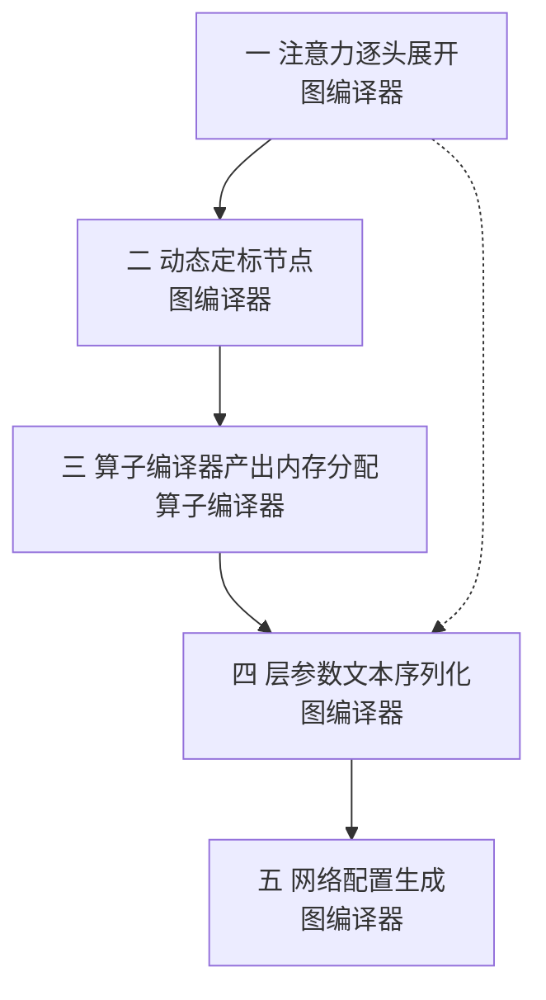

#### 第一项：注意力逐头展开（图编译器）

把批量注意力展开成每头一组算子。

| 输入 | 输出 |
| --- | --- |
| 一个批量矩阵乘 | 每头四个节点：矩阵乘、掩码、归一化指数、矩阵乘 |

影响：图文件节点数从 2 增到 128，且层参数文本需要 128 个对应的层。
已有按头切分原语可用。

#### 第二项：动态定标节点（图编译器）

产出带四阶段的动态定标节点。

| 需要的信息 | 来源 |
| --- | --- |
| 各阶段的输入输出缓冲区 | 命名规则可推 |
| 各阶段的定标系数与偏置 | 需要激活类型编码表 |
| 归约宽度 | 实测恒为 1024 |
| 各阶段的查找表 | 采样规则未确认，暂发恒等表 |

影响：图文件增 36 个节点，层参数文本增约 144 个层（每节点四阶段）。

#### 第三项：算子编译器产出内存分配（算子编译器）

这是本方案当前完全空缺的部分。算子编译器需要在中间表示上产出：

| 需要产出 | 用于填写 |
| --- | --- |
| L2 各类缓冲区的偏移与大小 | L2 地址分配字段 |
| L2 缓冲区编号 | 缓冲区编号字段 |
| 权重与定标系数的存储来源 | 来源标识字段 |
| 每引擎权重缓冲区数 | 权重分配字段 |
| 搬运块的高与宽 | 搬运尺寸字段 |
| 切片映射偏移与数量 | 切片位置字段 |
| X 与 Z 方向步幅（含对齐） | 步幅字段 |
| 数据排布顺序 | 排布字段 |
| 宏分块标志与编号 | 分块字段 |
| 主存偏移、切片起始行列 | 主存地址字段 |

建议复用已有通道：算子编译器已通过中间表示的模块属性向仿真器提供分块信息，
可扩充同一套属性承载上述内容。

#### 第四项：层参数文本序列化（图编译器）

新增模块，把图结构与算子编译器的内存分配合成 158 行格式的文本。

| 子任务 | 说明 |
| --- | --- |
| 字段顺序与格式 | 参考产物是固定顺序的键值对，冒号对齐 |
| 六类字段的填充逻辑 | 见 10.3 节分类 |
| 每层一个文件 | 文件名与网络配置里的层名一致 |
| 与图文件的一致性校验 | 缓冲区名、层数、拓扑必须对得上 |

#### 第五项：网络配置生成（图编译器）

产出列出全部层的配置文件。

| 内容 | 说明 |
| --- | --- |
| 通用段 | 步幅配置、输出路径 |
| 层清单 | 按执行顺序列出全部层名，实测 422 行 |
| 行尾格式 | 实测参考产物用回车换行 |

### 10.8 两份产物的一致性要求

图文件与层参数文本必须相互一致，这是新增的校验维度。

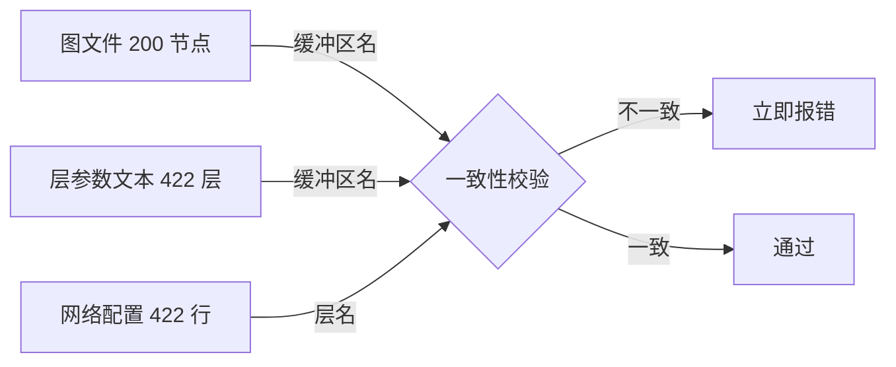

| 校验项 | 判据 |
| --- | --- |
| 缓冲区名 | 图文件引用的每个名字都要在层参数文本里出现 |
| 层名 | 网络配置的每一行都要有对应的参数文本文件 |
| 层数展开关系 | 一个动态定标节点对应四个层 |
| 拓扑 | 残差缓冲区编号在两边一致 |

现有的交叉校验机制只覆盖「图文件引用集与落盘二进制集相等」，需要扩充到覆盖
层参数文本。

---

## 11. 本次工作的交接状态

### 11.1 已完成并验证的

| 项 | 实测结果 |
| --- | --- |
| 算子编译器构建 | 用官方安装脚本构建成功，工具与包均已重新生成 |
| 中间表示单元测试 | 12 通过，含 30 条拒绝断言 |
| 图编译器全量回归 | **420 通过**，基线 289 全部保留 |
| 真实模型推理 | 3 通过，含与参考实现逐元素对齐 |
| 全流程闭环 | 通过，代价模型输出与既有基线一致 |
| GML 格式合法性 | 五条结构规则通过，第三方图库可解析 |
| 权重量化数值 | 与真实权重反量化比对通过 |
| 产物导出 | 相对路径 `gml-artifacts/llama2_7b_layers2_seq128/`，221 个文件 |

### 11.2 编译方式

**唯一生效的方式**是官方安装脚本，不要直接调用底层构建工具。

```bash
cd /media/disk/fengjingge/src/flagOS/flagOS-installers
ALLOW_DIRTY_FLAGTREE_SOURCE=1 bash 0-install-flagtree.sh --max-jobs 16
```

那个环境变量是脚本自带的本地开发开关——默认拒绝有未提交修改的源码，而本方案的
改动尚未提交。

### 11.3 三个仓库的改动

| 仓库 | 修改既有文件 | 新增文件 | 是否触碰核心逻辑 |
| --- | --- | --- | --- |
| 算子编译器 | 9 个，`+2333 / −4` | 5 个，共 1000 行 | 是，新增整算子级分层 |
| 图编译器 | 5 个，`+32 / −2` | 26 个 | 是，新增完整出口 |
| **仿真器** | **0** | **0** | **否** |

仿真器零改动的三条依据：仓库无代码改动；桥接模块仅新增两个解析函数、未触碰既有
接口；全流程闭环代价输出与基线完全一致。

### 11.4 下一任务的起点

**最大的缺口是层参数文本完全未产出**，详见第 10 章。按依赖顺序排列工作项。

| 序号 | 工作 | 归属 | 影响 | 阻塞 |
| ---: | --- | --- | --- | --- |
| 1 | 补齐已有算子的二进制字段 | 图编译器 | 补 746 个文件（零点、输出系数、定标） | 无 |
| 2 | 注意力逐头展开 | 图编译器 | 图文件节点数 2 增到 128 | 无 |
| 3 | 动态定标节点及其阶段二进制 | 图编译器 | 图文件增 36 节点，补 1789 个文件 | 激活类型编码表 |
| 4 | 算子编译器产出内存与地址分配 | **算子编译器** | 层参数文本的必要输入 | 无 |
| 5 | 层参数文本序列化 | 图编译器 | **补齐第二份交付物** | 依赖第 4 项 |
| 6 | 网络配置生成 | 图编译器 | 列出全部层 | 依赖第 5 项 |
| 7 | 接通硬件执行类字段到图文件 | 两侧 | 补齐 54 族字段 | 部分需编码表 |
| 8 | 旋转位置编码节点 | 图编译器 | 补 67 个文件 | 定标单元配置语义 |
| 9 | 两份交付物的一致性校验 | 图编译器 | 防止悬空引用 | 依赖第 5、6 项 |
| 10 | 图优化三项 | 图编译器 | 减少节点数 | 无，优先级低 |
| 11 | 每设备一份图文件 | 图编译器 | 支持多设备 | 需确认多份协同 |

第 1 项排在最前，因为它**性价比最高**：算子节点已经产出，只需补写对应的二进制。
零点恒为零、输出缩放系数可从下游节点的输入系数推得、定标系数由量化流程补齐——
都不依赖未确认的语义。

补完后二进制文件族从 10 增到约 20。具体文件数取决于层数，不做绝对数预测——
我方是 2 层而参考产物是单解码块，两者规模不同，参考产物里这三类共 746 个文件
这个数字不能直接套用。

第 1 项是图文件侧的最大单项收益。第 2 至 4 项合起来补齐第二份交付物，其中第 2 项
是关键——**算子编译器当前完全没有产出内存与地址分配信息**，而层参数文本里每层有
13 处以上片上地址、9 处以上主存地址需要它填。

第 6 项的接法建议复用已有通道：算子编译器已通过中间表示的模块属性向仿真器提供分块
信息，同一条通道可扩充承载布局、数据通路、定标粒度等字段，不必另建接口。

### 11.5 开新对话时的快速理解路径

| 想了解 | 读哪里 |
| --- | --- |
| 交付物有哪两份、缺什么 | 第 10 章，特别是 10.1 与 10.5 |
| 两个编译器各管什么 | 第 1 章的职责边界图，第 6 章 |
| 从仿真器到交付物的完整通路 | 第 5 章 |
| 五个硬件概念的实测含义 | 6.5 节 |
| 下一步做什么 | 11.4 节 |
| 实现细节与复现命令 | `docs/gml-lowering-20260914.md` |

三处曾经的误判，避免重复走弯路：

| 误判 | 更正 |
| --- | --- |
| 层参数文本是对方的中间产物 | **是我方必须交付的输入**，见 10.2 节 |
| 定标系数由输入乘权重除输出算出 | 它是算子自身的数学缩放，与量化无关 |
| 按算子类型计覆盖率 71% 就够 | 按节点数计仅约 25%，注意力粒度是主因 |

### 11.6 相关文档

| 文档 | 内容 |
| --- | --- |
| `docs/gml-lowering-20260914.md` | 实现细节、验证方法、复现步骤、不足与遗留问题 |
| 本文档 | 职责划分、完整通路、当前状态 |
| `gml-artifacts/llama2_7b_layers2_seq128/README.md` | 产物说明与校验命令 |
