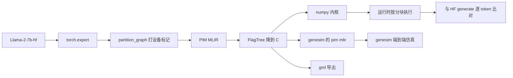

# 实施文档：Llama2 7B 推理算子全量走通存算一体编译链路

> 文档编号：implement-llama2-7b-e2e-20261003
> 日期：2026-10-05
> 关联需求：request-llama2-7b-e2e-20261003
> 关联设计：design-llama2-7b-e2e-20261003
> 涉及仓库：flagos-pim-compiler（图编译器）、FlagTree（算子编译器）、genesim（仿真器）

## 一、概述

这版让 Llama2 7B 推理里的算子不再因为形状被挡在编译器外面。原先线性算子要求 M、K、N 都是 2 的幂，8 卡切分下 `gate_proj`、`up_proj` 的 N=1376、`down_proj` 的 K=1376、`lm_head` 的 N=32000 全部退回主机 numpy，而端到端断言只比对 token，退回了照样是绿的。

现在三个维度都按分块遍历，最后一块不满由掩码和下标夹取处理，任意形状都能进编译内核。类型范围扩到 fp32、int32、int64，逐元素算子支持广播，三维 fp16 的批量矩阵乘逐批拆开。`mean.dim`、`pow`、`rsqrt`、`unsqueeze`、`transpose.int`、取负、步长为 1 的切片改走已有的编译入口。每个内核都记命中或退回，端到端测试断言退回次数为 0。

三条路径都有产物：numpy 拿到可加载的内核，genesim 拿到 pim mlir，gml 在导出图里核对算子名。genesim 上跑通一次端到端仿真，8084 个 token。当时 6720 条 trace 全部来自 pim mlir，2026-10-06 钉死非 GEMM 算子后复跑为 7138 条，见第五节第 3 条。

## 二、修改思路

限制分两层。上层是运行时的提前退回：`_compiled_linear_supports` 看到维度不是 2 的幂就直接走 numpy 镜像，编译器根本没机会接手。下层是编译器自己：Triton 的 `tl.arange` 要求范围是 2 的幂，分块搜索也只枚举能整除维度的 2 的幂，降级侧遇到不能整除的循环直接报错。

所以放宽的顺序不能反。先让内核按分块遍历并给尾块加掩码，再让分块搜索接受任意尺寸，然后降级侧把循环上界收回到真实维度，最后才删掉运行时的形状判断。先删判断、后补分块，超容量的形状会在编译期直接报错。

尾块的处理分两处。Triton 内核里三个维度的加载和存储都带越界掩码，越界元素填 0，不进累加。FlagTree 降到 C 时没有掩码机制，改成循环次数向上取整，并把 M、K、N 收回到真实维度，循环上界就是真实尺寸；下标夹取留在取元素偏移的一处，作为越界时的兜底。

类型与尺寸按 llama 推理实际出现的形态打开，不是把所有 dtype 都接进来。逐元素算子两侧统一到命令声明的输出类型，标量先铺成整块常数。批量矩阵乘只接三维且两侧都是 fp16 的，逐批拆成二维再折回。int32 补进转换类型表，int64 是 attention 掩码的位置索引，两个方向都加了。bfloat16 没加：推理不产生它，降级侧也没有对应的位操作。

计划里原先有一批算子直接跑 numpy，既不计命中也不计退回，「兜底次数为 0」看不见它们。这批不新增编译器能力，复用已有入口，见下表。

| aten 算子 | 走的编译入口 | 做法 |
| --- | --- | --- |
| `mean.dim` | `reduce`（新增） | 沿单轴求和再乘 1/轴长，求和在 fp32 上做完再存 |
| `pow`（指数为 2） | `eltwise` 的乘 | 自己乘自己 |
| `rsqrt` | `lut` 的 rsqrt | 查表激活加一个种类 |
| `neg` | `eltwise` 的减 | `0 - x` |
| `unsqueeze` | `reshape` | 插一根长度为 1 的轴，元素不变 |
| `transpose.int` | `transpose` | 两个轴号拼成全轴序 |
| `slice`（步长为 1） | `transpose` + `reshape` | 被切的轴转到轴首，目标区间成连续前缀，拷出后再转回 |

没有编译形态的算子（`relu`、`sigmoid`、`exp`、`sqrt`、`reciprocal`，以及步长不是 1 的切片）退回镜像并计入退回，不再是静默的。

仿真侧有一处放置错位。拆分放置单元时把编译器钉过的算子单独摘出来，单元变多了，层面位置和注意力序号仍按拆分前的下标记录，GEMM 单元继承了注意力流的序号，真正的注意力单元掉出分桶、被分到 GPU，trace 退回手写模板。拆分时把这三张表一起重建。

## 三、改了哪些文件

三个仓库都是未提交的改动。行数是相对各自 HEAD 的统计。

| 仓库 | 改动规模 | 作用 |
| --- | --- | --- |
| flagos-pim-compiler | 17 个文件，+1860 / -185，另新增 4 个文件 | 图编译、运行时、三路径测试 |
| FlagTree | 7 个文件，+166 / -53，另新增 1 个 lit | 分块搜索与降级 |
| genesim | 2 个文件，+140 / -8 | 放置表重建与钉死规则 |

### 3.1 flagos-pim-compiler

| 文件 | 函数 | 改动 |
| --- | --- | --- |
| `opcompiler_bridge/kernel_src.py` | `linear_kernel`、`_clamp_block`、`pick_blocks` | M 维也按分块遍历；`_pick` 换成 `_clamp_block`，不再要求分块整除维度；`pick_blocks` 返回三块 |
| `opcompiler_bridge/driver.py` | `_kernel_launcher`、`_compiler_fingerprint`、`_cache_key` | 删掉 M 必须是 2 的幂的校验；缓存键拼上三份生成 IR 的源文件和两份编译器产物的指纹；新增 `reduce` 分支，`group_size` 复用为归约轴 |
| `opcompiler_bridge/oplevel_kernel.py` | `reduce_kernel`、`eltwise_kernel`、`convert_kernel` | 新增沿单轴求均值的内核；逐元素内核按 dtype 出 fp16 或 fp32；转换类型表加 int32、int64 |
| `contracts/op_semantics.py` | `OP_SEMANTICS` | 新增 `reduce` 条目，承载 `aten.mean.dim`，不进助记符统计 |
| `runtime/kernels.py` | 见 3.2 | 放宽支持判断、打开类型与尺寸、五个算子改走编译、退回计数 |
| `genesim_bridge/placement_export.py` | `_measure_kernel_tile_n` | 注释改为三个维度都能分块，M=1 只是取一条代表性产物 |
| `scripts/run_full_pipeline.py` | `step_e_simulate`、`verify_trace_provenance`、`verify_sidecar_freshness`、`_trace_metadata`、`limited_config` | 仿真前先核对 sidecar 的哈希；trace 来源检查扩到全部 `op_*.pim_trace`；元数据按固定偏移切，长度超出文件直接报错；`--max-requests` 收短仿真，默认跟随配置，显式传参才改请求数 |
| `tests/conftest.py` | `pytest_runtest_logreport` | 失败时把详情追加到 `test-results/failure-live.md`，长套件被中途停掉也不丢现场 |

### 3.2 运行时内核

`runtime/kernels.py` 是改动最大的一个文件。路由计数是模块级字典，键是 `(算子名, "hit" 或 "fallback")`，由 `record_route`、`route_counts`、`reset_route_counts` 三个函数操作。记录点共 22 处，覆盖 `linear`、`eltwise`、`matmul`、`softmax`、`reduce`、`lut`、`reshape`、`transpose` 的命中与退回，以及没有编译形态的 `neg`、`pow`、`rsqrt`、`slice`、`relu`、`sigmoid`、`exp`、`sqrt`、`reciprocal` 的退回。

| 函数 | 改动 |
| --- | --- |
| `_compiled_linear_supports` | 删掉三个维度的 2 的幂判断，只留 dtype 与 `k >= 16`；`_is_pow2` 删除 |
| `compiled_linear_kernel` | 不支持时先记退回再走镜像 |
| `_compiled_eltwise`、`_eltwise`、`_align_broadcast` | fp16 与 fp32 各编一种；先按输出形状广播，类型取命令的 `dtype`；编译时带上命令的硬件上下文 |
| `matmul` | 三维且两侧都是 fp16 的批量矩阵乘逐批拆开，其余形状退回并计数 |
| `_compiled_convert` | 类型表加 int32、int64 |
| `mean_dim_kernel`、`_compiled_reduce` | fp16 走 `pim.reduce`，求和在 fp32 上做完再存 |
| `pow_kernel`、`neg_kernel` | 指数为 2 的幂走逐元素乘，取负走逐元素减 |
| `rsqrt_kernel` | 走 `pim.lut` 的 rsqrt |
| `unsqueeze_kernel`、`transpose_int_kernel` | 分别走 `reshape` 与 `transpose` |
| `slice_kernel`、`_compiled_slice` | 步长为 1 的切片走两次转置加一次连续拷贝，其余退回 |
| `_compiled_normalize` | 形状改为契约要求的单个二维形状，epsilon 按镜像的 `1e-5` 传入 |
| `_unary` | 没有编译形态的一元算子各记自己的退回 |

K 小于 16 是唯一保留的形状限制。Triton 的 `tl.dot` 要求 K 不小于 16，低于它编译器直接报错，这类形状退回镜像并计入退回，判据看得见。

### 3.3 FlagTree

| 文件 | 函数 | 改动 |
| --- | --- | --- |
| `lib/Dialect/TritonPIM/Transforms/TileToBudget.cpp` | `validateDot`、`candidateTilesDesc`、`searchTile` | 删掉 2 的幂检查；候选分块是不超过维度的 2 的幂再加维度本身；`isPowerOfTwo` 删除，`powerOfTwoDivisorsDesc` 改名 |
| `lib/Dialect/TritonPIM/Transforms/LowerPIMToEmitC.cpp` | `clampIndex`、`tripCountOf`、`makeView`、`storeFlat` | 循环次数向上取整；点积的 M、K、N 收回到真实维度；下标夹取只留在取元素偏移一处；补 int32、int64 的读写转换；`split_heads` 的写回下标加上外层偏移；`Rsqrt` 分支对齐缩进，报错文案补上 rsqrt |
| `test/Dialect/TritonPIM/tile_to_budget_odd_extent.mlir` | 新增 | 40x88x48 的 `tt.dot`，容量够时断言分块取整维，WRAM 只有 2048 时断言循环上界仍是真实维度并出现夹取 |
| `test/Dialect/TritonPIM/lower_to_emitc_ops.mlir` | 新增一条 | `(2, 4, 8)` 的 `split_heads`，写回下标钉在输出指针上 |
| `README.md`、`claude.md` | — | 补上分块放宽、尾块夹取与 i32、i64 存储类型 |

### 3.4 genesim

| 文件 | 函数 | 改动 |
| --- | --- | --- |
| `src/scheduler/gene_sim_scheduler.py` | 放置单元拆分 | 拆分时同步重建 `unit_layer_positions`、`unit_attention_indices`、`unit_attention_segment_indices` |
| 同上 | `_load_compiler_placement` | `shards` 为空时回落到顶层 `dpu_id`，不切分的算子也能钉死 |
| 同上 | `_warn_missing_pimir` | 缺 pim mlir 的告警从逐算子改成末尾汇总一条 |
| `tests/sim/test_compiler_placement.py` | 三条新增 | 钉死 GEMM 不把注意力挤到 GPU、空 `shards` 仍钉到 PIM、严格模式下缺 pim mlir 只记一条 |

## 四、测试与结果

测试分三层，命令都要先 `source /media/disk/fengjingge/src/flagOS/flagOS-installed/pytorch/env-pytorch.sh`。

| 层级 | 命令 | 结果 |
| --- | --- | --- |
| 层级 1 | `python -m pytest tests/test_three_path_generation.py tests/test_three_path_coverage.py -q` | 20 passed，约 8 秒 |
| 层级 2 | `python -m pytest tests/ -q -k "not llama2_7b" -p no:randomly` | 1289 passed、1 skipped、43 deselected，366.20 秒 |
| 层级 3 | `python -m pytest tests/ -q -k "llama2_7b" -p no:randomly` | 2026-10-06 在最新代码上复跑：44 passed、1295 deselected，2577.73 秒（42 分 57 秒），无失败 |
| FlagTree | `triton-opt \| FileCheck`，按四个 lit 文件的 RUN 行逐条跑 | 8 条全部通过 |
| genesim | `python3 -m unittest tests.sim.test_compiler_placement` | 60 条全部通过 |
| 仿真 | `python -m pytest tests/test_genesim_simulation.py -q -m slow -p no:randomly` | 1 passed，898.99 秒 |

层级 2 里那 1 条跳过是环境缺失。`pytest.ini` 注册了 `slow` 标记并默认排除，仿真和个别长编译不进快速回归，要用 `-m slow` 显式选中。

### 4.1 新增的判据

| 用例 | 钉住的事 |
| --- | --- |
| `test_arbitrary_shape_compiles` | N=1376、K=1376、N=32000 在 8 DPU 的真实配置下编得出，与 numpy 的相对误差小于 0.05 |
| `test_odd_m_compiles`、`test_tail_block_matches_numpy` | M=3 能编译；不被分块整除的维度，尾块与 numpy 一致 |
| `test_triton_and_emitc_agree_on_the_tail_block` | 同一形状下 Triton 内核与 EmitC 产物互比，越界元素埋了陷阱值 |
| `test_mlp_shapes_reach_the_compiled_kernel` | 守卫函数对 MLP 的四个形状返回 True |
| `test_fp32_eltwise_reaches_the_compiled_kernel`、`test_mixed_dtype_eltwise_computes_at_the_output_dtype` | fp32 逐元素进编译内核；两侧类型不同时按输出契约计算 |
| `test_bmm_reaches_the_compiled_kernel` | 三维 fp16 的批量矩阵乘逐批进编译内核 |
| `test_convert_int32_to_float32_compiles`、`test_convert_int64_to_float32_compiles` | 两种整数转换编得出并与 numpy 一致 |
| `test_mean_reaches_the_compiler`、`test_pow_reaches_the_compiler`、`test_rsqrt_reaches_the_compiler`、`test_unsqueeze_reaches_the_compiler`、`test_transpose_int_reaches_the_compiler` | 五个算子各自进了编译入口 |
| `test_every_kernel_in_the_plan_has_a_compiled_path` | 计划里的每个 launch 内核都在编译算子集合里 |
| `test_fallback_is_recorded` | 拿掉 PIM pass 后退回被记下来 |
| `test_prefill_graph_aten_hosts_are_only_the_allowed`、`test_decode_graph_device_marks_match_the_blacklist` | prefill 与 decode 两张图的 aten 主机侧都在允许项里 |
| `test_a_real_aten_op_must_not_stay_on_the_host` | 把 `aten.add` 标成主机时被测函数必须抛 AssertionError |
| `test_simulation_step_rejects_a_template_trace`、`test_simulation_step_rejects_a_stale_sidecar` | 仿真步骤拒绝手写模板 trace，也拒绝哈希对不上的 sidecar |
| `test_trace_metadata_survives_a_header_byte_of_0x7b`、`test_trace_metadata_rejects_a_header_whose_length_overruns` | 头部字节撞上 0x7B 仍能读；长度超出文件直接报错 |

### 4.2 端到端仿真

用 `conf/sim_llama2_7b_pp_tp2pp4_globalcost.yaml` 跑 genesim，配置要求读不到 pim mlir 就报错，走的是编译产物。仿真前 `verify_sidecar_freshness` 核对了 sidecar 的 6850 条哈希，全部一致。

| 项 | 结果 |
| --- | --- |
| 算子数 | 6852，32 层 |
| 请求数 | 10，全部完成 |
| 处理 token 数 | 8084 |
| 总时间 | 1438.882 秒 |
| 吞吐 | 5.618 token/秒，输出侧 1.059 token/秒 |
| 峰值驻留内存 | 206509056 字节，利用率 38.47%，溢出 0 |
| trace 来源 | 6720 条全部 `trace_source=pimir`，模板 0 条 |

6720 条的构成是 ROPE 2048、SOFTMAX 1024、GEMV_SCORE 1024、GEMV_CONTEXT 1024、MASK 1024、GEMM 448、SILU 64、VECTOR_MUL 64。

### 4.3 层级 3 的记录

层级 3 最近一次完整跑是修复 fp32 逐元素与 int64 转换之后：42 passed，三条策略（tp8_pp1、tp2_pp4、tp1_pp8）全部通过，退回次数为 0，生成文本与单卡 HF 一致。同一命令连跑 5 次，4 次全绿，1 次 `test_strategy_llama2_7b.py` 的两条断言失败，解码序列从 `[17..24]` 变成 `[11, 12]` 交替，11 是参考 logits 的第 5 名，与首位差 2.8。该文件单独连跑 8 次全部通过。失败不可稳定复现，失败那一次没有打印 `route_counts()`。

此后 FlagTree 的降级、运行时的五个算子编译化又改过多轮，层级 3 没有再完整跑过。第七轮补跑时在第 27 条 `test_real_prompt_produces_readable_text_matching_hf_generate` 停下，生成文本退化成重复的半句；单独复跑这条又通过。定位到 RMSNorm：`pow` 把平方收成 fp16，隐藏状态到几百时单个平方就超过 fp16 上限 65504，`mean.dim` 再把 4096 个平方的和收成 fp16，结果是 inf，`rsqrt(inf)` 得到 0，这一行的归一化整体归零。`tests/test_executor_llama2_7b.py` 与真实提示词用例在修复后单独通过，分别是 2 passed（86 秒）和 1 passed。

## 五、当前存在的问题

1. 层级 3 已在最新代码上复跑（2026-10-06）：`python -m pytest tests/ -q -k "llama2_7b" -p no:randomly` 为 44 passed、1295 deselected，2577.73 秒，无失败。比此前记录的 42 条多出的 2 条是后来补的记账用例。P0-3 的「兜底次数为 0」在当前代码上成立。

2. RMSNorm 的平方与求均值在 fp16 上会溢出。实测：输入 300 的 fp16 平方走编译内核得到 inf；4096 宽的 fp16 平方和走 `reduce` 得到 inf，而 fp32 参照是 892.5。导出图里这两步的 `spec.dtype` 是 float32，运行时看到 fp32 就退回 numpy，所以端到端目前是对的，溢出只在 fp16 输入的编译路径上。`test_mean_of_wide_squares_stays_finite` 喂的是 fp32，走的是退回，钉不住这条。降级侧的累加器已经是 fp32，溢出出在写回：`storeFlat` 按缓冲类型把结果收成 fp16。

3. 仿真侧的非 GEMM 算子原先没被钉到 PIM。放置 sidecar 里只有 GEMM 带 `shards`，其余 6626 个算子是空列表、没有 `dpu_id`，而 genesim 的钉死只认这两样，于是贪心把它们分到 GPU。实测展开后的 7204 个算子里有 484 个在 GPU 上，其中 RMSNORM、SPLIT、VECTOR_ADD、MEM_COPY、QUANT、RESHAPE、TRANSPOSE、CONCAT 都有 pim mlir。

   2026-10-06 补上了钉死：`genesim_bridge/placement_export.py` 新增 `_pin_unsharded_ops`，按算子所在层把它钉到该层流水段的第一台 DPU，`scripts/export_pp_placement.py` 把策略传进去。重新导出 `models/llama2_7b_tp2_pp4_placement.json` 后，6626 个算子级节点全部带上 `dpu_id`（段 0 到段 3 分别是 1657、1656、1656、1657 个）。用未提交代码重跑放置分派：PIM 7138 个、GPU 66 个。GPU 上剩下的是 64 个 ALL_REDUCE（行切的 o_proj 与 down_proj 之后插入的归约节点，genesim 没有它的 trace 编译器，代码里明确标成 gpu）和 MODEL_INPUT、MODEL_OUTPUT 两个零成本边界节点，三者都是需求划出的范围。

   判据：`tests/test_placement_export.py` 的 `test_non_gemm_ops_are_pinned_to_their_layer_stage`，26 条放置导出测试与 genesim 的 60 条 `test_compiler_placement` 全部通过。

   端到端仿真已用新 sidecar 复跑（2026-10-06）：`python scripts/run_full_pipeline.py --num-stages 4 --max-requests 10` 全流程通过。10 个请求全部完成，处理 8084 个 token，7138 条 trace 全部 `trace_source=pimir`，比旧 sidecar 的 6720 条多出的正是这次钉到 PIM 的算子：RMSNORM 65、SPLIT 96、VECTOR_ADD 64、MEM_COPY 64、QUANT 32、RESHAPE 32、TRANSPOSE 32、CONCAT 32、GATHER 1。`summary.json`：`total_time_s = 2677.084`，`throughput_tokens_per_s = 3.020`，输出侧 0.569。耗时比旧的 1501.752 秒多，是因为这批算子从 GPU 的峰值算力改走 PIM 的 trace 代价；峰值驻留从 206MB 升到 535920640 字节，利用率 0.998，仍在每台 DPU 的容量内，溢出为 0。

4. 尾块的判据钉的是产物一致，不是夹取被用到。被测形状下循环上界已经是真实维度，夹取比出来的下标恒等于原下标。真正让尾块算对的是降级时把 M、K、N 收回到真实维度。

5. 编译缓存随指纹失效，但没有清理。改了内核源码或重编 FlagTree，已有缓存整体作废，下次运行要重编，旧产物留在 `.opcompiler_cache` 里。

6. FlagTree 的 lit 本体跑不起来。`/dev/shm` 被占满，lit 起进程池时申请信号量失败，第八轮的 8 条是按 RUN 行手工执行 `triton-opt | FileCheck` 核对的。

7. 超 MRAM 的分批驻留没做。硬件每台 DPU 8GB，实测峰值驻留约 206MB，溢出为 0，没有超容量的形状，需求 2.3 已把它划出本轮范围。

## 六、本轮补记（2026-10-05）

按执行计划核对，而不是按编译器菜单核对。用与 7B 同算子集的单层模型、float16 导出，prefill 与 decode 两条计划里的命令是：

| 命令 | 输出类型 | 编译入口 | 结论 |
| --- | --- | --- | --- |
| linear、add、mul、mean、pow、rsqrt、silu、embedding、cat、transpose、view、reshape、slice、unsqueeze、neg、to.dtype | fp16，RMSNorm 的 pow、mean、add、rsqrt、mul 是 fp32 | linear、eltwise、reduce、lut、gather、concat、transpose、reshape、convert | 入口与类型都对得上 |
| alias | fp16 | 无 | 恒等视图，不改数值，按设计不编 |
| scaled_dot_product_attention | fp16 | 无整段入口 | 一个设备节点，内部再调 matmul、mask、softmax。拆头只发生在 gml 导出，运行时不拆 |

9 处编译失败后直接走镜像、不调用 `record_route` 的退回补上了记账：lut、normalize、rope、mask、convert、transpose、reshape、concat、split_heads，另加 kv_cache 的散写。`test_toolchain_miss_is_recorded` 把工具链换成抛错，断言这 9 个名字各记一次 fallback。

三路径生成改用计划里的比例。7B 的 1376、4096、32000 按 8 倍缩小成 172、512、4000，奇数和非 2 的幂保留。linear 取 gate 的形状 `(4, 512) × (172, 512)`。17 个入口各编一次，numpy 内核与镜像相对误差小于 0.05，pim mlir 同时产出，4.37 秒全部通过。

回归：`python -m pytest tests/ -q -k "not llama2_7b" -p no:randomly` 为 1291 passed、1 skipped、43 deselected，320 秒。比上一轮多出的 2 条是本轮新增的记账用例。

端到端仿真当时已跑完。`python -m pytest tests/test_genesim_simulation.py -q -m slow -p no:randomly` 为 1 passed，914 秒。配置是 `sim_llama2_7b_pp_tp2pp4_globalcost.yaml`：32 层、6852 个算子、10 个请求全部完成，处理 8084 个 token。6720 条 trace 全部由编译产出，复用 0 条。`summary.json`：`total_time_s = 1501.752`，`throughput_tokens_per_s = 5.383`，`throughput_output_tokens_per_s = 1.015`。这是钉死非 GEMM 算子之前的数字，最新一次是 7138 条 trace、2677.084 秒，见第五节第 3 条。

## 六、评审里并入的结论

八轮评审的问题都落到了代码或文档上，这里只留改变了结论的几条。

| 轮次 | 结论 | 落点 |
| --- | --- | --- |
| 第一轮 | 三路径的 gml 用例没钉 dtype，进程默认 dtype 被改成 fp16 后断言失败 | 模型构造改为 `.float()`，另加非恒等转换必须发出 `Convert` 的用例 |
| 第一轮 | 对拍包装在不支持的形状下直接调镜像，线性算子的退回看不见 | 包装函数退回前补记一次 |
| 第一轮 | 编译缓存不随编译器版本失效 | 缓存键拼上源文件与工具链指纹 |
| 第二轮 | 仿真步骤不核对 trace 来源 | `verify_trace_provenance` 移进 `step_e_simulate` |
| 第二轮 | 超 MRAM 拆批没有测量依据 | 补上峰值驻留 206MB、利用率 38.47%、溢出 0，划出本轮范围 |
| 第三轮 | `split_heads` 在拆分轴前面还有维度时算错，外层循环每圈写回同一段 | 写回下标改为外层序号乘每份元素数再加内层序号 |
| 第四轮 | 仿真可以在 sidecar 与编译产物不是一套时通过 | 仿真前核对 6850 条哈希；重导 sidecar 后 q/k/v 投影的分块从 (128, 128) 变成 (512, 128)，总时间少了约 41 秒 |
| 第五轮 | 逐元素算子两侧类型不同时按第一槽计算，与输出契约不一致 | 计算类型改取命令的 `dtype` |
| 第五轮 | trace 元数据按第一个 `{` 切，头部字节撞上 0x7B 就错位 | 头部是 `PIMT` 时按固定偏移切 |
| 第六轮 | 设备归属判据从黑名单反推期望值，增删黑名单都不会失败 | 期望值写死为允许留主机的 aten 名字，另加一条必须失败的用例 |
| 第六轮 | 指纹只覆盖 `kernel_src.py`，改了算子级 IR 生成器不会失效 | `oplevel_kernel.py`、`oplevel_emitter.py` 一并入摘要 |
| 第七轮 | 层级 3 首次补跑出现一条失败 | 定位到 RMSNorm 的 fp16 溢出，见第五节第 2 条 |
| 第七轮 | 「兜底次数为 0」看不见没有编译路径的算子 | 五个算子改走已有入口，计划级判据另加一条 |
| 第八轮 | `runtime/kernels.py` 当时相对 HEAD 只有两处改动，设计要求的放宽不在 | 按设计与测试重写了该文件，评审点名的 21 条用例修复后全部通过 |
| 第八轮 | `_compiled_normalize` 传两个形状，与契约要求的一个二维形状不符 | 改为单个形状，epsilon 单独传入 |

第八轮复核时层级 2 是 21 failed。根因是运行时文件的放宽被冲掉，测试已按新行为写好。重写后 `python -m pytest tests/ -q -k "not llama2_7b" -p no:randomly` 为 1289 passed、1 skipped、43 deselected（366.20 秒）。重编绑定之前有 1 条失败，是 `test_inprocess_libtriton_is_not_behind_triton_opt`：改了 `LowerPIMToEmitC.cpp` 后进程内的 `libtriton.so` 比方言源码旧。增量重编并原子替换进 PyTorch 环境后转绿。

## 七、第一轮评审（2026-10-06）

评审覆盖三个仓库的未提交改动：flagos-pim-compiler 17 个受控文件 +1860/-185、FlagTree 7 个文件 +166/-53、genesim 2 个文件 +140/-8。实测口径：层级 1 三路径 21 passed（7.79 秒），层级 2 1292 passed、2 skipped、45 deselected（320.55 秒），FlagTree 8 条 lit 全部通过，genesim `test_compiler_placement` 60 passed。P1 的现场是一次完整的 `run_full_pipeline.py`（`test-results/pipeline-run.log`，`PIPELINE_EXIT=0`，7138 条 trace 全部 `pimir`，总时间 2677.084 秒），前置条件独立复核过：sidecar 6850 条哈希全部一致，6626 个算子级节点全部带 `dpu_id`，按段分布 1657/1656/1656/1657。整体判断是需求 P0-1、P0-2、P0-3 的判据都落了地，发现 8 个问题，其中 3 个高。

### 7.1 问题确认与修复清单

| 问题编号 | 严重性 | 确认结果 | 修复状态 | 涉及文件 | 备注 |
| --- | --- | --- | --- | --- | --- |
| 1 | 高 | 成立 | 已修复 | `tests/test_placement_export.py` | 两条模板 trace 用例的 fixture 改成 `save_trace_file` 的 20 字节头。变异验证：删掉 `verify_trace_provenance` 里的模板判据后两条用例变红，还原后转绿 |
| 2 | 高 | 成立 | 已修复 | `runtime/kernels.py` | `mean_dim_kernel` 与 `pow_kernel` 改为在 fp32 上算完再按输出类型存。新增 `test_fp16_wide_sum_stays_finite`（4096 宽、平方和超过 fp16 上限）与 `test_fp16_square_stays_finite`，修复前都得到 inf |
| 3 | 高 | 部分成立 | 按文档口径处理 | `docs/design-llama2-7b-e2e-20261003.md` | 尾块确实落在降级侧而不是 `buildOuterDim`，设计 §9 补了修正记录。尝试在 `buildOuterDim` 里补下界不为 0 的尾块循环，降级器只收下界为 0 的分块循环，直接拒掉，已还原 |
| 4 | 中 | 成立 | 已修复 | `tests/test_opcompiler_e2e_llama2_7b.py`、`tests/test_strategy_llama2_7b.py` | 端到端与真实模型的策略集合加回 `tp1_pp8`，恢复纯张量、混合、纯流水三档 |
| 5 | 中 | 部分成立 | 已修复 | `tests/test_runtime_compiled_coverage.py`、`runtime/kernels.py` | `numpy_only` 只留 `aten.alias.default`。探测从源码调用图改成按 `record_route(..., "hit")` 判定，并跟两层委托。`gather_kernel` 原先不记账，补上命中记录。变异验证：去掉这条记录后用例变红 |
| 6 | 中 | 成立 | 已修复 | `tests/conftest.py` | 删掉 `pytest_runtest_logreport` 里追加写 `failure-live.md` 的钩子，设计清单里没有这一项 |
| 7 | 低 | 成立 | 已修复 | FlagTree `LowerPIMToEmitC.cpp` | 删掉 `loadElem` 上方解释「为什么不夹取」的注释；`split_heads` 两处注释改成直述下标语义 |
| 8 | 低 | 成立 | 已修复 | `tests/test_op_semantics.py` | `OLD_OPLEVEL_OPS` 的注释改为「重构前的字面量，加上本轮新增的 reduce」 |

### 7.2 未修复问题说明

问题 3 的代码部分未改。评审建议两条路：在 `buildOuterDim` 里补尾块，或把 `clampIndex` 从写路径上摘掉。前者实测走不通，降级器 `tripCountOf` 只收下界为 0 的分块循环，尾块循环（下界是主循环上界）会被直接报错；后者没有独立的收益，`emitDotLoops` 已经把 M、K、N 收回到真实维度，`snapshotToLocal` 把拷贝行数夹到真实行数，夹取在现有路径上是恒等变换。所以按设计 §9 的修正记录留档，代码保持现状。

### 7.3 回归测试结果

`python -m pytest tests/ -q -k "not llama2_7b" -p no:randomly` 为 1294 passed、2 skipped、49 deselected，322.80 秒，无失败。比修复前的 1292 条多出的 2 条是问题 2 新增的用例。

修复过程中 `test_fp32_rmsnorm_chain_reaches_the_compiler` 在整文件里失败、单独跑通过：`pow_kernel` 改成固定 fp32 后命中了前面用例留在缓存里的 fp16 内核。在这条用例开头清一次编译缓存后稳定通过。

改了 FlagTree 的注释后，进程内 `libtriton.so` 比方言源码旧，`test_inprocess_libtriton_is_not_behind_triton_opt` 变红。增量重编 `libtriton.so` 并原子替换进 FlagTree 与 PyTorch 两个环境后转绿。链接时缺 `libz`，用 FlagTree sysroot 的 `LIBRARY_PATH` 补上。

## 八、第二轮评审（2026-10-06）

评审覆盖三个仓库的未提交改动：flagos-pim-compiler 18 个受控文件 +2252/-206、FlagTree 7 个文件 +174/-53、genesim 2 个文件 +140/-8。第一轮的 8 个问题逐条复核：问题 1、2、5 用变异验证（删掉判据后对应用例确实变红），问题 4、6、7、8 在代码里逐项对上，问题 3 按设计 §9 的口径留档。新发现一个严重问题：设计 §4.2 要求放宽的 FlagTree `TileToBudget.cpp` 在评审开始时与 HEAD 逐字相同，3 个 lit 文件里 5 条断言失败。共 5 个问题，其中严重 1、中 2、低 2。

实测口径：层级 1 三路径 21 passed（8.89 秒）；层级 2 在改 FlagTree 前是 1294 passed、2 skipped、49 deselected（321.64 秒），重编后复跑同为 1294 passed（375.16 秒）；FlagTree `test/Dialect/TritonPIM/` 全部 57 条 RUN 修复前 5 条失败、修复后 0 条；genesim `test_compiler_placement` 60 passed。

两项判据本轮没有拿到新鲜证据。层级 3（`-k "llama2_7b"`）收集到 48 条，跑到第 29 条中止（`EXIT=143`），已完成的 29 条无失败标记；中止是因为重编 FlagTree 让 `.opcompiler_cache` 整体失效，7B 的形状要全部重编，实测约 1 分钟一条。所以「端到端逐 token 对齐且兜底次数为 0」目前唯一的完整记录仍是第五节第 1 条的 44 passed、2577.73 秒，且它早于本轮任何改动。P1 端到端仿真也没有重跑，现存证据是今天 09:00 那一次（`PIPELINE_EXIT=0`，10 个请求，8084 个 token，7138 条 trace 全部 `pimir`），出自补齐 `TileToBudget.cpp` 之前。这条改动对 A 路是零行为变化：送进 `pim-tile-to-budget` 的 `tt.dot` 形状来自 `kernel_src.py` 的 `BLOCK_M/N/K`，恒为 2 的幂，此时候选表与改动前完全相同，层级 2 改动前后同为 1294 passed 是旁证，但这只是推理，不等于重新跑过一次仿真。

另外清掉了一个跨会话残留：`/tmp/watch_then_sim.sh`（上一轮 08:36 留下）轮询 pytest，一旦空闲就无条件跑 10 个请求的仿真并覆盖 `test-results/pipeline-run.log`，而它判断用的日志里是上一轮的 `EXIT=0`。它会和后续验证抢 genesim 的固定路径，已杀掉。

### 8.1 问题确认与修复清单

| 问题编号 | 严重性 | 确认结果 | 修复状态 | 涉及文件 | 备注 |
| --- | --- | --- | --- | --- | --- |
| 1 | 严重 | 成立 | 已修复 | FlagTree `TileToBudget.cpp` | 评审开始时该文件与 HEAD 逐字相同，5 条 lit 失败。已按设计 §4.2 补齐：删掉 `isPowerOfTwo`，`validateDot` 去掉 2 的幂检查，`powerOfTwoDivisorsDesc` 改名 `candidateTilesDesc`（2 的幂候选再加整维本身），报错文案改为 `no legal tile fits`。`triton-opt` 与两份 `libtriton.so` 已重编，57 条 RUN 全绿 |
| 2 | 中 | 成立 | 已修复 | `scripts/run_full_pipeline.py`、设计 §5.1、实施 §3.1 | `--max-requests` 默认值从 1 改回跟随配置，需要收短时显式传参。设计 §5.1 与实施 §3.1 补上这一行 |
| 3 | 中 | 成立 | 未修复 | `docs/implement-llama2-7b-e2e-20261003.md` | 层级 3 的数字口径过时，但修正需要重新跑 `-k "llama2_7b"`，本轮未跑，见 8.2 |
| 4 | 低 | 成立 | 已修复 | `tests/test_three_path_coverage.py` | 缺口计算抽成 `_gaps`，归属表的取值生效：`linear` 归到 `matmul`，`matmul` 在 genesim 侧没有名字时 `linear` 报缺口 |
| 5 | 低 | 成立 | 已修复 | `scripts/run_full_pipeline.py` | `verify_trace_provenance` 去掉死参数 `expect_pimir`，模板 trace 一律拒绝；`main` 里对同一批 trace 的第二次扫描删掉 |

### 8.2 未修复问题说明

问题 3 未修。评审指出 §五.1 的「44 passed、1295 deselected」早于第七节的修复，与当前代码（1345 条、其中 48 条 llama2_7b）对不上。更新这个数字需要重新跑 `-k "llama2_7b"`，本轮按用户指示中止了那次运行（跑到第 29 条，已完成的无失败），所以口径暂留原样，不写一份没有实测支撑的新数字。

### 8.3 回归测试结果

`python -m pytest tests/ -q -k "not llama2_7b" -p no:randomly` 为 1297 passed、2 skipped、49 deselected，324.99 秒，无失败。比第七节的 1294 条多出的 3 条是本轮新增的用例：`test_template_trace_is_rejected_without_an_opt_out`、`test_linear_is_covered_by_matmul_on_the_genesim_side`、`test_default_request_count_follows_the_config`。三条都是先写测试、确认失败、再改代码、再确认通过。

FlagTree 的 `test/Dialect/TritonPIM/` 全部 57 条 RUN 在重编后逐条通过。
