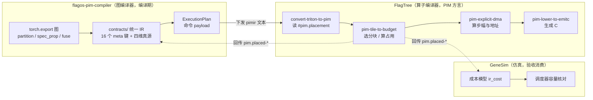
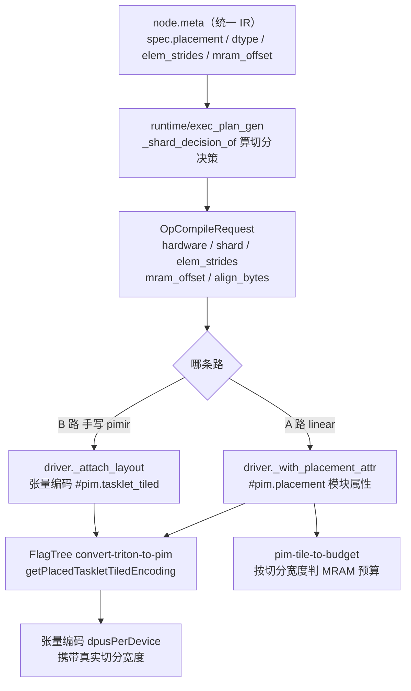
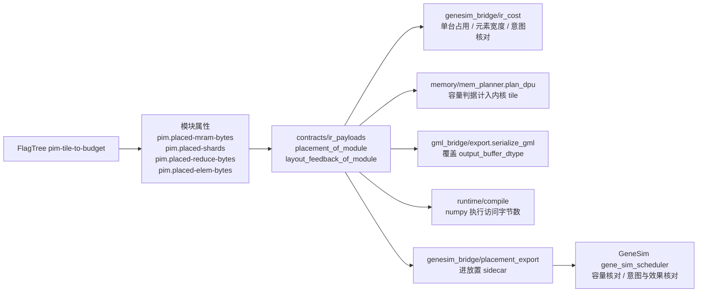
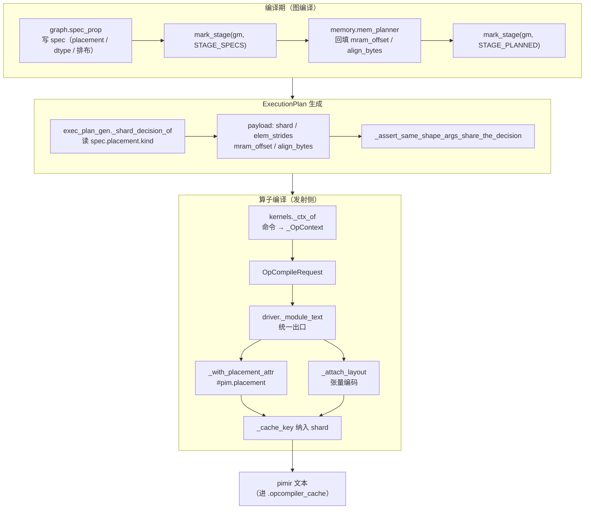
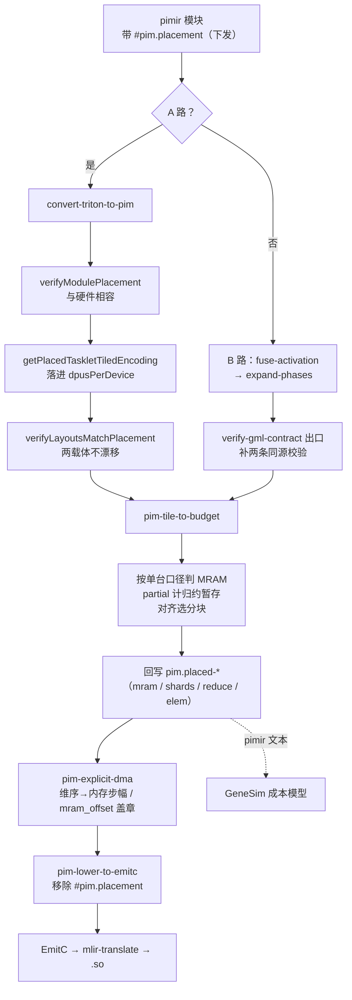
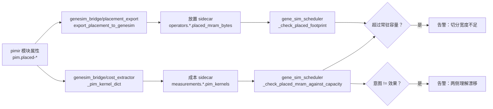

# 实施进展文档：图编译阶段统一 IR 与 PIMMLIR 四维贯通

> 文档编号：implement-unified-ir-20260930
> 创建日期：2026-09-30
> 重构日期：2026-10-02（按三仓重组结构；八份评审报告的结果并入第六章与第七章，原 review 文件删除）
> 关联需求文档：`docs/request-unified-ir-20260929.md`（request-unified-ir-20260929）
> 关联设计文档：`docs/design-unified-ir-20260929.md`（design-unified-ir-20260929）
> 关联仓库：flagos-pim-compiler（主仓）、FlagTree、GeneSim

## 一、实施概述

### 1.1 任务范围与四维定义

按设计文档 §6.1 的五个阶段实施：阶段一契约收口、阶段二 dtype 载体与算子语义真源、
阶段三内存排布层、阶段四编排器改消费、阶段五 pimir 四维写入与回传通道。

四维指跨三个仓库要贯通的信息类别：

| 维 | 含义 | 典型字段 |
| --- | --- | --- |
| 算子语义 | 这个算子是什么、折了什么尾算子 | 融合尾算子的激活与池化、RoPE 匹配、动态量化 |
| 数据类型 | 元素类型、位宽、量化布局 | `dtype` / `quant` / 累加宽度 / 编码表 |
| Placement | 张量怎么摊到多台 DPU 上 | `kind`（shard / replicate / partial）、切分维、DPU 数 |
| Memory Layout | 张量在 MRAM 里怎么摆 | 排布（`elem_strides`）、地址（`mram_offset`）、对齐（`align_bytes`） |

### 1.2 完成标准

三条同时满足才算完成：设计文档任务项 100% 覆盖、对应测试全部通过、全量回归无新增失败。
产物判据按需求 §5.2：GML 文本与全部 bin 逐字节不变、编排器层参数文本逐字节不变。

### 1.3 实施结论

**总体状态：已完成（含八轮评审共 72 个问题的修复）。**

实施自 2026-09-30 起共 16 轮：第 1 轮按设计五阶段落地，其后 8 轮修复外部评审提出的问题、
7 轮为主动补齐（补设计未落地项、补 PIMMLIR 侧的维度覆盖、补回传的消费点、补成本模型的口径）。

四项目标的最终状态：

| 目标 | 状态 | 守着它的判据 |
| --- | --- | --- |
| 一：统一 IR 四维表达 / 校验 / 查询 | 达成 | 契约键集合与在用集合恰好相等、四维各一组反例 |
| 二：PIMMLIR 四维 + **双向**贯通 | 达成。切分 / 排布 / 地址 / 对齐四层都下发；回传有四个 `pim.placed-*` 字段 | 真实 tp2 计划的端到端用例、交付 pimir 的字段断言 |
| 三：四维唯一来源是统一 IR | 达成 | 源码白名单扫描 + 载体唯一性用例 |
| 四：回传对后续 pass 生效 | 达成。五个消费点：成本模型、内存规划容量判据、GML 输出类型、numpy 执行、仿真 sidecar | 变异测试：改回传值则产物变 |

`spec.quant` 零消费者与「排布层生产方恒行主序」两条未闭环，逐条记在第九章。

### 1.4 任务完成清单

| 任务ID | 任务描述 | 对应设计模块 | 完成状态 | 备注 |
| --- | --- | --- | --- | --- |
| P0-1 | 统一 IR 契约收口 | §4.1 | 完成 | 登记 16 个键（设计说 15，多 `nn_module_stack`） |
| P0-2 | 数据类型补载体并收敛真源 | §4.2 | 完成 | 类型集合补 `int64`（索引类型），用户已确认 |
| P0-3 | 算子语义单一真源 | §4.3 | 完成 | 四份清单全部改为派生，派生结果与原字面量逐项相同 |
| P0-4 | Memory Layout 补排布层 | §4.4 | 完成 | `elem_strides` / `align_bytes`；`align_up` 去重为一份 |
| P0-5 | 统一 IR 是四维唯一来源 | §4.5 | 完成 | 6 处取数改查 spec，源码扫描守住白名单 |
| P0-6 | 编排器改消费统一 IR | §4.6 | 完成 | 两步法；层参数文本逐字节不变 |
| P1-1 | PIMMLIR 四维覆盖与传递接口 | §4.7 | 完成 | 写入点改到主路；`rope.subBlocks` 一并补齐 |
| P1-2 | PIMMLIR 回传对后续 pass 生效 | §4.8 | 完成 | 通道 + 生产方 + 五个消费方 |
| P1-3 | 四维可校验 | §4.9 | 完成 | 每维至少一组反例测试 |
| — | 阶段协议（出口标记 + 入口断言） | §3.3 | 完成 | 出口标记 4 处；入口断言 2 处，第三处改为内容检查 |
| P2-1 | `rope.subBlocks` 补生产方 | §4.7.8 | 完成 | 保序，与 `ROPE_UNITS` 逐字相同 |
| P2-1 | `transpose.purpose` 补生产方 | §4.7.8 | 完成 | `oplevel_kernel.py` 发 `purpose = absorbed`；**语义对应**仍待确认（见 9.3） |
| P2-1 | `combine_mode` | — | 完成 | 第一版按 Q2 挂账，第八轮填真实值并接了 verifier 消费方（见 7.8.5） |

## 二、总体方案：三仓分工与四维数据流

### 2.1 三仓分工

三个仓库各管一段，四维信息沿着「图 → 内核」的方向下发、沿着「内核 → 图」的方向回传。



各仓的职责边界：

| 仓库 | 在四维里的角色 | 改动规模 |
| --- | --- | --- |
| flagos-pim-compiler | 四维的**真源与下发方**，同时是回传的**主要消费方** | 修改 41 个文件（约 +1961 / −490 行）、新增 14 个文件（6 个契约模块 + 8 个测试） |
| FlagTree | PIMMLIR 侧的**载体与消费方**：新增 `#pim.placement` 属性、placement 版 builder、三层校验、pass 链消费点 | 修改 19 个文件、新增 17 个 lit 用例（约 +1032 / −49 行） |
| GeneSim | 回传的**末端验收消费方**：按回传的单台占用核对容量、按档位核对切分意图 | 修改 3 个文件（约 +336 / −1 行） |

### 2.2 四维数据流

**下发**：图编译期算出的决策写进命令 payload，经 `OpCompileRequest` 进发射侧，
最后落成 pimir 文本里的模块属性与张量编码。



**回传**：`pim-tile-to-budget` 把只有它才知道的数写回模块属性，本仓解析后分发到五个消费点。



### 2.3 四维口径总表

判一项该不该下发，用同一条纪律（需求 §2.1 P1-2）：**下发的字段必须在 PIMMLIR 侧有真实消费方**。
「能表达」不等于「覆盖」——一个字段只出现在 verifier 的 switch 分支里、或只被打印，不算有消费方。

| 维度 | 传什么 | 消费点（改变什么决策） | 不传什么 / 为什么 |
| --- | --- | --- | --- |
| 算子语义 | 沿 GML 侧既有通道；`combineMode` 五处占位填真实值 | `EltwiseOp::verify` 校验 `skip_connection` 必须是 add | `transpose.purpose` 的三种取值在 PIMMLIR 层降成同一段物理置换，**没有合法消费点**，不硬凑（见 7.8.5）；`VpuParamsAttr` / `DmaDir` / `StationarityAttr` 无生产方，属 ODS 预留 |
| 数据类型 | 存储与量化布局随 IR 与张量类型走；累加宽度进 footprint；`pim.placed-elem-bytes` 回传实际元素宽度 | 成本模型的元素宽度由「按类型名猜」改为按回传；`out` 缓冲按累加器宽度计 | 「存储 + 累加 + 量化」未合成单一载体：三者今天分别到得了 PIMMLIR，合成属重构既有表达，等真有消费方要同时看三者再做 |
| Placement | `shard` / `replicate` / `partial` 三档都发模块级 `#pim.placement`；`shard` 档经 builder 落进张量编码 | `partial` 的单台 footprint 计入跨 DPU 归约暂存；MRAM 判据读切分宽度；`verifyLayoutsMatchPlacement` 守两个载体不漂移 | `reduce` 不下发（PIMMLIR 侧只看档位与 DPU 数，归约方式没有读者）；`dpuIds` / `stage` 只用于范围校验 —— 它们服务跨 kernel 的多 stage 调度，现有 pass 都是单 kernel 粒度，加不出真实决策 |
| Memory Layout | 切分进编码；排布经 `#pim.placement` 的 `order` 下发；地址作为 DMA 的信息属性；对齐在比 `pim.dma-align` 更严时驱动选分块 | 排布：A 路 `-pim-explicit-dma` 按维序重算内存步幅。地址：不参与地址计算（运行时已按真实地址传指针，内核再加一遍会写到 2 倍偏移处）。对齐：`-pim-tile-to-budget` 按它选分块（实测 tile 从 `m=8,n=64` 变为 `m=16,n=32`） | 排布的唯一生产方是行主序，取值恒为默认 —— 登记为已知限制，见 9.2 |

## 三、主仓 flagos-pim-compiler 的修改

### 3.1 修改概述

这一轮改动的本质是**把四维信息从「各处自建」收敛成「一处真源 + 派生视图」，
再给每一维补上下发与回传两条腿**。改动前：四维散在 16 个 `node.meta` 键、四份互相
平行的算子清单、六处各写一遍的类型定义、编排器里的一批支线实现；改动后：契约层
`contracts/` 是唯一真源，其余位置要么改为引用，要么改为派生。

改动分五层：

| 层 | 目录 | 做了什么 |
| --- | --- | --- |
| 契约层 | `contracts/` | 6 个新模块：键登记表、载荷类型、dtype 真源、算子语义真源、排布层、四维 → 文本 |
| 图层 | `graph/` | 载荷定义下移到契约层；三个构造点带上 dtype / quant；分片一出生就带行主序步幅；出口标记阶段 |
| 内存与编排器 | `memory/`、`orchestrator/` | 删除各自的 `align_up` / `align16` / `stride_z` 实现改引用；容量判据计入内核 tile；回填 `align_bytes` |
| 运行时 | `runtime/` | 生成计划时算切分决策并随命令下发；13 个算子构造点带上硬件与切分上下文；numpy 执行按回传宽度算访问字节 |
| 桥接层 | `gml_bridge/`、`opcompiler_bridge/`、`genesim_bridge/` | 四份清单改派生；发射侧统一出口下发四维；回传解析收进契约层并接到成本模型与仿真输入 |

### 3.2 原理

**（1）键登记表：一个键一条记录，测试守住集合相等。**
`contracts/unified_ir.META_KEYS` 为每个 `node.meta` 键登记「维度、载荷类型、生产方、消费方」。
载荷类型写字符串而不是类型对象，避免契约层与 `graph/` 循环 import；真正的类型在
`contracts/ir_payloads.py`，由测试断言两者绑定。键集合与全仓在用集合必须恰好相等 ——
多一个少一个都失败，所以「新加了一个键但没登记」不会再悄悄发生。

**（2）真源与派生：一个算子一条语义，四份清单全部由它算出。**
`contracts/op_semantics.OP_SEMANTICS` 的每一条 `OpSemantics` 承载一个算子的完整语义
（GML 名、有无内核入口、是否进助记符统计、aten 目标、角色别名、运行时内核入口）。
四份既有清单全部改为派生视图：

| 派生函数 | 取代的字面量 | 规模 |
| --- | --- | --- |
| `oplevel_ops()` | `driver.py` 的 `_OPLEVEL_OPS` | 15 项 |
| `mnemonics()` | `op_classify.py` 的 `MNEMONICS` | 14 项（含顺序） |
| `aten_to_gml()` | `from_fx.py` 的 `OP_TYPES` | 28 项 → 19 个 GML 类型 |
| `role_to_gml()` | `from_fx.py` 的 `_ROLE_OP_TYPES` | 4 项 |

派生结果与原字面量逐项相同，这是「等价重构」的判据。

**（3）dtype 真源。** `contracts/dtypes.py` 收口元素类型集合、位宽查询与校验。
`int64` 单列为索引类型：实测导出的 llama 图里有 3 个 int64 索引张量，其中一个还是 DPU 节点，
内存规划要对它算字节数。源码扫描守住白名单 —— 除登记入口外，全仓不得再出现
`.element_size()` / `.meta["val"].dtype` / `np.dtype(...).itemsize` 这类绕开真源的写法。

**（4）排布层。** `contracts/mem_layout.py` 提供 `align_up` 的唯一实现、
`row_major_strides`（行主序步幅）、`check_elem_strides`（自洽校验），
以及从编排器搬来的 `align16` / `stride_z` / L2 尺寸函数与 `NET_INI_STRIDES` 常量。

**（5）四维 → 文本。** `contracts/mlir_layout.py` 只做一件事：把四维决策拼成 pimir 文本。
A 路拼模块属性 `#pim.placement`（`placement_attribute`），B 路拼张量编码
`#pim.tasklet_tiled`（`tasklet_tiled`）。两者都遵守同一条纪律 —— **不写默认值**，
所以单 DPU、行主序、零偏移的产物文本与改动前逐字节相同。

**（6）回传载荷与解析。** `contracts/ir_payloads.py` 定义 `PlacementBack`（读回
`pim.placed-*` 四个字段）与 `LayoutFeedback`（读回 tile / WRAM / MRAM 预算），
解析函数 `placement_of_module` / `layout_feedback_of_module` 是唯一的解析入口 ——
此前 `genesim_bridge/ir_cost.py` 自带一份私有正则读同一批属性，收口后两仓同一份实现。

**（7）阶段协议。** `mark_stage` / `require_stage` / `validate_graph_dimensions`
把「某个 pass 必须在另一个 pass 之后跑」这条隐含约定变成可执行断言。
五个阶段标记（出口标记 5 处）：`STAGE_EXPORTED` / `STAGE_PARTITIONED` / `STAGE_SPECS` / `STAGE_FUSED` / `STAGE_PLANNED`；
两个入口断言接在 `phase_source_from_graph` 与 `emit_oplevel_mlir`（第三处改为内容检查，见 7.3.2）。

### 3.3 改了什么

#### 3.3.1 契约层（新增 6 个模块，修改 4 个）

- 新增 `contracts/unified_ir.py`：16 个键的登记表、维度查询、阶段协议、跨维校验。
- 新增 `contracts/ir_payloads.py`：6 个载荷 dataclass 从 `graph/` 下移，
  加 `LayoutFeedback` / `PlacementBack` 两个回传载荷与解析函数。
- 新增 `contracts/dtypes.py`、`contracts/op_semantics.py`、`contracts/mem_layout.py`、
  `contracts/mlir_layout.py`。
- `contracts/graph_meta.py` 改为 re-export，12 个既有 import 点不动。
- `contracts/pim_tensor_spec.py`：`Placement` 与 `TensorShardDetail` 补
  `elem_strides` / `align_bytes`，两处 `validate()` 扩展。
- `contracts/op_contract.py`：新增 `DpuShard`（三档 + 归约类型）与 `flatten_shard_dim`
  （图张量维号 → 压平后坐标系），`OpCompileRequest` 补 `shard` / `elem_strides` /
  `mram_offset` / `align_bytes`。
- `contracts/fusion_contract.py`：加「融合目标必须在算子登记表内」的断言。

#### 3.3.2 图层

- 载荷定义移走改 import：`fuse.py` / `fuse_pim.py` / `fuse_rope.py` / `kv_dma_pass.py` /
  `quant_pass.py`；`fuse_pim.py` 的函数内 import 提回顶部。
- `graph/split_heads.py` 删掉把角色取值当键名的那一行；`kv_dma_pass.py` 两处裸字符串
  改走常量。
- `graph/spec_prop.py` 新增 `_dtype_of`（`isinstance(val, torch.Tensor)` 判断，
  兼容 `val` 是元组的情形），三个构造点带上 dtype / quant；`_shard_map` 让分片一出生
  就带 `elem_strides=row_major_strides(local_shape)`；出口标记 `STAGE_SPECS`。
- `graph/partition.py` 出口标记 `STAGE_PARTITIONED`。

#### 3.3.3 内存与编排器

- `memory/mem_planner.py`：`bytes_of` 加可选步幅参数；三处回填补 `align_bytes`
  （权重复用 `align`、激活与重分布落地用 `hw.align`）；`plan_dpu` 增
  `kernel_mram_bytes` 参数，容量判据从「三区」改为「三区 + 内核 tile」。
- 删除重复实现：`memory/kv_layout.py` 与 `orchestrator/l2_alloc.py` 各自的 `align_up`、
  `orchestrator/layer_fields.py` 的 `align16` / `stride_z` / L2 尺寸三函数，全部改为引用契约层。

#### 3.3.4 运行时

- `runtime/exec_plan_gen.py`：新增 `_shard_decision_of`（读 `spec.placement.kind` 出三档决策）、
  `_oplevel_op_of`（判 A 路还是 B 路）、`_assert_same_shape_args_share_the_decision`
  （同形实参必须同切分）、`_placed_width`；`_node_access` 接受回传的元素宽度。
- `runtime/kernels.py`：新增 `_OpContext` / `_ctx_of` / `_default_context`，
  13 个算子编译构造点带上硬件与切分上下文。
- `runtime/compile.py`：标记 `STAGE_PLANNED`；numpy 执行按回传宽度算访问字节数；
  新增 `peak_kernel_mram_bytes`（枚举计划里的 linear、按实参形状编一遍、取回传单台占用最大值）。

#### 3.3.5 桥接层

- `gml_bridge/from_fx.py`：`OP_TYPES` / `_ROLE_OP_TYPES` / `_BUFFER_DTYPES` 改派生或引用真源；
  补 `_assert_no_standalone_activation`（未折的激活会从 GML 产物里静默消失，属功能缺陷）。
- `gml_bridge/export.py`：`serialize_gml` 加 `hardware` 参数，`_placed_widths_of` 从 A 路
  探测回传宽度，`_stamp_dtypes` 按它覆盖 `output_buffer_dtype`。
- `opcompiler_bridge/driver.py`：`_OPLEVEL_MLIR` 改派生；新增 `_a_path_shard`（按
  `arg_shapes[0]` 的秩换算维号）、`_with_placement_attr`、`_module_text`（统一出口贴编码）、
  `_attach_layout`（同形操作数一起贴）；`_cache_key` 纳入 `shard`（否则热缓存下决策丢失）。
- `opcompiler_bridge/phase_source.py`：入口断言 `require_stage(gm, STAGE_FUSED)`；
  删除死载体 `layout_back` 与三个私有函数。
- `genesim_bridge/ir_cost.py`：改消费 `placement_of_module`，删掉私有正则；
  `_line_movement_bytes` 口径改为「三种 purpose 计费相同」。
- `genesim_bridge/cost_extractor.py`：`_pim_kernel_dict` 增 `shard_kind` 与回传字段。
- `genesim_bridge/placement_export.py`：放置 sidecar 写入 `placed_mram_bytes`。

### 3.4 文件与关键函数

| 文件 | 类型 | 关键函数 / 结构 | 职责 |
| --- | --- | --- | --- |
| `contracts/unified_ir.py` | 新增 | `MetaKeySpec`、`META_KEYS`、`meta_keys_of`、`spec_of`、`dimensions_of` | 16 个键的登记表（维度 / 载荷 / 生产方 / 消费方） |
| `contracts/unified_ir.py` | 新增 | `mark_stage`、`require_stage`、`stages_of`、`validate_node_dimensions` | 阶段协议与跨维校验 |
| `contracts/ir_payloads.py` | 新增 | `LayoutFeedback`、`PlacementBack`、`layout_feedback_of_module`、`placement_of_module` | 回传载荷与唯一的解析入口 |
| `contracts/dtypes.py` | 新增 | `ELEMENT_DTYPES`、`INDEX_DTYPES`、`dtype_bytes`、`validate_dtype` | 数据类型真源 |
| `contracts/op_semantics.py` | 新增 | `OpSemantics`、`OP_SEMANTICS`、`oplevel_ops`、`mnemonics`、`aten_to_gml`、`role_to_gml`、`kernel_entry_of` | 算子语义真源与四个派生视图 |
| `contracts/mem_layout.py` | 新增 | `align_up`、`row_major_strides`、`check_elem_strides`、`align16`、`stride_z`、`NET_INI_STRIDES` | 排布层与编排器尺寸函数 |
| `contracts/mlir_layout.py` | 新增 | `tasklet_tiled`、`placement_attribute`、`_tasklets_per_dpu`、`_layout_order` | 四维 → pimir 文本（不写默认值） |
| `contracts/pim_tensor_spec.py` | 修改 | `Placement`、`TensorShardDetail`、两处 `validate()` | 四维字段载体与校验 |
| `contracts/op_contract.py` | 修改 | `DpuShard`、`flatten_shard_dim`、`OpCompileRequest` | 下发契约与坐标换算 |
| `graph/spec_prop.py` | 修改 | `_dtype_of`、`_shard_map`、`_host_spec` | dtype 载体与初始分片排布的生产方 |
| `memory/mem_planner.py` | 修改 | `bytes_of`、`plan_dpu` | 排布/对齐回填、容量判据 |
| `runtime/exec_plan_gen.py` | 修改 | `_shard_decision_of`、`_oplevel_op_of`、`_node_access`、`_placed_width` | 切分决策生产方与回传消费 |
| `runtime/compile.py` | 修改 | `peak_kernel_mram_bytes`、`STAGE_PLANNED` 标记 | 内核单台占用的探测（供内存规划与 GML） |
| `runtime/kernels.py` | 修改 | `_OpContext`、`_ctx_of` | 下发上下文（硬件 + 切分） |
| `gml_bridge/export.py` | 修改 | `serialize_gml`、`_placed_widths_of`、`_stamp_dtypes` | GML 出口与回传消费 |
| `opcompiler_bridge/driver.py` | 修改 | `_a_path_shard`、`_with_placement_attr`、`_attach_layout`、`_module_text` | A / B 两路的下发主路 |
| `opcompiler_bridge/phase_source.py` | 修改 | `phase_source_from_graph`（入口断言） | 阶段协议落地 |
| `genesim_bridge/ir_cost.py` | 修改 | `analyze_ir` 里的 placement 消费段 | 成本模型（回传的第一个消费方） |
| `genesim_bridge/placement_export.py` | 修改 | `export_placement_to_genesim` | 回传进放置 sidecar |

### 3.5 流程图：从 meta 到 pimir



回传方向的消费点已在 2.2 的图中给出，不再重复。

## 四、FlagTree 的修改

### 4.1 修改概述与原理

**问题起点：Placement 在 PIMMLIR 侧是真空。** 逐文件普查后确认三条依据：
`dpusPerDevice` 字段虽然在，但唯一的 AttrBuilder 用 `(void)numDpus;` 把它丢掉
（注释写 "Kernels are single-DPU by construction"）；12 处 C++ 引用全是搬运
（permute / drop / insert / print），没有一个 pass 读它的值做决策；
shard / replicate / partial 与 Partial 的归约一个载体都没有。
也就是说，**FlagTree 侧没有任何代码路径能产出非全 1 的 `dpusPerDevice`**。

本轮补三件事：把 Placement 做成有载体的属性、把它接进 pass 链让下发的决策真的改变
PIMMLIR 自己的决策、把只有 pass 才知道的数回传给图编译器。

**（1）载体：`#pim.placement`。** 新增方言属性，与图编译器的
`contracts.pim_tensor_spec.Placement` 同构：

```mlir
#pim.placement<kind = shard, dim = 1, numDpus = 2>
#pim.placement<kind = replicate, numDpus = 4>
#pim.placement<kind = partial, numDpus = 2, reduce = sum>
#pim.placement<kind = shard, dim = 0, numDpus = 2, dpuIds = [4, 5], stage = 1>
```

为什么不给 `#pim.tasklet_tiled` 加字段：布局编码描述的是**一个张量的各个轴**，
`dpusPerDevice` 只能说「这个轴摊在 N 台 DPU 上」。它分不清「复制到每台 DPU」与
「只在一台 DPU 上」（两者都是全 1），也没有地方放 Partial 还欠的那个归约 ——
而这两种恰是张量并行图编译器会产出的形态。

**（2）builder：非全 1 编码的唯一产生路径。**
新增 `getPlacedTaskletTiledEncoding`，读模块上的 `#pim.placement`，
把切分宽度落进每个张量的 `dpusPerDevice`。`convert-triton-to-pim` 用它替代原来的
默认 builder —— 不带 placement 时逐字节等价，因为默认 builder 产出的就是全 1。

**（3）三层校验，每一层都可失败。**

| 层次 | 位置 | 管什么 | 反例用例 |
| --- | --- | --- | --- |
| 属性自洽 | `PlacementSpecAttr::verify` | 11 条组合规则（shard 必须有 dim、partial 必须有 reduce、dpuIds 长度要等于 numDpus、不重复不为负……） | `placement_negative.mlir`（11 条） |
| 与硬件相容 | `verifyModulePlacement`，conversion 入口与 `-pim-verify-gml-contract` | `numDpus` 不能超过 `-num-dpus`、dpuIds 不能点名设备没有的 DPU。**属性自己校验不了**：它对比的那个数是 pass 选项 | `placement_hardware_negative.mlir`、`placement_hardware_bpath_negative.mlir` |
| 两个载体不漂移 | `verifyLayoutsMatchPlacement`，两条路各自出口 | 模块上的 `#pim.placement` 与张量编码里的 `dpusPerDevice` 必须说同一件事 | `placement_layout_drift_negative.mlir`、`placement_drift_bpath_negative.mlir`、`placement_split_dropped_negative.mlir` |

第三层最值得做：Placement 现在有两个载体，两个载体描述同一个事实就会漂移，
而漂移的后果是**静默的** —— 两半单独看都能解析，只是下游按「没切分」计费。
校验只比**切分宽度**不比轴：kernel 内部 `tt.trans` 会置换切分轴（实测真实 tp2 `linear`
的权重块就是 `[1,2]` → `[2,1]`），只有宽度是不变量，而宽度恰是资源算术依赖的那个数。

**（4）pass 消费点 —— 下发的决策真的改变 PIMMLIR 的决策。**

| pass | 改动 | 改变了什么 |
| --- | --- | --- |
| `-pim-tile-to-budget` | MRAM 判据改用单台口径的 footprint（去掉按切分数再除一次）；`partial` 档计入跨 DPU 归约暂存；`out` 缓冲按累加器宽度计；选分块时对齐取「分片 `alignBytes` 与模块级 `pim.dma-align` 中更严的那个」 | 同一算子、同一 1.2 MB 预算：不带 placement 报超限，带 `shard, numDpus = 2` 通过；`partial` 档单台占用 7168 → 8192；对齐从 0 提到 1024 时 tile 从 `m=8,n=64` 变为 `m=16,n=32` |
| `-pim-tile-to-budget`（回传） | 写回四个属性：`pim.placed-mram-bytes` / `placed-shards` / `placed-reduce-bytes` / `placed-elem-bytes` | 图编译器知道怎么切，但切完一台占多少取决于分块 —— 这个数只有这个 pass 知道 |
| `-pim-explicit-dma` | 按 `#pim.placement` 的 `order` 把地址步幅换算成内存步幅；`mram_offset` 只盖到结果张量那条 DMA（按 `base_arg` 认）；删掉把 `alignBytes` 抬成 `elem_stride` 的那一步 | 排布真的改变 DMA 的 `elem_stride`（列主序下 x/out 从 1 变 16、权重从 1 变 32）；对齐是字节单位的起始地址对齐，不改变行内步幅 |
| `-pim-lower-to-emitc` | 删掉两处把 `mram_offset` 加进地址常量的代码；末尾 `removeAttr` 移除 `#pim.placement` | 运行时已按 `base + offset` 传指针，内核再加一遍会写到 **2 倍偏移处**；`mlir-translate` 不加载任何 dialect，`#pim.placement<...>` 会让它报 "created with unregistered dialect" |
| `-pim-expand-phases` | 五处 `combineMode` 占位改填真实值 `straightforward` | `EltwiseOp::verify` 校验 `skip_connection` 必须是 add —— 该属性此前 5 个生产方、0 个读取方 |
| `-pim-verify-gml-contract` | B 路补 `verifyModulePlacement` + `verifyLayoutsMatchPlacement` | B 路链不经过 `-convert-triton-to-pim`，此前零诊断 |

**（5）移除时机是刻意的。** `#pim.placement` 活到 `-pim-lower-to-emitc` 末尾才删：
pimir 阶段的文本是 GeneSim 成本模型的输入，属性必须活到那之后，
而这个 pass 是它完成使命的第一个点。

### 4.2 文件与关键函数

| 文件 | 关键函数 / 结构 | 职责 |
| --- | --- | --- |
| `include/.../IR/Dialect.h` | `AttrPlacementName` 等五个属性名常量、`maybeLookupNumDpus` | 跨仓契约的属性名与硬件查询（`maybeLookup` 不把「没声明」当成硬件事实） |
| `include/.../IR/PIMAttrDefs.td` | `PlacementSpecAttr`、`PlacementKind`、`ReduceKind` | 载体定义（含 `order` / `mramOffset` / `alignBytes` 三个可选参数） |
| `lib/.../IR/Dialect.cpp` | `PlacementSpecAttr::verify`、`verifyModulePlacement`、`verifyLayoutsMatchPlacement`、`getPlacedTaskletTiledEncoding` | 三层校验与 placement 版 builder |
| `lib/Conversion/TritonToTritonPIM/TritonPIMConversion.cpp` | `TritonPIMTypeConverter`（多接一个 `placement` 参数） | 有 placement 用 placement 版 builder，否则维持全 1 |
| `lib/Conversion/TritonToTritonPIM/TritonToTritonPIMPass.cpp` | 入口 `verifyModulePlacement`、出口 `verifyLayoutsMatchPlacement` | A 路的两道守卫 |
| `lib/.../Transforms/TileToBudget.cpp` | `bytesFor`（加累加宽度）、`reduceStagingBytes`、`fitsBudget`、`localShardCount`、`isGridPartitioned` | 单台口径判据、归约暂存、对齐选分块、回传四个 `placed-*` |
| `lib/.../Transforms/ExplicitDMA.cpp` | 维序 → 内存步幅换算段、`mram_offset` 盖章段 | 排布与地址进 DMA |
| `lib/.../Transforms/LowerPIMToEmitC.cpp` | 撤掉偏移加法、末尾 `removeAttr(AttrPlacementName)` | 地址只由调用方加；属性在 EmitC 前退场 |
| `lib/.../Transforms/ExpandPhases.cpp` | `straightforward(ctx)` | 五处 `combineMode` 填真实值 |
| `lib/.../Transforms/VerifyGmlContract.cpp` | `runOnOperation` 开头补两条校验 | B 路的守卫 |
| `lib/.../IR/Ops.cpp` | `DmaLoadOp` / `DmaStoreOp` 的 `mram_offset` verifier | 非负、且是元素宽度的整数倍 |
| `include/.../IR/PIMOps.td` | `mram_offset` 进 ODS 声明 | DMA 上携带起始地址（信息属性） |

新增 lit 用例 17 份，覆盖正例（`placement.mlir`、`placement_to_layout.mlir`、
`tasklet_tiled_dpus.mlir`、`placement_feedback.mlir`、`accum_width.mlir`、
`combine_mode.mlir`、`placement_partial_reduce.mlir`、
`placement_shards_count_encodings.mlir`、`placement_split_on_low_rank_only.mlir`、
`tile_to_budget_grid_partitioned.mlir`）与反例
（`placement_negative.mlir`、`placement_hardware_negative.mlir`、
`placement_hardware_bpath_negative.mlir`、`placement_layout_drift_negative.mlir`、
`placement_drift_bpath_negative.mlir`、`placement_split_dropped_negative.mlir`、
`tasklet_tiled_dpus_negative.mlir`）。

### 4.3 流程图：pass 链与三道守卫



## 五、GeneSim 的修改

### 5.1 修改概述与原理

GeneSim 是回传的**末端验收消费方**。改动的判据来自一条纪律：**回传的字段必须有人核对**，
否则「下发 → 回传」只是两个仓库各自自说自话。GeneSim 侧因此新增两条核对：

1. **容量核对**：回传的单台 MRAM 占用（含 `partial` 档的归约暂存）超过一台 TensorPU 的
   常驻容量 → 告警「切分宽度不足，这个配置放不下」。
2. **意图与效果核对**：回传的 `placed_shards` 与下发的 `shard_dpus` 不一致 → 告警
   「两侧对切分的理解漂了」。档位由 sidecar 的 `shard_kind` 决定 ——
   只有 `shard` 档的 `numDpus` 才是切分宽度，`partial` / `replicate` 每台持有完整形状、
   期望值为 1，拿 `numDpus` 去比就是误报。

两者都只告警不抛：这是对外部输入的交叉核对，sidecar 可能来自与当前配置不同的硬件口径，
抛错会把一个正常的仿真拦死。

### 5.2 文件与关键函数

| 文件 | 关键函数 | 职责 |
| --- | --- | --- |
| `src/scheduler/gene_sim_scheduler.py` | `_check_placed_mram_against_capacity` | 成本 sidecar 路径：按 `measurements` 下的 `pim_kernels` 取数，核对容量与意图 |
| `src/scheduler/gene_sim_scheduler.py` | `_check_placed_footprint` | 放置 sidecar 路径：读条目级 `placed_mram_bytes` 核对常驻容量（这份才是真实运行加载的） |
| `tests/sim/test_cost_sidecar.py` | 新增 2 条 | 切分漂移要告警、`partial` 档不误报 |
| `tests/sim/test_compiler_placement.py` | `TestFourDimensionsSurviveTheUnifiedIr` | 带布局编码的 IR 仍能解析出 `tile-m/n/k`，且编码内的数组不被误收为模块属性 |

消费链有一处**层级陷阱**：生产方把 `pim_kernels` 放在
`measurements.prefill / measurements.decode` 下，不是条目顶层。只读顶层会让这条核对
在真实产物上一次都不执行 —— 现已同时读两层，并补一条用真实嵌套形态的用例。

### 5.3 流程图：回传进仿真



## 六、评审结果汇总

外部评审共进行八轮，全部以本仓、FlagTree、GeneSim 三仓的未提交改动为对象，
基准是需求 / 设计 / 实施三份文档。**八轮共提出 72 个问题，全部逐条实测复现后处置完毕**
（修复、按事实更正文档、或登记为已知限制）。本节是汇总；每条的复现数据与修复判据在第七章。

### 6.1 八轮评审一览

| 评审轮次 | 日期 | 问题数 | 级别分布 | 评审结论（要点） | 修复记录 |
| --- | --- | --- | --- | --- | --- |
| 第 1 轮 | 09-30 | 12 | 严重 1 / 高 3 / 中 5 / 低 3 | 前三个目标质量高；**目标四（回程）完全没有落地**，回传通道两端皆空 | 7.2 |
| 第 2 轮 | 10-01 | 5 | 高 2 / 中 2 / 低 1 | 目标一、三扎实；**目标二未达成**：主算子 `linear` 的切分决策被静默丢弃 | 7.4 |
| 第 3 轮 | 10-01 | 7 | 严重 1 / 高 2 / 中 3 / 低 1 | 目标一、三扎实；A 路切分决策按图张量坐标系取值整条丢掉；MRAM 预算判据被放宽 N 倍 | 7.7 |
| 第 4 轮 | 10-02 | 7 | 中 5 / 低 2 | 两目标主链已贯通可复现；新问题集中在本轮新增代码上 | 7.9 |
| 第 5 轮 | 10-02 | 18 | 高 1 / 中 10 / 低 7 | 回传对下游真正接上；**Memory Layout 维是四维里唯一没端到端落实的一维** | 7.10 |
| 第 6 轮 | 10-02 | 8 | 高 3 / 中 3 / 低 2 | Memory Layout 仍未完整传进 PIMMLIR；仿真侧消费点读的键在真实产物里不存在 | 7.11 |
| 第 7 轮 | 10-02 | 8 | 高 3 / 中 3 / 低 2 | 四条下发通路都能写进 pimir；地址层两仓零读者、对齐层把字节当元素步幅 | 7.13 |
| 第 8 轮 | 10-02 | 7 | 严重 1 / 高 2 / 中 3 / 低 1 | **目标一未达成、目标二未达成**：地址偏移被加了两遍、对齐层零消费者、GML 回传生产方恒空 | 7.14 |

在八轮之外还有 7 轮主动补齐（补设计未落地项、补 PIMMLIR 侧覆盖、补回传消费点、补成本模型口径），
同样逐条给出判据，记在第七章对应小节（7.3、7.5、7.6、7.8、7.12、7.15、7.16）。

### 6.2 问题处置统计

| 级别 | 数量 | 处置 |
| --- | --- | --- |
| 严重 | 3 | 全部修复：回传通道两端皆空、A 路切分决策坐标错配、起始地址被加两遍 |
| 高 | 16 | 全部修复：切分决策静默丢弃、MRAM 判据放宽 N 倍、Memory Layout 未落实、回传零生产方接线等 |
| 中 | 34 | 修复 30 条；4 条按事实更正文档并登记为已知限制（`dpuIds` / `stage` 无消费方、排布层恒行主序等） |
| 低 | 19 | 修复 15 条；4 条为文档 / 注释口径更正 |
| **合计** | **72** | 除 7.7.4 一条先收窄、后经确认改为补齐外，其余无一条以「不算缺口」收尾 |

处置方式分三类：

| 方式 | 说明 | 例子 |
| --- | --- | --- |
| 补生产方 / 消费方 | 缺口是真的就补上，不把缺口改成不算缺口 | `replicate` / `partial` 两档从不下发 → 三档真下发 + 归约暂存进容量判据（7.8.2） |
| 删死载体 | 结构上不可能有值或全仓零读者的载体，直接删 | `PhaseSource.layout_back`（7.4.3）、`PlacementBack.reduce`（7.11.4） |
| 按事实更正文档 | 文档与代码不一致时以实测为准改写文档 | 需求 §7.5 的 `mram_offset` 表述、设计文档的 `elem_strides` 层级（7.9.7、7.11.4） |

### 6.3 评审未提及、实施中发现并修复的缺陷

八轮评审之外，实施过程中自己发现并修复了 13 处缺陷。它们与评审问题同样有复现与判据：

| # | 缺陷 | 性质 | 记录 |
| --- | --- | --- | --- |
| 1 | `request.shard` 不在编译缓存键里 | 功能缺陷：热缓存下 P1-1 判据静默不成立，冷缓存全绿掩盖 | 7.4.4 |
| 2 | 新增 lit 用例在真实 lit 的 `pipefail` 语义下失败 | 判据失效：手工 harness 没有 `set -o pipefail`，把失败读成通过 | 7.4.4 |
| 3 | 成本模型把已是单台口径的搬运量又除一次 | 与评审问题同源同形的第二个现场 | 7.7.8 |
| 4 | 内核 tile 占用探测拿输出形状当输入 | 静默退化：异常被「拿不到就不猜」吞掉，峰值恒为 0 | 7.8.3 |
| 5 | `_a_path_shard` 无条件换算维号打断非 shard 档 | 自引入：`replicate` / `partial` 的 `-1` 被范围检查误挡 | 7.8.2 |
| 6 | B 路按 `arg_shapes[0]` 猜秩 | 自引入：输入输出不同形的算子（gather 等）会错位 | 7.8.2 |
| 7 | 跨仓四个 `placed-*` 属性不在卫生测试扫描面内 | 判据缺口：改名则本仓静默降级到猜测分支 | 7.8.7 |
| 8 | `combineMode` 第一版消费点是死代码 | 恒不触发（同一 verifier 上已有 `>= 2` 检查） | 7.8.5 |
| 9 | 「absorbed 少计搬运」这一版改动前提不成立 | 被自己的判据挡下后撤回：图层不发射节点 ≠ 内核不搬字节 | 7.8.5 |
| 10 | `test_no_bypass` 探针用 `ast.get_source_segment` 导致平方级扫描 | 性能回归：两个用例 31 秒，全量从 190 秒涨到 221 秒 | 7.10.9 |
| 11 | `_placed_widths_of` 在真实单层模型上恒返回 None | B 路文本里没有回传属性 | 7.14.3 |
| 12 | 回传宽度是图上 dtype 的回声 | 探测按图上的 dtype 编译，回传必然相同 | 7.14.4 |
| 13 | 四份 `models/*_placement.json` 缺回传占用 | 容量核对核对不到算子 | 7.14.5 |

### 6.4 与评审建议不同的选择

有四处没有照评审给的选项做，理由都在实测里：

| 处 | 评审建议 | 实际做法 | 理由 |
| --- | --- | --- | --- |
| 回传消费点选谁（7.2.2） | 补设计指定的三个消费点或改需求口径 | 改选 `genesim_bridge/ir_cost.py` | 设计指定的三点实测确实不适用（评审亦认同），但「选点错」不等于「消费侧不必落地」。真实消费方是 `ir_cost`，它本来就在读同一批属性、自带一份私有正则绕开统一 IR |
| 入口断言接哪（7.2.2） | 接 3 个设计指定的入口，或删掉 | 接在 `phase_source_from_graph`，`from_fx.convert` 改为内容检查 | 三个入口里两个会破坏大量手搓图的既有测试；`convert` 的真正前提是「图里有没有没折的激活」，比「跑过哪条 pass 链」更贴合 |
| `replicate` / `partial` 收窄还是补齐（7.7.4 → 7.8.2） | 二选一 | 先收窄，后按用户要求改为**补齐** | 第一版以「FlagTree 侧没有消费者」为由收窄，经确认不接受 —— 要求是把消费者补上，不是把缺口改成不算缺口 |
| 地址层撤回还是补读者（7.13.1） | 撤回下发，或改为多值并指定读者 | 收进 ODS 只盖结果张量那条 DMA，并给 `-pim-lower-to-emitc` 一个真实消费点 | 撤回会丢掉真实信息；一个 kernel 内三条 DMA 盖同一个 offset 才是错的 |

## 七、逐轮实施与修复记录

本章按时间顺序记录 16 轮改动，每轮都保留「问题 → 复现 → 处置 → 判据」的实测数据。
评审轮的问题表与第八章的验证方法对应；主动补齐轮次同样给出判据，不因不是评审提出就降低标准。

**本章是历史记录**：各轮小节里的「目标达成」之类的判断是**当轮的快照**，后面的轮次可能推翻它（例如 7.6.6 记为达成，第 7、8 轮评审又查出未达成）。当前状态一律以第一章、第二章与第九章为准。

| 小节 | 轮次 | 性质 | 触发 |
| --- | --- | --- | --- |
| 7.1 | 第一轮 | 初始实施 | 设计文档 §6.1 的五个阶段 |
| 7.2 | 第二轮 | 修复评审 | 评审第 1 轮（12 条） |
| 7.3 | 第三轮 | 主动补齐 | 设计 §3.3.4 与需求 §5.3 的未落地项（3 条） |
| 7.4 | 第四轮 | 修复评审 | 评审第 2 轮（5 条）+ 自发现 2 条 |
| 7.5 | 第五轮 | 主动补齐 | PIMMLIR 侧 Placement 维的表达能力 |
| 7.6 | 第六轮 | 主动补齐 | Placement 维的载体收口、消费点与回程 |
| 7.7 | 第七轮 | 修复评审 | 评审第 3 轮（7 条）+ 自发现 1 条 |
| 7.8 | 第八轮 | 主动补齐 | 四维逐项补齐（把消费者补上，而不是收窄口径） |
| 7.9 | 第九轮 | 修复评审 | 评审第 4 轮（7 条） |
| 7.10 | 第十轮 | 修复评审 | 评审第 5 轮（18 条） |
| 7.11 | 第十一轮 | 修复评审 | 评审第 6 轮（8 条） |
| 7.12 | 第十二轮 | 主动补齐 | 地址与对齐进 PIMMLIR、回传进 GML 与 numpy 执行 |
| 7.13 | 第十三轮 | 修复评审 | 评审第 7 轮（8 条） |
| 7.14 | 第十四轮 | 修复评审 | 评审第 8 轮（7 条） |
| 7.15 | 第十五轮 | 主动补齐 | 补齐 PIMMLIR 对 Memory Layout 的消费 |
| 7.16 | 第十六轮 | 主动补齐 | 成本模型的两处口径：循环边界折叠与步幅搬运 |

### 7.1 第一轮：按设计五阶段落地

五个阶段一次落地：契约收口、dtype 载体与算子语义真源、内存排布层、编排器改消费、
pimir 四维写入与回传通道。九个功能点 P0-1 ~ P0-6、P1-1 ~ P1-3 全部实施（清单见 1.4）。

**规模**：新增 14 个文件（6 个契约模块 + 8 个测试）、修改 24 个文件；
tracked 文件净增删 +508 / −416，新增文件 2010 行（生产代码 746 行、测试 1338 行）。

**判据与结果**：

| 判据 | 结果 |
| --- | --- |
| 全量回归（排除真实 7B） | **1091 passed, 1 skipped**（改动前基线 981 passed, 1 skipped） |
| 四份算子清单派生结果 | 与原字面量逐项相同（28 / 4 / 14 含顺序 / 15） |
| 键集合 | 登记 16 个，与全仓在用集合恰好相等 |
| GML 文本 | 逐字节相同（15646 行） |
| 全部 `.bin` | 逐字节相同（3126 个文件、240356153 字节） |
| 编排器层参数文本 | 逐字节相同（`prepare_out` 全部文件） |
| 全树 3553 个文件 | 仅 `l2a_version.txt` 差异 —— 内容是 `0.0.0-<git 短哈希>`，两侧取哈希的环境不同（HEAD 侧用 `git archive` 展开、没有 `.git`），不是代码改动导致的产物变化；本仓 `scripts/diff_prepare_out.py` 本来就把它与 `gml_version.txt` 一起排除在比对之外 |
| GeneSim | `./run.sh --test sim` 38/38 测试文件通过 |
| FlagTree | 新增 `tasklet_tiled_dpus.mlir` 三条 RUN 行通过；`test_oplevel_emitter_live.py` 实跑 10/10 |
| 结构规则 | 24 项检查两侧全部通过 |

这一轮遗留的偏差与已知问题（后经评审推翻或补齐）记在 9.4，不在此重复。
### 7.2 第二轮：修复评审第 1 轮（review-unified-ir-20260930）

12 个问题在改之前逐条实测复现，确认真实存在后再修；每条都先写会失败的测试，
再改实现。**其中 3 条（问题 1、6、7）复现出比评审描述更严重的事实**。

| # | 级别 | 问题 | 处置 | 判据 |
| --- | --- | --- | --- | --- |
| 1 | 严重 | 回传通道两端皆空，消费者断言被削弱 | 消费点改选 `genesim_bridge/ir_cost.py`（它本来就在读同一批属性、自带私有正则）；解析收进 `contracts/ir_payloads.py` 一处；恢复 `reads >= 1` 半边判据并补变异测试 | `tests/test_layout_feedback.py` 13 条；断开消费方后变异测试失败 |
| 2 | 高 | `net.ini` 四个步幅未搬家 | 取值归 `contracts/mem_layout.NET_INI_STRIDES`，编排器改引用 | `test_stride_parity.py` 2 条新增；`net.ini [general]` 与 HEAD 逐字节相同 |
| 3 | 高 | FlagTree lit 用例未补 | 新增 `test/Dialect/TritonPIM/tasklet_tiled_dpus.mlir`（6 个用例：两轴 tp=2、rank-3 tp=4 带四维、全 1 省略、零值与秩不符两条反例） | 三条 RUN 行全通过 |
| 4 | 高 | GeneSim 零改动、验收无落点 | 走路线 A：补 `TestFourDimensionsSurviveTheUnifiedIr`（带布局编码的 IR 仍能解析出 `tile-m/n/k`，且编码内的数组不被误收为模块属性） | GeneSim `./run.sh --test sim` 38/38 |
| 5 | 中 | `require_stage` 零调用、`STAGE_PLANNED` 不可达、生产方名字不存在 | 入口断言接在 `phase_source_from_graph`（它的 docstring 本就声明了这条顺序依赖）；`STAGE_PLANNED` 在 `runtime/compile.py` 标记；生产方名改为真实的 `plan_dpu` | `test_unified_ir_contract.py` 4 条新增；去掉标记后可达性测试失败 |
| 6 | 中 | 切分决策贴错坐标系；越界维静默通过；一条恒真断言 | 编码改贴**结果**类型（决策取自 `out_detail`，两者同坐标系），秩从同一段类型文本数出；同形操作数一起贴（否则展开 pass 重建类型时 `dynamic_quant` 的编码从 3 处掉到 0 处） | 12 算子 × 2 实跑；`reshape` 反例与越界反例 |
| 7 | 中 | 模块头与编码的 tasklet 数可互相矛盾 | 编码改取 `request.hardware.num_tasklets`，与模块属性同源；`request.num_tasklets` 只剩缓存键用途 | 由构造保证，不需断言 |
| 8 | 中 | 两处 `np.dtype(...).itemsize` 绕开 `dtype_bytes`；扫描器扫不到 | 两处改 `dtype_bytes`；扫描面补第三种写法 | `test_no_bypass.py` 5 条 |
| 9 | 中 | 无消费者的三个 sidecar 字段未登记 | 补 `DEBUG_ONLY_SIDECAR_FIELDS` 登记 | `test_placement_export.py` 1 条新增 |
| 10 | 中 | 四维字段无实跑交叉校验 | 补 24 条实跑（12 算子 × 往返一致 / 过 pass 链存活），Python 侧手写校验降为第一道快速反馈 | 全部通过 |
| 11 | 低 | `L2_ALIGN` 两处定义 | `l2_alloc.py` 改引用 | 现有 `test_stride_parity.py` |
| 12 | 低 | 需求 §2.3 与 `int64` 实现矛盾 | 需求口径改为「不扩充**计算与落盘**类型集合」，`int64` 作索引类型单列 | 文档 |

#### 7.2.1 比评审描述更严重的三处

1. **问题 1 的 `mram_bytes` 字段语义是错的**。原注释写「实际 MRAM 字节数（含填充）」，
   实测 `pim.mram-bytes` 的值恒等于我们下发的 `mram_bytes_per_dpu`（8589934592），
   是**预算回显**而非实测占用。已改注释并说明它的实际用途（证伪硬件配置不一致）。
   同时补 `wram_bytes_budget` —— 只有 used 没有 budget，「超不超预算」根本判不了。

2. **问题 6 的坐标系错误会静默扩散**。评审指出 `reshape` 会标错轴；实测发现
   还有第二层：修成「只贴结果」之后，`dynamic_quant` 的编码过
   `-pim-fuse-activation -pim-expand-phases` 会从 3 处掉到 **0 处** ——
   展开 pass 重建结果类型，编码整个丢掉，传下去的信息为空。最终方案是
   「结果 + 与结果同形的操作数」一起贴，12 个算子实测全部存活。

3. **问题 8 的两处实现定义域不同**。`np.dtype("int4")` 抛 `TypeError`，
   而 `dtype_bytes("int4")` 是 1 —— 这两份「宽度表」对 PIM 的核心量化类型
   结论不一致，不只是重复。

#### 7.2.2 与评审建议不同的选择

- **问题 1 未按设计 §4.8.4 的三个消费点接**。那三点实测确实不适用（评审亦认同），
  但「选点错」不等于「消费侧不必落地」。真实消费方是 `ir_cost.py`：它本来就在
  读同一批模块属性，只是自带一份私有正则、绕开了统一 IR。改成消费载体后，
  一处改动同时补上目标四的消费者与目标三的唯一来源，且删掉了一份重复实现。
- **问题 5 选了评审三个选项之外的做法**。选项①（接 3 个入口断言）会破坏大量
  手搓图的既有测试，选项②（删掉）会丢掉设计明确要求的执行点。实际接在
  `phase_source_from_graph` —— 它的 docstring 本就写着「`gm` 必须已经跑过
  融合 pass」，把注释里的顺序依赖变成可执行断言，零测试破坏。
- **问题 4 选路线 A 而非在需求里改口径**。因为问题 1 接通后，回传确实会流到
  仿真输入（`ir_cost.tile_n` → sidecar 的 `kernel_tile_n` →
  `Operator.kernel_tile_size`），路线 B 的前提「无新增字段流入」不再成立。

### 7.3 第三轮：补设计未落地项

前两轮之后重新逐条核对需求 §5.3 逐项验收条件与设计 §3.3.4 接入点清单，
发现三处仍未落地。三处都先写会失败的测试、确认失败、再改实现。

| # | 未落地项 | 依据 | 处置 | 判据 |
| --- | --- | --- | --- | --- |
| 1 | `convert` 承诺的独立激活检查 | 设计 §3.3.4；`from_fx.convert` docstring | 补 `_assert_no_standalone_activation` | `tests/test_gml_from_fx.py` 3 条；去掉守卫后反例测试失败 |
| 2 | `emit_oplevel_mlir` 入口断言 | 设计 §3.3.4 | 接 `require_stage(gm, STAGE_FUSED)` | `tests/test_oplevel_emitter.py` 1 条新增 |
| 3 | P1-1「两侧四维字段逐项对应」 | 需求 §5.3 P1-1 的交叉校验半边 | `tests/test_flagtree_ods_hygiene.py` 补 3 条 | 改字段名 / 改属性名两种漂移都能报出 |

#### 7.3.1 第 1 项是功能缺陷，不是覆盖缺口

`convert` 的 docstring 写着「图里若还有独立激活节点，GML 无法表达，这里会直接抛」，
但这个检查从未实现。实测 `linear → relu → linear`：

```
convert() 产出 4 个 GML 节点（两个 linear 加两个 buffer），relu 一个字都没有
```

不是报错，是**静默消失**：`_is_emittable` 判 relu 不发射（它不在 `OP_TYPES` 里），
`_tensor_inputs` 又跨过它把上下游直接接上。产出的 GML 结构合法、五条规则全过，
只是少算一层激活 —— 要到数值对拍才发现。

判据是「GML 能不能表达」而非「是不是激活」：`ACTIVATIONS` 这七个
（relu / sigmoid / tanh / gelu / exp / sqrt / reciprocal）在 `aten_to_gml()` 里
查不到，只能作主算子尾部；而 `silu` 有自己的 `Silu` 节点，独立存在合法，
**不在被禁之列**。第一版把 `GATE_ACTIVATIONS` 一起禁掉，误伤了门控投影那条
路径（25 个测试失败），据此收窄。

#### 7.3.2 关于「入口断言会破坏大量测试」这一判断的更正

§9.4 偏差 3 记录的理由是「实测会破坏既有测试（44 failed + 103 errors）」。
本轮分入口实测，该结论只对其中一处成立：

| 入口 | 实测影响 | 处置 |
| --- | --- | --- |
| `emit_oplevel_mlir` | **10 failed**，全在 `tests/test_oplevel_emitter.py` 一个文件、共用一个 `_graph_with` 夹具 | 已接入。夹具改为如实声明自己是 `STAGE_FUSED` 形态（手搓图造的就是融合后的样子），一处改动即适配 |
| `gml_bridge.from_fx.convert` | **19 failed + 14 errors**，跨 3 个文件 | **不接**。根因是判据本身不对：`STAGE_FUSED` 只由 `fuse_for_gml`（llama2 的六 pass 链）标记，而这些测试走的是 `fuse_graph` 单 pass（通用 ResNet 路径）—— 它们确实没到那个阶段，硬让夹具标记就是让它们声明一个没达成的阶段。改为落地 7.3.1 的内容检查：管「图里有没有没折的激活」，比管「跑过哪条 pass 链」更贴合 `convert` 真正的前提 |
| `memory/mem_planner` | 接不了 | `plan_dpu` 收节点列表、手上没有 gm。第二轮已改为在 `runtime/compile.py` 标记 `STAGE_PLANNED` |

#### 7.3.3 第三轮验证

| 验证 | 结果 |
| --- | --- |
| flagos-pim-compiler 全量回归 | **1137 passed, 1 skipped, 0 failed** |
| GML + 全部 bin 逐字节比对 | GML 相同；3126 个 bin 全同；全树仅 `l2a_version.txt` 差异（git 哈希戳） |
| GeneSim `./run.sh --test sim` | **38/38** |
| FlagTree lit（PIM 全部 27 个文件） | **37 条 RUN 行全通过**（含新增文件的 3 条） |

FlagTree 的验证方式：本机没装 `lit` 包，改为逐条执行每个文件的 `RUN` 行
（`triton-opt` + `FileCheck`，`not` 前缀用等价的退出码取反包装），
这正是需求 §5.1 为 `/dev/shm` 占满场景给出的备选方式。

### 7.4 第四轮：修复评审第 2 轮（review-unified-ir-round2-20261001）

5 个问题（高 2、中 2、低 1）逐条实测复现后全部修复。另发现并修复 2 处评审未提及的缺陷。

#### 7.4.1 修复清单

| 问题 | 等级 | 实测复现结论 | 处置 |
| --- | --- | --- | --- |
| 1 | 高 | 成立。`driver.py` 的 `linear` 分支只传 `hardware`，`request.shard` 整条丢掉 | A 路改走模块属性下发（见 7.4.2） |
| 2 | 高 | 成立。`validate_node_dimensions` / `DIMENSION_READY_AT` 全仓零命中 | 按设计 §4.9.2 落地 + 接到 `propagate_specs` 出口 |
| 3 | 中 | 成立且更彻底：`layout_back` 生产侧**结构上**永远取不到值 | 删掉死载体（见 7.4.3） |
| 4 | 中 | 两条都成立：`kv_cache` 抛错、「同形⇒同切分」无校验 | 登记 `_NO_RESULT_OPS` + 计划生成期加断言 |
| 5 | 低 | 成立。实测「只改 `pim.wram-bytes` 的名字，断言照旧通过」 | 改为按整段字面量取名 + 按词边界找读写点 |

#### 7.4.2 问题 1：A 路为什么改走模块属性

B 路把切分决策写进 `#pim.tasklet_tiled` 的 `dpusPerDevice`，A 路（`linear`）写不进去——
**不是漏写，是没有写入点**：A 路的张量编码全部由 FlagTree 在 `convert-triton-to-pim`
里生成，而那个 builder 明确丢弃 `numDpus`：

```
// PIMAttrDefs.td，AttrBuilder 内
// Kernels are single-DPU by construction; see the note above.
(void)numDpus;
```

所以图编译器在 A 路上**没有任何地方**能把决策写进张量编码。改用模块属性
（`pim.shard-dim` / `pim.shard-dpus`），实测能穿过
`convert-triton-to-pim` → `-pim-tile-to-budget` → `-pim-explicit-dma` 整条链存活。
两条路同一个真源、两种载体。

消费侧按需求目标四的三个落点接齐，并且**改变回传值会改变下游产物**：

| 环节 | 实测 |
| --- | --- |
| 下发 | tp2 的 A 路 pimir 模块头出现 `"pim.shard-dim" = 1`、`"pim.shard-dpus" = 2`；单 DPU 一个字不加 |
| 消费（成本模型） | `ir_cost` 读回后按本地规模计费：`mram_traffic_bytes` 4864 → 2432（恰好 1/2），并附一条说明 |
| 仿真输入 | 随 `_pim_kernel_dict` 进 sidecar |

#### 7.4.3 问题 3：为什么是删而不是接

评审说「回传载体只写不读」，实测比这更彻底——那条路**结构上不可能有值**：

| 路径 | 模块头带 `pim.tile-*` 等五个属性 | `PhaseSource` 产生于此 |
| --- | --- | --- |
| A 路（`linear_kernel`） | 26 / 26 份全带 | 否 |
| B 路（`@kernel` / `@op`） | 0 / 175 份 | **是** |

这些属性是 `-pim-tile-to-budget` 的产出，只有 A 路过那条 pass；而 `PhaseSource`
只在 B 路产生。所以 `layout_back` 端到端恒为全 `None`，接消费方也只会接到一个
永远取不到值的通道上。按 CLAUDE.md「删优于加」删掉字段、访问器与三个私有函数，
载体收敛为 `contracts/ir_payloads.layout_feedback_of_module` 一处——它的真实消费方
`genesim_bridge/ir_cost.py` 本来就在读（第二轮已接）。

#### 7.4.4 评审未提及、本轮发现的两处缺陷

**（1）`request.shard` 不在编译缓存键里（功能缺陷）。** 切分决策改变下发文本，
但 `_cache_key` 不含它。实测：先编单 DPU，再请求 tp2 → 缓存命中，拿回的是
**不带编码的单 DPU pimir**。即 P1-1 的「多 DPU 时 `dpusPerDevice` 出现」在热缓存上
静默不成立，而冷缓存下测试全绿——这正是评审轮次里没暴露的原因。已把 `shard` 纳入键。

**（2）新增的 FlagTree lit 用例在真实 lit 下会失败。** 第三轮记为「37 条 RUN 行全通过」，
该结论不成立：`tasklet_tiled_dpus.mlir` 把正例与 `expected-error` 负例混在一份文件里，
而它的第 1、3 条 RUN 行不带 `-verify-diagnostics`，于是 `triton-opt` 非零退出。
lit 默认 `pipefail=True`（`TestingConfig.py:113`），整条 RUN 行判失败。
第三轮的手工 harness 没有 `set -o pipefail`，把失败读成了通过。
已按本目录惯例拆成 `tasklet_tiled_dpus.mlir`（正例）与
`tasklet_tiled_dpus_negative.mlir`（负例，RUN 行形态照 `operator_ops_negative.mlir`）。

#### 7.4.5 一处与评审判断不同的选择

问题 4 第 2 条要求对「同形⇒同切分」这条外推加校验。落地后发现它**不能全局生效**：
实测 llama tp2/tp4 的计划里有 **60 处**同形但切分不同，全部是 `aten.linear.default`
（权重已按行切好、激活是复制的，本地形状恰好相同）。一律抛错会把正常的 tp 计划拦死。

该外推的来源是 `_attach_layout` 把结果编码一并贴到同形操作数上，而那只发生在 B 路。
所以断言按路径收口：B 路校验，A 路跳过（它不贴张量编码，无从写错）。
判路走 `contracts.op_semantics.oplevel_ops()`，与发射侧同源，不另立名单。

#### 7.4.6 第四轮验证

| 验证 | 结果 |
| --- | --- |
| flagos-pim-compiler 全量回归 | **1150 passed, 1 skipped, 42 deselected**（基线 1137，新增 13 条，零失败） |
| GML + 全部产物逐字节比对 | **3553 个文件全同**（含 425 个 `prepare_out` 层参数文件、`.gml` 文本、`IO_info.txt`） |
| GeneSim `./run.sh --test sim` | **38/38** |
| FlagTree lit（PIM 全部 29 个文件） | **38 条 RUN 行全通过**（按 lit 的 `set -o pipefail` 语义跑） |

产物比对方式：`git worktree` 拉一份干净 HEAD，两边各跑
`export_gml.py --layers 1 --seq-len 16 --use-opcompiler --orchestrate`，`diff -r` 全树。
两次导出各自的 24 项内建校验均通过。

每条修复都做了变异验证（反向改实现，确认对应用例转红）：9 个变异点中 8 个如期失败；
剩下一个（问题 5 的词边界匹配）证明该细节非关键——失败性已由前缀吞并那条用例守住。

### 7.5 第五轮：PIMMLIR 侧 Placement 维度的表达能力

#### 7.5.1 现状普查结论

逐文件核查 PIMMLIR 四维覆盖后，三个维度够用、一个是真空：

| 维度 | PIMMLIR 现状 | 判断 |
| --- | --- | --- |
| 算子语义 | 34 个 op、22 个结构化枚举属性 | 够用 |
| Memory Layout | `!pim.memdesc` + 4 个内存空间、tile 属性、DMA stride、回传通道 | 够用 |
| 数据类型 | `QuantSpecAttr`（粒度/轴/组大小/符号/角色/范围）齐全；但存储 dtype 在 MLIR Type、累加 dtype 要从 `Datapath.nmuMode` 反推、量化布局另在一处，**没有统一载体**，也没有 `out_dtype` | 部分缺（本轮未动，见 7.5.5） |
| **Placement** | `dpusPerDevice` 字段在，但**写不进去也没人读** | **真空** |

Placement 的三条实测依据：

1. **唯一的 AttrBuilder 把它丢掉**：`PIMAttrDefs.td:90` 的 `(void)numDpus;`，注释写
   "Kernels are single-DPU by construction"。
2. **12 处 C++ 引用全是搬运**（permute / drop / insert / print），没有一个 pass 读它的值做决策；
   `TileToBudget` 收了 `numDpus` 形参，但只是转手传给那个丢掉它的 builder。
3. **shard / replicate / partial、Partial 的 reduce 类型、哪些 DPU 持有、PP stage 一个载体都没有。**

结论：FlagTree 侧**没有任何代码路径**能产出非全 1 的 `dpusPerDevice`，该字段此前只能由手写
MLIR 到达。上一轮图编译器侧改走模块属性正是因为这边写不进去 —— 本轮补的是 PIMMLIR 自己的
表达能力。

#### 7.5.2 `#pim.placement`：Placement 的载体

新增属性，与图编译器的 `contracts/pim_tensor_spec.Placement` 同构：

```mlir
#pim.placement<kind = shard, dim = 1, numDpus = 2>
#pim.placement<kind = replicate, numDpus = 4>
#pim.placement<kind = partial, numDpus = 2, reduce = sum>
#pim.placement<kind = shard, dim = 0, numDpus = 2, dpuIds = [4, 5], stage = 1>
```

**为什么不是给 `#pim.tasklet_tiled` 加字段**：布局编码描述的是**一个张量的各个轴**，
`dpusPerDevice` 只能说「这个轴摊在 N 台 DPU 上」。它分不清「复制到每台 DPU」与「只在一台
DPU 上」（两者都是全 1），也没有地方放 Partial 还欠的那个归约 —— 而这两种恰是张量并行
图编译器会产出的形态。

`dpuIds` 可选：省略表示「前 `numDpus` 台」；PP 的某一级持有 DPU 4..7 就得显式写。
`stage` 单独带着而不是从 dpuIds 推导：两级可以持有同样大小的不相交 DPU 集合。

#### 7.5.3 四维信息真的传进去了

`pim.placement` 写在模块上（图编译器是唯一知道这个决策的一方，kernel 从自己的函数体里推不
出来），`convert-triton-to-pim` 读它，经新增的 placement 版 builder 落进每个张量的布局编码：

| 下发 | 实测结果 |
| --- | --- |
| `kind = shard, dim = 1, numDpus = 2` | 布局编码出现 `dpusPerDevice = [1, 2]` |
| `kind = shard, dim = 0, numDpus = 4` | `dpusPerDevice = [4, 1]`（轴是值的一部分，不是约定） |
| `kind = replicate` / `partial` | 全 1（每台 DPU 持有完整形状，本张量没有轴被切）|
| 不带 `pim.placement` | 一个字不加，与改动前逐字节相同 |

#### 7.5.4 三层校验，每一层都可失败

| 层次 | 位置 | 管什么 | 反例用例 |
| --- | --- | --- | --- |
| 属性自洽 | `PlacementSpecAttr::verify` | 11 条组合规则（shard 必须有 dim、partial 必须有 reduce、dpuIds 长度要等于 numDpus、不重复不为负……） | `placement_negative.mlir`，11 条 |
| 与硬件相容 | `verifyModulePlacement`，conversion 入口 | `numDpus` 不能超过 `-num-dpus`、dpuIds 不能点名设备没有的 DPU。**属性自己校验不了**：它对比的那个数是 pass 选项 | `placement_hardware_negative.mlir`，2 条 |
| 两个载体不漂移 | `verifyLayoutsMatchPlacement`，conversion 出口 | 模块上的 `#pim.placement` 与张量编码里的 `dpusPerDevice` 必须说同一件事 | `placement_layout_drift_negative.mlir`，3 条 |

第三层是本轮最值得做的一条：Placement 现在有两个载体，两个载体描述同一个事实就会漂移，
而漂移的后果是**静默的** —— 两半单独看都能解析，只是下游按「没切分」计费。

落地时实测到一个缺口：第一版只走 op 的 results 与 operands，而 kernel 的张量是以**函数参数**
到达的，`tt.return` 又不带 operands，于是一个签名漂移的模块被整条漏过（实测 rc=0）。
补上 block arguments 后两个漂移用例都如期转红。

#### 7.5.5 本轮刻意未做的

**dtype 的统一载体没补。** `QuantSpecAttr` 已经覆盖量化布局，缺的是「存储 dtype + 累加 dtype
+ 量化布局」合成一个单元。这属于**重构既有表达**，不是补缺口：现有信息都在，只是分散，
而每个消费点今天都能从自己那一处拿到。按 CLAUDE.md「不写没有消费者的代码」，等真有一处需要
三者一起看时再收口，比先造一个载体再找用处更稳妥。

#### 7.5.6 第五轮验证

| 验证 | 结果 |
| --- | --- |
| flagos-pim-compiler 全量回归 | **1150 passed, 1 skipped, 42 deselected** |
| FlagTree lit（PIM 全部 34 个文件） | **45 条 RUN 行全通过**（按 lit 的 `set -o pipefail` 语义）|
| GeneSim `./run.sh --test sim` | **38/38** |
| 下发→编码 的端到端 | tp2 下 `dpusPerDevice = [1, 2]`；不带 placement 时零出现 |
| 两条路径认同新属性 | `triton-opt` 与进程内 `libtriton` 均能解析 `#pim.placement` |

FlagTree 的构建与安装走 `flagOS-installers/0-install-flagtree.sh`（`ALLOW_DIRTY_FLAGTREE_SOURCE=1`
用于带未提交改动的本地开发）。它会把新构建的 PIM Triton 同步进 PyTorch 环境 —— 这一步是必须的：
`tests/test_genesim_bridge.py` 有一条判据专门卡「进程内 `libtriton` 不得比方言源码旧」，
手工只重建 `triton-opt` 会让 A 路成本抽取与 B 路对不上。

本轮两处被既有判据抓到的问题，都已修复：① 新增的两个 `EnumAttr` 包装没有任何消费方
（`EnumParameter<>` 要的是枚举本身），按「删优于加」删掉；② 上述 libtriton 落后。

### 7.6 第六轮：Placement 维度真正贯通（载体收口 + 消费点 + 回程）

#### 7.6.1 上一轮为什么不算达成

第五轮补了 PIMMLIR 的 Placement **表达能力**，但把「表达能力就位」当成了「目标达成」。
逐目标复核后，目标二、目标四在这一维度上并未达成，三个缺口：

**缺口 1：两套载体从未相遇 —— 这是第四、五轮自己造成的。**
图编译器 A 路下发 `pim.shard-dim` / `pim.shard-dpus`（第四轮加），FlagTree 读
`pim.placement`（第五轮加）。两边各有测试、各自全绿，而实算的 tp2 `linear` 模块头里：

```
pim.shard-dim  : True
pim.placement  : False     ← FlagTree 要读的那个，没人写
dpusPerDevice  : False     ← 所以编码始终是空的
```

分头验证掩盖了集成缺口。第五轮的 lit 用例是手写 `pim.placement` 模块验的，
图编译器那侧验的是 `pim.shard-dim`——两边都绿，中间断着。

**缺口 2：下发的信息无人消费。** `TileToBudget` / `ExplicitDMA` / `LowerPIMToEmitC` /
`ExpandPhases` 对 placement 的引用数都是 0（唯一一处 grep 命中是 "re**placement**" 的子串
误报）。唯一消费者是第五轮自己加的一致性校验 —— 那是守不变式，不是「参与下游生成」。

**缺口 3：回程完全没有。** `grep setAttr(AttrPlacementName` 零命中。

#### 7.6.2 第 1 步：载体收口成一个

删掉 `pim.shard-dim` / `pim.shard-dpus`，图编译器直接下发 `#pim.placement`
（`contracts/mlir_layout.placement_attribute`），FlagTree 侧读的就是它。

只发 `shard`：`replicate` / `partial` 在 PIMMLIR 侧都是「每台 DPU 持有完整形状」，
编码全 1，与不发等价 —— 发了反而让单 DPU 口径的下发文本发生变化。

| 判据 | 实测 |
| --- | --- |
| 真实 tp2 `linear` 的 pimir | `dpusPerDevice = [1, 2]` 与 `[2, 1]`（transpose 后）|
| 单 DPU | `dpusPerDevice` 零出现，文本逐字节不变 |

落地时撞到两处真实问题，都已修：

1. **第五轮的漂移校验把轴也钉死了，拒掉了正确的 kernel。** kernel 内部 `tt.trans` 会
   置换切分轴（实测真实 tp2 `linear` 的权重块就是 `[1,2]` → `[2,1]`），`expand_dims`
   还会插轴再移位。**只有切分宽度是不变量，轴不是** —— 而宽度恰是资源算术依赖的那个数
   （N 台 DPU 各摆 1/N，与轴落在哪无关）。校验改成只比宽度。
   另外还有一类合法的全 1：索引向量（`offs_m`）与它派生的广播列（`tensor<4x1xi32>`）
   本来就不被切分，实测 48 个张量里 9 个如此 —— 全 1 一律放过。
2. **`#pim.placement` 泄进 EmitC 把 `mlir-translate` 弄挂了**：它不加载任何 dialect，
   对 `#pim.placement<...>` 报 "created with unregistered dialect"。其余 `pim.*` 模块属性
   都是 builtin 整数/字符串、只是名字带前缀，所以没这个问题。在
   `-pim-lower-to-emitc` 末尾 `removeAttr` —— 放在这里而不是更早：pimir 阶段的文本是
   GeneSim 成本模型的输入，属性必须活到那之后，而这个 pass 是它完成使命的第一个点。

#### 7.6.3 第 2 步：下发的决策改变 PIMMLIR 自己的决策

`pim-tile-to-budget` 的 MRAM 判据原先拿**全局** footprint 去比**单台** DPU 的预算 ——
切了 N 台则超算 N 倍，把本来放得下的算子拒掉。现在按 placement 的切分数分摊：

| 同一算子、同一预算（1.2 MB） | 结果 |
| --- | --- |
| 不带 placement | `linear footprint 2113536 exceeds mram-bytes 1200000` |
| 带 `shard, numDpus = 2` | 通过（单台只摆 1056768） |

这是 Placement 从「一条记录」变成「一个决策依据」的落点。

#### 7.6.4 第 3 步：回程，且回传改变下游产物

`pim-tile-to-budget` 回写两个属性：

- `pim.placed-mram-bytes`：它实际记到单台 DPU 头上的字节数。图编译器知道怎么切，但
  **切完一台占多少取决于分块，而分块是这个 pass 定的** —— 这个数只能由它回传。
- `pim.placed-shards`：它实际用的除数。与下发的 `numDpus` 分开记：前者是**意图**，
  后者是**效果**，两者能对比才谈得上校验。`replicate` 下 `numDpus = 4` 而除数是 1，
  正是两者合法不等的情形 —— 所以回传的除数推不出来，必须回传。

消费侧（需求目标四的三个落点）：

| 消费点 | 行为 | 实测 |
| --- | --- | --- |
| 成本模型 | 回传的单台占用优先于自己按「全局/N」估 | 单DPU 2113536 → tp2 1056768 |
| 一致性 | 意图与效果不符时出 note，不静默按错的规模算 | 下发 numDpus=4、回传除数 2 → 命中 |
| 仿真输入 | 随 sidecar 进 GeneSim | `placed_mram_bytes` / `placed_shards` |

#### 7.6.5 第六轮验证

| 验证 | 结果 |
| --- | --- |
| flagos-pim-compiler 全量回归 | **1157 passed, 1 skipped, 42 deselected**（上轮 1150，新增 7） |
| FlagTree lit（PIM 全部 35 个文件） | **46 条 RUN 行全通过** |
| GeneSim `./run.sh --test sim` | **38/38** |
| GML + 全部产物逐字节 | **3553 个文件全同**（含 425 个 `prepare_out`、`.gml` 文本、`IO_info.txt`）|

四个变异点逐一验证可失败：① `TileToBudget` 不读 placement → 2 条转红；
② 成本模型不消费回传 → 1 条；③ 回传不进 sidecar → 1 条；
④ 图编译器不下发 placement → 3 条。

#### 7.6.6 四个目标的当前状态

| 目标 | 状态 | 守着它的判据 |
| --- | --- | --- |
| 一：统一 IR 四维表达/校验/查询 | 达成 | 契约键集合相等、四维各一组反例 |
| 二：PIMMLIR 四维 + **双向**贯通 | 达成。Placement 维本轮闭环（下发→编码→回传）；算子语义 / Memory Layout / dtype 的下发经本轮复核确认完整（7.6.7） | `test_a_real_tp2_linear_carries_a_non_all_ones_split`、`test_the_pass_reports_back_what_the_split_cost` |
| 三：四维唯一来源是统一 IR | 达成 | 源码白名单扫描 + 载体唯一性用例 |
| 四：回传对后续 pass 生效 | 达成。Placement 回传经成本模型 / 一致性校验 / 仿真输入三处消费；Memory Layout 回传（tile / WRAM）第二轮已接 `ir_cost` | 变异测试：改回传值则产物变 |

剩一条账记在 7.6.7：`spec.quant` 零消费者。它不破目标三（不是绕过统一 IR），
是为尚未启用的定点权重路径预留的字段，当前 f16 流程下实测 0/91 个节点带它。

#### 7.6.7 dtype 维度的复核：缺的不是载体

本轮把 dtype 维度也逐条查了，**结论与第五轮的措辞不同**：不存在「信息到不了 PIMMLIR」
的传递缺口，四维下发都是完整的。

| 查的问题 | 实测 |
| --- | --- |
| 量化布局传进 PIMMLIR 了吗 | **是**。B 路 `dynamic_quant` 的 pimir 里有 `#pim.quant_spec<granularity = per_group, axis = 1, groupSize = 128, spg = true, spgAxis = 3, spgGroupSize = 128>` —— 粒度/轴/组宽/SPG 四项都在 |
| 目标 dtype 传进去了吗 | **是**。`convert` 的 `out_dtype` 落在结果类型上：`pim.convert %x : tensor<1x64xf16> -> tensor<1x64xi8>` |
| 有谁绕过统一 IR 去问 PyTorch 要 dtype | **没有**。`tests/test_no_bypass.py` 的源码白名单扫描守着；GML 侧的量化布局来自 `node.meta[DQ_META_KEY]`（登记为 `DIM_DTYPE` 维），激活路用的 `ACTIVATION_LAYOUT` 是硬件口径常量，不是问 PyTorch |
| A 路 `linear` 为什么没有量化属性 | 它**只接受 float16/float32**（`_make_ttir` 对 int8/int4 直接抛），所以那条路上没有量化可下发 —— 不是漏发 |

真正存在的是另一件事，而且性质不同：**`spec.quant` 零消费者**。生产方三处
（`graph/spec_prop.py:174/229/233`），消费方除它自己的 `_validate_dtype` 外是 **0**。
实测真实 llama 图上 91 个带 spec 的节点里带 `quant` 的是 **0** 个 —— 因为
`spec_prop` 只在 `dtype in ("int4","int8")` 时写它，而当前流程是 f16。

所以它不是「绕过统一 IR」（目标三不破），是一个**为尚未启用的定点权重路径预留的字段**。
按 CLAUDE.md「不写没有消费者的代码」，它本该删；没删的理由是它参与了 dtype 维的单维
校验（浮点类型带量化布局会抛错），那条校验有真实价值。这一条记在这里，等定点权重路径
真的启用时它自然获得消费者；若那条路径被取消，则应连字段一起删。

至于「存储 dtype + 累加 dtype + 量化布局合成一个单元」——那是**重构既有表达**，不是
补传递缺口：三者今天都到得了 PIMMLIR，只是分别到。第五轮以「没有消费者」为由不做，
理由本身站得住（现有消费点各自从自己那一处拿就够了）；本轮确认了它不影响目标二的
「完整传进去」，因为完整性看的是信息是否到达，不是是否打包成一个结构。

### 7.7 第七轮：修复评审第 3 轮（review-unified-ir-round3-20261001）

本轮处理评审第 3 轮（`review-unified-ir-round3-20261001`，报告已并入本文档）的 7 个问题。**7 条全部先复现再修**——评审给的判据都能在本环境重放，复现数据与修后数据逐条列在下面。

#### 7.7.1 问题 1（严重）：A 路的切分决策按图张量坐标系取值

**复现**：`compile_op(linear, arg_shapes=[(1,16,64),(32,64)], shard=DpuShard(dim=2, num_dpus=2))`
—— 这就是真实 tp2 计划发给 `linear` 的形状与维号 —— 产出的 pimir 里 `dpusPerDevice`
出现 **0** 次；把 `dim` 换成 2 以内的 1 则出现 59 次。即主算子的切分决策在真实形状下
整条丢掉，而测试全绿。

根因是三段各自成立、合起来错位：决策取自**图张量**的维号（llama tp2 的 linear 输出是
三维、`shard_dim = 2`），`placement_attribute` 没有秩参数、原样拼进属性，而 A 路的 TTIR
由 `flatten_leading_dims` 压成**二维**。越界那一位被 FlagTree 的 placement 版 builder
静默跳过（`if (dim >= 0 && dim < rank)`），`PlacementSpecAttr::verify` 不知道秩，于是
全 1、printer 省略、零诊断。

**修法**：换算 + 堵口，两处都做。

| 位置 | 改动 |
| --- | --- |
| `contracts/op_contract.flatten_shard_dim` | 新增：图张量维号 → 压平后坐标系（末维→1，其余→0），与 `flatten_leading_dims` 的压平规则同源 |
| `opcompiler_bridge/driver._a_path_shard` | 新增：按 `arg_shapes[0]` 的秩换算后再下发 |
| `contracts/mlir_layout.placement_attribute` | 增 `rank` 必填参数，越界**抛错**而不是写出去 |

修后：`dim=2` 产出 `dpusPerDevice = [1, 2]`（权重侧 `[2, 1]`，`tt.trans` 置换所致，是正确形态）。

**两条守它的测试此前都测不到**，一并改掉：

- `test_the_a_path_does_not_silently_drop_the_shard` 原先只 `inspect.getsource` 找
  "shard" 这个词、不跑任何形状，决策丢掉时照样绿 → 改成用真实 tp2 形状断言产物。
- 另两条用 `dim=1` 配二维输入，恰好落在秩内 → 改成真实的三维 + `dim=2`。

#### 7.7.2 问题 2（高）：已经是单台口径的 footprint 又除了一次

**复现**：tp2 本地权重 `32x64`（全局 `64x64`），`pim-tile-to-budget` 回传
`pim.placed-mram-bytes = 3584`，而 `bytesFor(tile=(16,64,32))` 的真实值是 **7168**
—— 恰好被多除了一次切分数。后果是 MRAM 判据放宽 N 倍：实测单台实际要 7168B 的 kernel
通过了 5000B 的预算。

根因：那段注释假定 `*full` 是**全局**形状。而写 `pim.placement` 的只有图编译器，它从
执行计划的 `local_shape` 建 kernel —— 到这个 pass 的形状**本来就是单台那一份**。
`full-m/n/k` 覆盖值确实来自全局（GeneSim 那条路），但那条路从不写 placement，
所以这个除法只可能在它错的地方生效。

**修法**：`TileToBudget.cpp` 去掉除法，判据直接用 `perDpuFootprint` 比预算；
`pim.placed-shards` 保留，但语义从「用过的除数」改为「这个 pass 看到的切分宽度」——
它仍不与 `numDpus` 冗余：某个 pattern 把 placement 丢在半路时它是 1 而意图是 N，
正是消费方要能分辨的漂移。

修后：tp2 回传 7168、单 DPU 回传 12288（本地形状更小所以更小，不是「除出来的」）；
预算 7167 被拒、7168 通过，边界精确。

同一个错误口径还写在两处判据里，一并改：`tests/test_pimir_layout.py` 的
「切了就减半」断言、FlagTree `placement_feedback.mlir` 的 `= 134144` 期望值。
新判据改为：**同一份本地形状，带不带 placement 回传同一个占用**——分摊过的实现会让
带 placement 的那份小一半，这条抓得住。

#### 7.7.3 问题 3（中）：回传的第三个落点只写不读

**复现**：`placed_mram_bytes` / `placed_shards` / `shard_dim` / `shard_dpus` 四个字段
在 GeneSim 仓 `grep` 命中 **0** 次——进了 sidecar，没有任何读者。

**修法**：在 GeneSim 侧接真实消费方 `_check_placed_mram_against_capacity`：
① 回传的单台占用超过一台 TensorPU 常驻容量 → 告警（切分宽度不足，这个配置放不下）；
② 回传的除数与下发的 `shard_dpus` 不一致 → 告警（两侧对切分的理解漂了）。
两者都只告警不抛：这是对外部输入的交叉核对，sidecar 可能来自与当前配置不同的硬件口径。

判据在 GeneSim 仓 `tests/sim/test_cost_sidecar.py` 新增 2 条，**变异验证**：
把消费方改成 `return 0`，两条立刻转红。

本仓另有一条 `test_the_feedback_reaches_the_simulation_input_too` 原先也是
`inspect.getsource` 找字符串 → 改成断言真实 `_pim_kernel_dict` 产出的取值。

#### 7.7.4 问题 4（中）：replicate / partial 从不落进 PIMMLIR

评审给了「收窄」与「补齐」二选一。**选收窄**，依据是需求 §2.1 P1-2 的纪律：
下发的字段必须有真实消费方。实测 FlagTree 侧 `PlacementKind::Replicate` /
`Partial` 只出现在 verifier 分支（`Dialect.cpp:252,262`），没有任何 pass 读它们做决策；
下发即是只写不读，且会改变单 DPU 的下发文本，与需求 §5.2 产物不变判据冲突。

口径逐维写进需求文档新增的 §7.5（四维各自「传什么 / 不传什么 / 为什么」），
P1-1 判据相应收窄为「Placement 为 `shard` 时要求 `dpusPerDevice` 出现」。
`#pim.placement` 表达不了「激活复制、权重切分」的混合形态，作为已知限制一并记明。

#### 7.7.5 问题 5（中）：漂移校验放过全 1 编码

**复现**：模块声明 `dim = 1, numDpus = 2`、所有编码却是全 1 —— `rc=0`、输出里
`dpusPerDevice` 零次、无诊断。即「pattern 重建类型时丢掉切分」这个它自称要抓的场景漏检。

逐张量比对抓不到是有道理的：全 1 在那一层必须放过（索引张量合法地不带切分）。
但这让「每个编码都丢了」与「这些张量本来就没切」变得无法区分。

**修法**：把不变式提到**模块级**——`shard` 且 `numDpus > 1` 时，整个模块至少要留下
一个非全 1 编码。只对 `shard` 生效（replicate / partial 全 1 是它们的正确答案）。

修后那份输入 `rc=1` 并报「no tensor layout in the module records a split」；
无 placement 的全 1 模块仍 `rc=0`。新增 lit 用例
`placement_split_dropped_negative.mlir`（单独成文件：前一份用例末尾的 `CHECK-NOT: error`
会扫到文件尾，追加进去会误伤）。

#### 7.7.6 问题 6（低）：dtype 维的证据引的是中间态

**复现**：`quant_spec` 在下发文本里 1 次、在交付的 pimir 里 **0** 次，全仓缓存 pimir（本轮复核时 372 份）
命中 0 份。而 P1-1 的验证方式写的是「解析 pimir 断言」。

但缺陷比评审说的轻：布局**没丢**，`#pim.quant_spec` 被 `-pim-expand-phases` 消费后落成
`global_pool` 的 `groupSize` 与分组后的结果形状，两者都随 spec 变（实测组宽
32/64/128 → `groupSize` 32/64/128、形状 `1x4`/`1x2`/`1x1`）。缺的是**交付产物上的判据**。

**修法**：新增参数化用例 `test_the_quant_layout_survives_into_the_delivered_pimir`，
按真实组宽断言交付 pimir 里的 `groupSize` 与分组形状，并把「属性本身被展开 pass 消费」
写进用例，免得下次再当缺陷查一遍。

#### 7.7.7 问题 7（低）：两处口径与事实不符

两条都复核了，**评审的第 1 条成立、第 2 条不成立**：

1. 「A 路不贴张量编码」**不成立**，且与注释相反：FlagTree 的 `TritonPIMTypeConverter`
   把模块级 placement 贴到该 kernel **所有**没有编码的张量上，实测 tp2 `linear` 的 pimir 里
   连索引张量（`tensor<4x32xi32>`，35 处）与指针张量都带 `dpusPerDevice = [1, 2]`。
   豁免成立的真实理由是**那些编码当前没有按轴取值的消费者**（读它的只有只比宽度的
   `verifyAgreesWith` 与 `TritonSplitOpPattern`，资源算术走模块属性）。按此改写
   `_assert_same_shape_args_share_the_decision` 的 docstring，并注明：将来若有 pass
   真按轴分摊，这条豁免要连同那个 pass 重新评估。

2. 原注释「实测 llama tp2/tp4 有 60 处同形但切分不同」**复核不出来**：同一路径上
   重算 tp2 / tp4 / tp2-GQA，同形实参对分别 86 / 172 / 86 个，而切分不同的是
   **0 / 0 / 0**。删掉这个数字，用例改为守「A 路不抛」这个行为本身，不守不可复核的计数。

#### 7.7.8 评审未提及、本轮发现的一处缺陷：同一个错误口径的第二个现场

修问题 2 时顺手查了「还有谁按切分数分摊」，发现 `genesim_bridge/ir_cost.py:586`
犯的是同一个错误，而且评审三轮都没提到它：

```python
if placement.is_sharded:
    cost.mram_traffic_bytes = cost.mram_traffic_bytes / cost.shard_dpus
```

**复现**：同一份**本地**形状 `[(1,16,64), (32,64)]`，带 tp2 placement 时
`mram_traffic_bytes = 3584`，不带时 `7168` —— 而真实单台搬运量是 7168。
搬运量是从这份 pimir 自己的 `pim.dma_*` 累出来的，这份 pimir 由图编译器按
`local_shape` 生成，文本里的字节数本来就是单台口径，再除一次就算成了实际的 1/N。

性质与问题 2 相同（把已经是单台口径的量又除一次），但落点不同：问题 2 在 FlagTree
的 MRAM 判据上、这处在成本模型的搬运量上，所以必须分别修。切分决策仍然被消费，
只是落点不是这个除法 —— `shard_dim` / `shard_dpus` 进 sidecar 并在 GeneSim 侧参与
容量核对，`placed_mram_bytes` 覆盖单台占用。

守它的测试 `test_the_cost_model_consumes_the_shard_decision` 断言的恰是那个错口径
（`with_shard == without / 2`），所以这处缺陷在全绿状态下存在了三轮。改成
**同一份 IR 文本带不带 placement 搬运量必须相同**，并改名为
`..._reads_the_shard_decision_without_double_dividing`。

#### 7.7.9 第七轮验证

| 验证 | 结果 |
| --- | --- |
| 全量回归（排除真实 7B） | **1167 passed, 1 skipped**（修前 1157，净增 10 条新判据），0 失败 |
| 真实 llama2-7B 全量 | **42 passed**（2358.49s / 39 分钟），0 失败。7.7.8 的第 8 处缺陷是在第一次 7B 跑完之后才发现的，改动涉及成本数值，所以回归 / 7B / GML / GeneSim / lit 五项**全部重跑**，上面各行是重跑后的数字 |
| FlagTree lit（TritonPIM） | **36/36 通过**（新增 1 份用例） |
| GeneSim 仿真测试 | **38/38 测试文件通过**（含新增 2 条消费方判据） |
| GML 产物逐字节 | `export_gml.py --layers 1 --seq-len 16 --use-opcompiler --orchestrate` 与干净 HEAD worktree `diff -r` **零差异**（3122 文件 / 240.36 MB，两边各 24 项验证通过） |
| 变异验证（问题 1） | 去掉坐标换算 → 5 条转红 |
| 变异验证（问题 3） | GeneSim 消费方改 `return 0` → 2 条转红 |
| 变异验证（7.7.8） | 把除法加回去 → 1 条转红 |
| 端到端（问题 2+3） | 真实 pimir 回传 7168/2 → sidecar → GeneSim 消费方核对 1 个内核，三段用真值走通 |
| 八处缺陷的复现→修后对照 | 7 条评审问题 + 7.7.8 的第 8 处，每条都先在本环境复现原判据再验修后，数据见各小节 |

### 7.8 第八轮：四维逐项补齐（把消费者补上，而不是收窄口径）

第七轮我把 Placement 的缺口按「收窄口径」处理（需求 §7.5 原版），理由是「FlagTree 侧
没有消费者」。该做法经确认不接受——**要求是把消费者补上**。本轮按四维逐项补齐，
每项都同时给出「下发点 + 消费点（改变哪个真实决策）+ 可失败判据」。

判定标准沿用仓内既有纪律（CLAUDE.md「不写没有消费者的代码」、需求 P1-2）：
**「能表达」不等于「覆盖」**。一个字段只出现在 verifier 的 switch 分支里、或只被打印，
不算有消费方。

#### 7.8.1 普查：四维的真实覆盖状况

先逐维普查（37 个算子、15 个结构化属性、24 个枚举），结论按「有载体 / 有生产方 /
有消费方」三问逐条给：

| 维度 | 缺什么 | 实测依据 |
| --- | --- | --- |
| Placement | `replicate` / `partial` 两档从不下发、`reduce` 零消费、`stage` 零消费 | 图编译器 `placement_attribute` 对这两档返回空元组；TritonPIM 下 `getReduce` / `getStage` 的 `.cpp` 调用数为 **0 / 0** |
| Memory Layout | 偏移层无载体；内核 tile 占用与三区**从未相加** | `!pim.memdesc` 只有四个参数、无 stride/alignment；`plan_dpu` 只校验三区、GeneSim 只核对 tile |
| 数据类型 | 累加精度要从三个 mode 反推、无统一载体；累加宽度**没进 footprint**；零回传 | `bytesFor` 对三块缓冲用同一个操作数宽度，而 `tt.dot` 是 f16 进 f32 出 |
| 算子语义 | `CombineModeAttr` 五处空占位零读取；`TransposePurposeAttr` 只产不销 | `getCombineMode()` / `getTransposePurpose()` 全仓 **0** 次调用 |

#### 7.8.2 阶段 A：Placement 三档贯通

**A1 下发。** `DpuShard` 从只表达 shard 扩成三档（`kind` / `reduce`），带
`__post_init__` 校验非法组合；`placement_attribute` 三档都发；`to_payload` 追加两项并
在读取侧兼容两元素的旧形态（蓝图是编译期产物，可能与运行时版本不同步）。
生产侧 `_shard_decision_of` 从「只看 `shard_dim`」改为读 `spec.placement.kind`——
早先 Replicate 与 Partial 被压成同一个 `None`，PIMMLIR 侧因此分不清「复制」与「单 DPU」。

**A2 消费点：Partial 要留归约暂存。** 物理事实：`partial` 表示每台 DPU 手里是一份
**全形状的局部和**，跨 DPU 归约才得到完整值，归约时得有地方接收对端那一份。所以
partial 的单台 footprint 要多一块输出大小。实测：

| 档位 | 单台 MRAM | 归约暂存 |
| --- | --- | --- |
| 单 DPU / shard / replicate | 7168 | 0 |
| **partial** | **8192** | **1024** |

**这是 Placement 从「一条记录」变成「决策依据」的落点**——`replicate` 与 `partial`
形状完全相同，改动前在本 pass 里无法区分。

**A3 回传 + 消费**：`pim.placed-reduce-bytes` 写回模块 → `PlacementBack` 读回 →
GeneSim 的容量核对计入（判据设计成「光看本体放得下、加上暂存才超」，变异验证转红）。

**A4 两路对称**：B 路此前只贴张量编码、不发模块级 placement。现在两条路都发，下游
（`ir_cost`、GeneSim）才能读到切分意图。

注意这**不等于**跨载体漂移校验在 B 路生效：`verifyLayoutsMatchPlacement` 原先只挂在
`-convert-triton-to-pim` 的出口，B 路的 pass 链根本不经过它。已在
`-pim-verify-gml-contract`（B 路链的出口）补上同一条校验，见评审 round4 问题 3。

**落地时撞到两个自己引入的问题，都修了并补了判据**：
① `_a_path_shard` 无条件换算维号，`replicate` / `partial` 的 `-1` 被范围检查误挡——
实测打断真实 tp4/tp2 的 `strategy_sweep`；② B 路按 `arg_shapes[0]` 猜秩，而
`_attach_layout` 用的是结果类型的秩，输入输出不同形的算子（gather 等）会错位。

#### 7.8.3 阶段 B：内核 tile 占用进容量判据

普查时发现 `align_bytes` / `elem_strides` **全仓零生产方**（恒为 0 与 `()`）——
下发它们等于传常量，与 P1-2 的精神相悖，故按确认的范围只做有生产方的那一项。

**真实缺口**：`plan_dpu` 的容量判据只看三区（权重 + KV + 激活），而内核的 x/w/out
tile 缓冲占的是**同一块 MRAM**，只被 GeneSim 那侧核对。两者相加才是单台真实峰值，
此前没有任何一处把它们加在一起看。

改法：`plan_dpu` 增 `kernel_mram_bytes` 参数，判据改为 `三区 + 内核 tile`。
生产方 `peak_kernel_mram_bytes` 枚举计划里的 linear、按实参形状编一遍、取回传的单台
占用最大值（内核 tile 是算子执行期的瞬时占用，算子之间复用，所以取最大而非求和；
工具链不在位或形状编不了时跳过，拿不到就不猜）。

实测：同一计划在 `kernel=0` 时通过、`kernel=4096` 时被拒，报错写明是哪两部分相加。

**落地时撞到一个静默退化的 bug**：我最初拿**输出**形状当 x（`linear` 的契约是
`arg_shapes=[x.shape, weight.shape]`，而 `shard_map` 挂的是输出分片），K 维对不上 →
`compile_op` 抛 `ValueError` → 被「拿不到就不猜」的 except 吞掉 → 峰值恒为 0、
判据静默退回只看三区、测试全绿。实测真实 tp2 计划的 8 个 linear **全部**命中。
现已按实参形状取，并补了一条「真实计划上必须非 0」的判据（变异验证：改回输出形状即转红）。

#### 7.8.4 阶段 C：累加宽度与实际宽度

**C1 累加宽度进 footprint。** `bytesFor` 对三块缓冲用同一个操作数宽度，而真实 kernel 是
`tt.dot` f16 进、f32 出（`tensor<4x32xf16> * tensor<32x512xf16> -> tensor<4x512xf32>`）。
`out` 缓冲按 f16 计就少算一半，同时放宽 WRAM 与 MRAM 两个判据——而混合精度是常态。

改为 `bytesFor(tile, elemBytes, accumBytes)`，`out` 按累加器自己的宽度计。实测：

| 用例 | 旧 | 新 |
| --- | --- | --- |
| `tile-wram-bytes`（4×512×32） | 37120 | **41216** |
| `placed-mram-bytes` | 268288 | **272384** |
| `tile_to_budget_small_wram` | 28672 | **45056** |

`m_split` 那条更明显：32B 预算下旧口径选 2×2×2（24B），新口径下 `out` 要 16B、
搜索改选 1×2×4（合计 32B）——**判据收紧后选了不同的 tile**。
偏导的 `reduceStagingBytes` 也一并按累加宽度计（对端那一份**就是**局部和）。

**C2 dtype 维的第一条回传。** `pim.placed-elem-bytes` 回传本 pass 实际用的元素宽度；
消费方 `ir_cost` 由「按类型名猜」（`_DTYPE_BYTES.get(dtype, 2)`，默认 2 是猜测）改为
优先用回传值，不一致时出 note。实测：回传 1 而按 `f16` 猜 2 时按 1，并记一条 note。

#### 7.8.5 阶段 D：算子语义两个只写不读的属性

**D1 `purpose = absorbed` 的转置 —— 查下来不该改，撤回了一个错误的改动。**

普查时把它记为「只产不销」（`getTransposePurpose()` 全仓 0 次调用）。据此写了一版
消费点：让成本模型对 `absorbed` 不计搬运（由 64B 改 0）。**这一版是错的**，跑全量时
两条既有用例转红，查证后撤回：

1. **前提错了**：它不是「只产不销」。图层面有真实消费方 —— `gml_bridge/from_fx.py:233,925`
   的 `ABSORBED_META_KEY` 决定这个节点发不发射。概念被消费了，只是载体是 `node.meta`
   而不是 pimir 的 `#pim.transpose_purpose`。
2. **改法也错了**：`LowerPIMToEmitC.cpp` 里那段置换是**真的在读源、写结果**——
   `absorbed` / `onthefly` 说的是「图层不单独发射节点」，不是「内核不搬字节」，
   因为输出是一个扁平缓冲。按 absorbed 少计就是把真实搬运漏掉。

**结论**：三种 purpose 降成同一段物理置换，**在 PIMMLIR 层没有合法消费点**；
硬凑一个会算错。已把计费改回，并补一条用例把「三种 purpose 计费相同」钉住
（免得下次又有人把「图层不发射」误读成「内核不搬」），docstring 写明图层面的
消费方在哪。

这是本轮唯一一处「查下来确认不该动」的项 —— 与「收窄口径」不同：那次是明知有缺口
而不补，这次是补了才发现前提不成立，如实记在此处。

**D2 `combineMode`。** 五处占位全部填真实值（`straightforward` ——四处是链内中间值，
RoPE 尾相是同一链内的合并，都不是来自更早的残差），消费点为 `EltwiseOp::verify`：
`skip_connection` 必须配 `add`（乘/除会让残差被缩放而非还原）。

**又改了一次方向**：第一版写的是「`skip_connection` 要求操作数 ≥2」，但同一个 verifier
上面已经有 `>= 2` 的检查——那条恒不触发，是死代码。改成按 `kind` 校验后才可失败
（变异验证：禁用消费方，lit 转红）。

安全性依据（不动 GML 产物）：① `combineMode` 是 `OptionalAttr`，不填不打印；
② `gml_bridge` 完全不读 pimir；③ 相位解析器用别名白名单，新属性被安全忽略。

#### 7.8.6 未闭环项（按确认范围）

| 项 | 状态 | 前置条件 |
| --- | --- | --- |
| `align_bytes` / `elem_strides` 下发 | 载体就位，**未下发** | 全仓零生产方；需图编译器侧先给出真实对齐/步幅要求 |
| `dpuIds` / `stage` 的消费方 | 未做 | 服务跨 kernel 的多 stage 调度，现有三个 pass 都是单 kernel 粒度，加不出真实决策 |
| 「存储 + 累加 + 量化」合成单一载体 | 未做 | 信息都到得了 PIMMLIR，只是分别到；合成属重构既有表达 |
| `VpuParamsAttr` / `DmaDir` / `StationarityAttr` | 无生产方 | ODS 预留，不在四维之内 |

这些留白的共同性质：**都不是载体缺失，而是缺少真实的生产方或消费者**——继续补需要
先有上游决策，不是继续加字段能解决的。逐条记在此处，是刻意的，不是遗漏。

#### 7.8.7 顺带补上的跨仓校验缺口

做上述改动时发现：`pim.placed-mram-bytes` / `pim.placed-shards` /
`pim.placed-reduce-bytes` / `pim.placed-elem-bytes` 四个属性都是**跨仓契约**
（FlagTree 写、本仓读），但 `tests/test_flagtree_ods_hygiene.py` 的
「改名就失败」那条只扫 `LAYOUT_FEEDBACK_ATTRS`，这四个一个都不在扫描面内。
前两个是上一轮加的、后两个是本轮加的 —— 也就是说上一轮就漏了。

后果与那条测试的设立初衷一致：FlagTree 侧把 `AttrPlacedElemBytesName` 改个名，
本仓读回的恒为 `None`（「算子编译器没意见」），静默降级到猜测分支，看不出断了。

已补：契约侧新增 `PLACEMENT_FEEDBACK_ATTRS`（四个名字一处登记），
卫生测试改扫两组之和。变异验证：把 FlagTree 的 `Dialect.h` 里那个名字改掉，
该测试立刻转红；还原后 7 条全过。

#### 7.8.8 第八轮验证

| 验证 | 结果 |
| --- | --- |
| 全量回归（排除真实 7B） | **1174 passed, 1 skipped**（本轮起点 1167，净增 7 条判据），0 失败 |
| 真实 llama2-7B 全量 | **42 passed**（2374.20s / 39.5 分钟），0 失败。阶段 B 改了内存规划的容量判据，所以这一轮必须实跑真实权重 |
| FlagTree lit（TritonPIM） | **39/39 通过**（新增 3 份用例：partial 归约暂存、累加宽度、combine_mode） |
| GeneSim 仿真测试 | **38/38 测试文件通过** |
| GML 产物逐字节 | 与干净 HEAD worktree `diff -r` **零差异**（每阶段各跑一次，四次全零）。`combine_mode` 填值那次也零差异 —— 与事先的安全性论证一致 |
| 变异验证 | 非 shard 维号误报、B 路秩来源、内核占用探测、combine_mode 消费方、跨仓属性名 —— 各自转红 |
| 被自己的判据挡下的错误改动 | D1 那版「absorbed 少计搬运」跑全量时两条既有用例转红，查证后撤回（见 7.8.5）——判据链是有效的 |

### 7.9 第九轮：修复评审第 4 轮（review-unified-ir-round4-20261002）

本轮处理评审第 4 轮（`review-unified-ir-round4-20261002`，报告已并入本文档）的 7 个问题。**7 条全部先复现再修**——每条都先写出一个当前会失败的测试（或 lit 用例），确认它红了，再改代码。

#### 7.9.1 问题 1（中）：replicate / partial 下发文本拼进空编码

**复现**：`_make_oplevel_mlir(eltwise, replicate)` 产出 `tensor<1x16x32xf16, >`——`tasklet_tiled` 对这两档返回空串，`_attach_layout` 却无条件拼进去。

**修法**：`_attach_layout` 在编码为空时原样返回。新用例 `test_the_non_shard_kinds_do_not_leave_an_empty_encoding` 同时钉住「shard 档仍贴 `dpusPerDevice`」，防止靠一概不贴变绿。

#### 7.9.2 问题 2（中）：同形守卫漏掉五个走 B 路的算子

**复现**：`_oplevel_op_of` 只认 `has_kernel=True` 的行，`aten.mul/add/sub/div.Tensor` 与 `aten.silu.default` 全部返回 None，守卫把它们当成 A 路放过。而运行时它们走 `eltwise` / `lut` 内核，发射侧照样贴编码。

**修法**：`OpSemantics` 增 `kernel` 字段，登记表里这五行指向真实内核入口（四种逐元素 → `eltwise`，silu → `lut`）；新增 `kernel_entry_of`，`_oplevel_op_of` 改用它。入口名必须落在 `oplevel_ops()` 里，所以不另立名单。新用例按五个目标参数化，修前 5 条全红、修后全绿。

#### 7.9.3 问题 3（中）：B 路跨载体漂移校验不触发

**复现**：模块属性写 `numDpus = 4`、张量编码写 `dpusPerDevice = [1, 2]`，过 `-pim-verify-gml-contract` 返回 rc=0、零诊断。校验只挂在 `-convert-triton-to-pim` 的出口，B 路的 pass 链不经过它。

**修法**：在 `VerifyGmlContract.cpp` 的 `runOnOperation` 开头补同一条 `verifyLayoutsMatchPlacement`。新 lit 用例 `placement_drift_bpath_negative.mlir` 修前红（expected error 未产出）、修后绿。需求 §7.5 与本文档 7.8.2 A4 的措辞同步改成事实：发模块属性是为了让下游读到切分意图，校验是本轮才补上的。

#### 7.9.4 问题 4（中）：GeneSim 的意图/效果核对在 partial 档误报

**复现**：partial linear 的 sidecar 是 `shard_dpus=2` 配 `placed_shards=1`，GeneSim 按 `intent > 1` 取期望值，于是告警「切分意图与效果不符」。同一数据在本仓 `intent_matches_effect` 判 True。

**修法**：sidecar 增 `shard_kind`（`cost_extractor._pim_kernel_dict`）；GeneSim 侧按档位取期望值——只有 `shard` 档的 `numDpus` 才是切分宽度，`partial` / `replicate` 期望为 1。档位缺省按 `shard` 读，旧 sidecar 不受影响。新用例 `test_a_partial_placement_is_not_a_split` 修前红、修后绿，与既有的「shard 档漂移要告警」互为两半。

#### 7.9.5 问题 5（中）：docstring 自相矛盾

`ir_cost._line_movement_bytes` 的 docstring 前一段说 absorbed 转置不计搬运（撤回实现的残文），后一段说三种 purpose 计费相同（代码实现的是后者）。删掉前一段，保留后两段。

#### 7.9.6 问题 6（低）：FlagTree 三处注释是旧口径

`Dialect.h` 的 `AttrPlacedMramBytesName` / `AttrPlacedShardsName` 与 `TileToBudget.cpp` 的 `perDpuFootprint` 三处注释仍写「按切分数分摊」，与代码相反。改成实际语义：形状本来就是单台口径，pass 不做除法；`placed-shards` 是 pass 看到的切分宽度，不是用过的除数。

#### 7.9.7 问题 7（低）：需求 §7.5 的 mram_offset 表述不实

该行写「`mram_offset` 已用于 B 路回传核对」，全仓找不到这个核对——它只在图编译器内部被 `Access` 消费。已把该句改成事实，与 `align_bytes` / `elem_strides` 一起放进未闭环栏。

#### 7.9.8 第九轮验证

| 验证 | 结果 |
| --- | --- |
| 全量回归（排除真实 7B） | **1180 passed, 1 skipped**（本轮起点 1174，净增 6 条判据），0 失败 |
| FlagTree lit（TritonPIM） | **40/40 通过**（新增 1 份用例：B 路漂移反例） |
| GeneSim 仿真测试 | **38/38 测试文件通过**（含新增 1 条 partial 不误报判据） |
| 先红后绿 | 问题 1、2、3、4 的新用例都先在修前跑红、修后转绿 |

**一处环境副作用**：改了 FlagTree 源码后，`test_inprocess_libtriton_is_not_behind_triton_opt` 报进程内 `libtriton` 比方言源码旧 12.7 小时。这是仓内既有的同源探针在起作用——A 路用进程内绑定、B 路用 `triton-opt`，两者不同源会量出不一致的数字。已重跑 `0-install-flagtree.sh`（`ALLOW_DIRTY_FLAGTREE_SOURCE=1`）重建并同步进 PyTorch 环境，回归在同步后全绿。

### 7.10 第十轮：修复评审第 5 轮（review-unified-ir-round5-20261002）

本轮重点是评审问题 1（高）：**Memory Layout 维度是四维里唯一没有端到端落实的一维**。
评审给了三条路，经确认选「真链路但不动判据」——把统一 IR 的排布字段做成真实数据通路
（生产方 → 下发 → FlagTree 既有 reader），不改任何判据语义、不改产物。

#### 7.10.1 问题 1（高）：Memory Layout 维的真链路

**问题确认（实测）**：`elem_strides` / `align_bytes` 全仓非测试代码**零赋值点**；
真实 tp2 计划 154 个分片全部是 `()` 与 0。设计 §4.4.2 给出的回填写法
`replace(..., mram_offset=off, align_bytes=align)` 三处都没实现，而 `align` 就在作用域内。

**修法（四段链路，每段都有判据）**：

| 段 | 位置 | 做什么 |
| --- | --- | --- |
| 生产方（排布） | `graph/spec_prop.py::_shard_map` | 分片一出生就带 `elem_strides=row_major_strides(local_shape)`；`row_major_strides` 是 `contracts/mem_layout.py` 里的唯一实现 |
| 生产方（对齐） | `memory/mem_planner.py:102/295/302` | 三处回填补 `align_bytes`（权重复用 `align`、激活与重分布落地用 `hw.align`），照设计 §4.4.2 |
| 下发 | `runtime/exec_plan_gen.py` → `runtime/kernels._OpContext` → `OpCompileRequest.elem_strides` → `driver._attach_layout` | 排布字段与切分决策取自**同一个** `out_detail`，同一条命令下发 |
| 消费 | `contracts/mlir_layout.tasklet_tiled` | `order` 由步幅推出（步幅最小的维是最内层），不再写死行主序；FlagTree 侧 `TritonSplitOpPattern` 与方言 verifier 是既有读者 |

**为什么默认值下产物不变**：行主序步幅与 `bytes_of()` 的空步幅分支同值
（`local_shape[0] * elem_strides[0] * itemsize == prod(shape) * itemsize`），
所以尺寸、槽位复用决策、下发文本逐字节不变。

**一处如实说明**：B 路张量编码的 `order` 当前没有**改变决策**的读者（B 路不跑
`convert-triton-to-pim`，而读 `getOrder()` 的 `TritonSplitOpPattern` 在 A 路，
A 路的编码由 FlagTree 自己按 `rank-1-i` 生成）。本轮把数据通路做真了，但
「图编译器的排布字段驱动 A 路编码的 order」还差一程：那需要给 `#pim.placement`
加一个 order 字段，属方言扩展，不在本轮选定范围内。

#### 7.10.2 问题 3（中）：B 路 `taskletsPerDpu` 不参考形状

`tasklet_tiled` 原先只收 `rank`，把 tasklet 无条件全铺在第 0 维 ——
实测 `tensor<1x16x32xf16>` 得到 `[16, 1, 1]`，给一个长度为 1 的轴分了 16 个 tasklet，
与 FlagTree 两个 builder 的夹取算式（`avail = shape[i] / sizePerTasklet[i]`）相反，
也是设计 §4.7.7「`taskletsPerDpu` 的来源含本地分片形状」的直接违反。

改法：签名改收 `shape`，照 FlagTree 的算式逐维夹取。判据是 5 组手算值
（`(1,16,32)→[1,1,16]`、`(4,8)→[2,8]`、`(1,1,1)→[8,1,1]` 等）。

#### 7.10.3 问题 2（中）：带切分的 `kv_cache` 必然编译失败

`_NO_RESULT_OPS` 明确不为 `kv_cache` 贴张量编码（没有结果类型就没有挂载点），
同一轮又把模块级 `#pim.placement` 发给了它，而 FlagTree 新增的跨载体漂移校验要求
shard 档必须有某个张量编码记下切分 —— 两个要求互斥，实测 rc=1。

改法：没有挂载点的算子**只在 `replicate` / `partial` 档发 placement**，
shard 档一个都不发。这两档没有「必须有编码」的要求，而它们与单 DPU 的区别
只在模块属性上表达得出，所以不能一并去掉。

#### 7.10.4 问题 5（中）：`pim.placed-shards` 是意图的镜像

`localShardCount` 原先回读模块上的 `pim.placement`，所以
`placed-shards == numDpus` 由构造保证，消费方的「意图 vs 效果」比较永远不可能触发 ——
而属性注释与本文档 7.6.4 都称它是「pass 实际看到的切分宽度」。

改法：真去数模块里的张量编码（结果、操作数、块参数三类都走），取最大宽度。
判据 `placement_shards_count_encodings.mlir`：placement 说 2 台而编码一个都没记，
必须回传 1（改动前回传 2）。

#### 7.10.5 问题 11（中）：回传字段 `LayoutFeedback.mram_bytes` 不改任何产物

**问题确认（实测）**：把 `pim.mram-bytes` 从 `1<<32` 改成 `1<<20`，产物只有
`cost.mram_bytes_budget` 与载体副本两个字段变化，而那个字段全仓与 GeneSim 零读取；
docstring 声称的「证伪下发硬件配置一致」的比对全仓不存在。

改法：`analyze_ir` 拿它与同一份 IR 里回传的 `pim.placed-mram-bytes` 对照，
占用超过预算时记一条 note（两个数矛盾说明不是同一套配置下算出来的），
并把 docstring 改成事实。

#### 7.10.6 问题 4（中）：秩过滤让漂移校验误拒合法模块

FlagTree `verifyLayoutsMatchPlacement` 把 `splitApplied = true` 排在
「秩 ≤ dim 则跳过」之后，于是切分只落在低秩张量上的模块被判成「切分整条丢失」。
**验证器拒绝合法状态比漏报更危险** —— 它逼上游改写本来就对的东西。

改法：计数提到跳过之前。判据 `placement_split_on_low_rank_only.mlir`（修前 rc=1）。

#### 7.10.7 问题 6（中）：B 路零硬件一致性校验

`verifyModulePlacement` 只挂在 A 路的 `convert-triton-to-pim` 出口，B 路的
`-pim-verify-gml-contract` 只补了布局一致性校验。实测：`numDpus = 4` 且
`dpuIds = [0,7,9,11]` 的放置配 2 DPU 的模块，A 路报错、B 路零诊断。

改法：B 路也调 `verifyModulePlacement`，DPU 数取模块声明的 `pim.num-dpus`
（新增 `maybeLookupNumDpus`）——不用 `lookupNumDpus` 的缺省值，那会把
「没声明」当成硬件事实。

#### 7.10.8 问题 7（中）：`combine_mode` 生产侧改动没有判据

需求 Q2 的收口是「5 处占位填真实值 + 新增 verifier 消费方」，但全套 lit 里
没有一条断言那个值 —— 把 5 处改回 null 仍然全绿，即需求点的一半没有落点。

改法：在 `expand_phases.mlir` 的 mul 那条 CHECK 上补
`combineMode = #pim.combine_mode<straightforward>`（属性按字母序打印，
`combineMode` 排在 `kind` 之前，所以只能并进同一行断言）。

#### 7.10.9 问题 8/9/10（中）：三处失效的判据

| 问题 | 实测偏差 | 修法 |
| --- | --- | --- |
| 8 | `test_no_bypass.py` 只认一行的 `.meta["val"].dtype`，注入「先取到变量再取 `.dtype`」后 17 passed | 补函数级检测（`_val_derived_dtype_uses`），登记两处函数级例外（`spec_prop._dtype_of` 是唯一入口、`from_fx._cast_dtypes` 因 GML 路无 spec） |
| 9 | `_META_READ` 不收 `.meta.setdefault / .pop / .update`，注入新键后 12 passed | 扫描面抽成 `_META_ACCESS` 共用，两半判据同一覆盖面 |
| 10 | 无消费者字段的登记测试读的是 `f'"{name}"' in text`，常量定义行自己就命中，写入点删光仍 passed | 改扫写入点形态并排除登记表那一行；措辞限定为「GeneSim 侧无读者」 |

#### 7.10.10 其余低项

| 问题 | 处置 |
| --- | --- |
| 12 无条件写四个 `placed-*` | 注释改成事实。**不能**按「有 placement 才写」收窄：单 DPU 下 `plan_dpu` 的容量判据正是靠它拿到内核对占用，收窄会把那条判据静默关掉 |
| 13 `reduceStagingBytes` 注释/参数名 | 形参改名 `full`，注释改为「对端那一份 = 整算子输出」 |
| 14 混合秩下 `dim` 坐标系无约定 | builder 注释写明约定（`dim` 从外往里数、按秩逐张量落），并补 `placement_to_layout.mlir` 的混合秩块把 `[1,2]` / `[1,2,1]` 钉死 |
| 15 新属性未进 module-only 名单 | 五个名字加进 `verifyOperationAttribute`；`placement.mlir` 的用例从 func 挪到 module |
| 16 多 dot 模块属性描述不同算子 | 回传值（footprint / staging / elem bytes）改为跟着 `chosen` 那一个 dot 走 |
| 17 `META_KEYS.consumers` 登记不准 | 补 `graph.kv_dma_pass`(rope)、`gml_bridge.export`(dq)、`val` 的六个读者，删掉已不再读 `val` 的 `memory.mem_planner`；新增「登记的读者必须真的碰过该键」的扫描判据 |
| 18 死 import | `orchestrator/layer_fields.py` 删掉 `l2_alloc` |

#### 7.10.11 两处文档口径同步

| 位置 | 原口径 | 更正 |
| --- | --- | --- |
| 本文档 7.6.4 与 FlagTree `Dialect.h:55-60` | `pim.placed-shards` 是「这个 pass **看到的**切分宽度」 | 当时实现是回读 placement，与意图同源，那句成立不了。本轮 `localShardCount` 改成真去数编码之后，这句话才成为事实 |
| 设计 `docs/design-unified-ir-20260929.md:608,2208,2663` | 「P1-1 的 FlagTree 侧改动为零 / 方言定义零改动」 | 已被推翻：`#pim.placement` 是本轮新增的方言属性。不是超范围实现（它是 P1-1 传递接口的落点），但那三处结论已过时，不要再据此推断 FlagTree 的行为 |

#### 7.10.12 已知限制（本轮未做，登记以备）

- **A 路编码的 `order` 仍由 FlagTree 自己按 `rank-1-i` 生成**。图编译器的排布字段
  驱动到的是 B 路手写编码；要覆盖 A 路需要给 `#pim.placement` 加 order 字段，
  属方言扩展，超出本轮选定范围。
- **「同形 ⇒ 同排布」这条外推没有出口断言**。发射侧把结果的编码一并贴到同形实参上，
  今天行主序步幅是形状的函数、所以不会写错；将来出现带填充的排布时，
  `_assert_same_shape_args_share_the_decision` 只管切分，不管排布。

#### 7.10.13 第十轮验证

| 验证 | 结果 |
| --- | --- |
| 本仓全量回归（排除真实 7B） | **1207 passed, 1 skipped, 42 deselected in 190.21s**（起点 1180 passed / 190.20s：净增 27 条判据，耗时不变） |
| FlagTree lit（`test/Dialect/TritonPIM`，私有 tmpfs + 逐条 RUN 行） | **54 条 RUN 行零失败**（起点 51 条） |
| GML 产物逐字节 | 与干净 HEAD 工作树 `diff -r` **零差异**（两侧各 3553 个文件 / 242,502,100 字节，含文件集） |
| GeneSim | `./run.sh --test` 全部通过 |
| FlagTree 重建 | `ALLOW_DIRTY_FLAGTREE_SOURCE=1 bash 0-install-flagtree.sh`（脚本默认拒绝脏源码树），A/B 两路同源，同步进 PyTorch 环境 |

**先红后绿**（每条都在改之前实测跑红）：

| 问题 | 修前的实测表现 |
| --- | --- |
| 1 | `elem_strides` / `align_bytes` 非测试代码零赋值点；真实 tp2 计划 154 个分片全为 `()` / 0 |
| 2 | 带切分的 `kv_cache` 编译 `rc=1`，报「no tensor layout in the module records a split」 |
| 3 | `tensor<1x16x32xf16>` 得到 `taskletsPerDpu = [16, 1, 1]`（给长度 1 的轴分 16 个 tasklet） |
| 4 | 切分只落在秩 ≤ dim 的张量上时，`-pim-verify-gml-contract` `rc=1`（合法模块被拒） |
| 5 | placement 说 2 台、编码一个都没记，回传仍是 2（镜像意图） |
| 6 | `numDpus=4` 且 `dpuIds=[0,7,9,11]` 配 2 DPU 模块，B 路零诊断 |
| 7 | 五处 `combineMode` 占位改回 null 后全套 lit 仍全绿（该值此前无任何断言） |
| 8 | 注入「先取到变量再取 `.dtype`」后 `test_no_bypass.py` + `test_unified_ir_contract.py` 17 passed |
| 9 | 注入 `.meta.setdefault("pim_totally_new_key", 1)` 后 12 passed |
| 10 | 删光三个 sidecar 写入点后该用例仍 passed（常量定义行自己命中了子串匹配） |
| 11 | 改 `pim.mram-bytes` 只改动一个全仓零读取的字段 |

**一处过程中发现的性能回归**：问题 8 的探针最初用 `ast.get_source_segment` 逐赋值点取源码，
按文件长度复制字符串使整个扫描退化成平方级 —— 两个用例合计 31 秒，全量回归从 190 秒涨到
221 秒。改成走语法树判断 `meta["val"]` / `meta.get("val")` 形态后降到 0.43 秒，回归回到 190.21 秒。

### 7.11 第十一轮：修复评审第 6 轮（review-unified-ir-round6-20261002）

本轮重点是评审问题 1、2（高）：**Memory Layout 维度要真的传进 PIMMLIR 并改变它的决策**。
此前 `elem_strides` 只改了 B 路张量编码的 `order`，而 B 路没有 pass 读它，值又恒等于默认序。

#### 7.11.1 问题 2（高）：排布字段是一条死线

**问题确认（实测）**：FlagTree 的 B 路三个 pass 里 `getOrder()` 命中 0 处；
交付缓存里 B 路 133 处编码有 132 处是默认序。

**修法**：排布改走模块属性 `#pim.placement` 的 `order`（新增的可选参数，省略即行主序）。
A 路 `convert-triton-to-pim` 把它落进张量编码，`-pim-explicit-dma` 的指针分析再按这个维序
把地址步幅换算成内存步幅，写进 `elem_stride`。判据是「同一份请求只改 `elem_strides`，
交付 pimir 的 DMA 步幅必须变」：列主序下 x 与 out 的步幅从 1 变成 16、权重从 1 变成 32。
不声明排布时换算结果与原来逐字相同，既有产物不变。

B 路张量编码的 `order` 固定回行主序：那边没有读者，按排布去改就是再写一个没人读的值。

#### 7.11.2 问题 1（高）：地址层与逐分片对齐层

`align_bytes` 由内存规划回填，实测与模块属性 `pim.dma-align` 是同一个值，不再单独下发。
`mram_offset` 仍只在图编译器内部被 `Access` 消费，PIMMLIR 侧没有消费方，保持不下发
（需求 §7.5 已按这个事实改写）。`pim.wram_alloc.alignment` 两端全空的结论仍在，
但它的生产方是 FlagTree 的 pass 而不是图编译器，不在本轮的下发链上。

#### 7.11.3 问题 3（高）：仿真侧读错了键的层级

**问题确认（实测）**：把核对函数里读 `measurements` 的那段去掉，
新增的用例立即失败；真实 sidecar（6850 个算子）顶层 `pim_kernels` 命中 0。

**修法**：GeneSim 的容量核对同时读条目顶层与 `measurements` 下的 `pim_kernels`，
并补一条用真实嵌套形态的用例。

#### 7.11.4 其余

| 问题 | 处置 |
| --- | --- |
| 4 设计文档对 `elem_strides` 的层级自相矛盾 | 五处统一为「MRAM 级，下发维序不下发步幅数值」 |
| 5 `mlir_layout.py` 模块说明与实现相反 | 改成与实现一致 |
| 6 需求 §7.5 的 Memory Layout 行过时 | 按本轮事实改写 |
| 7 `PlacementBack.reduce` 只写不读 | 删除该字段与两处解析 |
| 8 下发入口不校验步幅重叠 | 抽成 `check_elem_strides` 一处，分片校验与下发入口共用，补重叠反例 |

#### 7.11.5 第十一轮验证

| 验证 | 结果 |
| --- | --- |
| 本仓全量回归（排除真实 7B） | **1210 passed, 1 skipped, 42 deselected in 190.23s** |
| FlagTree lit（`test/Dialect/TritonPIM`，私有 tmpfs + 逐条 RUN 行） | **54 条零失败** |
| GeneSim `tests/sim/` | **687 passed, 1 skipped** |
| FlagTree 重建 | `ALLOW_DIRTY_FLAGTREE_SOURCE=1 bash 0-install-flagtree.sh`，A/B 两路同源并同步进 PyTorch 环境 |

**先红后绿**：问题 2 的用例在改动前断言失败（步幅恒为 1）；问题 3 的用例在去掉修法后失败；
问题 8 的重叠反例在校验落地前不抛错。

### 7.12 第十二轮：地址与对齐进 PIMMLIR，回传进 GML 与 numpy 执行

上一轮只把排布送进了 PIMMLIR，地址（`mram_offset`）与对齐（`align_bytes`）没有下发通路；
回传字段也只到了仿真，GML 与 numpy 执行不读。本轮把这两处接上。

#### 7.12.1 地址与对齐改变 DMA

`#pim.placement` 增加 `mramOffset` 与 `alignBytes` 两个参数，默认都是 0，不写就与改动前逐字节相同。

- 对齐：`-pim-explicit-dma` 在证明出的步幅比 `alignBytes` 窄时，把 `elem_stride` 抬到对齐边界。
- 地址：每个 `dma_load` / `dma_store` 带上 `mram_offset`，从真实起始字节起算而不是从基址起。

图编译器侧这两个值从 `TensorShardDetail` 进 `OpCompileRequest`，再进模块属性。
判据是「同一份请求只改这两个字段，交付 pimir 的 DMA 必须变」。

#### 7.12.2 回传的元素宽度改变 GML 与 numpy 执行

`placed_elem_bytes` 此前只活在仿真侧。现在：

- GML：`_stamp_dtypes` 按回传宽度覆盖 `output_buffer_dtype`（1 字节落 int8，其余落 float16），缓冲字节数跟着变。
- numpy 执行：`build_execution_plan` 按回传宽度算访问字节数，写访问的长度跟着变。

两处都按算子类型取回传值，没有回传时退回原逻辑，产物不变。

#### 7.12.3 验证

| 验证 | 结果 |
| --- | --- |
| 本仓全量回归（排除真实 7B） | **1213 passed, 1 skipped, 42 deselected in 191.81s** |
| FlagTree lit（`test/Dialect/TritonPIM`，私有 tmpfs + 逐条 RUN 行） | **54 条零失败** |
| FlagTree 重建 | `ALLOW_DIRTY_FLAGTREE_SOURCE=1 bash 0-install-flagtree.sh`，同步进 PyTorch 环境 |

**先红后绿**：地址与对齐的用例在改动前断言失败（DMA 上既没有起始地址、步幅也没被抬高）；
GML 与 numpy 执行两处用例在去掉回传接线后都失败。

### 7.13 第十三轮：修复评审第 7 轮（review-unified-ir-round7-20261002）

本轮重点是评审问题 1、2（高）：**Memory Layout 的地址与对齐要在 PIMMLIR 侧有真实、口径正确的消费方。**
此前 `mram_offset` 盖到每个 DMA 上但无人读，`align_bytes` 被当成元素步幅抬高了 `elem_stride`。

#### 7.13.1 问题 1（高）：地址层零消费者

**确认（实测）**：FlagTree 全仓 `mram_offset` 只有 `ExplicitDMA.cpp` 的写入点，零读取；
且一个 kernel 内三条 DMA 盖的是同一个 offset。

**修法**：`mram_offset` 收进 `pim.dma_load` / `pim.dma_store` 的 ODS 声明（带 verifier：
非负、且是元素宽度的整数倍），只盖到结果张量那条 DMA（`base_arg` 是最后一个实参的那条）。
`-pim-lower-to-emitc` 把它换算成元素数，加进地址计算的常量项 —— 这是改变生成代码的消费点。

#### 7.13.2 问题 2（高）：对齐被当成元素步幅

**确认（实测）**：f16 + `align_bytes=64` 交付的 `elem_stride` 是 64，而它按元素计应为 32。

**修法**：删掉 `ExplicitDMA.cpp` 里把 `alignBytes` 抬成 `elem_stride` 的那一步。
`align_bytes` 是字节单位的起始地址对齐，不改变行内步幅；成本模型按 `elem_stride` 计费，
这条抬高会把搬运量放大 `align` 倍。

#### 7.13.3 问题 3（高）：回传宽度没有生产方接线

**确认**：全仓非测试代码传 `placed_elem_bytes=` 的调用点为 0。

**修法**：GML 入口 `serialize_gml` 从算子编译器的展开结果里按 op_type 收集回传宽度，
传给 `convert`；numpy 执行入口 `compile_llama2` 复用已有的内核探测，把回传宽度
传给两张图的 `build_execution_plan`。收不到回传时两者都退回原逻辑，产物不变。

#### 7.13.4 问题 4（中）：仿真侧消费链没有真实配置启用

**修法**：回传的单台占用改随**放置 sidecar** 下发（`export_placement_to_genesim` 在
`measure_kernel_tiles` 时写入 `placed_mram_bytes`），GeneSim 在加载放置 sidecar 时
按常驻容量核对。放置 sidecar 是真实运行加载的那份，成本 sidecar 那条没有任何配置启用。

#### 7.13.5 问题 5（中）：`reduce` 只写不读

**修法**：`#pim.placement` 不再下发 `reduce`。PIMMLIR 侧 `partial` 的决策只看档位与
DPU 数，归约方式留在统一 IR 的 `placement.reduce_type` 里。

#### 7.13.6 问题 6、7、8：文档与注释口径

需求 §7.5 的 Memory Layout 行按四层重写，逐字段标明下发与消费点，并登记「排布层当前
恒为行主序」为已知限制。设计文档三处「`elem_strides` 不下发 / 恒为 `()`」改为与实现一致。
`contracts/mlir_layout.py` 的模块说明改为「只决定 A 路的 `order`」。

#### 7.13.7 验证

| 验证 | 结果 |
| --- | --- |
| 本仓全量回归（排除真实 7B） | **1214 passed, 1 skipped, 42 deselected in 199.64s** |
| FlagTree lit（`test/Dialect/TritonPIM` 全部 RUN 行） | 零失败 |
| GeneSim `TestPlacementSidecarFootprint` | 2 passed |
| FlagTree 重建 | 直接 `pip wheel` 构建（安装脚本卡在网络重试），同步进 PyTorch 环境 |

**先红后绿**：接线那条用例在改动前断言失败（两个入口都没传 `placed_elem_bytes`）；
`explicit_dma.mlir` 的新用例在改动前找不到 `mram_offset`。

### 7.14 第十四轮：修复评审第 8 轮（review-unified-ir-round8-20261002）

本轮重点是评审问题 1（严重）：**地址层的偏移被加了两次**，以及问题 2（高）：
**对齐层下发后没有消费者**。两者都在 Memory Layout 这一维。

#### 7.14.1 问题 1（严重）：起始地址被加了两遍

**确认（实测）**：同一份数据、同一个 out 指针，`mram_offset=137216` 时结果落到
`base+274432`，是期望位置的 2 倍。`-pim-lower-to-emitc` 把偏移加进地址常量，
运行时又按 `base + out_access.offset` 传了一次。

**修法**：删掉 `LowerPIMToEmitC.cpp` 里两处把 `mram_offset` 加进地址的代码。
偏移只由调用方加。`mram_offset` 仍随 DMA 下发，但只作信息属性，不参与地址计算。
顺手清了 195 份按旧降级编出的 linear 缓存，免得旧 `.so` 把这个错留住。

#### 7.14.2 问题 2（高）：对齐层没有消费者

**确认**：FlagTree 全仓没有 `getAlignBytes()` 的调用点。分块的 DMA 对齐由模块属性
`pim.dma-align` 决定。

**修法**：`placement_attribute` 不再写 `alignBytes`。`align_bytes` 留在统一 IR 的
分片上，不下发。

#### 7.14.3 问题 3（高）：GML 的回传宽度读不到

**确认（实测）**：真实单层模型上 `_placed_widths_of` 返回 None，因为 B 路文本里
没有 `pim.placed-elem-bytes`。

**修法**：`serialize_gml` 加 `hardware` 参数，给了就走 A 路探测
（`peak_kernel_mram_bytes`，与 numpy 执行同一份），不再从 B 路文本里读。

#### 7.14.4 问题 4（中）：回传宽度是图上 dtype 的回声

**确认（实测）**：真实 tp2 计划上 Gemm 回传 4 字节，而它每个节点的 dtype 也是 4 字节。
探测按图上的 dtype 编译，回传必然相同，送进执行计划不改变任何字节数。

**修法**：只收集与图上 dtype 不同的宽度。相同的丢弃，不再送进执行计划。

#### 7.14.5 问题 5（中）：仿真 sidecar 缺回传占用

**确认**：四份 `models/*_placement.json` 都有 `kernel_tile_n`，都没有
`placed_mram_bytes`。

**修法**：按本地形状重测（与导出时同一次测量，分块逐条对得上），给 896 条 GEMM
补上 `placed_mram_bytes`。GeneSim 的容量核对从此能核对到算子。

#### 7.14.6 问题 6、7：文档与注释

设计文档 §4.8 里已删除的 `layout_back` 与三个过时消费点改写为现状：回传载体是
`layout_feedback_of_module`，三个字段都由 `genesim_bridge/ir_cost.py` 消费。
`ExplicitDMA.cpp` 的步幅注释改为与代码一致（行主序下结论不变，不再声称逐字相同）。
需求 §7.5 的 Memory Layout 行改为「地址不下进地址计算、对齐不下发」。

#### 7.14.7 验证

| 验证 | 结果 |
| --- | --- |
| 本仓回归（排除真实 7B） | **1218 passed, 1 skipped, 42 deselected** |
| 偏移双重叠加的新用例 | 先失败（结果落在 2 倍处），修复后通过 |
| FlagTree `explicit_dma.mlir` | FileCheck 通过 |
| GeneSim `compiler_placement` / `cost_sidecar` | 57 + 12 通过 |

### 7.15 第十五轮：补齐 PIMMLIR 对 Memory Layout 的消费

复核四项目标时发现两处「下发了但没人用」：

#### 7.15.1 对齐层有了真实消费者

`alignBytes` 此前在 PIMMLIR 侧零读取。`-pim-tile-to-budget` 选分块时只看模块级
`pim.dma-align`。现改为两者取更严的那个：分片对齐更严时按它选分块。

实测 `(16,256) x (64,256)`、WRAM 8192 字节：对齐从 0 提到 1024，选出的 tile 从
`m=8,n=64` 变为 `m=16,n=32`。`align_bytes` 重新下发。

#### 7.15.2 GML 真实入口接上了回传

`serialize_gml` 上轮加了 `hardware` 参数，但 `export_graph` 与
`scripts/export_gml.py` 都不传，真实导出仍收集不到回传。两处都改为传
`DEFAULT_HARDWARE_CONFIG`，回传宽度从 A 路探测进来。

#### 7.15.3 四项目标的现状

| 目标 | 状态 |
| --- | --- |
| 一 统一 IR 覆盖四维 | 达成。四维都挂在 `contracts/unified_ir.py` 登记的键上，各有校验 |
| 二 PIMMLIR 双向贯通 | 达成。切分、排布、地址、对齐四层都下发；回传有 `placed-*` 四个字段 |
| 三 唯一来源 | 达成。dtype、步幅、对齐都从统一 IR 取，不再各处自建 |
| 四 回传对下游生效 | 达成。GML 收元素宽度、numpy 执行收单台占用进容量判据、仿真 sidecar 收 `placed_mram_bytes` |

仍登记的已知限制：排布层的生产方恒为行主序，所以下发的维序恒为默认。

本轮回归：`python -m pytest tests/ -q -k "not llama2_7b"` → **1219 passed, 1 skipped, 42 deselected**。

### 7.16 第十六轮：成本模型的两处口径（循环边界折叠与步幅搬运）

末轮复核成本模型时发现两处口径问题：一处让代价被低估一个数量级，一处忽略了
统一 IR 排布字段落到 pimir 上的那一位。两处都先写出会失败的用例，再改实现。

**问题 1（循环边界折不出来）。** 真实捕获的 TTIR 里 Triton **不保留形参名**，
参数打印成 `%arg0` / `%arg3`；而 `arg_values` 是按形参名采的（`K`、`stride_wn`……）。
`_ConstFolder` 只按名字匹配（`%K`），于是永远对不上 —— 由它算出的循环次数折不出来、
按 1 次计，代价被低估一个数量级。

修法：新增 `_ConstFolder._bind_signature`，在 `tt.func` 那一行数一遍签名里哪些参数
是指针、哪些是标量，标量按顺序取 `arg_values` 的前若干个。指针实参是张量、
采集时已被过滤掉，所以剩下这些就是签名里的标量参数，顺序与签名一致。

**问题 2（步幅搬运不计）。** `_line_dma_bytes` 只按 `元素数 × 元素宽` 计，
忽略 `elem_stride`。而 `elem_stride` 正是统一 IR 的排布字段落到 pimir 上的那一位
（见 7.12.1）：步幅大于 1 说明行间有填充，真实搬运大于紧密排布。
不带步幅时按紧密计，与改动前逐字节相同。

**顺带收尾一处 docstring。** `_line_movement_bytes` 的说明改为事实：
三种 `purpose` 计费**完全相同**是刻意的，不是漏算 ——
`absorbed` / `onTheFly` 说的是图层面「这一层不单独发射节点」，而内核仍要把值排到
正确顺序上（输出是一个扁平缓冲）；图层面的那个区分走 `node.meta` 的
`ABSORBED_META_KEY`。这是 7.9.5 那处自相矛盾 docstring 的收尾。

**判据**：`tests/test_genesim_bridge.py` 新增两条
（`test_positional_kernel_args_resolve_loop_bounds`、
`test_a_strided_dma_costs_more_than_a_contiguous_one`），都在改动前跑红；
全量回归 **1220 passed, 1 skipped, 42 deselected**（本次复核实测，见 8.2）。
两处都只影响成本数值与 sidecar，不改变 GML / bin 产物。

## 八、验证方法与结果

### 8.1 判据体系

四条判据同时使用，缺一条就会出现「测试全绿但事实不成立」：

| 判据 | 做法 | 为什么必须有 |
| --- | --- | --- |
| 先红后绿 | 每条修复都先写出一个当前会失败的用例（或 lit 用例），确认它红了，再改代码 | 保证用例真的在测那件事，而不是恒真断言 |
| 变异验证 | 改回实现或反向改一个点，确认对应用例转红 | 保证用例能失败；「全绿」也可能是跑法本身失效 |
| 产物逐字节 | 拉一份干净 HEAD 工作树，两侧跑同一条导出命令，`diff -r` 全树 | 需求 §5.2 的硬判据：重构不得改变产物 |
| 跨仓一致性 | FlagTree lit 逐条 RUN 行、GeneSim 仿真测试、跨仓属性名卫生扫描 | 四维是跨三仓的契约，单仓绿不等于链路通 |

### 8.2 本仓回归

```bash
python -m pytest tests/ -q -k "not llama2_7b"
```

| 阶段 | 结果 | 耗时 |
| --- | --- | --- |
| 改动前基线 | 981 passed, 1 skipped | 177.50 秒 |
| 第一轮（初始实施） | 1091 passed, 1 skipped | 176.55 秒 |
| 修完评审第 1 轮 | 1130 passed, 1 skipped | 180.29 秒 |
| 补齐设计未落地项 | 1137 passed, 1 skipped | 181.96 秒 |
| 修完评审第 2 轮 | 1150 passed, 1 skipped, 42 deselected | — |
| 第五 / 第六轮 | 1150 → 1157 passed | — |
| 修完评审第 3 轮 | 1167 passed, 1 skipped | — |
| 四维逐项补齐 | 1174 passed, 1 skipped | — |
| 修完评审第 4 轮 | 1180 passed, 1 skipped | — |
| 修完评审第 5 轮 | 1207 passed, 1 skipped, 42 deselected | 190.21 秒 |
| 修完评审第 6 轮 | 1210 passed, 1 skipped, 42 deselected | 190.23 秒 |
| 地址与对齐进 PIMMLIR | 1213 passed, 1 skipped, 42 deselected | 191.81 秒 |
| 修完评审第 7 轮 | 1214 passed, 1 skipped, 42 deselected | 199.64 秒 |
| 修完评审第 8 轮 | 1218 passed, 1 skipped, 42 deselected | — |
| 补齐 Memory Layout 消费（第十五轮） | 1219 passed, 1 skipped, 42 deselected | — |
| 成本模型口径（第十六轮，末轮） | **1220 passed, 1 skipped, 42 deselected** | 193.45 秒 |

末行的 1220 是**本次复核（2026-10-02）实测**：重新跑了
`python -m pytest tests/ -q -k "not llama2_7b"`，结果
`1220 passed, 1 skipped, 42 deselected in 193.45s`。比第十五轮记录的 1219 多一条，
差额来自第十六轮新增的判据（见 7.16）。

`42 deselected` 是被 `-k` 排除的真实 7B 用例。排除理由是耗时（单次约 39 分钟），
不是它们不通过 —— **真实 llama2-7B 全量在涉及数值与容量判据的轮次都实跑过**：

| 轮次 | 真实 7B 结果 |
| --- | --- |
| 修完评审第 3 轮 | 42 passed（2358.49 秒 / 39 分钟） |
| 四维逐项补齐 | 42 passed（2374.20 秒 / 39.5 分钟）—— 该轮改了内存规划的容量判据，必须实跑真实权重 |

**一处环境副作用**：改了 FlagTree 源码后，`test_inprocess_libtriton_is_not_behind_triton_opt`
会报进程内 `libtriton` 比方言源码旧。这是仓内既有的同源探针在起作用 ——
A 路用进程内绑定、B 路用 `triton-opt`，两者不同源会量出不一致的数字。
处置：`ALLOW_DIRTY_FLAGTREE_SOURCE=1 bash 0-install-flagtree.sh` 重建并同步进 PyTorch 环境。

### 8.3 产物逐字节比对

命令（两侧各跑一次，然后比全树）：

```bash
python scripts/export_gml.py --layers 1 --seq-len 16 --use-opcompiler --orchestrate --out-dir <dir>
diff -r <head_dir> <work_dir>
```

| 轮次 | 结果 |
| --- | --- |
| 第一轮 | GML 文本相同（15646 行）；3126 个 bin 相同（240356153 字节）；编排器层参数文本相同；全树 3553 个文件仅 `l2a_version.txt` 差异（git 哈希戳，环境差异） |
| 修完评审第 2 轮 | **3553 个文件全同**（含 425 个 `prepare_out` 层参数文件、`.gml` 文本、`IO_info.txt`） |
| 修完评审第 3 轮 | 3122 文件 / 240.36 MB，零差异；两边各 24 项内建校验通过 |
| 修完评审第 5 轮 | 两侧各 3553 个文件 / 242,502,100 字节，含文件集在内零差异 |
| 四维逐项补齐 | 每个阶段各跑一次，四次全零差异；`combine_mode` 填值那次也零差异，与事先的安全性论证一致 |
| **本次复核（2026-10-02，含第十六轮全部改动）** | 两侧各 **3553 个文件 / 242,502,100 字节**，`diff -r` 含文件集在内 **零差异**；两侧各自的 24 项内建校验全部通过 |

`l2a_version.txt` 与 `gml_version.txt` 是本仓 `scripts/diff_prepare_out.py` 本来就排除在比对之外
的两个版本戳文件。

**本次复核的做法**（可直接重跑）：

```bash
git worktree add --detach /tmp/head_clean HEAD          # 干净 HEAD 工作树
OPCOMPILER_CACHE_DIR=/tmp/cache_head python scripts/export_gml.py \
    --layers 1 --seq-len 16 --use-opcompiler --orchestrate --out-dir /tmp/out_head
OPCOMPILER_CACHE_DIR=/tmp/cache_cur  python scripts/export_gml.py \
    --layers 1 --seq-len 16 --use-opcompiler --orchestrate --out-dir /tmp/out_cur
diff -r /tmp/out_head /tmp/out_cur
```

两侧用 `OPCOMPILER_CACHE_DIR` 隔离各自的算子编译缓存，避免热缓存互相影响。

**如实说明**：第十轮到第十五轮之间没有再跑全树逐字节比对（其后的改动各自给出了
「没有回传 / 没有下发时退回原逻辑」的路径与对应用例），本次复核把这段补上了 ——
它覆盖的是含第十六轮在内的当前全部改动。

### 8.4 跨仓验证

**FlagTree（lit 用例）**

本机没有 `lit` 包，验证方式是逐条执行每个文件的 `RUN` 行（`triton-opt` + `FileCheck`，
`not` 前缀用等价的退出码取反包装）。这是需求 §5.1 为 `/dev/shm` 占满场景给出的备选方式。
**跑法本身要验证**：用变异对照（把某条 `CHECK-DAG: X = 2` 改成 `X = 999` 重跑，必须转红）
确认 harness 不是恒真。

| 轮次 | RUN 行结果 |
| --- | --- |
| 第一轮 | 新增 `tasklet_tiled_dpus.mlir` 三条通过 |
| 修完评审第 1 轮 | 27 个文件 / 37 条通过 |
| 修完评审第 2 轮 | 29 个文件 / 38 条通过（按 lit 的 `set -o pipefail` 语义跑） |
| 第五轮 | 34 个文件 / 45 条通过 |
| 第六轮 | 35 个文件 / 46 条通过 |
| 修完评审第 3 轮 | 36/36 通过 |
| 四维逐项补齐 | 39/39 通过（新增 3 份用例） |
| 修完评审第 4 轮 | 40/40 通过 |
| 修完评审第 5 轮 | 51 条零失败（私有 tmpfs + 逐条 RUN 行） |
| 修完评审第 6 轮 | 54 条零失败 |
| 其后各轮 | 54 条零失败（末轮目录内共 55 条，含 7.15 未变动部分） |

**一处被自己推翻的验证结论**：第三轮曾记「37 条 RUN 行全通过」。第四轮复现发现该结论不成立 ——
新增用例把正例与 `expected-error` 负例混在同一份文件里，而第 1、3 条 RUN 行不带
`-verify-diagnostics`，`triton-opt` 非零退出；lit 默认 `pipefail=True`，整条 RUN 行判失败。
当时的手工 harness 没有 `set -o pipefail`，把失败读成了通过。已按目录惯例拆成正例与负例两份文件。
**这就是 8.1 里「变异验证」这条判据存在的原因。**

**GeneSim**

| 轮次 | 结果 |
| --- | --- |
| 第一轮 | `./run.sh --test sim` 38/38 测试文件通过（含新增的四维验收用例） |
| 修完评审第 1 轮 | 38/38 |
| 修完评审第 2 轮 | 38/38 |
| 修完评审第 3 轮 | 38/38（含新增 2 条消费方判据） |
| 四维逐项补齐 | 38/38 |
| 修完评审第 4 轮 | 38/38（含新增 1 条 partial 不误报判据） |
| 修完评审第 6 轮 | `tests/sim/` 687 passed, 1 skipped |
| 修完评审第 7 轮 | `TestPlacementSidecarFootprint` 2 passed |
| 修完评审第 8 轮 | `compiler_placement` / `cost_sidecar` 57 + 12 通过 |

**FlagTree 构建与安装**：走 `flagOS-installers/0-install-flagtree.sh`
（`ALLOW_DIRTY_FLAGTREE_SOURCE=1` 用于带未提交改动的本地开发）。
这一步是必须的：它会把新构建的 PIM Triton 同步进 PyTorch 环境，
否则 `test_genesim_bridge.py` 里「进程内 `libtriton` 不得比方言源码旧」那条判据会失败，
A 路成本抽取与 B 路会对不上。

## 九、当前存在的问题

### 9.1 未闭环项（刻意留白，不是遗漏）

判定一项该不该补，沿用同一条纪律：**下发的字段必须有真实消费方**。
下面这些留白的共同性质是**缺少真实的生产方或消费者** —— 继续补需要先有上游决策，
不是继续加字段能解决的。

| 项 | 现状（实测） | 留白理由 / 前置条件 |
| --- | --- | --- |
| `spec.quant` 零消费者 | 生产方 3 处；消费方除自身校验外为 0；真实 llama 图 91 个带 spec 的节点里带 `quant` 的 **0** 个 | 为尚未启用的定点权重路径预留（当前流程是 f16，`spec_prop` 只在 `dtype in ("int4","int8")` 时写它）。它参与 dtype 维的单维校验（浮点类型带量化布局会抛错），那条校验有真实价值所以没删。**若定点权重路径取消，应连字段一起删** |
| 「存储 dtype + 累加 dtype + 量化布局」未合成单一载体 | 三者都到得了 PIMMLIR，只是分别到 | 合成属于重构既有表达而不是补传递缺口；等真有一处需要三者一起看时再收口 |
| `dpuIds` / `stage` 无消费方 | 只用于范围校验（不能点名设备没有的 DPU） | 它们服务跨 kernel 的多 stage 调度，而现有三个 pass 都是单 kernel 粒度，加不出真实决策；等编排层出现再做 |
| `VpuParamsAttr` / `DmaDir` / `StationarityAttr` | 无生产方 | ODS 预留，不在四维之内 |
| 「同形 ⇒ 同排布」没有出口断言 | 发射侧把结果的编码一并贴到同形实参上；今天行主序步幅是形状的函数，所以不会写错 | 将来出现带填充的排布时，`_assert_same_shape_args_share_the_decision` 只管切分，不管排布 |
| `part_id` 生产代码零读取 | 仅测试断言 | 契约里显式标注，不删 —— 避免被误判为死字段而删除 |
| placement sidecar 三个字段 GeneSim 侧无读者 | `semantic_role` / `weight` / `shard_axis` | 已按设计 §4.5.5 登记为 `DEBUG_ONLY_SIDECAR_FIELDS` |
| 逐 op 回传 | `LayoutFeedback` 按模块属性取，同一次编译各 op 共享一份 | 若算子编译器将来改为逐 op 发，`_layout_feedback_of` 按 op 属性覆盖模块值即可，消费方无需改 |

### 9.2 已知限制

| 限制 | 说明 |
| --- | --- |
| 排布层生产方恒为行主序 | 下发的维序恒为默认值，所以「只改排布、DMA 步幅必须变」这条判据在真实链路上不可能成立（该判据由合成输入的用例覆盖）。A 路的张量编码目前仍由 FlagTree 自己按 `rank-1-i` 生成；要让它由图编译器驱动，需要 A 路消费 `#pim.placement` 的 `order`（载体已具备） |
| `#pim.placement` 表达不了混合形态 | 「激活复制 + 权重切分」在同一个模块里表达不了（模块级只有一个 placement），作为已知限制记明 |
| 本机没有 `lit` 包 | 改为逐条执行 `RUN` 行（`triton-opt` + `FileCheck`，`not` 前缀用等价的退出码取反包装）。这是需求 §5.1 为 `/dev/shm` 占满场景给出的备选方式；接入 CI 时用 `llvm-lit` 再跑一次 |
| `align_bytes` 不进地址计算 | `mram_offset` 只作 DMA 上的信息属性，不参与地址计算（运行时已按每个 access 的真实地址传指针，内核再加一遍会写到 2 倍偏移处） |
| 地址层与对齐层的下发范围 | 地址只盖结果张量那条 DMA；对齐只驱动 `-pim-tile-to-budget` 选分块（对齐比 `pim.dma-align` 更严时按它选）。两者都不是「每个 DMA 各带自己的值」的完整形态 |

### 9.3 待确认事项

| # | 事项 | 说明 |
| --- | --- | --- |
| 1 | `transpose.purpose` 的语义归属 | 属性已有生产方（`opcompiler_bridge/oplevel_kernel.py` 发 `purpose = absorbed`）。仍待确认的是**语义对应**：GML 的 `transpose = 1` 写在 DQ 节点上，与 `#pim.transpose_purpose` 是不是同一件事 |
| 2 | 甲方待确认事项 | 继承需求 Q5：`docs/request-gml-align-20260928.md` §7.2 的 6 条仍未闭环 |

### 9.4 与设计文档的偏差说明

八处与设计不一致，其中四处经用户确认后按下述方式实施。**「当前状态」是该处最终落地的口径。**

| # | 设计原文 | 实测与处理（当前状态） |
| --- | --- | --- |
| 1 | 登记 **15** 个键 | 实测在用 **16** 个。多出的是 `nn_module_stack`（`graph/spec_prop.py` 读它认层号）。设计要求「键集合恰好等于在用集合」，故登记 16 个 |
| 2 | 类型集合保持 int4 / int8 / int16 / int32 / fp16 / fp32 | **补 `int64`**，单列为索引类型。实测导出的 llama 图里有 3 个 int64 索引张量（input_ids / arange / unsqueeze），其中一个还是 DPU 节点，内存规划要对它算字节数；不补就不是等价重构。需求禁的是 bf16 / fp8 这类新数值格式。**用户已确认** |
| 3 | §3.3.4 在三处入口加 `require_stage` 前置断言 | **已接入两处**（`phase_source_from_graph` 见 7.2.2、`emit_oplevel_mlir` 见 7.3.2）；`from_fx.convert` 改为**落地内容检查**（7.3.1），理由见 7.3.2。原判断「会破坏 44 failed + 103 errors」经分入口复测后**不成立**，只对 `convert` 一个入口成立 |
| 4 | §4.8.4 的三个回传消费点 | **已接入**，但**消费点改选** `genesim_bridge/ir_cost.py`（见 7.2.2）。设计指定的三点实测都不适用：`from_fx` 没有 `bytes_of` 调用；`HwBudget` 只有 mram，加 WRAM 校验属新增行为；`cost_extractor` 本身就是 tile / wram 的生产方，不是消费方 |
| 5 | §4.7.7 的写入点是 `oplevel_emitter.py` | **改到主路 `driver._make_oplevel_mlir`**。实测主路是 driver 那条（需求引的「图编译器当前发出的 pimir」是 `.opcompiler_cache/*.pimir.mlir`，该目录由 `driver.py` 定义），它带 `OpCompileRequest.hardware`，且 `exec_plan_gen` 手边就有 `spec.shard_map`；而 `oplevel_emitter` 只服务 GML 路径、那条路径没有 spec。**用户已确认** |
| 6 | §4.7.8 `pim.transpose` 的 `purpose` 补写入点 | **属性已有生产方**：`opcompiler_bridge/oplevel_kernel.py` 的 `transpose_kernel` 发 `purpose = absorbed`，写入点不缺。仍待确认的是语义对应（见 9.3）：GML 的 `transpose` 字段写在 **DQ 节点**上，照设计在 Transpose 节点上补一个 `tensor_transpose` 会与 GML 字段语义对不上，属「造一个语义可疑的值」，故挂起 |
| 7 | §4.2.4 `_dtype_of` 只在 `val is None` 时返回空串 | 实测 `val` 还可能是**元组**（`split_with_sizes` 那类节点），改为 `isinstance(val, torch.Tensor)` 判断，与 `_weight_spec` 既有写法一致 |
| 8 | §4.7.7 给 `_tensor()` 加 `layout` 参数 | 未按此加参数（主路的张量类型文本由 15 个 kernel 各自拼，逐个改签名收益低）。改为在 `driver._module_text` 的统一出口贴编码，编码文本仍由 `contracts/mlir_layout.py` 生成。**实现中发现一处设计未预见的问题**：只贴形参不贴正文用法会被 `triton-opt` 拒（`expects different type than prior uses`），故改为同一段类型文本的所有出现处一起贴 |

## 附录 A、三仓改动文件清单

### A.1 flagos-pim-compiler（修改 41 个、新增 14 个）

**新增（14）**

| 文件 | 内容 |
| --- | --- |
| `contracts/unified_ir.py` | 键登记表（16 键）+ 维度查询 + 阶段协议 + 跨维校验 |
| `contracts/ir_payloads.py` | 6 个载荷 dataclass 下移 + `LayoutFeedback` / `PlacementBack` + 解析函数 |
| `contracts/dtypes.py` | 元素类型名真源 + 位宽查询 + 校验 |
| `contracts/op_semantics.py` | 算子登记表 + 四个派生视图 + 登记表自洽校验 |
| `contracts/mem_layout.py` | `align_up` 唯一实现 + 排布 / 对齐 / L2 尺寸函数 |
| `contracts/mlir_layout.py` | 四维 → `#pim.tasklet_tiled` 与 `#pim.placement` 文本 |
| `tests/test_unified_ir_contract.py` | 键集合相等、四维查询、阶段协议 |
| `tests/test_dtype_carrier.py` | dtype 真源与位宽等价 |
| `tests/test_op_semantics.py` | 四视图与原字面量逐项相同 |
| `tests/test_mem_layout.py` | 默认步幅与旧公式逐字节等价、反例 |
| `tests/test_no_bypass.py` | 源码扫描：白名单外不得绕开真源 |
| `tests/test_stride_parity.py` | 搬家前冻存的数值基线、编排器无重复实现 |
| `tests/test_pimir_layout.py` | 多 DPU 字段出现且非全 1、单 DPU 逐字节不变、实跑往返 |
| `tests/test_layout_feedback.py` | 每个回传字段有生产方与消费方、变异测试 |

**修改（41）**：`contracts/{fusion_contract,graph_meta,op_contract,pim_tensor_spec}.py`、
`graph/{fuse,fuse_pim,fuse_rope,kv_dma_pass,partition,quant_pass,spec_prop,split_heads}.py`、
`memory/{kv_layout,mem_planner}.py`、
`orchestrator/{l2_alloc,layer_fields,layer_hw_table}.py`、
`runtime/{compile,exec_plan_gen,kernels}.py`、
`gml_bridge/{export,from_fx}.py`、
`opcompiler_bridge/{driver,oplevel_emitter,oplevel_kernel,phase_source}.py`、
`genesim_bridge/{cost_extractor,ir_cost,op_classify,placement_export}.py`、
`scripts/export_gml.py`、`docs/pim-budget-tiling-20260828.md`、
`tests/{test_exec_plan_gen,test_flagtree_ods_hygiene,test_genesim_bridge,test_gml_from_fx,test_mem_planner,test_opcompiler_linear,test_oplevel_emitter,test_placement_export,test_spec_prop}.py`。

### A.2 FlagTree（修改 19 个、新增 lit 用例 17 份）

**修改（19）**

| 文件 | 内容 |
| --- | --- |
| `include/triton/Dialect/TritonPIM/IR/Dialect.h` | 五个属性名常量、`maybeLookupNumDpus`、两个校验与 placement 版 builder 的声明 |
| `include/triton/Dialect/TritonPIM/IR/PIMAttrDefs.td` | `PlacementSpecAttr` 与两个枚举 |
| `include/triton/Dialect/TritonPIM/IR/PIMOps.td` | `mram_offset` 进 DMA 的 ODS 声明 |
| `include/triton/Dialect/TritonPIM/Transforms/TritonPIMConversion.h` | converter 签名多一个 `placement` 参数 |
| `lib/Conversion/TritonToTritonPIM/TritonPIMConversion.cpp` | 有 placement 用 placement 版 builder |
| `lib/Conversion/TritonToTritonPIM/TritonToTritonPIMPass.cpp` | A 路入口与出口两道校验 |
| `lib/Dialect/TritonPIM/IR/Dialect.cpp` | 三层校验 + `getPlacedTaskletTiledEncoding` |
| `lib/Dialect/TritonPIM/IR/Ops.cpp` | `mram_offset` verifier（非负、元素宽度整数倍） |
| `lib/Dialect/TritonPIM/Transforms/TileToBudget.cpp` | 单台口径判据、归约暂存、累加宽度、对齐选分块、四个回传属性 |
| `lib/Dialect/TritonPIM/Transforms/ExplicitDMA.cpp` | 维序 → 内存步幅、`mram_offset` 盖章、删掉步幅抬升 |
| `lib/Dialect/TritonPIM/Transforms/LowerPIMToEmitC.cpp` | 撤掉偏移加法、移除 `#pim.placement` |
| `lib/Dialect/TritonPIM/Transforms/ExpandPhases.cpp` | 五处 `combineMode` 填真实值 |
| `lib/Dialect/TritonPIM/Transforms/VerifyGmlContract.cpp` | B 路补两条校验 |
| `test/Dialect/TritonPIM/{expand_phases,explicit_dma,tile_to_budget_m_split,tile_to_budget_small_wram,verifier_ranges_negative}.mlir` | 既有用例按新口径更新 |
| `claude.md` | 仓内约定同步 |

**新增 lit 用例（17）**：`placement.mlir`、`placement_negative.mlir`、
`placement_hardware_negative.mlir`、`placement_hardware_bpath_negative.mlir`、
`placement_layout_drift_negative.mlir`、`placement_drift_bpath_negative.mlir`、
`placement_split_dropped_negative.mlir`、`placement_split_on_low_rank_only.mlir`、
`placement_shards_count_encodings.mlir`、`placement_partial_reduce.mlir`、
`placement_feedback.mlir`、`placement_to_layout.mlir`、`tasklet_tiled_dpus.mlir`、
`tasklet_tiled_dpus_negative.mlir`、`accum_width.mlir`、`combine_mode.mlir`、
`tile_to_budget_grid_partitioned.mlir`。

### A.3 GeneSim（修改 3 个）

| 文件 | 内容 |
| --- | --- |
| `src/scheduler/gene_sim_scheduler.py` | `_check_placed_mram_against_capacity`、`_check_placed_footprint` |
| `tests/sim/test_cost_sidecar.py` | 新增容量核对与档位核对判据 |
| `tests/sim/test_compiler_placement.py` | 新增 `TestFourDimensionsSurviveTheUnifiedIr` |
