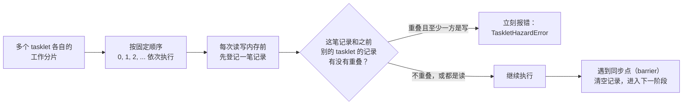
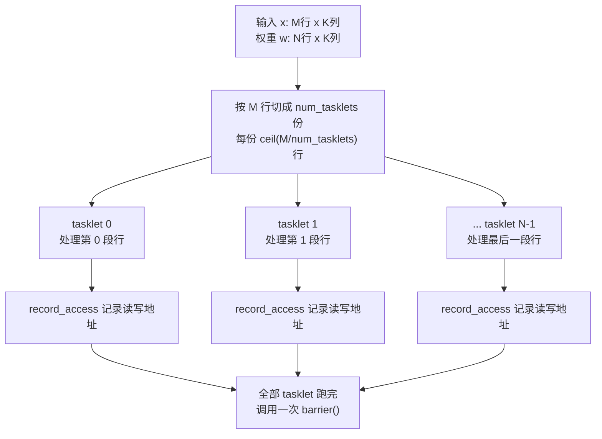
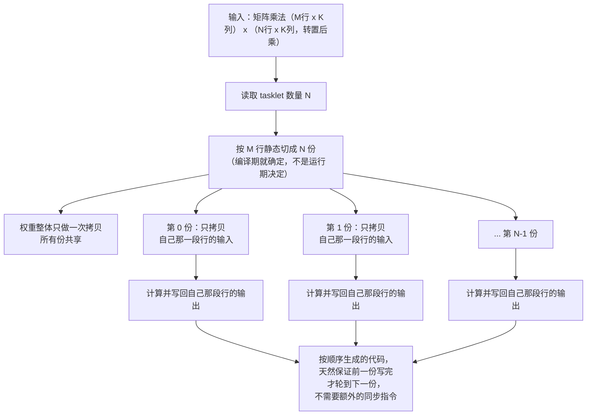

# DPU 内多 tasklet 细化说明（2026-08-27）

本文记录本次改动如何在原有"单 DPU、单 tasklet"的数值执行链路上，补上
"一个 DPU 内部有多个 tasklet 并行工作"这一层建模。文档以当前工作区代码为
准，重点说明：

- 本次到底新增了什么能力，解决什么问题；
- 两个仓库分别改了哪些文件、哪些函数；
- 原理是什么，为什么这样设计；
- 现在的验证证据、范围边界、已知问题。

> 术语说明：本文中的"tasklet"指真实存算一体芯片（类 UPMEM 架构）里一个
> DPU 内部的一条执行流；一个 DPU 可以有多个 tasklet 同时处理不同的数据
> 分片。"顺序模拟"指本仓 numpy 后端用固定顺序依次执行多个 tasklet 的工作，
> 不是真的开多个操作系统线程并发跑。

## 1. 本次修改概述

改动前的问题：`backend/dpu_sdk.py` 里一个 DPU 只是"一块内存 + 一个程序
入口"，没有任何 tasklet 概念；FlagTree 的算子编译 pass
（`pim-lower-single-tasklet`）名字里就写死了"只支持 1 个 tasklet"，硬性
拒绝其他取值。但真实存算一体硬件里，一个 DPU 内部本来就有多个 tasklet
各自处理一部分数据，如果编译器和模拟器完全没有对这层建模，硬件到来之后
才会暴露的问题（比如两个 tasklet 的数据切分算错、重叠写同一块内存、忘记
加同步点）现在完全测不出来。

本次改动的目标：在不引入真实硬件之前，让 numpy 模拟器和算子编译器都能
表达"一个 DPU 内部按多个 tasklet 切分工作"这件事，并且能够**在没有真硬件
的情况下，提前发现"切分算错""漏加同步"这类真实硬件上会变成数据竞争的
错误**。

### 已实现能力

| 能力 | 当前状态 | 证据文件 |
| --- | --- | --- |
| DPU 内部真实 WRAM 内存（不只是数字） | 已实现 | `backend/dpu_sdk.py` |
| DPU 分组（rank）的只读元数据标签 | 已实现，不影响寻址 | `backend/dpu_sdk.py` |
| 多 tasklet 顺序模拟执行 | 已实现 | `backend/hal_numpy.py` |
| tasklet 间数据冲突检测（漏加同步能被抓到） | 已实现 | `backend/hal_numpy.py` |
| 手写 NumPy 版多 tasklet 矩阵乘法 | 已实现 | `runtime/kernels.py` |
| 算子编译器多 tasklet 支持（原来硬编码只支持 1 个） | 已实现，原地泛化 | `FlagTree/lib/Dialect/TritonPIM/Transforms/LowerPIMToEmitC.cpp` |
| 图编译器把 tasklet 数量传给算子编译器 | 已实现 | `contracts/op_contract.py`、`opcompiler_bridge/driver.py` |
| 真实 Llama-2-7B 端到端验证（多档 tasklet 数量） | 已实现 | `tests/test_opcompiler_e2e_llama2_7b.py` |

### 没有实现的能力（本次范围之外）

| 能力 | 状态 | 原因 |
| --- | --- | --- |
| 真实多线程/多 pthread 并发执行 tasklet | 未实现 | 会让数值结果不可复现，无法逐元素对拍；真并发正确性只能等真硬件验证 |
| 循环分块（tile）pass | 未实现 | 本次只做按行切分，分块留给以后 |
| rank 参与图编译器的切分决策 | 未实现 | rank 目前只是 SDK 层的分组标签 |
| DPU 内部再分 bank 的寻址层 | 未实现 | 现有扁平 DPU 编号已经覆盖这一层 |
| 不同算子用不同的 tasklet 数量 | 未实现 | 需要代价模型才有意义，本次全图统一一个数字 |

## 2. 原理：为什么用"顺序模拟 + 冲突检测"而不是真并发

### 2.1 两条路都要解决的矛盾

一边是"要验证 tasklet 并发下会不会出错"，一边是"数值结果必须能跟单卡
PyTorch 逐元素对拍，不能有一点不确定性"。这两个要求如果用真的多线程
（pthread）去实现多 tasklet，会互相打架：多线程执行顺序不确定，同样的
输入跑两次可能因为线程调度不同产生细微的浮点误差，对拍就没法做了。

解决办法：**不追求"真的同时执行"，只追求"能查出真并发会出的错"**。



这样做的好处：
- 数值结果和单线程执行完全一样，可以放心跟 PyTorch 对拍；
- 但只要有两个 tasklet 的数据分片算错、重叠了，或者忘了加同步点，
  立刻会抛异常——这正是真实硬件上会变成"读到脏数据"的那类错误。

### 2.2 和真实硬件的对应关系

| 真实硬件（类 UPMEM） | 本仓模拟 |
| --- | --- |
| 一个 DPU 内部有多个 tasklet，物理上并发执行 | 多个 tasklet 按固定顺序模拟执行，不是真并发 |
| tasklet 各自有一块私有的 WRAM 缓存 | `backend/dpu_sdk.py` 给每个 DPU 一块真实的 WRAM 字节数组 |
| 多个 tasklet 同时读写内存可能冲突，要用 barrier 同步 | `HazardTracker` 记录每次访问，barrier 清空记录 |
| host 侧调用一次 `dpu_launch`，DPU 内部的 tasklet 调度是设备自己的事 | host 侧（Python/编译产物）调用一次，内部按 tasklet 切好的分片依次跑完 |

## 3. 修改文件总览

### 3.1 `flagos-pim-compiler` 仓库

| 文件 | 改动类型 | 内容 |
| --- | --- | --- |
| `contracts/exec_plan.py` | 修改 | `Command` 新增 `num_tasklets` 字段（默认 4） |
| `contracts/op_contract.py` | 修改 | `OpCompileRequest` 新增 `num_tasklets` 字段 |
| `backend/dpu_sdk.py` | 修改 | 每个 DPU 新增真实 WRAM 字节数组；新增 `dpu_alloc_ranks`/`dpu_get_nr_ranks`/`DpuSet.by_rank` |
| `backend/hal_numpy.py` | 修改 | 新增 `HazardTracker`（冲突检测）、`record_access`/`barrier`/`wram_ptr` 接口 |
| `runtime/kernels.py` | 修改 | 新增 `tasklet_linear_kernel`（手写多 tasklet 矩阵乘法）；`compiled_linear_kernel` 把 tasklet 数量传给算子编译器 |
| `runtime/exec_plan_gen.py` | 修改 | `build_execution_plan` 新增 `num_tasklets` 参数，贯通到每条 launch 命令 |
| `opcompiler_bridge/driver.py` | 修改 | 把 tasklet 数量传给 FlagTree 的 pass；缓存键加入 tasklet 数量 |
| `opcompiler_bridge/kernel_src.py` | 修改 | 文档字符串更新（新 pass 名字） |
| `docs/hal_numpy.md` | 修改 | 补充 WRAM/rank/tasklet 相关接口说明 |
| `tests/test_dpu_sdk.py` | 修改 | 新增 rank/WRAM 相关测试 |
| `tests/test_hal_numpy.py` | 修改 | 新增冲突检测相关测试 |
| `tests/test_kernels.py` | 修改 | 新增多 tasklet 矩阵乘法测试 |
| `tests/test_opcompiler_linear.py` | 修改 | 新增多档 tasklet 数量的编译产物测试 |
| `tests/test_exec_plan_gen.py` | 修改 | 新增 tasklet 数量传递测试 |
| `tests/test_opcompiler_e2e_llama2_7b.py` | 修改 | 端到端测试改为多档 tasklet 数量参数化 |

### 3.2 `FlagTree` 仓库

| 文件 | 改动类型 | 内容 |
| --- | --- | --- |
| `lib/Dialect/TritonPIM/Transforms/LowerPIMSingleTasklet.cpp` → `LowerPIMToEmitC.cpp` | 改名+修改 | 泛化支持任意 tasklet 数量，不再硬性要求等于 1 |
| `include/triton/Dialect/TritonPIM/Transforms/Passes.td` | 修改 | pass 改名为 `pim-lower-to-emitc`，更新说明文字 |
| `lib/Dialect/TritonPIM/Transforms/CMakeLists.txt` | 修改 | 编译目标文件名跟着改 |
| `bin/CMakeLists.txt` | 修改 | 注释里的文件名跟着改 |
| `test/Dialect/TritonPIM/lower_to_emitc.mlir` | 新增 | 多 tasklet 切分的正例测试（覆盖整除、余数两种情况） |
| `test/Dialect/TritonPIM/lower_to_emitc_negative.mlir` | 新增 | tasklet 数量非法时报错的负例测试 |

## 4. 图编译器侧实现

### 4.1 契约扩展

`contracts/exec_plan.py` 的 `Command`（图编译器生成的每一条执行命令）
新增一个字段：

```python
num_tasklets: int = 4
```

只在 `op == "launch"`（也就是"在某个 DPU 上跑一次算子"）的命令上有意义。
默认值定为 4，不是 1——这样现有调用方不需要专门改代码就会自动走多
tasklet 路径，多 tasklet 是本次的主线，不是需要额外开关才能碰到的旁支。

`contracts/op_contract.py` 的 `OpCompileRequest`（图编译器交给算子编译器
的编译请求）同样新增 `num_tasklets` 字段，默认值 4，与上面保持一致。

### 4.2 执行计划生成

`runtime/exec_plan_gen.py::build_execution_plan` 新增 `num_tasklets`
参数，贯通到每一条生成的 launch 命令上——全图统一用一个数字，不支持
"不同算子用不同 tasklet 数量"（那需要一个代价模型来决定"这个算子该切
几份"，本次不做）。

### 4.3 numpy 侧的多 tasklet 矩阵乘法

`runtime/kernels.py` 新增 `tasklet_linear_kernel`，只覆盖矩阵乘法
（`linear`）这一个算子。原理：把输出矩阵按行（M 维）切成
`num_tasklets` 份，每份交给一个 tasklet：



权重（w）不切分，所有 tasklet 共享同一份只读权重；只有输入 x 和输出
按行切分。如果 M 不能被 `num_tasklets` 整除，最后一个 tasklet 少算几行；
如果 `num_tasklets` 比 M 还大，多出来的 tasklet 直接跳过（空转）。

### 4.4 numpy 后端的冲突检测

`backend/hal_numpy.py` 新增 `HazardTracker`：记录"哪个 tasklet、在哪个
地址区间、读还是写"，每次新记录进来时和当前这一段（两次 barrier 之间）
已有的记录比较——如果发现两个不同 tasklet 的地址区间重叠、且至少一方是
写，立刻抛出 `TaskletHazardError`。

`NumpyBackend` 新增三个方法给 kernel 调用：

- `record_access(tasklet_id, 内存类型, 起始地址, 长度, 是否写)`：登记一次
  访问；
- `barrier()`：清空当前记录，进入下一阶段；
- `wram_ptr(dpu_id)`：拿到某个 DPU 的 WRAM 裸指针，供编译产物用。

每一次"在某个 DPU 上跑一次算子"（一条 launch 命令）都有自己独立的一份
记录，不同 DPU 之间、不同命令之间不会互相干扰。

### 4.5 DPU 底层：真实 WRAM 和 rank 分组

`backend/dpu_sdk.py`（厂商 SDK 的 numpy 镜像）里，一台 DPU 原来只有一块
MRAM（主存）字节数组，本次新增一块 WRAM（片上暂存区）字节数组——不再是
一个只用来校验预算的数字,而是真的可以读写的内存,这样 tasklet 才有具体
地址可以记录、可以检测冲突。

另外新增 `dpu_alloc_ranks`/`dpu_get_nr_ranks`/`DpuSet.by_rank`，镜像
真实厂商 SDK 里"多个 DPU 组成一个 rank"的概念。**这只是一个只读的分组
标签，不改变任何寻址方式**——图编译器切分数据的时候仍然只认扁平的
DPU 编号，rank 分组不参与切分决策,也不参与通信计划。

## 5. 算子编译器侧实现（FlagTree）

### 5.1 为什么不新建一个"多 tasklet pass"，而是改造原来的 pass

原来的 pass 叫 `pim-lower-single-tasklet`，名字里就写死了"只支持 1 个
tasklet",一旦传入的 tasklet 数量不等于 1 直接报错退出。

本次的做法是**原地改造这个 pass，而不是新建一个平行的 pass**：如果多
tasklet 支持做好了，"只有 1 个 tasklet"应该是"多个 tasklet"的一个特例
（正好只有一份），没有理由维护两套互相独立的实现。所以把这个 pass
改名为 `pim-lower-to-emitc`（意思是"把 PIM 中间表示下沉成 EmitC"，不再
提"single-tasklet"），让它接受任意 `tasklet 数量 >= 1`，`= 1` 时的行为
和原来完全一样。

### 5.2 pass 内部怎么切分



关键点：这个切分是在**编译期**（生成 C 代码的时候）就静态展开好的，
生成出来的 C 代码里没有"运行时决定第几个 tasklet"这种逻辑，每一份都是
写死的行区间。这和 numpy 侧的做法（Python for 循环依次跑）在效果上是
对应的——都是按程序顺序执行,不依赖真并发。

由于是严格按顺序生成代码，"第 0 份先执行完才轮到第 1 份"这件事本身就是
一种比同步原语更强的保证，所以生成的 C 代码里不需要真正的同步指令。

### 5.3 图编译器怎么把 tasklet 数量传给算子编译器

`opcompiler_bridge/driver.py` 把 `OpCompileRequest.num_tasklets` 这个
字段直接拼进调用 FlagTree 的命令行参数（`-convert-triton-to-pim`的
`num-tasklets=` 选项），再经 `pim-lower-to-emitc` 消费。同一个矩阵乘法
形状,不同 tasklet 数量会生成不同的 C 代码,所以缓存键（决定"这次编译要不要
复用之前的产物"）也加入了 tasklet 数量,不会用错缓存。

## 6. 本次做了哪些验证

### 6.1 单元测试

| 测试内容 | 文件 | 验证什么 |
| --- | --- | --- |
| 冲突检测：两个 tasklet 写重叠区间、无同步点 | `tests/test_hal_numpy.py` | 能抓到"漏加同步" |
| 冲突检测：有同步点隔开后不报错 | `tests/test_hal_numpy.py` | 不会误报 |
| 冲突检测：只读不算冲突 | `tests/test_hal_numpy.py` | 不会误报 |
| 冲突检测接入真实执行流程（不是只测算法本身） | `tests/test_hal_numpy.py` | kernel 里真的调用检测接口时能触发/不触发 |
| 手写多 tasklet 矩阵乘法数值正确性（1/2/3/5/8 份） | `tests/test_kernels.py` | 整除、有余数、tasklet 数超过行数三种情况都对 |
| 手写版本切分区间不重叠、覆盖全部行 | `tests/test_kernels.py` | 切分逻辑本身正确 |
| 手写版本故意漏加同步能被抓到 | `tests/test_kernels.py` | 不只是数值对，同步问题也能验证出来 |
| DPU rank 分组、WRAM 分配 | `tests/test_dpu_sdk.py` | 新增 SDK 接口行为正确 |
| 图编译器执行计划正确带上 tasklet 数量 | `tests/test_exec_plan_gen.py` | 数量能传到每条命令上 |

### 6.2 FlagTree 编译器测试

在真机上重新编译了 FlagTree 的 `triton-opt`，确认新 pass 编译通过。
新增两个 FileCheck 测试：

- `lower_to_emitc.mlir`：同一个矩阵乘法（4 行输入），分别用 1/2/3 个
  tasklet 编译，检查生成的 C 代码里内存分配次数符合预期（1 个 tasklet
  是 2 次分配，2 个 tasklet 是 3 次，3 个 tasklet 因为有余数、最后一个
  tasklet 分不到行、也是 3 次，不是 4 次）；
- `lower_to_emitc_negative.mlir`：tasklet 数量非法（小于 1）时确认报错。

另外手工跑了一遍真实的算子编译链路（不是 FileCheck，是真的把一个矩阵
乘法编译成 `.so` 再执行），确认：

- 1/2/4/8 个 tasklet 编译出的 `.so` 数值全部跟 `x @ w.T` 的参考结果一致
  （最大误差 `2.86e-06`）；
- 故意让输出内存和输入内存重叠（模拟内存复用场景）时，多 tasklet 切分
  后依然正确——这是历史上出过真实 bug 的场景（详见本文档第 7 节），
  确认这次改动没有把这个坑重新引入。

### 6.3 真实 Llama-2-7B 端到端验证

```bash
source /media/disk/fengjingge/src/flagOS/flagOS-installed/pytorch/env-pytorch.sh
cd /media/disk/fengjingge/src/flagOS/flagos-pim-compiler
python3 -m pytest tests/test_opcompiler_e2e_llama2_7b.py -v -s
```

用真实 Llama-2-7B 模型、真实 prompt，走完整链路（图编译器切分标注 →
算子编译请求 → FlagTree 编译成 `.so` → numpy 后端执行），分别在
`tasklet 数量 = 1、4、8` 三档下验证：

```text
3 passed in 863.24s (0:14:23)
```

每一档都有 15360 次编译产物调用，逐次跟手写 NumPy 参考比对：

| shape | dtype | 调用次数 | 最大相对误差 | 超 5% 容差次数 |
| --- | --- | ---: | ---: | ---: |
| `((1, 1, 4096), (512, 4096))` | `float16` | 11520 | `9.4967e-04` | 0 |
| `((1, 1, 512), (4096, 512))` | `float16` | 3840 | `8.6281e-04` | 0 |

三档生成的文本完全一致，且与 HF `model.generate()` 逐字符一致：

```text
prompt: 'The capital of France is'
generated: 'The capital of France is a city of contrasts. The city is home to the Eiffel Tower'
```

## 7. 当前存在的问题

### 7.1 tasklet 之间不是真并发，无法验证真并发下的问题

这是本次设计上主动做的取舍，不是遗漏，但必须说清楚边界：现在的多 tasklet
是"按固定顺序模拟",不是真的开多个线程同时跑。这意味着：

- 能验证的：数据切分对不对、有没有重叠、忘加同步点会不会被抓到；
- 不能验证的：真正多个 tasklet **同时**访问内存时，会不会出现真实
  硬件上才有的时序问题（比如某种真并发下的竞争条件，在顺序模拟下永远
  不会触发，因为顺序模拟本身就规避了"同时"这件事）。

真并发正确性目前只能等真实硬件到来后再验证，或者以后单独设计一条真
pthread 的验证路径（但那条路径会牺牲数值可复现性,需要另外考虑怎么和
现有的逐元素对拍机制共存）。

### 7.2 不同算子不能用不同的 tasklet 数量

全图目前只能配置同一个 tasklet 数量，不支持"这个算子用 4 个、那个算子
用 8 个"。真实场景里不同算子（矩阵形状不同）最优的 tasklet 数量可能不一样，
但这需要一个代价模型来决定，本次没有做，也没有为将来预留任何相关接口。

### 7.3 循环分块（tile）没有实现

真实存算一体硬件的 WRAM 容量有限，如果矩阵形状很大，一个 tasklet 自己
负责的那部分数据可能也放不进 WRAM，需要再往下切成更小的块（tile）分批
搬运。本次只做了"按行切给 tasklet"这一层,没有做"tasklet 内部再分块"。

### 7.4 WRAM 超预算目前只警告，不会自动处理

FlagTree 的 `pim-explicit-dma` pass 如果发现某个内存暂存区超过 WRAM
预算，只会打印警告，不会自动重新切分。这个问题在本次改动之前就存在，
本次没有解决,也不在本次范围内。

### 7.5 rank/bank 目前只是概念占位，没有真实用途

新增的 `dpu_alloc_ranks` 目前只是一个分组标签，没有任何图编译器逻辑
真正利用这个分组做决策（比如"这一组内的 DPU 之间通信更快，优先分到
同一组"这类优化）。这是本次故意划定的范围边界，不是没做完。

## 8. 常用验证命令

```bash
source /media/disk/fengjingge/src/flagOS/flagOS-installed/pytorch/env-pytorch.sh
cd /media/disk/fengjingge/src/flagOS/flagos-pim-compiler

# 冲突检测 + 手写多 tasklet 矩阵乘法单测
python3 -m pytest tests/test_hal_numpy.py tests/test_kernels.py tests/test_dpu_sdk.py -q

# 编译产物多档 tasklet 数量数值验证（需要 GPU）
python3 -m pytest tests/test_opcompiler_linear.py -q

# 真实 Llama-2-7B 端到端（1/4/8 三档 tasklet 数量，需要 GPU + 本地模型权重）
python3 -m pytest tests/test_opcompiler_e2e_llama2_7b.py -v -s
```

FlagTree 侧重新编译并跑 pass 级测试：

```bash
cd /media/disk/fengjingge/src/flagOS/flagOS-installed/flagTree-pim/build/flagtree-cmake
ninja bin/triton-opt
bin/triton-opt <测试文件>.mlir \
  -convert-triton-to-pim='target=pim:v1 num-tasklets=4 wram-bytes=65536' \
  -pim-explicit-dma -pim-lower-to-emitc -convert-func-to-emitc
```

## 9. 一句话结论

本次改动让 numpy 模拟器和算子编译器都学会了"一个 DPU 内部按多个 tasklet
切分工作"这件事，用"顺序模拟 + 冲突检测"的方式，在不牺牲数值可复现性
的前提下，提前捉住真实硬件上会出现的数据切分错误和漏加同步的问题；用
真实 Llama-2-7B 模型在 1/4/8 三档 tasklet 数量下验证了完整链路（图编译器
→算子编译器→C→numpy）都能正确生成 tokens。真并发下的时序问题仍然只能
等真实硬件验证。
