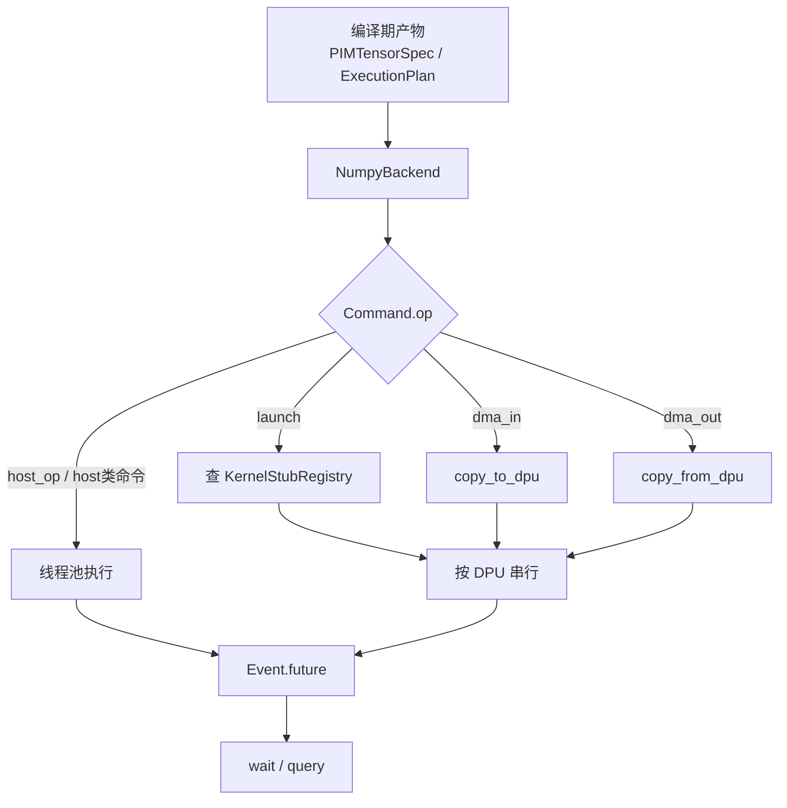
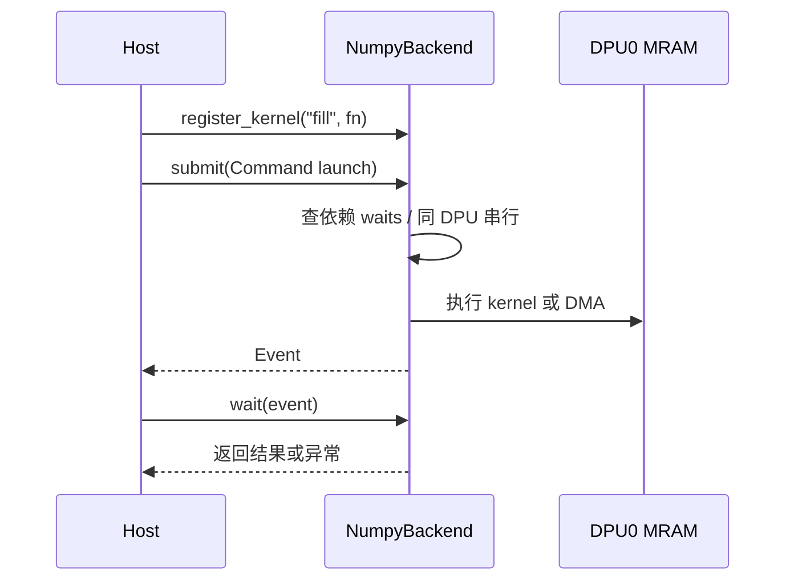

# numpy假后端技术实现说明

本文对应当前仓库里这批未提交改动，目标是把“多 DPU 独立地址空间的运行时底座”先在 CPU 上跑通，方便后续把编排器、通信、KV 和内存规划都先验数值。

## 一、这次改了什么

| 文件 | 变化 | 作用 |
| --- | --- | --- |
| `backend/hal_numpy.py` | 新增 | 核心实现。用多个独立的 NumPy 缓冲区模拟多个 DPU 的 MRAM。 |
| `backend/hal_vendor.py` | 新增 | 真硬件后端占位，当前只报错。 |
| `backend/__init__.py` | 修改 | 统一导出后端入口。 |
| `contracts/pim_tensor_spec.py` | 新增 | 张量切分与驻留契约。 |
| `contracts/exec_plan.py` | 新增 | 运行时命令与执行计划契约。 |
| `tests/test_hal_numpy.py` | 新增 | 覆盖隔离性、异步、DMA、接口形状和 GPT-2 形状烟雾测试。 |
| `docs/hal_numpy.md` | 新增短文档 | 这是原有的英文短说明；本文件是更完整的中文说明。 |

## 二、核心数据结构

### 1. 张量布局契约

```python
Placement(kind, dim=None, reduce_type=None)
TensorShardDetail(dpu_id, shard_dim, start_idx, end_idx, local_shape, mram_offset=0)
PIMTensorSpec(device, placement, residency, pinned_dpu_id, shard_map, reduce_type)
```

| 结构 | 字段 | 含义 |
| --- | --- | --- |
| `Placement` | `kind` | 布局类型，只支持 `Shard`、`Replicate`、`Partial`。 |
| `Placement` | `dim` | 如果是切分，表示沿哪一维切。 |
| `Placement` | `reduce_type` | 如果是部分和，表示用什么归约方式。 |
| `TensorShardDetail` | `dpu_id` | 这个分片属于哪个 DPU。 |
| `TensorShardDetail` | `shard_dim` | 分片发生在哪一维。 |
| `TensorShardDetail` | `start_idx/end_idx` | 这个分片在全局张量上的区间。 |
| `TensorShardDetail` | `local_shape` | 这个 DPU 上本地张量的形状。 |
| `TensorShardDetail` | `mram_offset` | 这个分片在本地 MRAM 的字节偏移。 |
| `PIMTensorSpec` | `device` | 张量最终驻留在 `host` 还是 `dpu`。 |
| `PIMTensorSpec` | `residency` | `transient` 还是 `pinned`。 |
| `PIMTensorSpec` | `pinned_dpu_id` | 若常驻，则钉在哪个 DPU。 |
| `PIMTensorSpec` | `shard_map` | 每个 DPU 对应哪个分片。 |
| `PIMTensorSpec` | `reduce_type` | 如果是 `Partial`，记录归约方式。 |

### 2. 执行计划契约

```python
Access(loc, offset, length)
Command(id, op, dpu_id, payload, reads=[], writes=[], waits=[])
ExecutionPlan(commands)
```

| 结构 | 作用 |
| --- | --- |
| `Access` | 记录一次读写访问的地址范围。 |
| `Command` | 运行时最小执行单元。靠 `op` 和 `payload` 描述要做什么。 |
| `ExecutionPlan` | 命令列表。真正的依赖关系放在每条命令的 `waits` 里。 |

`Command.op` 目前支持的值包括 `launch`、`dma_in`、`dma_out`，以及一组主机侧命令名。`reads` / `writes` 现在是契约字段，后续编排器会继续用；`NumpyBackend` 本身主要看 `op`、`dpu_id`、`payload` 和 `waits`。

## 三、NumpyBackend 怎么工作

### 总体流程



### 关键原则

1. 每个 DPU 有自己独立的 MRAM。
2. 同一个 DPU 上的命令按顺序串行。
3. 显式依赖由 `waits` 控制。
4. 主机上的数据在提交时会先拷贝一份，避免后续被外部修改。
5. 这个后端只模拟“能不能跑对”，不模拟真实硬件性能。

### 调度原理

`submit()` 会先把 `waits` 里的命令 id 转成依赖 future，再按命令类型分发：

| 分支 | 行为 |
| --- | --- |
| `launch` | 从注册表里取 kernel stub，在目标 DPU 上执行。 |
| `dma_in` | 把主机数据写进目标 DPU 的 MRAM。 |
| `dma_out` | 从目标 DPU 的 MRAM 读回数据。 |
| `dpu_id is None` | 走主机线程池，执行 `payload["fn"]`。 |

同一个 DPU 上还有一层“尾巴 future”控制：新命令必须等上一个命令完成后再开始，这样可以模拟单 DPU 流水线的顺序语义。

## 四、对外接口怎么用

### 1. 创建后端

```python
backend = NumpyBackend(
    NumpyBackendConfig(
        num_dpus=2,
        mram_bytes_per_dpu=64 * 1024,
    )
)
```

`allow_device_to_device` 默认是 `False`，也就是说当前阶段不支持 DPU 到 DPU 直连拷贝。

### 2. 注册 kernel stub

```python
def fill(hal, dpu_id, cmd) -> None:
    value = np.asarray(cmd.payload["value"], dtype=np.int32)
    hal.write_local(dpu_id, cmd.payload["offset"], value)

backend.register_kernel("fill", fill)
```

kernel stub 的输入是：

| 参数 | 含义 |
| --- | --- |
| `hal` | 当前 `NumpyBackend` 实例。 |
| `dpu_id` | 目标 DPU id。 |
| `cmd` | 当前命令对象。 |

### 3. 直接读写本地 MRAM

```python
backend.write_local(dpu_id=0, offset=0, data=np.asarray([1, 2, 3], dtype=np.int32))
data = backend.read_local(dpu_id=0, offset=0, shape=(3,), dtype=np.int32)
```

这两个接口是调试和验数的最常用入口：

| 接口 | 输入要求 | 输出 |
| --- | --- | --- |
| `write_local` | `offset` 必须是字节偏移；`data` 必须能转成连续数组。 | 无 |
| `read_local` | `shape` 和 `dtype` 必须能精确描述目标字节数。 | 返回一个新数组副本。 |

### 4. 提交异步命令

```python
event = backend.submit(
    Command(
        id=1,
        op="launch",
        dpu_id=0,
        payload={"kernel": "fill", "offset": 0, "value": [1, 2, 3, 4]},
        reads=[],
        writes=[],
        waits=[],
    )
)

backend.wait(event)
done = backend.query(event)
```

`Event.kind` 只是结果类型标记，当前有三种：

| 值 | 意义 |
| --- | --- |
| `dpu` | DPU 上执行的 kernel。 |
| `dma` | DMA 读写。 |
| `host` | 主机侧任务。 |

### 5. 批量拷贝

```python
backend.push_xfer([
    (0, 0, data0),
    (1, 128, data1),
])
```

这只是把多次 `write_local` 串起来做，适合初始化多个 DPU 的静态数据。

## 五、怎么验证

直接跑：

```bash
python -m pytest tests/test_hal_numpy.py -q
```

每个测试覆盖的点如下：

| 测试名 | 验证内容 |
| --- | --- |
| `test_runtime_contracts_have_the_expected_fields` | 契约字段齐全，布局和计划对象能正常创建。 |
| `test_vendor_backend_stub_is_available_from_package` | 真硬件后端目前仍是占位。 |
| `test_dpu_isolation_and_copy_round_trip` | 不同 DPU 的 MRAM 互不影响。 |
| `test_submit_wait_query_and_kernel_stub` | `submit` / `wait` / `query` 和 kernel 注册可用。 |
| `test_submit_serializes_commands_on_the_same_dpu` | 同一个 DPU 上的命令会按顺序执行。 |
| `test_submit_dma_and_host_paths_return_results_and_propagate_errors` | `dma_in`、`dma_out` 和主机任务都能返回结果，错误会往外抛。 |
| `test_dma_in_snapshots_host_payload_at_submit_time` | 提交后修改原始主机数组，不会污染已经提交的 DMA。 |
| `test_command_waits_are_honored_before_execution` | `waits` 真的会阻塞后继命令。 |
| `test_same_dpu_dma_waits_for_prior_launch_without_explicit_waits` | 同一 DPU 的尾部串行语义成立。 |
| `test_device_to_device_direct_copy_has_no_phase1_api` | 当前阶段没有 DPU 到 DPU 直连拷贝。 |
| `test_read_local_returns_a_copy_and_push_xfer_fans_out` | `read_local` 返回副本，`push_xfer` 能同时写多个 DPU。 |
| `test_gpt2_smoke_payload_stays_model_agnostic` | 只验证 GPT-2 形状数据能进出 MRAM，不绑定具体模型逻辑。 |

## 六、现在还有什么限制

1. `VendorBackend` 现在是空壳，实例化会直接报 `NotImplementedError`。
2. `register_plan()` 现在只保存对象，没有真正参与调度。
3. `Command.reads` / `writes` 目前是契约字段，backend 还没用它们做更深的依赖分析。
4. `submit()` 只覆盖当前阶段需要的命令路径，没做完整的运行时解释器。
5. 这个后端不模拟真实硬件时延、带宽和并发争用，只模拟数值和顺序语义。
6. `allow_device_to_device=True` 被明确禁止，因为第 1 阶段不需要 DPU 直连。

## 七、对应的原理图



## 八、快速结论

这次改动的核心，不是“多了一个 NumPy 包装层”，而是补上了一个可验证的运行时底座：

1. 用 `contracts/` 把运行时数据格式钉死。
2. 用 `NumpyBackend` 把每个 DPU 的独立地址空间、DMA、异步命令和串行语义模拟出来。
3. 用测试把隔离性、等待关系、拷贝语义和烟雾场景都锁住。
4. 真硬件后端先占位，后续只要替换 `VendorBackend`，上层接口不用改。
