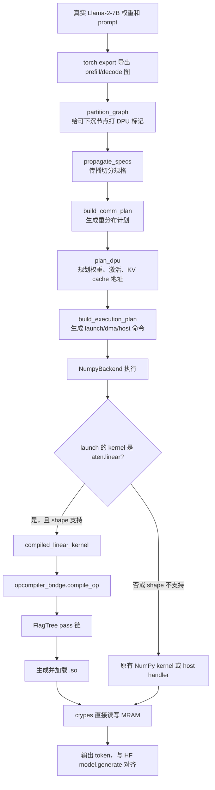
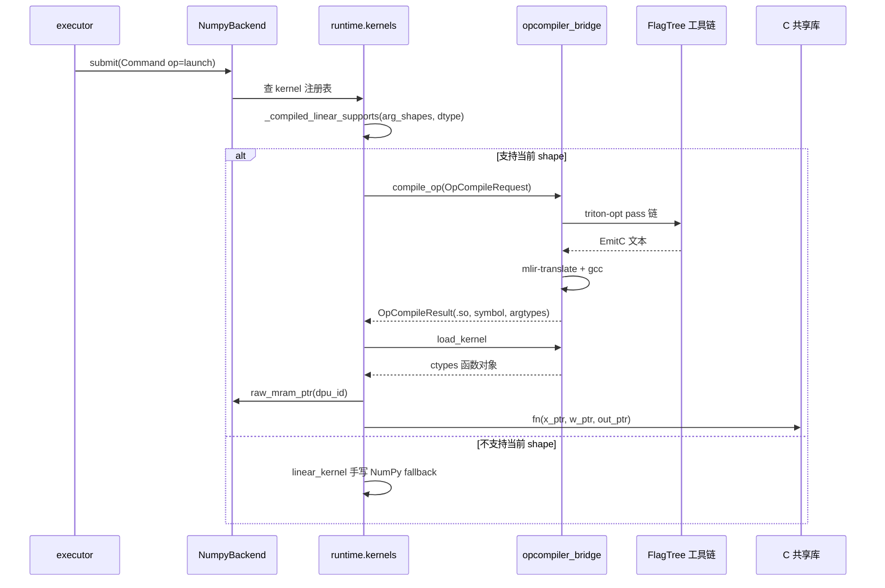
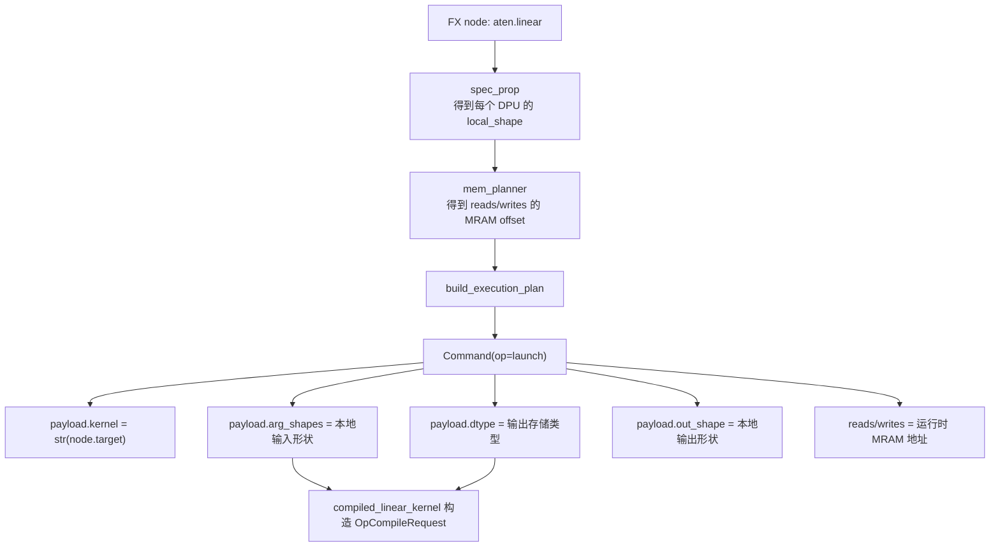
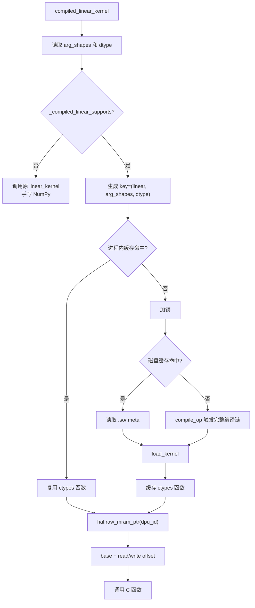
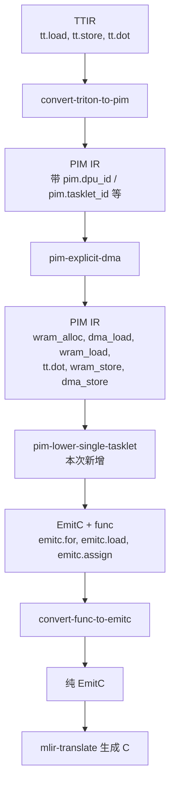
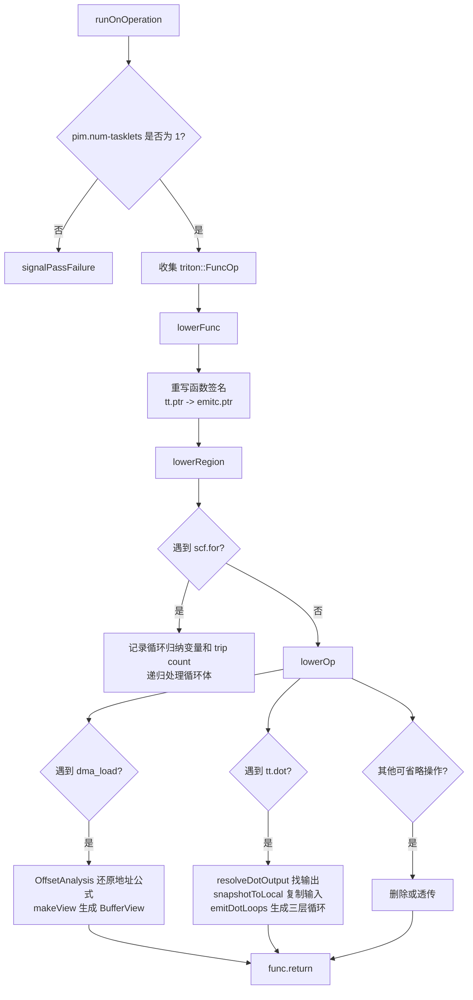
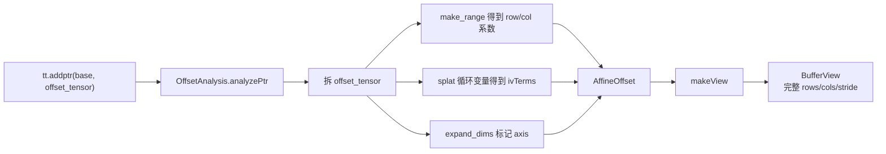
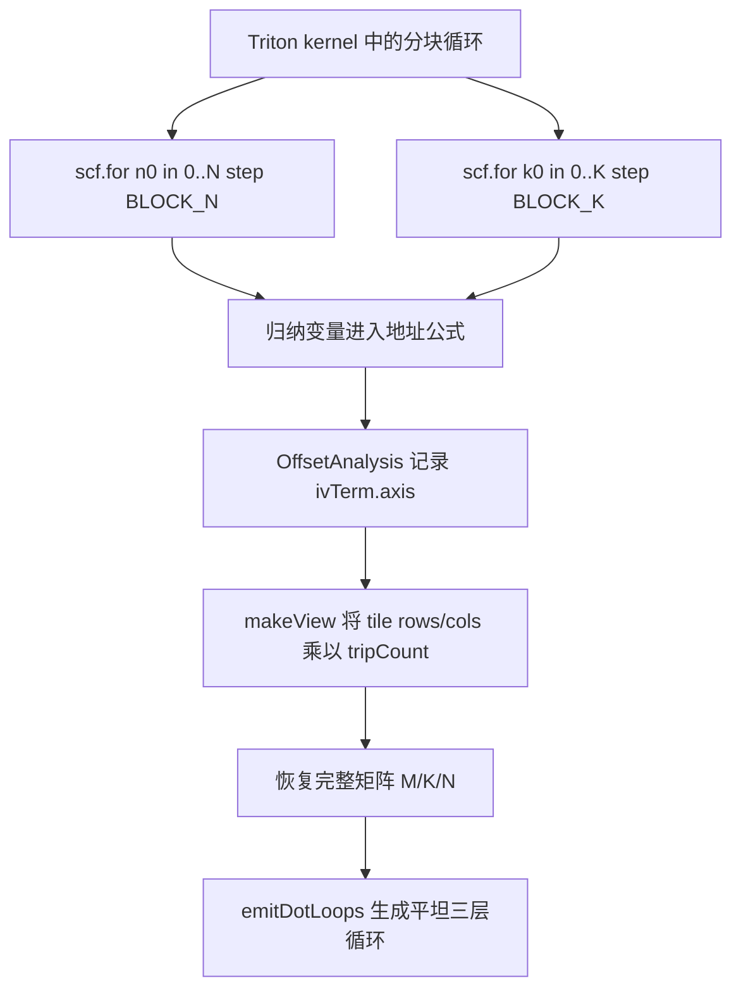
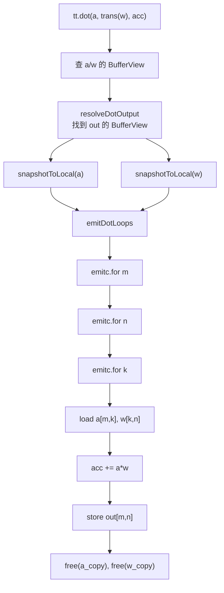

# 图编译器到算子编译器联通说明（2026-08-25）

本文记录当前未提交修改如何把 `flagos-pim-compiler` 的图编译器和
`FlagTree` 的算子编译器接起来。文档以当前工作区代码为准，重点说明：

- 本次到底新增了什么能力；
- 两个仓库分别改了哪些文件；
- 图编译器如何把本地算子信息传给算子编译器；
- 算子编译器新增 pass 如何把 `pim mlir` 下沉到可执行的 C 产物；
- 现在的验证证据、范围边界、已知问题和后续改进方向。

> 术语说明：本文中的 `pim mlir` 指 FlagTree 的 TritonPIM 方言文本；`C 产物`
> 指主机侧共享库 `.so`，由 `ctypes` 在 `NumpyBackend` 上执行。它不是最终真实
> DPU 设备二进制。

## 1. 本次修改概述

改动前，两条链路互相独立：

| 链路 | 改动前状态 | 缺口 |
| --- | --- | --- |
| 图编译器链路 | `flagos-pim-compiler` 已能用手写 `NumPy` 算子跑通真实 Llama-2-7B 推理 | 没有调用 FlagTree 生成的算子产物 |
| 算子编译器链路 | FlagTree 能把 Triton kernel 转成 `pim mlir` 文本 | `pim mlir` 没有继续生成可执行代码，也没有被图编译器执行 |

本次补上第一期垂直切片：只覆盖 `linear`，把图编译器执行计划里的本地
`linear` 调用转成算子编译请求，再经 FlagTree pass 链生成主机侧 `.so`，最后
在 `NumpyBackend` 的 MRAM 字节数组上原地执行。

### 已实现能力

| 能力 | 当前状态 | 证据文件 |
| --- | --- | --- |
| 图侧生成本地算子视图 | 已实现，`ExecutionPlan` 的 `launch` 命令携带 `arg_shapes`、`dtype`、`out_shape` | `runtime/exec_plan_gen.py` |
| 图侧到算子侧契约 | 已实现，新增 `OpCompileRequest`、`OpCompileResult` | `contracts/op_contract.py` |
| `linear` 的 Triton 编译入口 | 已实现，新增最小 Triton kernel | `opcompiler_bridge/kernel_src.py` |
| `TTIR -> pim mlir -> EmitC -> C -> .so` | 已实现，新增桥接驱动 | `opcompiler_bridge/driver.py` |
| `pim mlir -> EmitC` pass | 已实现，新增 `pim-lower-single-tasklet` | `FlagTree/lib/Dialect/TritonPIM/Transforms/LowerPIMSingleTasklet.cpp` |
| `.so` 在伪后端上执行 | 已实现，`ctypes` 传入 MRAM 裸指针 | `runtime/kernels.py`、`backend/hal_numpy.py` |
| 真实 Llama-2-7B 端到端验证 | 已实现，decode 中支持形状逐次对拍 | `tests/test_opcompiler_e2e_llama2_7b.py` |

### 没有实现的能力

| 能力 | 当前状态 | 原因 |
| --- | --- | --- |
| 所有算子都走算子编译器 | 未实现 | 当前只覆盖 `linear`，其他算子仍走原有 `NumPy` 或主机路径 |
| 任意矩阵形状 | 未实现 | 当前要求 M/K/N 都是 2 的幂且 K 至少为 16 |
| 多 tasklet 下沉 | 未实现 | 新 pass 明确只支持 `pim.num-tasklets == 1` |
| 真实 DPU 二进制 | 未实现 | 当前产物是主机侧 `.so`，用于 numpy 伪后端验证 |
| 完全由 C 产物输出驱动整段解码 | 尚未由当前端到端测试证明 | 测试逐次对拍后写回手写 `NumPy` 参考值继续推理 |

## 2. 总体流程

### 2.1 从模型到执行产物



### 2.2 编译链路

```mermaid
flowchart LR
    A["OpCompileRequest<br/>op=linear<br/>arg_shapes<br/>dtype"] --> B["kernel_src.py<br/>构造 Triton linear kernel"]
    B --> C["triton.compile<br/>在 GPU 上跑一次拿 TTIR"]
    C --> D["triton-opt<br/>convert-triton-to-pim"]
    D --> E["pim mlir"]
    E --> F["pim-explicit-dma<br/>显式 WRAM 和 DMA"]
    F --> G["pim-lower-single-tasklet<br/>新增 pass"]
    G --> H["EmitC 方言"]
    H --> I["convert-func-to-emitc"]
    I --> J["mlir-translate --mlir-to-cpp"]
    J --> K["C 源码"]
    K --> L["gcc -shared -fPIC -O2"]
    L --> M[".so + .meta"]
```



### 2.3 运行时调用链



## 3. 修改文件总览

### 3.1 `flagos-pim-compiler` 仓库

| 文件 | 状态 | 主要内容 | 对链路的作用 |
| --- | --- | --- | --- |
| `.gitignore` | 修改 | 忽略 `.opcompiler_cache/` | 防止 `.so/.meta/.c` 编译缓存入库 |
| `contracts/op_contract.py` | 新增 | `OpCompileRequest`、`OpCompileResult`、`flatten_leading_dims` | 定义图侧和算子侧的最小契约 |
| `opcompiler_bridge/__init__.py` | 新增 | 暴露 `compile_op` | 给外部提供包入口 |
| `opcompiler_bridge/kernel_src.py` | 新增 | 最小 `linear` Triton kernel，N/K 分块 | 产生真实 TTIR，内部含 `tl.dot` |
| `opcompiler_bridge/driver.py` | 新增 | 编译驱动、缓存、签名解析、`.so` 构建 | 把 `OpCompileRequest` 变成可加载共享库 |
| `backend/hal_numpy.py` | 修改 | 新增 `raw_mram_ptr(dpu_id)` | 让 C 产物直接访问 DPU 的 MRAM 字节数组 |
| `runtime/kernels.py` | 修改 | 新增 `compiled_linear_kernel`、shape 判断、进程内缓存锁 | 在执行期把 `linear` 替换为编译产物 |
| `tests/test_opcompiler_linear.py` | 新增 | 单算子对拍 | 验证 `.so` 的数值正确性 |
| `tests/test_opcompiler_e2e_llama2_7b.py` | 新增 | 真实 Llama-2-7B 端到端对拍 | 验证图编译、算子编译、伪后端执行的联通 |
| `docs/opcompiler_bridge-20260825.md` | 修改 | 本文档 | 作为本次桥接工作的唯一说明文档 |

### 3.2 `FlagTree` 仓库

| 文件 | 状态 | 主要内容 | 对链路的作用 |
| --- | --- | --- | --- |
| `.gitignore` | 修改 | 忽略 `third_party/flir/` | 避免本地依赖目录入库 |
| `include/triton/Dialect/TritonPIM/Transforms/Passes.td` | 修改 | 注册 `pim-lower-single-tasklet` pass | 让 `triton-opt` 识别新增 pass |
| `lib/Dialect/TritonPIM/Transforms/LowerPIMSingleTasklet.cpp` | 新增 | pass 主体 | 把单 DPU、单 tasklet 的 PIM IR 降到 EmitC |
| `lib/Dialect/TritonPIM/Transforms/CMakeLists.txt` | 修改 | 编译新增 C++ 文件，链接 EmitC/Func/SCF | 把 pass 编进 TritonPIMTransforms |
| `bin/RegisterTritonDialects.h` | 修改 | 引入 EmitC 头文件 | 让 `triton-opt` 可处理 EmitC 方言 |
| `bin/CMakeLists.txt` | 修改 | 链接 `MLIREmitCDialect`、`MLIRFuncToEmitC` | 支持 `-convert-func-to-emitc` |

## 4. 图编译器侧实现

### 4.1 算子契约

`contracts/op_contract.py` 是图编译器和算子编译器之间的唯一契约。

| 结构体或函数 | 字段或签名 | 含义 |
| --- | --- | --- |
| `OpCompileRequest` | `op: str` | 算子名，当前只接受 `"linear"` |
| `OpCompileRequest` | `arg_shapes: list[tuple[int, ...]]` | 本地输入形状，来自执行计划的 `cmd.payload["arg_shapes"]` |
| `OpCompileRequest` | `dtype: str = "float32"` | MRAM 中的存储类型，当前支持 `float16` 和 `float32` |
| `OpCompileResult` | `so_path: str` | 编译出的共享库路径 |
| `OpCompileResult` | `symbol: str` | 共享库里的 C 函数名 |
| `OpCompileResult` | `argtypes: list[str]` | 从 C 函数签名解析出的参数元素类型 |
| `flatten_leading_dims(shape)` | `tuple[int, int]` | 把 rank 大于等于 2 的输入按最后一维为 K，其余维展平成 M |

为什么契约这么小：

| 没有放进契约的信息 | 原因 |
| --- | --- |
| bias | 当前图编译器白名单里的 `linear` 路径只消费 `x` 和 `weight`，没有 tensor bias |
| 全局切分方式 | 每个 DPU 看到的已经是本地 shape，算子编译器只需编译本地单算子 |
| MRAM offset | offset 是运行期地址，由 `cmd.reads` 和 `cmd.writes` 提供，不应进编译期 key |
| WRAM 信息 | `NumpyBackend` 不建模真实 WRAM，当前 C 产物直接读写 MRAM |
| DPU 数量 | 每台 DPU 执行同一份本地 kernel，算子产物不关心全局 DPU 个数 |

### 4.2 执行计划如何提供编译参数

图编译器没有单独生成一个“算子编译任务列表”。当前实现是在执行计划生成
`launch` 命令时，把算子编译需要的本地视图写入 `payload`，运行时遇到支持的
`linear` 再动态构造 `OpCompileRequest`。



当前 `launch` 命令里与算子编译相关的字段：

| 字段 | 来源 | 用途 |
| --- | --- | --- |
| `payload["kernel"]` | `str(node.target)` | 在 `NumpyBackend` kernel 注册表里查执行函数 |
| `payload["arg_kinds"]` | `node.args` | 区分 tensor 参数和字面量参数 |
| `payload["arg_shapes"]` | `PIMTensorSpec.shard_map[dpu_id].local_shape` | 编译期 shape，也是读取 MRAM 时的张量形状 |
| `payload["dtype"]` | `node.meta["val"].dtype` | 决定 MRAM 元素宽度和 C 指针元素类型 |
| `payload["out_shape"]` | 输出 spec 的本地 shape | 读取和写回输出时使用 |
| `cmd.reads` | 内存规划和重分布落地地址 | 运行时输入地址 |
| `cmd.writes` | 内存规划地址 | 运行时输出地址 |

### 4.3 `runtime/kernels.py` 的新路径

`register_all(hal, use_compiled_linear=True)` 会把 `aten.linear.default` 从原来的
`linear_kernel` 替换成 `compiled_linear_kernel`。



支持判断规则：

| 维度 | 当前要求 | 原因 |
| --- | --- | --- |
| M | 2 的幂 | `tl.arange(0, M)` 要求范围是 2 的幂 |
| K | 2 的幂且至少 16 | `tl.arange` 要求 2 的幂，`tl.dot` 要求 K 至少 16 |
| N | 2 的幂 | `tl.arange(0, N)` 要求范围是 2 的幂 |
| dtype | `float16` 或 `float32` | pass 和 C 类型转换只覆盖这两种 |

真实 Llama-2-7B 中：

| 部分 | 本地 shape | 是否走编译产物 | 说明 |
| --- | --- | --- | --- |
| decode 的 q/k/v 投影 | `x=(1,1,4096)`，`w=(512,4096)` | 是 | 展平后 M=1,K=4096,N=512 |
| decode 的 o 投影 | `x=(1,1,512)`，`w=(4096,512)` | 是 | 展平后 M=1,K=512,N=4096 |
| prefill 的多数 `linear` | M 等于 prompt 长度 | 通常否 | 本次 prompt 长度不是 2 的幂 |
| MLP 的 gate/up/down | 含 `11008` | 否 | intermediate size 不是 2 的幂 |
| lm head | 含 `32000` | 否 | vocab size 不是 2 的幂 |

### 4.4 `NumpyBackend` 裸指针接口

`backend/hal_numpy.py` 新增：

```python
def raw_mram_ptr(self, dpu_id: int) -> int:
    ...
```

它返回某个 DPU 的 MRAM 起始地址。`compiled_linear_kernel` 用这个地址加上
`cmd.reads` 和 `cmd.writes` 的 offset，得到 C 函数参数：

```python
fn(
    ctypes.c_void_p(base + x_access.offset),
    ctypes.c_void_p(base + w_access.offset),
    ctypes.c_void_p(base + out_access.offset),
)
```

这一点很关键：编译出的 C 函数不知道全局 MRAM，也不知道 offset。Python 侧把
已经偏移过的裸指针传进去，所以 C 函数只看到三个连续数组指针。

## 5. 桥接层实现

### 5.1 `kernel_src.py`：最小 `linear` Triton kernel

桥接层没有直接调用 FlagGems 的 `linear` 实现，而是新增一个更窄的 Triton
kernel。原因是这条链路要服务 `pim-explicit-dma` 和新增 pass，必须让 IR 形态
足够简单、静态、可分析。

核心计算：

```python
for n0 in range(0, N, BLOCK_N):
    acc = tl.zeros((M, BLOCK_N), dtype=tl.float32)
    for k0 in range(0, K, BLOCK_K):
        x_blk = tl.load(x_ptr + x_off)
        w_blk = tl.load(w_ptr + w_off)
        acc = tl.dot(x_blk, tl.trans(w_blk), acc, allow_tf32=False)
    tl.store(out_ptr + o_off, acc.to(out_ptr.dtype.element_ty))
```

设计约束：

| 约束 | 原因 |
| --- | --- |
| 不做 autotune | 编译目标是固定 shape 的本地单算子，不需要搜索 |
| 不做 mask | mask 会让 `pim-explicit-dma` 无法证明简单 strided DMA |
| grid 固定为 `(1,)` | 当前是单 DPU、单 tasklet、本地视图 |
| K 方向分块 | 避免权重 offset tensor 超过 Triton 单 tensor 元素上限 |
| N 方向分块 | 避免 `tl.dot` 操作数 tile 超过 GPU shared memory 限制 |
| M 方向不分块 | decode 场景 M=1，当前不需要 |

### 5.2 `driver.py`：从请求到共享库

`compile_op(request, force=False)` 是总入口。

| 阶段 | 函数 | 输入 | 输出 |
| --- | --- | --- | --- |
| 校验和构造 kernel | `_kernel_launcher` | `OpCompileRequest` | 固定 M/K/N 的 Triton launcher |
| 生成 TTIR | `_make_ttir` | launcher 和 CUDA tensor | `compiled.asm["ttir"]` |
| 计算 WRAM 预算 | `_wram_budget` | shape 和 dtype | `wram_bytes` |
| 跑 FlagTree pass 链 | `_run_triton_opt` | TTIR 文本 | EmitC 方言文本 |
| 翻译为 C | `_translate_to_c` | EmitC 文本 | C 源码 |
| 解析 ABI | `_parse_signature` | C 源码 | 函数名和参数类型 |
| 编译共享库 | `compile_op` 内部 | C 源码 | `.so` 和 `.meta` |
| 加载共享库 | `load_kernel` | `OpCompileResult` | `ctypes` 函数对象 |

缓存规则：

| 缓存层 | key | 作用 |
| --- | --- | --- |
| 磁盘缓存 | `sha256(op,arg_shapes,dtype)` | 避免同 shape 重复跑 Triton、FlagTree、gcc |
| 进程内缓存 | `(op,arg_shapes,dtype)` | 避免每次 launch 都重新 `dlopen` 和设置签名 |

并发安全：

| 风险 | 修复 |
| --- | --- |
| 8 个 DPU 线程首次遇到同一 shape，同时编译同一路径 | `runtime/kernels.py` 用 `_COMPILE_LOCK` 保护缓存未命中路径 |
| 其他调用方绕过 runtime 锁，同时写同一个 `.so` 文件 | `driver.py` 先写 `<key>.<pid>.<tid>.so`，成功后原子替换 |

## 6. FlagTree 新 pass：`pim-lower-single-tasklet`

### 6.1 pass 的定位

新增 pass 位于：

```text
FlagTree/lib/Dialect/TritonPIM/Transforms/LowerPIMSingleTasklet.cpp
```

注册名：

```text
-pim-lower-single-tasklet
```

它接在 `-convert-triton-to-pim` 和 `-pim-explicit-dma` 之后，`-convert-func-to-emitc`
之前。



### 6.2 pass 的输入和输出

| 项 | 内容 |
| --- | --- |
| 输入 IR | `pim-explicit-dma` 之后的 module |
| 输入关键操作 | `pim.wram_alloc`、`pim.dma_load`、`pim.barrier`、`pim.wram_load`、`tt.dot`、`pim.wram_store`、`pim.dma_store` |
| 输出 IR | `func.func` 加 `emitc.*` 操作 |
| 最终用途 | 交给 `-convert-func-to-emitc` 和 `mlir-translate --mlir-to-cpp` 生成 C |
| 范围 | 单 DPU、单 tasklet、静态二维 buffer、f16/f32 |
| 失败策略 | 超出范围直接报错，不猜测生成错误代码 |

### 6.3 pass 做了哪些转换

| 输入操作或结构 | 输出或处理方式 | 原理 |
| --- | --- | --- |
| `tt.func` | `func.func` | 后续 `convert-func-to-emitc` 只处理标准 `func` |
| `tt.return` | `func.return` | 同上 |
| `!tt.ptr<T>` 参数 | `!emitc.ptr<T>` 参数 | C 入口函数直接接收裸指针 |
| `pim.wram_alloc` | 删除 | 单 tasklet 伪后端不建模 WRAM |
| `pim.dma_load` | 记录为 `BufferView` | 用 `base_arg` 和地址分析恢复 MRAM view |
| `pim.barrier` | 删除 | 单 tasklet 没有 tasklet 间同步 |
| `pim.wram_load` | 转成已有 `BufferView` | WRAM staging 被省略 |
| `tt.trans` | 设置 `BufferView.transposed` | 只改逻辑访问，不搬数据 |
| `pim.convert_layout` | 透传 `BufferView` | 对当前直接内存访问无数值影响 |
| `arith.truncf/extf` | 透传 `BufferView` | 读写元素时按 f16/f32 转换 |
| `tt.dot` | 展开成三层 `emitc.for` | 生成真实矩阵乘法 C 代码 |
| `pim.wram_store` | 记录输出 view | 找到结果写回目标 |
| `pim.dma_store` | 不单独生成代码 | `tt.dot` 展开时已经写入输出 |
| `pim.tasklet_id`、`pim.dpu_id` | 常数 0 | 当前固定单 tasklet、单 DPU 编译视图 |

### 6.4 pass 内部流程



### 6.5 关键结构体

#### `LoopInfo`

| 字段 | 含义 |
| --- | --- |
| `Value iv` | 一个 `scf.for` 的归纳变量 |
| `int64_t tripCount` | 该循环的迭代次数 |

`LoopInfo` 用来把 Triton kernel 中的 N/K 分块循环折叠回完整矩阵维度。

#### `AffineOffset`

| 字段 | 含义 |
| --- | --- |
| `constant` | 地址公式里的常数项 |
| `rowCoeff` | tile 行索引的系数 |
| `colCoeff` | tile 列索引的系数 |
| `ivTerms` | 外层分块循环归纳变量对地址的贡献 |

它表示一条 DMA 地址的仿射公式：

```text
offset(row, col, iv...) =
    constant + rowCoeff * row + colCoeff * col + sum(coeff(iv) * iv)
```

#### `IVTerm`

| 字段 | 含义 |
| --- | --- |
| `iv` | 循环归纳变量 |
| `coeff` | 归纳变量在地址公式里的系数 |
| `axis` | 该变量滑动的是行方向还是列方向 |

`axis` 是修正真实 bug 的关键。不能只靠系数猜测变量属于哪一维，因为真实
`o_proj` 中不同维度的系数可能相同。现在直接从 `expand_dims` 传播轴信息。

#### `BufferView`

| 字段 | 含义 |
| --- | --- |
| `ptr` | 指向 MRAM 或临时缓冲区的 EmitC 指针 |
| `rows`、`cols` | 物理二维形状 |
| `rowStride`、`colStride` | 行列方向地址步长 |
| `constant` | 固定偏移 |
| `transposed` | 是否按转置后的逻辑视图访问 |
| `elemTy` | 存储元素类型，当前为 f16 或 f32 |

`BufferView` 把“逻辑矩阵”和“物理地址公式”合在一起。后续所有读写都通过
`elementOffset(row, col)` 计算元素地址，因此 `tt.trans` 不需要搬数据，只需翻转
逻辑行列。

### 6.6 地址分析

`pim-explicit-dma` 只给 DMA 标注 `base_arg`、`contiguous_dim`、`elem_stride`。
这些信息足够表达 DMA 是否连续，但不够生成 C 下标。新增 pass 必须恢复完整地址
公式。

地址分析只识别当前 Triton 前端实际会产生的几类操作：

| 操作 | 分析含义 |
| --- | --- |
| `tt.make_range` | 产生一维单位步长索引 |
| `tt.expand_dims` | 把一维索引放到行方向或列方向 |
| `tt.broadcast` | 扩展形状，不改变地址系数 |
| `tt.splat` | 常数或循环变量扩展成张量 |
| `arith.muli` | 常数倍缩放 |
| `arith.addi` | 地址项相加 |
| `tt.addptr` | 从指针和 offset tensor 得到最终地址 |



失败策略是保守的：如果地址表达式不是上述形式，pass 直接失败，不生成猜测代码。

### 6.7 分块循环折叠

`kernel_src.py` 必须切 N 和 K：

| 分块方向 | 不分块的问题 |
| --- | --- |
| K | 权重 offset tensor 达到 `N*K`，真实 shape 下超过 Triton 单 tensor 元素上限 |
| N | `tl.dot` 的操作数 tile 会超过 GPU shared memory 限制 |

但 C 产物最终不是在 GPU 上执行，也不建模 WRAM。所以分块在这里只影响地址表达式，
不应该保留为真实计算结构。新增 pass 把分块循环折叠回完整 M/K/N：



折叠后的 C 逻辑等价于：

```c
for (m = 0; m < M; ++m) {
  for (n = 0; n < N; ++n) {
    float acc = 0.0f;
    for (k = 0; k < K; ++k) {
      acc += x[m, k] * w[k, n];
    }
    out[m, n] = acc;
  }
}
```

真实代码还会在读写 f16 时调用位转换 helper。

### 6.8 `tt.dot` 降级

这是新增 pass 最核心的功能。FlagTree 现有 PIM 路径没有把 `tt.dot` 降到 C 或
LLVM IR 的现成能力。新增 pass 对 `tt.dot` 做如下处理：

| 步骤 | 函数 | 说明 |
| --- | --- | --- |
| 解析输入 | `state.tryLookup(dot.getA/B)` | 找到左右操作数对应的 `BufferView` |
| 校验 K | `w.logicalRows() == a.logicalCols()` | 保证矩阵乘法维度一致 |
| 解析初始累加值 | 读取 `dot.getC()` | 当前只接受 splat 常数或循环携带的初始值 |
| 找输出 | `resolveDotOutput` | 沿 use-def 找到 `wram_store -> dma_store` |
| 复制输入 | `snapshotToLocal` | 防止输入输出别名导致边读边写污染 |
| 生成循环 | `emitDotLoops` | 生成 `m/n/k` 三层 `emitc.for` |
| 释放缓冲 | `free` | 释放 `malloc` 的临时输入副本 |



### 6.9 f16 存储处理

C 里没有在当前环境下可移植的 half 类型。新增 pass 对 f16 的处理方式是：

| 场景 | C 类型 | 处理 |
| --- | --- | --- |
| f32 存储 | `float*` | 直接读写 |
| f16 存储 | `uint16_t*` | 读时 `pim_f16_to_f32`，写时 `pim_f32_to_f16` |

计算始终用 f32 累加，这与图编译器侧原 `linear_kernel` 一致：MRAM 按 dtype
读写，但矩阵乘法用 f32 计算，最后再窄回存储类型。

## 7. `linear` 与 `dot` 的关系

这个问题容易混淆，需要明确：

| 层级 | 看到的算子 | 说明 |
| --- | --- | --- |
| 图编译器 | `aten.linear.default` | FX 图上被打标、切分、生成执行计划的是 `linear` |
| 桥接层 Triton kernel | `tl.dot` | 用 Triton 实现 `y = x @ w.T` 时内部使用矩阵乘 |
| FlagTree IR | `tt.dot` | `tl.dot` 在 TTIR/PIM IR 中表现为 `tt.dot` |
| 新 pass | 展开 `tt.dot` | `pim-lower-single-tasklet` 把它变成 C 三层循环 |

因此，图编译器不需要有 `dot` 节点也能触发 `tt.dot` 的 lower。触发路径是：


## 8. 验证证据

### 8.1 端到端命令

```bash
source /media/disk/fengjingge/src/flagOS/flagOS-installed/pytorch/env-pytorch.sh
cd /media/disk/fengjingge/src/flagOS/flagos-pim-compiler
python3 -m pytest tests/test_opcompiler_e2e_llama2_7b.py -v -s
```

最新验证结果：

```text
1 passed in 276.67s
```

输出统计：

| shape | dtype | 调用次数 | 最大相对误差 | 平均相对误差 | 超 5% 次数 |
| --- | --- | ---: | ---: | ---: | ---: |
| `((1, 1, 4096), (512, 4096))` | `float16` | 11520 | `9.4967e-04` | `4.4730e-05` | 0 |
| `((1, 1, 512), (4096, 512))` | `float16` | 3840 | `8.6281e-04` | `7.3941e-05` | 0 |

生成文本：

```text
prompt: 'The capital of France is'
generated (our orchestrator, 含编译产物):
'The capital of France is a city of contrasts. The city is home to the Eiffel Tower'
generated (HF model.generate):
'The capital of France is a city of contrasts. The city is home to the Eiffel Tower'
```

### 8.2 空缓存验证

普通运行可能命中 `.opcompiler_cache`，只能证明“加载并执行已有 `.so`”。为了证明
本轮确实触发 `pim mlir -> C -> gcc`，使用空缓存目录重新跑：

```bash
source /media/disk/fengjingge/src/flagOS/flagOS-installed/pytorch/env-pytorch.sh
cd /media/disk/fengjingge/src/flagOS/flagos-pim-compiler
export OPCOMPILER_CACHE_DIR=$(mktemp -d /tmp/opcompiler-cache-e2e-XXXXXX)
python3 -m pytest tests/test_opcompiler_e2e_llama2_7b.py -v -s
find "$OPCOMPILER_CACHE_DIR" -maxdepth 1 -type f -printf '%TY-%Tm-%Td %TH:%TM:%TS %s %p\n' | sort
```

结果：

```text
1 passed in 281.20s
生成 2 个 .so 和 2 个 .meta
```

新生成文件：

```text
/tmp/opcompiler-cache-e2e-IVcpdW/de745e9dbf3cf579.so
/tmp/opcompiler-cache-e2e-IVcpdW/de745e9dbf3cf579.meta
/tmp/opcompiler-cache-e2e-IVcpdW/0d0411b5fa27dada.so
/tmp/opcompiler-cache-e2e-IVcpdW/0d0411b5fa27dada.meta
```

`file` 和 `nm` 证据显示两个 `.so` 都是 x86-64 共享库，导出符号均为
`linear_kernel`。

### 8.3 测试覆盖含义

| 测试 | 覆盖内容 | 未覆盖内容 |
| --- | --- | --- |
| `tests/test_opcompiler_linear.py` | 单算子 `.so` 对拍手写 `NumPy` 和 torch，覆盖 f32/f16 和 fallback | 真实多 DPU 并发、真实内存复用 |
| `tests/test_opcompiler_e2e_llama2_7b.py` | 真实模型、真实图编译、真实执行计划、decode 中 15360 次编译产物逐次对拍 | 不证明整段解码完全由 C 产物结果继续传播 |
| 空缓存端到端运行 | 证明本轮重新触发完整编译链并执行新 `.so` | 仍然只覆盖当前支持的 `linear` shape |

## 9. 当前已知问题和边界

### 9.1 端到端测试的证明边界

端到端测试里的包装器逻辑是：

1. 备份输入；
2. 用手写 `linear_kernel` 算参考结果；
3. 恢复输入；
4. 调用编译产物；
5. 比较两者输出；
6. 把手写 `NumPy` 参考结果写回，继续后续 token 推理。

这样设计能隔离“单次编译产物是否正确”和“后续错误是否累积”。它能强证明每次
编译产物调用的数值正确，但不能证明整个 decode 后续状态完全由 C 产物输出驱动。

后续应增加一个不写回参考结果的端到端测试，用编译产物结果直接继续解码。

### 9.2 缓存会影响“是否重新 lower”的判断

`compile_op` 磁盘缓存命中时直接返回 `.so/.meta`，不会重新跑 FlagTree pass 链。
因此：

| 运行方式 | 能证明什么 |
| --- | --- |
| 默认缓存运行 | 能证明 `.so` 被加载执行，不能证明本轮重新 lower |
| 空 `OPCOMPILER_CACHE_DIR` 运行 | 能证明本轮重新走了 `TTIR -> pim mlir -> C -> gcc` |
| `compile_op(force=True)` | 能强制单算子重新编译 |

### 9.3 只覆盖第一期 `linear`

当前 `opcompiler_bridge` 不是通用算子编译框架。它只接受：

```python
OpCompileRequest(op="linear", arg_shapes=[x_shape, weight_shape], dtype=...)
```

未来如果要覆盖 attention、RMSNorm、RoPE、SiLU、逐元素算子，需要重新评估：

- 契约字段是否足够；
- PIM 方言是否需要新原语；
- `pim-lower-single-tasklet` 的地址分析是否能覆盖新 IR 形态；
- 是否还应继续走 EmitC，还是转向 LLVM IR 或真实 DPU SDK C。

### 9.4 真实硬件语义尚未实现

当前 `.so` 是主机进程加载的共享库：

```text
ctypes.CDLL -> host CPU 执行 -> 直接改 numpy.ndarray 表示的 MRAM
```

真实硬件目标应该是：

```text
DPU kernel 二进制 -> dpu_load -> DPU tasklet 执行 -> MRAM/WRAM/DMA 硬件语义
```

因此当前验证的是“信息下沉和数值闭环”，不是“真实 DPU 运行闭环”。

### 9.5 FlagTree 仓内 pass 测试不足

当前未提交修改中没有看到 FlagTree 仓内新增针对
`pim-lower-single-tasklet` 的 FileCheck 或 C++ 单测。主要验证来自
`flagos-pim-compiler` 侧的单算子和端到端测试。后续应在 FlagTree 仓补：

- `tt.dot` 基本降级测试；
- f16 helper 生成测试；
- N/K 分块折叠测试；
- 输入输出别名场景测试；
- 不支持多 tasklet 时失败的负例测试。

## 10. 关键问题和修复记录

| 问题 | 现象 | 修复 |
| --- | --- | --- |
| 两份 Triton 环境冲突 | `transformers` 提前 import 普通 Triton，导致拿不到 PIM pass | 统一 PyTorch 环境中的 Triton 文件，不再运行时切换 |
| `linear` 输入不是二维 | 真实 shape 是 `(batch, seq, hidden)` | `flatten_leading_dims` 展平成 `(M,K)` |
| 大 shape 超过 Triton 限制 | offset tensor 或 shared memory 超限 | `kernel_src.py` 切 N 和 K |
| 分块轴判断错误 | `o_proj` 数值错误 | 从 `expand_dims` 传播 axis，不靠系数猜 |
| 输入输出地址别名 | 边读边写污染输入 | C 代码先 snapshot 输入 |
| snapshot 放栈上崩溃 | worker 线程栈溢出 | 改用 `malloc/free` |
| 多 DPU 首次并发编译 | `.so` 被并发写坏，`ctypes` 找不到符号 | runtime 加锁，driver 用临时文件加原子替换 |
| 验证脚本自身污染输入 | 对拍误报 100% 相对误差 | 对拍前备份原始输入，两次计算都从干净输入读 |

## 11. 后续改进建议

| 优先级 | 改进项 | 目的 |
| --- | --- | --- |
| 高 | 增加“纯编译产物驱动”的端到端测试 | 证明 C 产物输出能直接驱动后续 token |
| 高 | 在 FlagTree 仓补 pass 级 FileCheck 测试 | 把 `pim-lower-single-tasklet` 的行为固定下来 |
| 高 | 让图编译期预生成算子编译请求或缓存预热 | 避免首次运行时在 DPU 线程里触发编译 |
| 中 | 支持非 2 的幂 shape 或 padding | 覆盖 MLP 和 lm head |
| 中 | 扩展更多算子 | 从 `linear` 垂直切片走向完整模型覆盖 |
| 中 | 清理两处 FlagTree 构建目录和 Triton 环境 | 降低环境误用风险 |
| 中 | 记录编译产物对应的 TTIR/PIM IR/C 文本 | 便于审计和回归定位 |
| 低 | 优化生成 C 的性能 | 当前目标是数值闭环，性能不是第一优先级 |
| 低 | 评估 LLVM IR 或真实 DPU SDK C 路径 | 为真实硬件后端做准备 |

## 12. 常用验证命令

单算子验证：

```bash
source /media/disk/fengjingge/src/flagOS/flagOS-installed/pytorch/env-pytorch.sh
cd /media/disk/fengjingge/src/flagOS/flagos-pim-compiler
python3 -m pytest tests/test_opcompiler_linear.py -v -s
```

真实 Llama-2-7B 端到端验证：

```bash
source /media/disk/fengjingge/src/flagOS/flagOS-installed/pytorch/env-pytorch.sh
cd /media/disk/fengjingge/src/flagOS/flagos-pim-compiler
python3 -m pytest tests/test_opcompiler_e2e_llama2_7b.py -v -s
```

强制验证本轮重新 lower 到 C：

```bash
source /media/disk/fengjingge/src/flagOS/flagOS-installed/pytorch/env-pytorch.sh
cd /media/disk/fengjingge/src/flagOS/flagos-pim-compiler
export OPCOMPILER_CACHE_DIR=$(mktemp -d /tmp/opcompiler-cache-e2e-XXXXXX)
python3 -m pytest tests/test_opcompiler_e2e_llama2_7b.py -v -s
find "$OPCOMPILER_CACHE_DIR" -maxdepth 1 -type f -printf '%TY-%Tm-%Td %TH:%TM:%TS %s %p\n' | sort
```

## 13. 一句话结论

当前未提交修改已经把“图编译器的 `linear` 本地视图”接到了“FlagTree 的
`pim mlir -> C` 下沉链路”，并能在 numpy 伪后端上执行真实生成的 `.so` 产物；
真实 Llama-2-7B decode 中支持的 attention `linear` shape 已经逐次对拍通过。
但这仍是第一期垂直切片：不是全算子覆盖，不是真实 DPU 二进制，也还缺少完全由
C 产物结果驱动后续解码的端到端验证。
