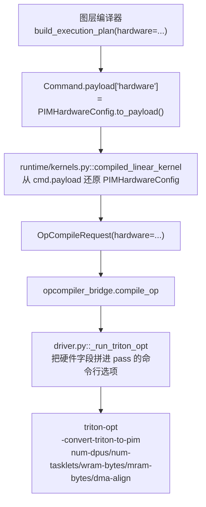
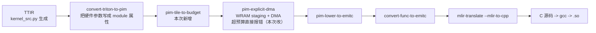
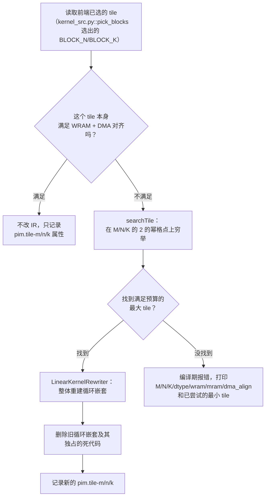
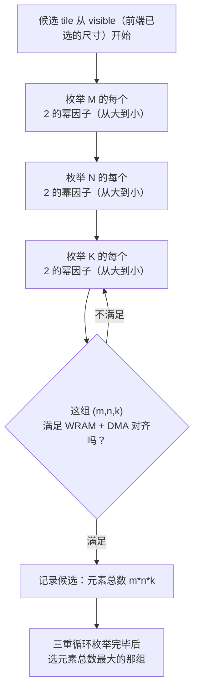
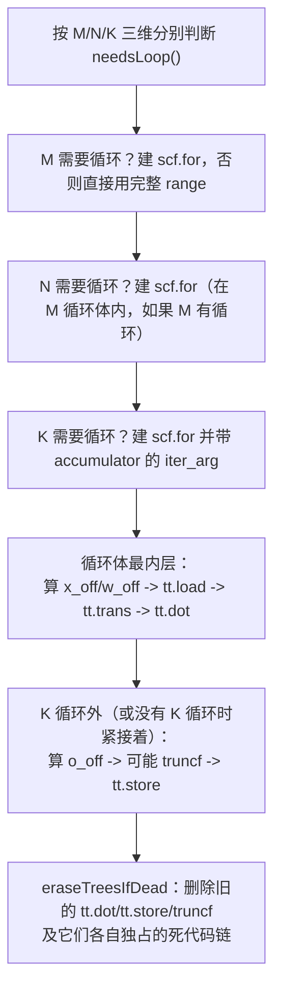

# PIM 预算感知循环分块（2026-08-28）

本文记录本次改动如何在 `pim mlir -> C` 之前新增一个"预算感知循环分块"pass，
把硬件尺寸（DPU 数量、WRAM/MRAM 容量、DMA 对齐要求）从图层编译器显式传给
算子编译器，并让算子编译器在预算不够时**真正改写循环分块**，而不是简单
报错或者按 shape 偷偷放大预算绕过限制。文档以当前工作区代码为准，重点
说明：

- 本次到底新增了什么能力，解决什么问题；
- 两个仓库分别改了哪些文件、哪些函数、哪些关键结构体；
- 原理是什么，为什么这样设计；
- 现在的验证证据、范围边界、已知问题、常用命令。

> 术语说明：本文中"tile"指一次搬进 WRAM 参与计算的一小块数据（比如
> `M x K` 矩阵里的一个 `tile_m x tile_k` 子块）；"WRAM"是每个 DPU 内部
> 容量很小、但访问快的暂存内存，"MRAM"是每个 DPU 容量大、但访问慢的主存。
> 存算一体芯片做矩阵乘法时必须先把数据从 MRAM 搬一小块到 WRAM，算完再搬
> 下一块，这个"搬多大一块"的决策就是"循环分块"。

## 1. 本次修改概述

### 1.1 改动前的问题

改动前，`opcompiler_bridge/driver.py` 里有一个函数 `_wram_budget`，它不是
从硬件真实容量算预算，而是**按 shape 反推**：先假设一份自己内部选定的 tile
尺寸，算出这份 tile 要用多少字节，然后把预算"放大到刚好够用（外加一倍
余量）"。这等于说，不管真实硬件的 WRAM 有多大，`driver.py` 永远都会算出
一个"正好够用"的假预算——**从未真正测试过"WRAM 装不下会怎样"**。

同时，FlagTree 侧的 `pim-explicit-dma` pass 发现 WRAM 用量超预算时只是
`emitWarning`（警告），不阻止继续编译——即使真的传入一个偏小的预算，编译
也不会失败，产物照样生成，只是留下一条会被忽略的警告文本。

这两个问题叠加的后果：**循环分块这件事在硬件尺寸这个维度上完全没有被
验证过**。图层编译器传下来的硬件尺寸信息，实际上从未真正影响过算子编译器
生成的代码结构。

### 1.2 本次实现的能力

| 能力 | 状态 | 证据文件 |
| --- | --- | --- |
| 硬件尺寸契约：DPU 数、WRAM/MRAM 容量、DMA 对齐从图层编译器显式传给算子编译器 | 已实现 | `contracts/op_contract.py`、`runtime/exec_plan_gen.py`、`runtime/kernels.py` |
| FlagTree 新增 `pim-tile-to-budget` pass，在 `pim-explicit-dma` 之前跑 | 已实现 | `FlagTree/lib/Dialect/TritonPIM/Transforms/TileToBudget.cpp` |
| 预算不够时穷举搜索一个更小的合法 tile（2 的幂、WRAM 装得下、DMA 对齐） | 已实现 | 同上，`searchTile` |
| 找到更小 tile 后**真正改写 IR**（重建循环嵌套，不是只报错） | 已实现 | 同上，`LinearKernelRewriter` |
| M/N/K 三个维度都支持分块（不是只有 N/K，M 目前恒为 1 但机制通用） | 已实现 | 同上，见 `tile_to_budget_m_split.mlir` |
| WRAM 超预算从"警告"改成"编译期硬失败" | 已实现 | `FlagTree/lib/Dialect/TritonPIM/Transforms/ExplicitDMA.cpp` |
| `driver.py` 不再按 shape 反推 WRAM 预算，改用硬件契约里的真实值 | 已实现 | `opcompiler_bridge/driver.py`（删除 `_wram_budget`） |
| 真实 llama2-7b o_proj 形状下端到端验证分块改写路径 | 已实现 | `tests/test_opcompiler_linear.py` |

### 1.3 本次没有实现的能力

| 能力 | 状态 | 原因 |
| --- | --- | --- |
| 非 2 的幂 shape 的 padding | 未实现 | 第一期只处理 2 的幂，找不到合法 tile 直接失败或走现有 NumPy fallback |
| 图编译器根据分块结果反过来调整图切分 | 未实现 | MRAM 装不下仍然由图侧内存规划直接报错，属于更上层的决策 |
| `genesim_bridge` 读取新增的 `pim.tile-*`/`pim.mram-bytes`/`pim.dma-align` 属性 | 未实现 | 问题 4（成本桥接）那条支路还停在旧签名，见"9. 已知问题"第 3 条 |
| `kernel_src.py`（Python 前端）主动为大 M 生成分块循环 | 未实现 | 前端至今只在 N/K 方向切循环，M 恒为 1；`pim-tile-to-budget` 接到需要 M 分块的输入时能正确处理，但没有前端会主动产出这种输入 |
| per-op 不同 tasklet 数、代价模型驱动的分块策略 | 未实现 | 全图统一一个 tasklet 数，属于第二阶段范畴 |

## 2. 总体流程

### 2.1 硬件契约的传递路径



### 2.2 算子编译 pass 链（本次新增的一环）



`pim-tile-to-budget` 插在 `convert-triton-to-pim` 和 `pim-explicit-dma`
之间——前者先把硬件尺寸写成 module 属性，后者按最终确定的 tile 生成真正的
WRAM staging 代码，中间这一步负责"tile 到底是多大"这个决策。

### 2.3 `pim-tile-to-budget` 内部决策流程



## 3. 修改文件总览

### 3.1 `flagos-pim-compiler` 仓库

| 文件 | 改动类型 | 内容 |
| --- | --- | --- |
| `contracts/op_contract.py` | 修改 | 新增 `PIMHardwareConfig` 结构体，`OpCompileRequest` 加 `hardware` 必填字段 |
| `runtime/exec_plan_gen.py` | 修改 | `build_execution_plan` 加 `hardware` 必填参数，写进每条 `launch` 命令的 payload |
| `runtime/kernels.py` | 修改 | `compiled_linear_kernel` 从 `cmd.payload` 还原硬件契约，构造 `OpCompileRequest` |
| `opcompiler_bridge/driver.py` | 修改 | 删除按 shape 反推预算的 `_wram_budget`；pass 链加 `-pim-tile-to-budget`；硬件参数拼进命令行；缓存 key 带上硬件字段 |
| `tests/test_op_contract.py` | 新增 | `PIMHardwareConfig` 的校验逻辑单测 |
| `tests/test_exec_plan_gen.py` | 修改 | 补 `hardware` 参数的测试用例 |
| `tests/test_opcompiler_linear.py` | 修改 | 新增两个"真正触发分块改写"的数值对拍用例 |
| `tests/test_executor_llama2_7b.py`、`tests/test_decode_loop_llama2_7b.py`、`tests/test_concurrency_llama2_7b.py`、`tests/test_natural_prompt_llama2_7b.py`、`tests/test_opcompiler_e2e_llama2_7b.py` | 修改 | 补 `hardware` 参数；修正 `dma_align` 取值（原来误用了 MRAM 页对齐的数值） |
| `docs/opcompiler_bridge-20260825.md` | 修改 | 补充新 pass 在流程图里的位置和作用 |

### 3.2 `FlagTree` 仓库

| 文件 | 改动类型 | 内容 |
| --- | --- | --- |
| `lib/Dialect/TritonPIM/Transforms/TileToBudget.cpp` | **新增** | 本次核心：预算搜索 + IR 重写，852 行 |
| `include/triton/Dialect/TritonPIM/Transforms/Passes.td` | 修改 | 注册 `pim-tile-to-budget` pass |
| `lib/Dialect/TritonPIM/Transforms/CMakeLists.txt` | 修改 | 把新文件加进构建 |
| `include/triton/Conversion/TritonToTritonPIM/Passes.td` | 修改 | `convert-triton-to-pim` 新增 `mram-bytes`/`dma-align` 两个 pass 选项 |
| `lib/Conversion/TritonToTritonPIM/TritonToTritonPIMPass.cpp` | 修改 | 把新增两个选项写成 module 属性，校验为正数 |
| `include/triton/Dialect/TritonPIM/IR/Dialect.h` | 修改 | 新增属性名常量、`maybeLookupMramBytes`/`maybeLookupDmaAlign` 查询函数声明 |
| `lib/Dialect/TritonPIM/IR/Dialect.cpp` | 修改 | 实现上述查询函数；**修了一个已存在的 bug**（见第 6 节） |
| `lib/Dialect/TritonPIM/Transforms/ExplicitDMA.cpp` | 修改 | WRAM 超预算从 `emitWarning` 改成 `emitError` + `signalPassFailure` |
| `python/src/passes.cc` | 修改 | Python 绑定加 `mram_bytes`/`dma_align` 两个参数，新增 `add_tile_to_budget` 绑定 |
| `test/Conversion/triton_to_pim.mlir`、`test/Dialect/TritonPIM/explicit_dma.mlir` | 修改 | 补新增属性的 FileCheck 断言 |
| `test/Dialect/TritonPIM/tile_to_budget_negative.mlir` | **新增** | 反例测试：预算缺失/超预算/对齐不满足 |
| `test/Dialect/TritonPIM/tile_to_budget_small_wram.mlir` | **新增** | 大 tile 在小 WRAM 下必须报错、大 WRAM 下正常通过 |
| `test/Dialect/TritonPIM/tile_to_budget_linear.mlir` | **新增** | 前端 tile 本来就满足预算的情况（不触发改写） |
| `test/Dialect/TritonPIM/tile_to_budget_m_split.mlir` | **新增** | M 维度也需要分块的情况（覆盖 M/N/K 全维度改写） |

## 4. 图编译器侧实现细节

### 4.1 硬件契约结构体

```python
@dataclass(frozen=True)
class PIMHardwareConfig:
    num_dpus: int              # 参与计算的 DPU 数量，必须是 2 的幂
    num_tasklets: int          # 每个 DPU 内 tasklet 数量
    mram_bytes_per_dpu: int    # 单 DPU MRAM 总容量
    wram_bytes_per_dpu: int    # 单 DPU WRAM 总容量
    dma_align: int             # DMA 起始地址和长度的对齐要求，必须是 2 的幂
```

字段在 `__post_init__` 里全部校验为正整数，`num_dpus`/`dma_align` 额外要求
是 2 的幂——不满足直接在构造时抛异常，不允许"先构造出一个非法配置、用到
才报错"这种延迟失败。`to_payload()`/`from_payload()` 负责在
`Command.payload`（一份 JSON 兼容的字典）里来回转换，因为 `Command` 本身
要能被序列化传递。

这个结构体是**图层编译器和算子编译器之间唯一的硬件尺寸真源**：图层编译器
造一份，塞进每条 `launch` 命令，算子编译器从命令里读出来、构造
`OpCompileRequest`，再把里面每个字段翻译成 FlagTree pass 的命令行选项。
中间任何一层都不允许自己另外猜一份默认值来替代它。

### 4.2 `build_execution_plan` 怎么把契约写进命令

`runtime/exec_plan_gen.py::build_execution_plan` 新增了必填的 `hardware`
关键字参数，函数体第一件事就是校验
`hardware.num_tasklets == num_tasklets`（两个参数本该是同一个数字，分开
传是历史遗留，这里加校验防止两处不同步）。每条生成的 `launch` 命令，
`payload` 字典里都会多一个 `"hardware": hardware.to_payload()` 键。

### 4.3 `compiled_linear_kernel` 怎么用契约

`runtime/kernels.py::compiled_linear_kernel` 从 `cmd.payload["hardware"]`
用 `PIMHardwareConfig.from_payload` 还原出结构体，再连同 `arg_shapes`/
`dtype` 一起构造 `OpCompileRequest`，交给 `opcompiler_bridge.compile_op`。
进程内缓存的 key 也带上了 `hardware.to_payload()`——同一个 shape 换一套
硬件参数（比如换一个更小的 WRAM）必须重新编译，不能用旧产物。

### 4.4 `driver.py` 删掉了什么

改动前有一个 `_wram_budget(request)` 函数，逻辑是：拿三个 tile（x 的
`M x BLOCK_K`、w 的 `BLOCK_N x BLOCK_K`、输出的 `M x BLOCK_N`）算出字节数，
乘 2 留余量，再向上取到 2 的幂。这个数字**从未来自任何硬件配置**，纯粹是
"保证够用"的自我实现。本次直接删除这个函数，`_run_triton_opt` 改成从
`request.hardware.wram_bytes_per_dpu` 等字段取真实值，拼进
`-convert-triton-to-pim` 的命令行：

```text
-convert-triton-to-pim=target=pim:v1
  num-dpus=<hardware.num_dpus>
  num-tasklets=<hardware.num_tasklets>
  wram-bytes=<hardware.wram_bytes_per_dpu>
  mram-bytes=<hardware.mram_bytes_per_dpu>
  dma-align=<hardware.dma_align>
```

pass 链也从 `-pim-explicit-dma -pim-lower-to-emitc -convert-func-to-emitc`
变成 `-pim-tile-to-budget -pim-explicit-dma -pim-lower-to-emitc
-convert-func-to-emitc`。

## 5. FlagTree 侧：硬件属性怎么落到 module 上

`convert-triton-to-pim` pass 本来就会把 `num-dpus`/`num-tasklets`/
`wram-bytes` 三个选项写成 module 级属性（`pim.num-dpus` 等）。本次新增
`mram-bytes`/`dma-align` 两个选项，同样的做法写成 `pim.mram-bytes`/
`pim.dma-align`，并且在写之前校验三者（含原有的 `wram-bytes`）都是正数：

```cpp
if (wramBytes <= 0) { emitError(...); return signalPassFailure(); }
if (mramBytes <= 0) { emitError(...); return signalPassFailure(); }
if (dmaAlign <= 0)  { emitError(...); return signalPassFailure(); }
...
mod->setAttr(AttrMramBytesName, b.getI64IntegerAttr(mramBytes));
mod->setAttr(AttrDmaAlignName, b.getI32IntegerAttr(dmaAlign));
```

`mram-bytes` 用 `int64_t`（真实 MRAM 容量可能到 GB 级，`int32_t` 会溢出），
`dma-align` 用 `int32_t` 就够。`include/triton/Dialect/TritonPIM/IR/
Dialect.h` 新增两个查询函数 `maybeLookupMramBytes`/`maybeLookupDmaAlign`，
跟原有的 `maybeLookupWramBytes` 是同一套写法：返回 `nullopt` 表示"没找到
这个属性"，跟"属性存在但值是 0"区分开。

## 6. 一个先于本次任务发现并修复的既有 bug

在写新 pass 之前，`lib/Dialect/TritonPIM/IR/Dialect.cpp` 里有一个共享的
辅助函数：

```cpp
static std::optional<int64_t> lookupModuleIntAttr(Operation *op, StringRef name) {
  auto mod = op->getParentOfType<ModuleOp>();
  ...
}
```

`getParentOfType` 只往**严格意义上的祖先**里找，永远不会把 `op` 自己当成
结果。但 `pim-explicit-dma`（原有 pass）和新写的 `pim-tile-to-budget`
（本次新增）都是模块级 pass，调用这个函数时传的就是 `getOperation()`
——也就是模块自己。结果是：**每次查预算都返回 `nullopt`**，等价于"没有
配置任何预算"。

这个 bug 在原有 `pim-explicit-dma` 里被意外掩盖：超预算检查还有另一条独立
路径（`WRAMAllocOp` 的 verifier，直接对着分配操作本身检查，不走这个共享
函数），侥幸把问题挡住了，只是走的是完全不同的代码路径，没人注意到共享
函数本身是坏的。但本次新写的 `pim-tile-to-budget` 没有这条备用路径——直接
调用出来就是"编译期永远报缺配置错误"，因此在实现新 pass 的过程中把这个
既有 bug 暴露出来并修复：

```cpp
auto mod = isa<ModuleOp>(op) ? cast<ModuleOp>(op)
                              : op->getParentOfType<ModuleOp>();
```

先判断 `op` 本身是不是模块，是的话直接用，不是才往上找祖先。

## 7. FlagTree 侧核心实现：`TileToBudget.cpp`

### 7.1 关键结构体

#### `TileShape`

```cpp
struct TileShape { int64_t m = 0, n = 0, k = 0; };
```

三个整数，表示一次分块的 `M x N x K` 尺寸。全文件里既用来表示"当前可见的
tile"，也用来表示"整个算子未分块的完整规模"，靠上下文区分。

#### `TileDim`

```cpp
struct TileDim {
  int64_t tile;
  int64_t full;
  bool needsLoop() const { return tile < full; }
};
```

一个维度（M 或 N 或 K）的"分块尺寸 vs 完整尺寸"。`needsLoop()` 是整个
改写逻辑的开关：如果分块尺寸等于完整尺寸，说明这一维不需要切循环，一次
算完；只有分块尺寸小于完整尺寸时才需要真的建一个 `scf.for`。这是保证
"M=1（真实 llama2-7b decode 场景）时完全不多建一层空转循环"的关键设计。

#### `BuiltDim`

```cpp
struct BuiltDim {
  TileDim dim;
  scf::ForOp forOp;  // 如果这一维需要循环，这里是新建的循环；不需要就是空
  Value iv;          // 循环变量；不需要循环时为空
};
```

`buildOuterDim` 函数的返回值，告诉调用者"这一维到底有没有建循环、循环
变量是什么"，后续代码据此决定往哪里插入下一层的内容。

#### `LinearKernelRewriter`

整个改写逻辑的载体类，构造时传入要替换的 `tt.dot` 操作、完整规模
`full`、目标分块尺寸 `newTile`，以及 `numTasklets`/`numDpus`（构造新张量
类型的编码需要这两个数字）。对外只有两个方法：

- `analyze()`：定位这个 `tt.dot` 的输入指针（x、w）、输出指针、要替换的
  最外层操作范围，以及要不要在结果窄化成存储精度（`arith.truncf`）。
  任何识别不出来的模式直接报错返回，不猜测。
- `rewrite()`：真正调用一系列 `build*` 私有方法，按新的 tile 尺寸重建
  整套循环嵌套和 `tt.dot`，再删除旧的循环嵌套及其独占的死代码。

### 7.2 预算搜索：`searchTile`



之所以是三重穷举而不是"先缩 K，缩不下去再缩 N，最后缩 M"这种贪心单路径，
是因为贪心会**死锁**：假如缩小 K 到某个值之后，x 这块 buffer 的字节数正好
低于 DMA 对齐要求，贪心策略会卡在这里报失败——但换一个 N 的取值、配合
稍大一点的 K，可能存在别的合法组合。这不是理论上的担心，是拿真实
llama2-7b 的 o_proj 形状（`M=1, K=512, N=4096`）实测出来的：贪心策略在
这个形状上会漏掉本来存在的合法 tile。穷举法枚举的候选数量有限（每个维度
最多 `log2(维度大小)+1` 个候选，三个维度相乘也就几百个组合），性能上完全
可以接受。

选中的标准是"元素总数最多的那组"，即优先保留能塞进预算的最大 tile——
tile 越大，循环迭代次数越少，理论上更接近性能最优（虽然本次链路的目标是
数值正确、可编译，不是性能）。

### 7.3 IR 重写：`LinearKernelRewriter::rewrite()`



重建的每一条指令都严格照抄 `kernel_src.py`（Python 前端 Triton kernel）
产出的算子序列——不是另外设计一套等价但形状不同的写法。这一点很关键：
`pim-explicit-dma` 的地址分析（`traceBaseArg`）和 `pim-lower-to-emitc`
的偏移分析（`OffsetAnalysis`）都是靠"认出特定的算子序列模式"来证明一次
访存是规整的跨步搬运，序列形状变了这两个分析就会直接放弃，报错退出。
新建的每个张量类型都要带上跟原有类型一致的 `#pim.tasklet_tiled` 布局
编码——`tt.broadcast`/`arith.muli` 等算子要求参与运算的多个操作数编码
逐字段相等，编码不匹配会在 verifier 阶段报错；必要时插入
`pim.convert_layout` 把编码在两个不同布局之间转换，这个模式是从
`convert-triton-to-pim` 自己在真实 IR 上产出的转换序列里逐条对照出来的，
不是凭空设计。

### 7.4 死代码清理：为什么需要 `eraseTreesIfDead`

被替换的 `tt.dot` 往往不是孤零零一个操作：它的两个操作数各自经过一条
"从函数参数算出地址偏移"的算子链（`tt.expand_dims`/`tt.broadcast`/
`arith.muli`/`tt.addptr`/`tt.load`），输出结果也经过一条独立的地址偏移
链才到 `tt.store`。如果只删除 `tt.dot`/`tt.store` 这两个操作本身，两条
死代码链会原地留下——而 `pim-explicit-dma` 会把模块里**所有** `tt.load`/
`tt.store`（不管有没有被用到）都计入 WRAM 用量，留下的死代码会让 WRAM
预算检查算出一个偏大、偏离真实情况的数字。

`eraseTreesIfDead` 接受多个"根节点"（旧 `tt.dot`、旧 `tt.store`、可能
存在的旧 `truncf`），先把这些根节点作为一批统一删除，再沿着各自的操作数
往上追、只删那些已经变成"零使用且删除后无副作用"（`use_empty()` +
`wouldOpBeTriviallyDead`）的节点。这个函数是本次实现过程中经过三轮修正
才稳定下来的，具体教训见第 9 节。

## 8. 验证证据

### 8.1 FlagTree 侧 FileCheck 测试（14 项全过）

```bash
source /media/disk/fengjingge/src/flagOS/flagOS-installed/pytorch/env-pytorch.sh
TRITON_OPT=/media/disk/fengjingge/src/flagOS/flagOS-installed/flagTree-pim/build/flagtree-cmake/bin/triton-opt
FILECHECK=/media/disk/fengjingge/src/flagOS/flagOS-installed/flagTree/llvm-7d5de303/bin/FileCheck
cd /media/disk/fengjingge/src/flagOS/flagOS-installers/FlagTree

# 缺硬件配置、超预算、对齐不满足三种反例
$TRITON_OPT test/Dialect/TritonPIM/tile_to_budget_negative.mlir -pim-tile-to-budget 2>&1 \
  | $FILECHECK test/Dialect/TritonPIM/tile_to_budget_negative.mlir --check-prefix=MISSING

# 大 tile 小预算下无解必须报错；大预算下正常通过
$TRITON_OPT test/Dialect/TritonPIM/tile_to_budget_small_wram.mlir \
  -convert-triton-to-pim='target=pim:v1 num-dpus=1 num-tasklets=4 wram-bytes=128 mram-bytes=4294967296 dma-align=64' \
  -pim-tile-to-budget 2>&1 | $FILECHECK test/Dialect/TritonPIM/tile_to_budget_small_wram.mlir --check-prefix=OVER

# 前端 tile 本来就够用，不触发改写
$TRITON_OPT test/Dialect/TritonPIM/tile_to_budget_linear.mlir \
  -convert-triton-to-pim='target=pim:v1 num-dpus=1 num-tasklets=4 wram-bytes=65536 mram-bytes=4294967296 dma-align=64' \
  -pim-tile-to-budget 2>&1 | $FILECHECK test/Dialect/TritonPIM/tile_to_budget_linear.mlir --check-prefix=OK

# M 维度也要分块，走完整 pass 链到 EmitC
$TRITON_OPT test/Dialect/TritonPIM/tile_to_budget_m_split.mlir \
  -convert-triton-to-pim='target=pim:v1 num-dpus=1 num-tasklets=4 wram-bytes=32 mram-bytes=4294967296 dma-align=8' \
  -pim-tile-to-budget -pim-explicit-dma -pim-lower-to-emitc -convert-func-to-emitc 2>&1 \
  | $FILECHECK test/Dialect/TritonPIM/tile_to_budget_m_split.mlir --check-prefix=EMITC
```

以上加上原有的 `explicit_dma.mlir`/`triton_to_pim.mlir`/
`lower_to_emitc.mlir` 一共 14 项检查，全部通过，证明新 pass 没有破坏
任何既有行为。

### 8.2 Python 侧数值对拍测试（13 项全过）

```bash
source /media/disk/fengjingge/src/flagOS/flagOS-installed/pytorch/env-pytorch.sh
cd /media/disk/fengjingge/src/flagOS/flagos-pim-compiler
python -m pytest tests/test_opcompiler_linear.py -q
```

其中两项是本次新增、专门用来验证"分块改写不改变数值结果"：

- `test_compiled_linear_with_tight_wram_budget_triggers_tile_rewrite`：
  小 shape（`M=4,K=32,N=8`），故意给一个塞不下前端已选 tile 的 WRAM
  预算，逼真正触发改写（缩到 `K=8`），跟 torch 参考结果对拍。
- `test_compiled_linear_real_llama_shape_with_tight_wram_triggers_tile_rewrite`：
  真实 llama2-7b o_proj 形状（`M=1,K=512,N=4096`，float16），逼 N 从
  512 缩到 128，跟未触发改写的手写 NumPy 参考结果对拍，2% 相对容差内。

### 8.3 真实 llama2-7b 端到端回归

```bash
source /media/disk/fengjingge/src/flagOS/flagOS-installed/pytorch/env-pytorch.sh
cd /media/disk/fengjingge/src/flagOS/flagos-pim-compiler
python -m pytest tests/test_opcompiler_e2e_llama2_7b.py -q
```

3 个 tasklet 数配置全部通过，耗时约 14 分钟，跟改动前的基线耗时一致
（真实模型场景 WRAM 预算本来就够用，不会触发分块改写路径，这里只是确认
"预算够用时行为不变"这条回归）。

## 9. 已知问题和边界

### 9.1 dma_align 概念混用（已在本次修复，记录教训）

改动前 5 个 llama2-7b 测试文件（`test_executor_llama2_7b.py` 等）都把
`hw.align`（MRAM 里张量摆放的页对齐，来自 `memory/mem_planner.py`，数值
是 1024）直接当成 `dma_align`（WRAM tile 搬运的对齐要求）传给
`PIMHardwareConfig`。这是两个不同量级的概念：真实 tile 字节数（几十到
几万字节）几乎不可能整除 1024，一旦真正触发 `pim-tile-to-budget` 的
搜索/改写逻辑，会在 DMA 对齐检查上全线失败。本次统一改成显式的小数值
（如 64），并在代码注释里写明两者不能混用。

### 9.2 IR 重写只覆盖当前唯一支持的 `linear` 算子形态

`analyze()` 对输入 IR 的结构做了相当严格的模式匹配（一个 `tt.dot`，两个
操作数各自经过"至多一次 `tt.addptr`"，输出至多经过一次 `arith.truncf`
到达唯一一次 `tt.store`）。任何不符合这个形态的 IR（比如同一个 `tt.dot`
结果被多处消费、或者算子序列跟 `kernel_src.py` 写法不同）会被直接拒绝，
不会尝试猜测或强行改写。这是有意为之——宁可拒绝也不猜错，但意味着这个
pass 目前只服务于本仓库这一条 `linear` 垂直链路，不是通用的分块基础
设施。

### 9.3 `genesim_bridge` 没有跟进读取新属性

方案原本设想 `genesim_bridge`（问题 4 成本桥接）应该读取
`pim.mram-bytes`/`pim.dma-align`/`pim.tile-*` 这些新属性、把
`add_convert_to_pim` 的 Python 绑定调用换成新签名。这部分完全没有实现：
`genesim_bridge/flagtree_driver.py` 仍然调用旧的 5 参数签名（能跑通是因为
C++ 侧给新增两个参数设了默认值，不是真的传了硬件契约）。如果以后要让
GeneSim 的成本估算感知真实硬件预算和分块结果，需要单独一轮改动。

### 9.4 IR 重写调试过程中修复的三个内存管理错误（记录在此避免复现）

开发 `eraseTreesIfDead` 的过程中依次遇到并修复了三类崩溃/静默错误：

1. **悬空 Value 崩溃**：同一个 `Value` 被两个死操作共享作为操作数时会
   进入待删除队列两次，第一次删除后第二次再调用 `.getDefiningOp()`
   就是访问已释放内存。修法是用一个"已加入队列"的集合在**入队时**去重，
   而不是在出队后才检查。
2. **双重删除崩溃**：`store`（消费者）和 `root`（`tt.dot` 本身或其外层
   循环）各自独立清理时，如果两者的清理范围有重叠（比如 `store` 的操作
   数正好是 `root` 产出的一个中间结果），先删 `root` 会让 `store` 引用
   悬空指针。修法是把所有"根节点"收集成一批，统一按"消费者先于生产者"
   的顺序整体删除，删除阶段结束后才开始清理各自的死代码链，且清理阶段
   明确排除"其它根节点自己产出的值"，不让它们进入清理队列。
3. **死代码残留导致 WRAM 用量计算错误**：最初的实现只删除了 `tt.dot`
   本身，没有意识到它的两个操作数各有一条独立的地址计算链、输出也有
   一条独立的地址计算链，三条链子都要在删除主节点之后各自向上追溯清理，
   否则遗留的 `tt.load`/`tt.store` 会被 `pim-explicit-dma` 错误计入
   WRAM 用量。

这三个问题都是在给真实 llama2-7b 形状和手写 M 分块测试跑通全链路
（`-pim-tile-to-budget -pim-explicit-dma -pim-lower-to-emitc
-convert-func-to-emitc`）的过程中暴露出来的，只跑 `pim-tile-to-budget`
单个 pass 或只用小的、结构简单的输入测试都不会触发。

### 9.5 一个先于本次任务、被本次任务连带修复的既有 bug

见第 6 节：`lookupModuleIntAttr` 用 `getParentOfType<ModuleOp>()` 查询
硬件预算，对模块级 pass 自己调用自己（`op == getOperation()`）的场景
永远返回 `nullopt`。原有 `pim-explicit-dma` 因为有另一条独立校验路径
侥幸没暴露这个问题；新写的 `pim-tile-to-budget` 没有备用路径，直接把它
暴露出来。已在 `lib/Dialect/TritonPIM/IR/Dialect.cpp` 修复。

## 10. 常用验证命令

重新编译 FlagTree（改了 `TileToBudget.cpp` 或任何 pass 之后必须重新
编译才能生效）：

```bash
source /media/disk/fengjingge/src/flagOS/flagOS-installed/pytorch/env-pytorch.sh
cd /media/disk/fengjingge/src/flagOS/flagOS-installed/flagTree-pim/build/flagtree-cmake
ninja bin/triton-opt
```

单独跑某个 FileCheck 测试（不依赖 lit 环境，手动拼命令行）：

```bash
source /media/disk/fengjingge/src/flagOS/flagOS-installed/pytorch/env-pytorch.sh
TRITON_OPT=/media/disk/fengjingge/src/flagOS/flagOS-installed/flagTree-pim/build/flagtree-cmake/bin/triton-opt
FILECHECK=/media/disk/fengjingge/src/flagOS/flagOS-installed/flagTree/llvm-7d5de303/bin/FileCheck
cd /media/disk/fengjingge/src/flagOS/flagOS-installers/FlagTree
$TRITON_OPT test/Dialect/TritonPIM/tile_to_budget_m_split.mlir \
  -convert-triton-to-pim='target=pim:v1 num-dpus=1 num-tasklets=4 wram-bytes=32 mram-bytes=4294967296 dma-align=8' \
  -pim-tile-to-budget 2>&1 | $FILECHECK test/Dialect/TritonPIM/tile_to_budget_m_split.mlir --check-prefix=OK
```

Python 侧算子编译单测：

```bash
source /media/disk/fengjingge/src/flagOS/flagOS-installed/pytorch/env-pytorch.sh
cd /media/disk/fengjingge/src/flagOS/flagos-pim-compiler
python -m pytest tests/test_opcompiler_linear.py -v -s
```

真实 llama2-7b 端到端验证：

```bash
source /media/disk/fengjingge/src/flagOS/flagOS-installed/pytorch/env-pytorch.sh
cd /media/disk/fengjingge/src/flagOS/flagos-pim-compiler
python -m pytest tests/test_opcompiler_e2e_llama2_7b.py -v -s
```

## 11. 一句话结论

硬件尺寸（DPU 数、WRAM/MRAM 容量、DMA 对齐）现在是图层编译器到算子编译器
之间显式、必填、端到端验证过的契约；FlagTree 新增的 `pim-tile-to-budget`
pass 在预算不够时会在 M/N/K 三个维度上穷举搜索一个更小的合法 2 的幂
tile，并真正重建循环嵌套（不是简单报错或者悄悄放大预算），重建过程中
清理了旧循环留下的死代码；真实 llama2-7b 形状下已经验证过分块改写路径的
数值正确性和端到端可编译性，但 `genesim_bridge` 成本桥接、非 2 的幂
padding、图侧自动切分反馈这三块仍未覆盖。
