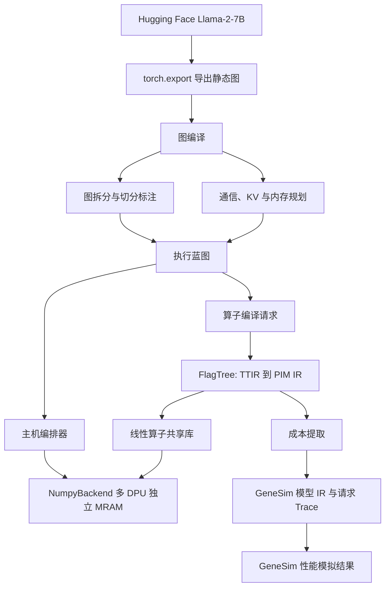
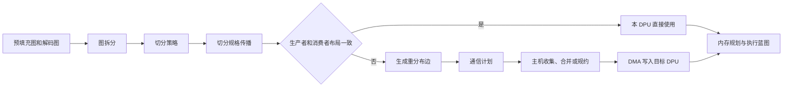
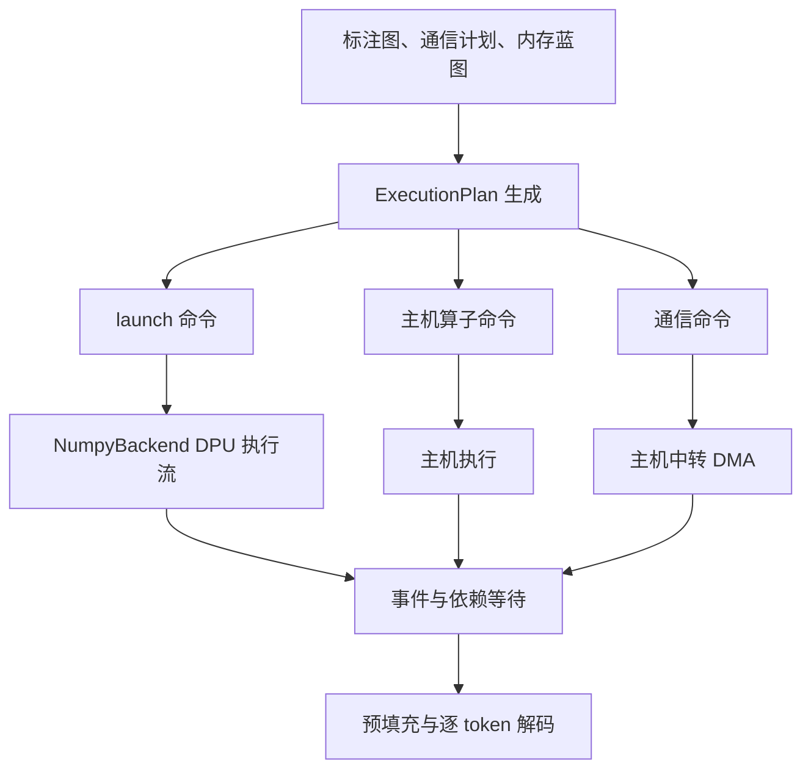
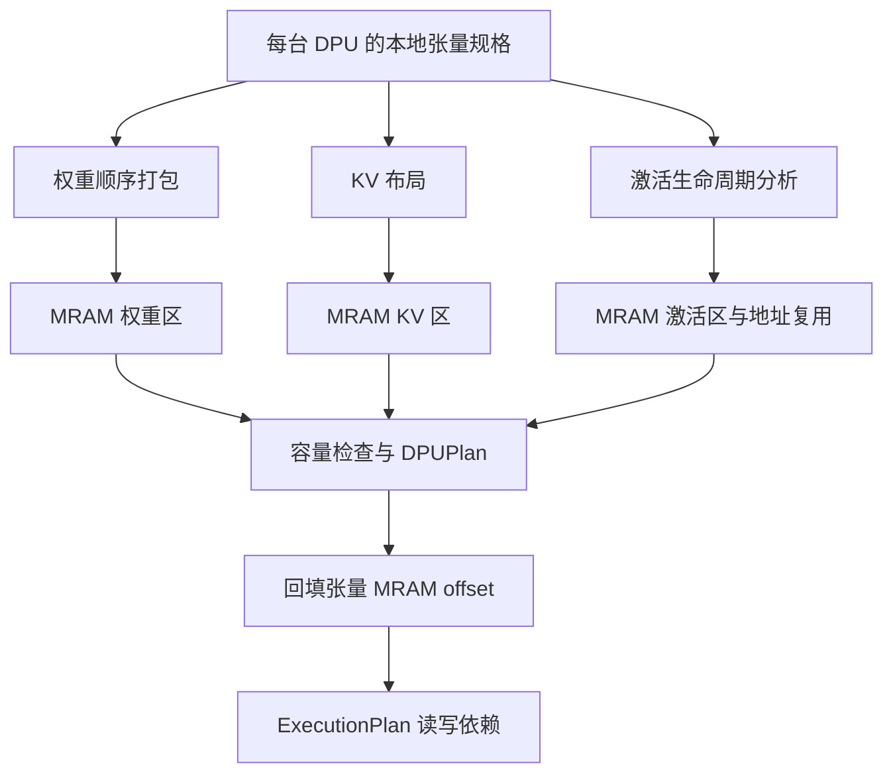
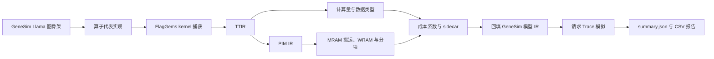

# 存算一体大模型推理编译器技术实现文档


| 项目     | 内容                                 |
| -------- | ------------------------------------ |
| 版本     | v0.0.3                               |
| 日期     | 2026-09-01                           |
| 目标模型 | Llama-2-7B                           |
| 本文范围 | 已实现的软件编译、仿真与数值验证能力 |

## 1. 概述

本项目面向多 DPU的存算一体推理场景。编译期将 Llama-2-7B 固定形状图转换为静态执行蓝图；运行期按蓝图在 `NumpyBackend` 上完成多 DPU 仿真执行，并可将 FlagTree 的算子信息回填至 GeneSim 进行性能模拟。

其中图功能执行验证后端为 `NumpyBackend`，算子编译产物为在该后端 MRAM 上运行的主机侧共享库。



### 1.1 源码范围

技术方案依据以下源码形成。


| 组件             | 源码位置                      | 本版纳入的实现                                                        |
| ---------------- | ----------------------------- | --------------------------------------------------------------------- |
| 图编译与主机编排 | `flagos-pim-compiler/`        | 静态图导出、图拆分、切分、通信、内存、KV、命令计划、NumpyBackend 执行 |
| 算子编译         | `flagOS-installers/FlagTree/` | PIM 方言、TTIR 到 PIM IR、显式 DMA、预算分块、多 tasklet EmitC 下降   |
| 性能模拟         | `genesim/`                    | Llama-2-7B 图构建、成本回填、编译器放置读取、PIM 执行时间估算         |
| 安装交付         | `flagOS-installers/`          | 安装脚本和推理环境                                                    |

## 2. 环境搭建

### 2.1 基础条件

目标系统为 Ubuntu 22.04 x86_64，必须安装可用的 NVIDIA 驱动并能执行 `nvidia-smi`。安装过程需要网络访问权限以下载源码、Python 依赖和 PyTorch 软件包；安装脚本不安装 NVIDIA 驱动，也不要求 root 权限。

```bash
nvidia-smi
git --version
```

### 2.2 安装 FlagOS 软件栈

在安装仓根目录按顺序执行四个脚本。第 3 步使用已授权、已下载的 Hugging Face 格式 `Llama-2-7b-hf` 模型；该模型需要用户自行在 Hugging Face 完成访问授权。

```bash
git clone https://github.com/jingge815/flagOS-installers.git
cd ~/flagOS-installers

bash 0-install-flagtree.sh
bash 1-install-flaggems.sh
bash 2-install-pytorch.sh

# 请将路径替换为实际的本地 Llama-2-7b-hf 模型目录。
bash 3-install-model-inference.sh \
  --model-path /path/to/Llama-2-7b-hf
```

四个脚本的职责和安装后的检查方式如下。默认安装根目录为 `/media/disk/fengjingge/src/flagOS/flagOS-installed/`。


| 步骤 | 脚本                           | 主要产物                                             | 检查命令                                                                                                                   |
| ---- | ------------------------------ | ---------------------------------------------------- | -------------------------------------------------------------------------------------------------------------------------- |
| 0    | `0-install-flagtree.sh`        | FlagTree、Triton、PIM 编译 pass                      | `source ../flagOS-installed/flagTree/env-flagtree.sh` 后运行 `python ../flagOS-installed/flagTree/examples/matmul_sm80.py` |
| 1    | `1-install-flaggems.sh`        | FlagGems 及 CUDA 算子验证环境                        | `source ../flagOS-installed/flagGems/env-flaggems.sh` 后导入 `flag_gems`                                                   |
| 2    | `2-install-pytorch.sh`         | PyTorch 2.9.1、CUDA 12.8 运行库及同步后的 PIM Triton | `python -c 'from triton._C.libtriton import passes; print(hasattr(passes, "pim"))'` 输出 `True`                            |
| 3    | `3-install-model-inference.sh` | Llama-2-7B 本地模型和 FlagGems 推理验证              | 查看`logs/inference-*.log` 中的 `inference_status: ok`                                                                     |

每次新开终端都需要加载 PyTorch 环境；否则无法保证 `torch` 和带 PIM pass 的 Triton 来自同一套安装。

```bash
source /path/flagOS-installed/pytorch/env-pytorch.sh
python - <<'PY'
import torch
from triton._C.libtriton import passes

print("torch:", torch.__version__)
print("cuda available:", torch.cuda.is_available())
print("pim passes:", hasattr(passes, "pim"))
PY
```

### 2.3 配置图编译器

图编译器通过环境变量读取站点路径。以下配置不修改源码，适用于当前机器及迁移后的环境；路径也可写入仓库根目录的 `paths.json`。

```bash
1.在path目录下载genesim，同时切换到fjg-dev分支
git clone https://github.com/jingge815/flagos-pim-compiler.git
cd /path/flagos-pim-compiler
source /path/flagOS-installed/pytorch/env-pytorch.sh


export PYTORCH_ENV_SCRIPT=/path/flagOS-installed/pytorch/env-pytorch.sh
export LLAMA2_7B_MODEL_DIR=/path/flagOS-installed/model-inference/models/Llama-2-7b-hf
export FLAGTREE_PREFIX=/path/flagOS-installed/flagTree
export GENESIM_ROOT=/path/genesim

python -c 'from genesim_bridge.paths import describe; print(describe())'
```

其中 PIM 硬件契约统一包含 DPU 数、每 DPU tasklet 数、MRAM 容量、WRAM 容量和 DMA 对齐值。默认配置为 8 个 DPU、每 DPU 16 个 tasklet、8 GiB MRAM、64 KiB WRAM、8 字节对齐；可通过 `FLAGTREE_PIM_*` 环境变量覆盖。

### 2.4 配置 GeneSim

GeneSim 复用上述 PyTorch 和 FlagTree 环境。首次进入 GeneSim 仓库时安装依赖；若环境脚本导致 `uv` 的用户目录安装不可用，按 GeneSim 文档安装 `uv` 后再将 `$HOME/.local/bin` 加入 `PATH`。

```bash
cd /media/disk/fengjingge/src/genesim
source /media/disk/fengjingge/src/flagOS/flagOS-installed/pytorch/env-pytorch.sh
./install.sh --skip-attacc

# 仅在提示 uv 不可用时执行。
curl -sSL https://astral.sh/uv/install.sh | sh
export PATH="$HOME/.local/bin:$PATH"
```

## 3. 实验验证

本节给出可重复执行的验证路径及通过判据。图编译器以单卡 PyTorch 或 Hugging Face 推理结果作为数值参考；GeneSim 以生成的 PIM IR、sidecar 和 `summary.json` 作为模拟闭环产物。

### 3.1 Numpy功能验证

Numpy是模拟存算一体架构的伪后端验证平台，用于检查图编译、通信、算子、编排器、内存管理和 Llama-2-7B 推理链路。当前仓库全量测试均已通过，表中列出对应测试项和验证结论。

git clone https://github.com/jingge815/flagos-pim-compiler.git
cd https://github.com/jingge815/flagos-pim-compiler.git
source /path/flagOS-installed/pytorch/env-pytorch.sh 
例如：source /media/disk/fengjingge/src/flagOS/flagOS-installed/pytorch/env-pytorch.sh 
python -m pytest tests/ -x -q


| 验证层次       | 验证点                                                                                                           | 文字描述                                                                                                   | 对应测试指标                                                                                                      | 验证结果 |
| -------------- | ---------------------------------------------------------------------------------------------------------------- | ---------------------------------------------------------------------------------------------------------- | ----------------------------------------------------------------------------------------------------------------- | -------- |
| 基础契约       | `tests/test_op_contract.py`、`tests/test_paths.py`                                                               | 检查算子编译请求、硬件参数、路径配置和数据结构契约。                                                       | 编译、调度、通信、内存等模块稳定运行。                                                                            | 通过     |
| 图拆分         | `tests/test_partition.py`                                                                                        | 验证严格图导出、算子白名单识别、DPU/主机节点标注和连通分区划分。                                           | 模型导出过程无图中断，算子分组符合预期规则；实现图计算分割功能，可配置不同设备计算。                              | 通过     |
| 切分传播       | `tests/test_spec_prop.py`、`tests/test_spec_prop_llama2_7b.py`                                                   | 验证张量、流水和混合策略下的分片布局、层归属、完整图标注及重分布边生成。                                   | 中间张量分布形态推导结果与预期切分方案一致；全图标注完整、无缺失、无逻辑冲突。                                    | 通过     |
| 切分策略       | `tests/test_strategy.py`、`tests/test_strategy_sweep.py`、`tests/test_strategy_llama2_7b.py`                     | 验证合法策略枚举、DPU 映射、跨段边以及不同策略的推理结果一致性。                                           | 实现图计算分割功能，可配置不同设备计算。                                                                          | 通过     |
| DPU 软件接口   | `tests/test_dpu_sdk.py`                                                                                          | 验证 DPU 分配、独立 MRAM、DMA、广播、程序装载和同步接口。                                                  | 多 DPU 独立地址空间模拟生效，无隐式数据共享。                                                                     | 通过     |
| Numpy 后端     | `tests/test_hal_numpy.py`                                                                                        | 验证异步命令、事件等待、多 DPU 独立地址空间和 tasklet 访问冲突检查。                                       | 多 DPU 独立地址空间模拟生效，无隐式数据共享。                                                                     | 通过     |
| Numpy 算子     | `tests/test_kernels.py`                                                                                          | 验证线性、加法、乘法和双曲正切等算子与参考结果逐元素一致。                                                 | 编译、调度、通信、内存等模块稳定运行。                                                                            | 通过     |
| 通信计划       | `tests/test_comm_plan.py`                                                                                        | 验证重分布边到 DMA 分段、地址计算、批量传输和通信成本统计。                                                | 可准确识别归约、收集等数据重分布场景。                                                                            | 通过     |
| 通信执行       | `tests/test_comm_lowering.py`、`tests/test_comm_llama2_7b.py`                                                    | 验证主机中转的规约、聚合、重分片、散播及 Llama-2-7B 通信数值对拍。                                         | 可准确识别并正确执行归约、收集等数据重分布场景。                                                                  | 通过     |
| KV 缓存布局    | `tests/test_kv_layout.py`、`tests/test_kv_layout_llama2_7b.py`                                                   | 验证 KV 区布局、位置访问、预填充写入、跨解码步读取和解码掩码。                                             | KV 张量无冗余重分布边，常驻属性生效；KV 缓存跨解码步稳定驻留，解码掩码生效。                                      | 通过     |
| 内存规划       | `tests/test_mem_planner.py`、`tests/test_mem_planner_llama2_7b.py`                                               | 验证权重/KV/激活三区规划、生命周期复用、地址不重叠和容量约束。                                             | 内存区域无重叠、无溢出，单 DPU 容量校验通过。                                                                     | 通过     |
| 执行计划       | `tests/test_exec_plan_gen.py`                                                                                    | 验证 launch、主机算子和通信命令的读写依赖、等待关系及硬件参数传递。                                        | 编排器可自动调度多 DPU 执行。                                                                                     | 通过     |
| 主机编排与解码 | `tests/test_executor_llama2_7b.py`、`tests/test_natural_prompt_llama2_7b.py`、`tests/test_strategy_llama2_7b.py` | 验证 Llama-2-7B 预填充、逐 token 自回归解码、贪心采样、自然语言提示词、KV 字节和不同策略下的参考结果对拍。 | 在 GPU 环境完成大模型图导出和参考推理，并在 Numpy 仿真后端正常输出 Llama-2-7B token；LLaMA 2 模型正常自回归解码。 | 通过     |
| 并发执行       | `tests/test_concurrency_llama2_7b.py`                                                                            | 验证无依赖 DPU 命令可并发执行，有依赖命令按等待关系执行。                                                  | 编排器可自动调度多 DPU 执行。                                                                                     | 通过     |
| 算子编译桥接   | `tests/test_opcompiler_linear.py`、`tests/test_opcompiler_e2e_llama2_7b.py`                                      | 验证单 DPU`linear` 从 TTIR、PIM IR 到共享库的编译链，以及编译产物与 NumPy/PyTorch 的一致性。               | 单 DPU 算子可正常编译。                                                                                           | 通过     |
| 放置导出       | `tests/test_placement_export.py`                                                                                 | 验证图编译器将算子与 DPU 放置关系导出为 GeneSim 可读取的旁路数据。                                         | 图编译结果可传递至模拟器端，支撑后续调度与代价评估。                                                              | 通过     |
| 测试报告       | `tests/test_pytest_report.py`                                                                                    | 验证测试结果报告能够记录通过、失败、未执行状态及调用阶段耗时。                                             | 编译、调度、通信、内存等模块稳定运行。                                                                            | 通过     |
| 全量回归       | `tests/`                                                                                                         | 覆盖上述图编译、通信、后端、算子、内存、编排及 Llama-2-7B 端到端路径。                                     | 编译、调度、通信、内存等模块稳定运行。                                                                            | 通过     |

### 3.2 GeneSim Llama-2-7B 模拟验证

以下流程将本地 Llama-2-7B 配置生成 GeneSim 图骨架，从huggingface Llama-2-7B模型加载，到编译器，进而到模拟。具体参照genesim/docs/llama-2.md文件，预期输出Llama-2-7B仿真数据。

```bash
# 1. 生成 GeneSim 图骨架。
python scripts/model_parser.py \
  --model_name /path/flagOS-installed/model-inference/models/Llama-2-7b-hf \
  --output models/llama2_7b.ir

例如：
python scripts/model_parser.py \
  --model_name /media/disk/fengjingge/src/flagOS/flagOS-installed/model-inference/models/Llama-2-7b-hf \
  --output models/llama2_7b.ir


# 2. 生成 10 条可复现实验请求。
./run.sh --trace --synthetic --seed 0 --num_requests 10 \
  --output traces/llama2_7b.trace

# 3. 从 FlagTree PIM IR 提取成本并回填模型 IR。
python scripts/refine_ir_with_flagtree.py \
  --ir models/llama2_7b.ir \
  --out-ir models/llama2_7b_pimir.ir \
  --sidecar models/llama2_7b_pimir_extensions.json \
  --seq-len 128 --ir-level pimir

# 4. 使用默认 sim.yaml 执行模拟。
./run.sh
```


| 产物             | 位置                                     | 含义                                         |
| ---------------- | ---------------------------------------- | -------------------------------------------- |
| GeneSim 模型图   | `models/llama2_7b_pimir.ir`              | 已回填算子成本的 Llama-2-7B 模型 IR          |
| PIM 成本 sidecar | `models/llama2_7b_pimir_extensions.json` | PIM kernel、MRAM 搬运、WRAM 使用量和分块信息 |
| 请求 Trace       | `traces/llama2_7b.trace`                 | 固定随机种子生成的 10 条请求                 |
| 模拟汇总         | `results/summary.json`                   | 已完成请求数和系统级统计结果                 |

#### GeneSim 测试指标

GeneSim 表覆盖模型 IR 的生成、保存和加载，PIM IR 成本解析，以及请求 Trace 驱动的仿真输出。该表与第 3.1 节分开列示，避免将性能模拟能力混入 Numpy 功能验证。


| 验证层次              | 验证点                                                                                                   | 文字描述                                                                                         | 对应测试指标                                                     | 验证结果 |
| --------------------- | -------------------------------------------------------------------------------------------------------- | ------------------------------------------------------------------------------------------------ | ---------------------------------------------------------------- | -------- |
| 模型 IR 生成与复现    | `genesim/scripts/model_parser.py`、`genesim/scripts/test_model_ir.py`、`tests/test_genesim_bridge.py`    | 从 Llama-2-7B 配置生成模型 IR；模型 IR 支持保存、加载，成本回填后保持算子、依赖和子图结构不变。  | 模型 IR 可在模拟器端完整存储和复现（dump/serialize/replay）。    | 通过     |
| PIM IR 解析与成本回填 | `genesim/scripts/refine_ir_with_flagtree.py`、`tests/test_genesim_bridge.py`                             | 解析 TTIR/PIM IR 的浮点运算量、MRAM 搬运量、WRAM 使用量和分块信息，并写入模型 IR 与 sidecar。    | GeneSim 可正常解析 PIM MLIR 产物；LLaMA 2 模型模拟代价估计正常。 | 通过     |
| 编译器放置与 PIM 调度 | `tests/test_placement_export.py`、`genesim/scripts/test_compiler_placement.py`                           | 将图编译器导出的算子-DPU 放置关系写入 sidecar，GeneSim 调度器读取该结果并绑定 PIM 资源。         | 编译、调度、通信、内存等模块稳定运行。                           | 通过     |
| 请求 Trace 与仿真输出 | `genesim/scripts/test_trace_ir.py`、`genesim/scripts/test_pipeline_execution.py`、`results/summary.json` | 生成、保存和读取请求 Trace；对 Llama-2-7B PIM IR 执行请求级模拟，输出汇总 JSON 和详细 CSV 数据。 | GeneSim 可正常输出仿真数据。                                     | 通过     |

## 4. 技术方案

### 4.1 图编译与通信

图编译器将 Llama-2-7B 导出为预填充图和解码图两张固定形状静态图。它在编译期决定节点归属、分片布局、跨 DPU 数据搬运和本地 MRAM 地址，运行期不再重新做切分决策。



图拆分将当前可下沉的 `linear`、`addmm`、`add`、`mul`等节点标记为 DPU 节点，其余节点保留在主机。切分传播以 `PIMTensorSpec` 记录每个张量在每台 DPU 上的本地形状、范围和地址，并支持张量并行、流水并行及二者组合。


| 目录或文件           | 子功能                                        | 作用                                                            |
| -------------------- | --------------------------------------------- | --------------------------------------------------------------- |
| `contracts/`         | `PIMTensorSpec`、`RedistributeEdge`、图元数据 | 定义跨模块共用的张量、分片和重分布契约                          |
| `graph/partition.py` | 图拆分                                        | 按可下沉算子白名单标注 DPU 节点和连通分区                       |
| `graph/strategy.py`  | 切分策略                                      | 表示张量、流水和混合切分时的层与 DPU 对应关系                   |
| `graph/spec_prop.py` | 切分传播                                      | 推导`Shard`、`Replicate`、`Partial` 布局并生成重分布边          |
| `comm/plan.py`       | 通信计划                                      | 将重分布边展开为字节精确的收集和写回 DMA 段                     |
| `comm/lowering.py`   | 通信执行                                      | 通过主机完成`all_reduce`、`all_gather`、`all_to_all`、`scatter` |

### 4.2 算子编译器

算子编译器将本地 `linear` 算子的形状、数据类型和硬件参数转换为共享库。FlagTree 使用 PIM 方言表达 DPU、tasklet、MRAM、WRAM 和显式 DMA；共享库由 `NumpyBackend` 传入本地 MRAM 指针后原地读写结果。


`pim-explicit-dma` 将隐式读写改写为 WRAM 分配、MRAM 到 WRAM 搬运、tasklet 同步和 WRAM 读写；预算分块 pass 根据 M、N、K 与 WRAM 预算选择线性算子分块。当前算子桥接只编译 `linear`，仅支持 `float16`、`float32`，并要求展开后的 M、K、N 为 2 的幂且 K 不小于 16；不满足条件的线性算子保持由 NumPy 内核执行。


| 目录或文件                                              | 子功能       | 作用                                                   |
| ------------------------------------------------------- | ------------ | ------------------------------------------------------ |
| `FlagTree/include/triton/Dialect/TritonPIM/`            | PIM 方言定义 | 定义 tasklet 布局、MRAM/WRAM 描述符、DMA 和同步算子    |
| `FlagTree/include/triton/Conversion/TritonToTritonPIM/` | pass 声明    | 注册 TTIR 到 PIM IR 的转换接口                         |
| `FlagTree/lib/Conversion/TritonToTritonPIM/`            | IR 转换      | 给 Triton 张量加入 PIM 布局和硬件属性                  |
| `FlagTree/lib/Dialect/TritonPIM/Transforms/`            | PIM pass     | 实现显式 DMA、WRAM 预算分块和多 tasklet EmitC 下降     |
| `opcompiler_bridge/`                                    | 编译桥接     | 生成 Triton kernel、调用 pass 链、构建并缓存`.so`      |
| `runtime/kernels.py`                                    | 执行接入     | 对支持的`linear` 调用编译产物，其他情形转入 NumPy 内核 |

### 4.3 主机编排器与运行时

主机编排器只解释编译期产出的 `ExecutionPlan`，不在运行时重新判断设备映射或切分方式。每条命令携带读写地址和等待依赖，DPU 无依赖命令可在独立执行流中并发，跨 DPU 数据通过主机 DMA 中转。



预填充使用完整提示词图，解码使用单 token 图，两者共享 `DecodeState.valid_len` 和 KV 区。注意力节点的专用处理会写入当前 K/V、读取历史 K/V，并在主机侧完成 attention 计算，从而保证解码位置与缓存长度一致。


| 目录或文件                 | 子功能         | 作用                                                   |
| -------------------------- | -------------- | ------------------------------------------------------ |
| `runtime/compile.py`       | 统一编译入口   | 导出静态图并串联图、通信、内存和命令计划生成           |
| `runtime/exec_plan_gen.py` | 命令计划生成   | 将节点、DMA 段和地址访问展开为带依赖的`ExecutionPlan`  |
| `runtime/executor.py`      | 计划解释与解码 | 提交命令、管理`valid_len`，执行预填充和逐 token 解码   |
| `runtime/kernels.py`       | DPU 算子       | 提供线性和逐元素算子的 Numpy/编译产物执行入口          |
| `backend/hal_numpy.py`     | 运行时后端     | 提供每 DPU 独立 MRAM/WRAM、异步事件和 tasklet 冲突检查 |
| `backend/dpu_sdk.py`       | SDK 镜像       | 提供设备集合、DMA、广播、程序装载等接口的 NumPy 实现   |

### 4.4 内存管理与 KV 缓存

每台 DPU 的 MRAM 在编译期划分为权重区、KV 区和激活区，并对总容量进行检查。权重与 KV 地址由预填充图和解码图共享；激活区按生命周期复用地址，复用前的未完成读者会被转换为命令等待关系。



KV 缓存按层、注意力头和 token 位置定位，`PIMStaticKVCache` 直接对指定 DPU 的 MRAM 区域执行更新和读取。该布局同时覆盖预填充一次写入多位置和解码逐步写入一个位置的场景。


| 目录或文件                     | 子功能        | 作用                                              |
| ------------------------------ | ------------- | ------------------------------------------------- |
| `memory/kv_layout.py`          | KV 布局与访问 | 计算 K/V 区偏移、读写 tile、生成预填充与解码掩码  |
| `memory/mem_planner.py`        | 三区内存规划  | 打包权重、规划 KV、按生命周期复用激活区并检查容量 |
| `contracts/pim_tensor_spec.py` | 本地张量规格  | 保存每 DPU 的分片形状、范围和`mram_offset`        |
| `contracts/exec_plan.py`       | 地址访问描述  | 保存命令的读写区间和等待命令编号                  |

### 4.5 GeneSim 成本桥接与模拟

成本桥接从 FlagGems 的实际 kernel 启动中捕获 TTIR，并将其转换为 PIM IR。它从两类 IR 提取浮点运算、数据类型、MRAM 搬运、WRAM 使用量和分块信息，回填 GeneSim 模型 IR 后驱动请求级性能模拟。



桥接对预填充和解码两个代表点分别测量，并将结果拟合为 GeneSim 可使用的成本系数。GeneSim 读取可选的图编译放置 sidecar，将指定算子绑定到对应 PIM 资源；PIM GEMM 使用与放置阶段一致的 roofline 公式估计服务时间。


| 目录或文件                                   | 子功能                    | 作用                                                |
| -------------------------------------------- | ------------------------- | --------------------------------------------------- |
| `genesim_bridge/flagtree_driver.py`          | kernel 捕获和 PIM IR 下降 | 捕获 FlagGems kernel 的 TTIR、网格和标量参数        |
| `genesim_bridge/ir_cost.py`                  | IR 成本解析               | 统计 FLOPs、MRAM DMA 字节、WRAM 缓冲和分块属性      |
| `genesim_bridge/cost_extractor.py`           | 成本回填                  | 将测量值拟合为系数并写入 GeneSim IR 与 sidecar      |
| `genesim_bridge/placement_export.py`         | 放置导出                  | 输出图编译器选择的算子与 DPU 对应关系               |
| `genesim/scripts/refine_ir_with_flagtree.py` | GeneSim 入口              | 调用图编译器成本桥接，生成 TTIR 或 PIM IR 精化结果  |
| `genesim/src/scheduler/`、`genesim/src/vpu/` | 模拟调度与资源            | 读取编译器放置结果，完成 PIM 资源选择和执行时间估算 |

## 5. 当前交付能力小结


| 能力                        | 当前实现状态                     | 验证方式                                                      |
| --------------------------- | -------------------------------- | ------------------------------------------------------------- |
| 固定形状 Llama 图编译       | 已实现                           | 图拆分、切分传播和真实模型结构测试                            |
| 张量、流水和混合切分        | 已实现                           | 策略测试和跨段通信边检查                                      |
| 主机中转通信                | 已实现                           | DMA 段计划及 all-reduce、all-gather、all-to-all、scatter 对拍 |
| MRAM 规划与 KV 缓存         | 已实现                           | 地址不重叠、容量、KV 字节和 attention 对拍                    |
| 静态执行蓝图与解码          | 已实现                           | Llama-2-7B logits、令牌和 KV 与参考模型对拍                   |
| `linear` 算子编译桥接       | 已实现，受形状与数据类型范围限制 | `.so` 与 NumPy、PyTorch 数值对拍                              |
| FlagTree PIM IR 与预算分块  | 已实现                           | PIM IR、显式 DMA、WRAM 与分块信息检查                         |
| GeneSim Llama-2-7B 模拟闭环 | 已实现                           | PIM 成本 sidecar、Trace 和`summary.json` 检查                 |
