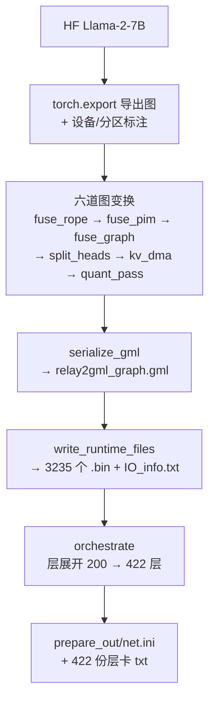
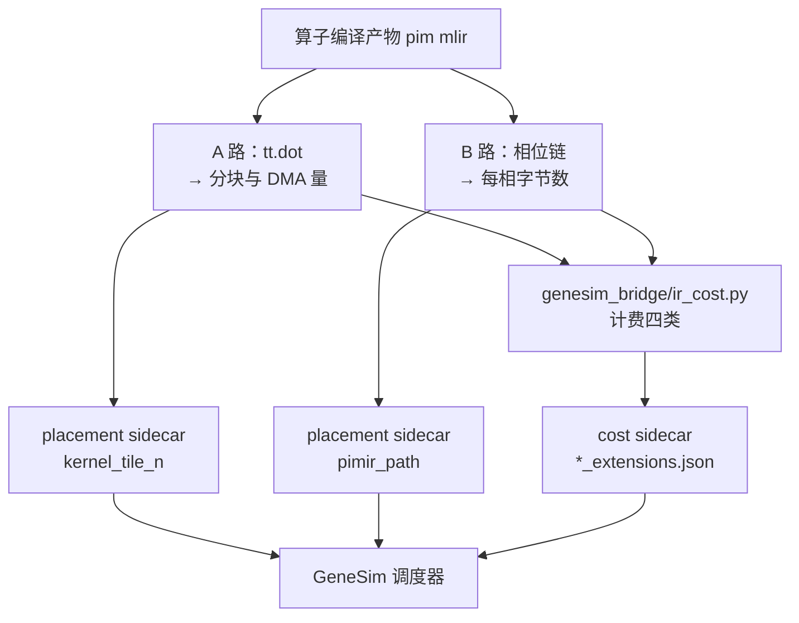

# 存算一体大模型推理编译器 v0.0.5

| 项目     | 内容                                   |
| -------- | -------------------------------------- |
| 版本     | v0.0.5                                 |
| 日期     | 2026-09-26                             |
| 目标模型 | Llama-2-7B                             |
| 基线     | `pim-compiler-v0.0.4`（`6a14609`，2026-09-14） |
| 本文范围 | v0.0.4 → v0.0.5 的变化、原理、安装与逐步验证 |

本文档接续 `pim-compiler-v0.0.4.md`，只写 **v0.0.4 → v0.0.5 的变化**；第 6、7 章是
面向新机器的完整操作清单（以 v0.0.4 第 5 章为底、按本版变化改写），照着做即可，
不必翻旧文档。技术方案的完整描述（图编译、算子编译、主机编排、内存管理、成本桥接的
设计原理）仍以 `pim-compiler-v0.0.3.md` 为准。原语层的完整说明见
`pimmlir-primitives-20260926.md`。

四条主线：

1. **兼容 Ubuntu 24.04**：系统 Python 探测不再写死版本号，24.04 上与 22.04 走同一条路径。
2. **支持 GML 生成**：新增 `gml_bridge/` 与 `orchestrator/` 两个顶层模块，从 torch 导出图
   直接产出 `relay2gml_graph.gml`、3235 个运行时 `.bin` 与 `prepare_out/`（`net.ini` + 422 份层卡）。
3. **扩充 PIMMLIR 原语**：方言侧 op 从 31 个增至 37 个，硬件字段从裸字符串收编为带校验器的
   结构化属性，三条消费路径（GML / numpy 假后端 / GeneSim 成本）全部接通。
4. **修复 7B 整网对拍**：SiLU 设备求值改回闭式、`aten.alias` 改回恒等传递、gather 索引按
   图上的 dtype 取宽度——三处都是本版开发中引入的回归，修完后 `llama2_7b` 组全绿
   （见 2.4、4.5、7.2）。

## 1. 版本与代码量

### 1.1 三个仓库

| 仓库 | v0.0.4 | v0.0.5 | 提交数 | 代码量 |
| --- | --- | --- | ---: | --- |
| flagos-pim-compiler | `6a14609`（2026-09-14，tag `pim-compiler-v0.0.4`） | `c4e947a` + 工作区改动 | 6 | 139 文件，+43653 / -286 |
| genesim | `281ebc2` | `9d419bc` + 工作区改动 | 3 | 25 文件，+1686 / -155 |
| FlagTree | `dc35b24df`（2026-08-30，v0.0.4 时未改动） | `ec55fb233`（2026-09-25）+ 工作区改动 | 5 | 38 文件，+11170 / -45 |

三仓各有一处工作区改动是本版的收尾修复（SiLU 闭式、alias 恒等、genesim 的 /dev/shm
重定向等），**交付前随 v0.0.5 一起提交**；本文档所有数字均以含这些改动的工作区实测为准。

v0.0.4 时 FlagTree 与 FlagGems 都没动（见 `pim-compiler-v0.0.4.md` 第 1 章）；本版
FlagTree 有 5 个提交，是本版四条主线里第三条（扩充 PIMMLIR 原语）的方言侧载体。

pim-compiler 的 +43653 行里，**新模块占 7268 行**（`gml_bridge/` 4067、`orchestrator/` 3015、
`quant/` 186），测试占 11649 行，文档占 14271 行。

### 1.2 新增的顶层模块

v0.0.4 时仓库有 17 个顶层条目，现在 20 个。新增的三个：

| 模块 | 文件数 | 行数 | 职责 |
| --- | --- | --- | --- |
| `gml_bridge/` | 7 | 4067 | 图 → GML 文本与运行时 `.bin` |
| `orchestrator/` | 9 | 3015 | 层展开、Layer ID 发号、L2 地址分配、`net.ini` 与层卡 |
| `quant/` | 3 | 186 | 权重与激活的量化 |

**没有顶层模块被删除。**

### 1.3 测试面

| 指标 | v0.0.4 | v0.0.5 |
| --- | --- | --- |
| `tests/` 下测试文件 | 30 | 70 |
| 收集到的用例 | 289 | 926 |
| 快速回归（`-k "not llama2_7b"`） | 247 passed | **883 passed, 1 skipped, 42 deselected** |

`docs/pim-compiler-v0.0.4.md` 第 5.0 节第五步写的「预期 714 passed」是 `537e345` 时点的
数字，本文档以下面的实测为准。

## 2. 能力变化

### 2.1 兼容 Ubuntu 24.04

**结论**：Ubuntu 22.04 与 24.04 走同一条安装路径，三个安装脚本在两个版本上都能跑完。
本仓侧只改了两处源码，共 +19 / -11 行。

| 卡点 | 22.04 上的样子 | 24.04 上的样子 | 改法 |
| --- | --- | --- | --- |
| Python 安装路径写死 | `python3.10` 与 `python-3.10.20` 是常量 | 系统 Python 是 3.12，但脚本用的是自带独立 Python，版本号仍来自安装目录 | 改为按 `python3.*` 通配探测 |
| 系统 Python 无 pip | 有 pip | 默认无 pip，且带 PEP 668 的 `EXTERNALLY-MANAGED` | 本版不再用系统 Python 装任何东西（模型下载那套 venv 步骤已随模型推理安装步骤一起删掉） |
| torch CPU wheel 不带 triton | CUDA wheel 自带 triton，可整目录覆盖 | CPU wheel 依赖里没有 triton，覆盖分支无从下手 | 安装脚本 2 新增「整体安装 FlagTree Triton + dist-info」分支 |

本仓改的两处都在「路径写死导致校验静默通过」这一类：

| 文件 | 改动 |
| --- | --- |
| `genesim_bridge/paths.py` | 删掉常量 `_NVIDIA_BACKEND_SUBPATH`（写死 `python3.10`），新增 `_flagtree_site_packages()` 按 `python3.*` 动态探测；命中数不为 1 时直接抛错并回显当前路径配置 |
| `scripts/export_gml.py` | 两处写死的参考产物绝对路径改为读 `paths.json`；**改前在别的机器上这两条校验恒为「跳过」，即静默通过** |

### 2.2 支持 GML 生成

v0.0.4 时本仓不产 GML，也不产 `prepare_out/`。v0.0.5 补齐了整条链：



关键产物与口径：

| 产物 | 名字与位置 | 口径 |
| --- | --- | --- |
| GML 文本 | `<out-dir>/relay2gml_graph.gml` | 完整第 1 层 204 节点 / 335 边，506248 字节；`--decode-block-only` 取纯 decode 块 200 节点 / 331 边，498509 字节 |
| 运行时文件 | `<out-dir>/*.bin` | 完整导出 3235 个 / 506.66 MB；decode 块 3184 个 / 240.34 MB |
| 图级 I/O 清单 | `<out-dir>/IO_info.txt` | 7 输入 3 输出的 node_id / dtype / shape / sf |
| 编排产物 | `<out-dir>/prepare_out/` | `net.ini` 422 行 + `txt_files/` 422 份层卡 |

### 2.3 扩充 PIMMLIR 原语

方言侧（FlagTree）op 从 **31 增至 37**：新增 6 个算子级 op，扩展 13 个既有 op，
另给 17 个算子级 op 统一加了四个共性字段。

| 类别 | 内容 |
| --- | --- |
| 新增 op（6 个） | `pim.dynamic_quant`、`pim.fpsu_scale`、`pim.kantor`、`pim.convert`、`pim.global_pool`、`pim.gather` |
| 扩展 op（13 个） | 主要是 `pim.matmul`（+11 字段）、`pim.eltwise`（定长改变长）、`pim.normalize`（eps 由属性改操作数）、`pim.kv_cache`（五种模式） |
| 新属性（8 个） | `#pim.phase_spec`、`#pim.fpsu_spec`、`#pim.kantor_spec`、`#pim.weight_binding`、`#pim.contraction`、`#pim.broadcast_spec`、`#pim.transpose_purpose`、`#pim.vpu_params` |
| 新枚举（13 个） | 其中 `FunctionalUnit` 由 4 值扩到 **9 值**（原先一个 `cstl` 代表六个硬件块，成本抽取分不出遍历类型） |

**最重要的一条**：硬件字段从**裸字符串**收编为**带校验器的 ODS 属性**。改前跨仓传值靠
`"pim.kantor-mode"` 这样的属性名正则匹配，任一侧改名则字段静默丢失、图照样合法跑完。

覆盖率判据是**集合相等**，不是「非零即可」：

| 判据 | 内容 |
| --- | --- |
| 发射侧 | 整份 `llama2_7b.ir` 上导出，覆盖到的助记符集合**恰好等于** 14 个 |
| 编译侧 | opcompiler 单测实际调 `compile_op` 的算子集合**恰好等于** 16 个（B 路 15 个 + A 路 `linear`） |
| 成本侧 | 14 个助记符逐个量一遍，算力类必须 `flops > 0`，搬运类必须 `mram_traffic_bytes > 0` |

### 2.4 修复 7B 整网对拍（本版开发中引入的三处回归）

`c4e947a`（分区白名单翻黑名单、SiLU 下设备）把三处问题带进整网对拍，
`llama2_7b` 组的 `test_executor_llama2_7b.py` 与 `test_strategy_llama2_7b.py` 全部失败。
修完后整组通过（实测见 7.2）。三处如下：

| 回归 | 现象 | 修法 |
| --- | --- | --- |
| SiLU 下设备后走 31 段弦线查表 | 单点误差很小，32 层残差累积后 logits 最大差 1.8、贪心解码错 1 位 | 设备求值改回闭式 `x/(1+exp(-x))`，`|x|` 超过 80 先夹住再算，避免 `expf` 溢出；numpy 镜像同一条公式 |
| `aten.alias` 接上 `pim.dynamic_quant` | fp16 量化成 int8 再按 fp16 的长度写回，读出来是 fp16 最大值（logits 最大差 396） | alias 改回恒等传递。量化是权重侧的事；图上 alias 只出现在因果掩码和一次 `mul` 别名，激活侧没有节点消费量化产物 |
| gather 索引强制读成 int32 | token id 在设备上是 int64，一个索引吃进相邻索引的字节，嵌入查到的全是错行 | 索引宽度按图上的 dtype 取 |

为什么「把表修好」走不通，实测数据见 4.5。

## 3. 技术原理

### 3.1 图变换的次序不能换

六道图变换有硬性的先后关系，写在 `gml_bridge/export.py::fuse_for_gml` 里：

| 次序 | 变换 | 为什么必须在这个位置 |
| --- | --- | --- |
| ① | `fuse_rope` | 必须最前。拆头之后再折 RoPE，节点数会翻 32 倍 |
| ② | `fuse_pim` | 要在通用融合 pass 之前，它先标注 PIM 专用语义 |
| ③ | `fuse_graph` | 通用「主算子 + 激活/池化」融合 |
| ④ | `split_heads` | 必须在前三道之后，否则融合块被拆散 |
| ⑤ | `kv_dma_pass` | 依赖拆头留下的头下标 |
| ⑥ | `quant_pass` | 规则依赖逐头角色 |

### 3.2 相位模型

「相位」是**属性**而不是算子，写在算子级 op 上：

```
#pim.phase_spec<index, bytes, unit, forceConsecutive, reads>
```

`reads` 表达的是**扇出**而非串行：动态量化的相 1（恒等表）与相 2（倒数）都读相 0。
串行化仍能产出能加载的图，只是倒数错 **256 倍**，而且不报错——所以由
`VerifyGmlContract.cpp` 按链强制。

三条标准链：动态量化 4 相、Softmax 5 相、RoPE 3 相。相位号是**同一条链内**的遍历序号，
不是函数级全局编号；找链时要穿过不带相位的中间算子，否则 Softmax 的稳定化 `x - max`
会把一条链拆成两段、相 0 变成缺号。

### 3.3 算子编译器的两条路


两条路**互不降级**：

- A 路产物缺 `pim.dma_*` 就报错，**不看它有没有 `tt.dot`**——逐元素核本来就没有 `tt.dot`，
  拿它当「这是 A 路」的代理会让没跑起来的 DMA 静默通过。
- B 路遇到没实现 pattern 的算子级 op 直接报错。否则每加一个 `pim.*` 都会在 C 里蒸发，
  而 numpy 对拍用的镜像照样通过——那是假绿。

### 3.4 运行时内核

`runtime/kernels.py` 的 aten 白名单从 **4 条扩到 34 条**，每个条目都有 numpy 镜像
（本环境下无 GPU 时的实际执行路径）。其中 15 个算子会真的调算子编译器编出 `.so`：

| 组 | 算子 |
| --- | --- |
| A 路 | `linear` |
| B 路（14 个） | `softmax`、`mask`、`gather`、`eltwise`、`matmul`、`convert`、`transpose`、`reshape`、`concat`、`normalize`、`rope`、`lut`、`kv_cache`、`split_heads` |

v0.0.5 早期 `aten.alias` 也走编译内核（`pim.dynamic_quant`），2.4 的整网对拍修复把它
改回恒等镜像，`dynamic_quant` 随之退出这张表。GML 管线的 DQ 相位模板不受影响，
仍在算子编译器里。

**回退契约**是这批改动里最要紧的一条：只有 `ToolchainUnavailable`（工具链不在位）
允许回退 numpy 镜像；算子编译器抛出的 `ValueError` / `RuntimeError` 一律原样上抛。
改前捕获的是三元组异常，导致「编译静默失败」时对拍仍然全绿。

### 3.5 成本如何进仿真



计费四类：算力 / 权值驻留搬运 / 视图类搬运 / 相位说明里的字节数。

改前 `ir_cost.py` 只认 `tt.dot` 与算术指令，整算子级助记符**一个都不认**，成本恒为 0
且不报错——仿真照常跑完、给出一个看起来合理的总耗时，只是那个数字是错的。

### 3.6 Ubuntu 24.04 适配的原理

`genesim_bridge/paths.py` 原来写死：

```python
_NVIDIA_BACKEND_SUBPATH = "python/lib/python3.10/site-packages/triton/backends/nvidia"
```

改成按 `python3.*` 通配探测，命中数不是 1 就抛错：

```python
def _flagtree_site_packages() -> Path:
    """flagTree 安装里 Python 的 site-packages 目录（python3.X 版本号动态探测）。"""
    lib_dir = flagtree_prefix() / "python" / "lib"
    matches = sorted(lib_dir.glob("python3.*"))
    if len(matches) != 1:
        raise RuntimeError(f"{lib_dir} 下应有且只有一个 python3.* 目录，"
                           f"实际找到 {len(matches)} 个：{matches}\n当前生效路径：\n{describe()}")
    return matches[0] / "site-packages"
```

**为什么不做静默兜底**：兜底会掩盖「装错了目录」这件事，而图编译器后面要用这里的
`include/cuda.h` 与 `bin/ptxas`，静默取错目录的后果是编译期出现难以定位的缺头文件错误。

### 3.7 SiLU 为什么改回闭式

Llama 的 SiLU 门控在 32 层里逐层累积，单点误差会被残差放大。设备侧 31 段弦线查表
与 torch 闭式在单点上差得极小，但整网对拍过不了：

| 求值方式 | logits 最大差 | 均值 | 贪心错位数 |
| --- | --- | --- | --- |
| 31 段弦线，定域 [-4, 4) | 1.86 | 0.157 | 1 |
| 域外改饱和（正侧返回 x，负侧返回 0） | 0.89 | 0.043 | 0 |
| 参考产物的真实表，按最优段取值 | 1.07 | 0.182 | 1 |
| 闭式 | 0.043 | 0.006 | 0 |

31 段是硬件格式的上限（Ceva-NeuPro-M 规范 4.3.3），要压到 0.2 以下需要约 480 段，
装不下；参考产物那张表的分段规则没能反推出来，即便按最优段取值也到不了 0.2。
所以设备求值改回闭式。**GML 里的 288 B 表仍按原样合成**（`contracts/gml_lut.py` 的
`synth_silu` 没动），变的只是设备求值不再读它。

## 4. 这一版修掉的问题

按主题聚类，每条都给出改法与判据。

### 4.1 静默失败

| 问题 | 后果 | 改法 |
| --- | --- | --- |
| 不认识的 `pim.*` 在 `ir_cost.py` 里记 0 成本 | 总耗时算小了但不报错 | 分「未识别」与「没有计费规则」两档留 `notes` |
| 编译失败被 `except (ValueError, NotImplementedError, RuntimeError)` 吞掉 | 「编译内核与镜像逐元素一致」在编译静默失败时也成立 | 新增 `ToolchainUnavailable`，只捕这一类 |
| EmitC 侧静默填默认 eps `1e-5` | IR 不带 eps → C 默认 1e-5 → numpy 镜像同默认 → 对拍结构上不可能发现 | `pim.normalize` 的 eps 改为**必填张量操作数** |
| 参考产物路径写死，校验恒「跳过」 | 非开发机上两项校验等于没做 | 改读 `paths.json`；配了就真校验 |

### 4.2 判据自身不可能失败（假绿）

| 问题 | 改法 |
| --- | --- |
| `idx` 从未生成却被标为「不适用」，覆盖率测试因此恒真 | 反向查找 `_stamp_idx`，把它移进已产出集 |
| 组反量化的定标因子是标量，精确算术里组边界与整行末尾相等 | `pim.matmul` 增加真操作数 `weightScales`，判据改用 2 的幂且一个元素都不饱和 |
| 覆盖率测试断言「恰好 5 个助记符」，把缺口固化成预期 | 扩到 14 个并改集合相等 |

### 4.3 跨仓与工具链

| 问题 | 改法 |
| --- | --- |
| `pim.kantor-mode` 是唯一还在跨仓传值的裸字符串属性，改名即静默失效 | 收编为 ODS 属性 `tailCardValue`，校验器只收 0（Q 路）或 3（K 路） |
| 进程内 `libtriton.so` 与 `triton-opt` 分别构建，行为不一致 | 新增 `_check_inprocess_matches_triton_opt()` 探针，不一致直接抛 |
| `pim.rope` 六个子块名与方案、参考、常量表三处都不一致 | 逐位核对统一 |
| `pim.kv_cache` 散写分支提前 `return success()`，绕过元素类型与容量两条共用校验 | 取消提前返回 |

### 4.4 执行路径

| 问题 | 改法 |
| --- | --- |
| 主机侧 37/75 个算子，其中 8 个内核按构造永不执行 | 分区判据从白名单翻转为**黑名单**；实测单层图 `placement = {'dpu': 64, 'host': 10}`，落主机的 10 个全是编译脚手架（元数据断言 ×6、`getitem` ×2、`arange` ×1、`wrap_with_set_grad_enabled` ×1），**没有一个「本可在设备上跑却退回主机」** |
| `spec_prop.py` 缺规则的设备算子静默退回主机 | 规则表从 5 项扩到 31 项，缺规则当场抛错 |
| SDPA 用模块级全局 `kv_specs` | 连续三种切分策略互相覆盖，解码结果错。改为把 KV 区域信息**冻进命令载荷** |
| `_cache_key` 漏 `out_dtype` | f16→i8 与 f16→f32 落到同一个 `.so`，`ctypes.CDLL` 按路径缓存句柄，第二次拿到第一份代码。补进缓存键 |
| B 路 `pim.kv_cache` 的缓存容量取了末维 | `[Tq, 4096]` 声明 4096 个元素，而一次搬 128×4096，校验器直接拦下，整条 B 路导出中断（见 8.1） |

### 4.5 整网对拍暴露的三处回归（本版内修掉）

三处回归是 4.4 第一条「白名单翻黑名单」的连带产物：SiLU 与 alias 随之下设备后，
整网对拍立刻变红。修法与判据：

| 回归 | 后果 | 改法 |
| --- | --- | --- |
| SiLU 走 31 段弦线查表 | 32 层累积后 logits 最大差 1.86、贪心解码错 1 位 | FlagTree `LowerPIMToEmitC.cpp` 的 `pim_lut_silu` 改闭式求值，`|x|` 超 80 先夹住；`runtime/kernels_pim.py` 的 numpy 镜像同一条公式 |
| `aten.alias` 走 `pim.dynamic_quant` | 半截 int8 字节按 fp16 读回，logits 最大差 396 | `runtime/kernels.py` 的 alias 内核改回恒等传递，删掉没人调用的 `_compiled_dynamic_quant` |
| gather 索引宽度写死 int32 | 嵌入查错行 | 索引宽度按 `cmd.payload["arg_dtypes"]` 取，`out_dtype` 补进编译缓存键 |

判据（`tests/test_opcompiler_ops.py`、`tests/test_quant_activations.py`、
`tests/test_kernels.py`、`tests/test_runtime_compiled_coverage.py`）：
SiLU 断言从「必须读表」改成「必须等于闭式」，alias 断言恒等，gather 断言按图上
dtype 查表。整网判据是 `llama2_7b` 组全绿（见 7.2）。

## 5. 环境与容量要求

| 项目 | 要求 |
| --- | --- |
| 操作系统 | Ubuntu 22.04 或 24.04，x86_64 |
| GPU | **可选**。有 NVIDIA GPU（驱动 570+）用 CUDA 版 torch；无卡用 CPU 版 |
| 磁盘 | `flagTree` 约 23 GB、`pytorch` 约 13 GB；模型权重约 14 GB（由甲方提供，放任意目录，见 6.0 第四步） |
| 内存 | FlagTree 是完整 LLVM/Triton CMake 构建，`MAX_JOBS` 默认 8，低内存机器请调小 |
| 网络 | 需访问 GitHub、`oaitriton.blob.core.windows.net`（LLVM）、PyPI、`download.pytorch.org` |
| root | **全程不需要 root**。系统命令需已由管理员预装（清单与自检命令见 6.0 第一步），三个安装脚本与全部验证都不需要 root |

## 6. 安装：一步一步做下来

### 6.0 完整操作清单

#### 第一步：系统命令自检（不需要 root）

三个安装脚本只依赖一组基础命令。**不用 `apt-get update`、不用 sudo**，先跑这一条自检：

```bash
for c in git tar gzip dpkg-deb apt-get awk sed find make cc c++ ar ld curl; do
  command -v "$c" >/dev/null 2>&1 || echo "缺: $c"
done
```

输出为空即齐。`curl` 与 `wget` 二选一；`apt-get`、`dpkg-deb` 只要求命令存在——脚本 0
用它们**下载 .deb 包并解到自己的 sysroot**（`apt-get download` + `dpkg-deb -x`），
不会往系统装任何东西。缺哪个就请机器管理员预装哪个，这是一次性的系统准备，不属于
本交付物的安装步骤。**不需要系统 `python3`**：三个脚本都用自带的独立 Python 3.10.20
（v0.0.4 需要它是因为还有第四个脚本）。

#### 第二步：网络设置（跨境网络建议）

安装要从 GitHub 和 PyPI 拉几个 GB，默认超时在跨境网络下偏短：

```bash
export UV_HTTP_TIMEOUT=600      # genesim 的 install.sh 用 uv，默认仅 30 秒
# 国内网络建议配 PyPI 镜像（不影响 torch 官方索引）
export PIP_INDEX_URL=https://pypi.tuna.tsinghua.edu.cn/simple
export PIP_TRUSTED_HOST=pypi.tuna.tsinghua.edu.cn
```

实测遇到过的网络失败（`GnuTLS recv error`、`Failed to download rich`、`No matching
distribution found for torch==2.9.1+cpu` 等）**重跑同一条命令即可继续**，脚本每一步
都有幂等判断。`torch==2.9.1+cpu` 在官方 CPU 索引里确实存在，报「找不到」是瞬时故障，
不要去改脚本里钉的版本号。

#### 第三步：三个安装脚本（直接跑，不需要 root、不需要 GPU）

```bash
git clone https://github.com/jingge815/flagOS-installers.git
cd flagOS-installers

bash 0-install-flagtree.sh       # 最慢的一步：编译 LLVM/Triton/PIM pass
bash 1-install-flaggems.sh
bash 2-install-pytorch.sh        # 无卡机器加 --torch-cpu，省 2.5 GB 流量
```

三个脚本各自跑完应该看到的关键行：

| 脚本 | 关键输出 |
| --- | --- |
| 0 | `未检测到 NVIDIA GPU，按纯 CPU 模式安装`（无卡时）→ `FlagTree 已安装。`；无卡下验证打印 `PIM passes: OK` |
| 1 | `未检测到 NVIDIA GPU，按纯 CPU 模式安装。`（无卡时）→ `FlagGems 已安装。` |
| 2 | `PIM Triton passes: OK`、`No broken requirements found.` |

脚本 0 装完自检：

```bash
source /media/disk/fengjingge/src/flagOS/flagOS-installed/flagTree/env-flagtree.sh
python -c 'import torch, triton; print("imports ok")'
#    预期: imports ok

# 确认 PIM pass 在本版构建里（v0.0.5 新增了 --pim-verify-gml-contract）
/media/disk/fengjingge/src/flagOS/flagOS-installed/flagTree/build/flagtree-cmake/bin/triton-opt --help 2>&1 | grep pim
#    预期: 6 行，含 --pim-expand-phases、--pim-verify-gml-contract、--pim-lower-to-emitc 等
```

> 若构建目录已存在，脚本会先 `rm -rf` 再重建，所以重跑不会像其他步骤那样快。
> 脚本 0 会给自己那份独立 Python 装一个 `torch==2.7.1+cu128`（供安装后验证与
> FlagGems smoke test 使用），这一份不区分有没有 GPU，纯 CPU 机器上同样会拉十几个
> `nvidia-*`/`cuda-*` 包（约 2.5 GB）。不影响正确性，只是占流量和磁盘；脚本 2 装的
> `torch==2.9.1+cpu`/`+cu128` 是独立的另一份。

脚本 2 装完自检（**这一步的真正判据**）：

```bash
source /media/disk/fengjingge/src/flagOS/flagOS-installed/pytorch/env-pytorch.sh
python -c 'from triton._C.libtriton import passes; print(hasattr(passes, "pim"))'
#    预期: True
```

`True` 表示 PIM pass 已经同步进 PyTorch 那份 triton。**这一条与有没有 GPU 无关**——
pass 是跑在 CPU 上的 MLIR 变换。纯 CPU 上会多打一行
`PyTorch 侧没有 triton（CPU 版 wheel 不带），整体安装 FlagTree 的 PIM Triton`，
这是正常路径。

#### 第四步：图编译器与 GeneSim

两个仓库不在 flagOS-installers 里，另行克隆：

```bash
cd /path                     # 与 flagOS-installers 同级即可
git clone https://github.com/jingge815/flagos-pim-compiler.git
git clone https://github.com/pimtools/genesim.git
```

**先装 GeneSim 依赖**——它同时补齐了图编译器测试要用的 `scipy`、`datasets`
（flagOS 的 PyTorch 环境里没有这两个），所以这一步不能放到最后：

```bash
cd /path/genesim
./install.sh --skip-attacc          # 装 uv、建 .venv，并补齐 Python 依赖
```

> `env-pytorch.sh` 会设 `PYTHONNOUSERSITE=1`，导致 `pip install --user uv` 失败。若装 `uv` 报
> `Can not perform a '--user' install`，改用官方脚本：`curl -sSL https://astral.sh/uv/install.sh | sh`
> 并把 `$HOME/.local/bin` 加进 `PATH`。

然后配置图编译器的站点路径。**不需要安装模型推理环境，也不需要 HF 授权下载**：模型
权重目录由甲方提供（交付物或机器上已有），把 `llama2_7b_model_dir` 指过去即可。
改仓库根目录的 `paths.json`：

```json
{
  "pytorch_env_script": ".../flagOS-installed/pytorch/env-pytorch.sh",
  "llama2_7b_model_dir": ".../Llama-2-7b-hf",
  "flagtree_prefix": ".../flagOS-installed/flagTree",
  "genesim_root": ".../genesim",
  "gml_reference_dir": ".../gml-reference",
  "gml_llama2_reference_dir": ".../gml-reference/model_layers_0_decode_v2/parser_output/tvmgen_default_nprm_main_0/runtime_files"
}
```

确认路径都解析正确：

```bash
source /path/flagOS-installed/pytorch/env-pytorch.sh
python -c 'from genesim_bridge.paths import describe; print(describe())'
```

六个键的说明：

- 前四个是必需项。`llama2_7b_model_dir` 没配或目录不存在时，`llama2_7b` 测试组
  **整体跳过**（不是失败）；GML 导出与全流程闭环会直接报错——那是它们本来就依赖模型。
- 后两个是**可选的参考产物目录**（芯方舟底层编译器的标准输出样例，由甲方提供、
  不属于 flagOS 软件栈），用于把本仓产物与甲方产物逐族比对。配了就真校验，
  不配就干净跳过（不会再静默「通过」）。**建议两个都配**：单缺 `gml_llama2_reference_dir`
  会让一组结构校验测试报 `RuntimeError: 未配置站点路径 gml_llama2_reference_dir`；
  单缺 `gml_reference_dir` 则 GML 导出的 dtype 覆盖检查落到「跳过」分支，少做一项。

#### 下一步：跑测试确认装成功

见第 7 章。按 7.0 的顺序跑，**任何一条对不上都说明前面的安装有问题**，先回头查对应
步骤的输出，不要往下走。

### 6.1 环境脚本速查

三个脚本都生成一份环境脚本，**只能 `source`，不能 `bash`**（直接执行会报
`Source this file instead`）：

| 脚本 | 环境脚本 |
| --- | --- |
| `0-install-flagtree.sh` | `flagOS-installed/flagTree/env-flagtree.sh` |
| `1-install-flaggems.sh` | `flagOS-installed/flagGems/env-flaggems.sh` |
| `2-install-pytorch.sh` | `flagOS-installed/pytorch/env-pytorch.sh` |

后两个会**级联 source 上游**，通常只 source 最后一个就够。跑图编译器与本文档所有测试，
只需要：

```bash
source /media/disk/fengjingge/src/flagOS/flagOS-installed/pytorch/env-pytorch.sh
```

（v0.0.4 文档里的 `3-install-model-inference.sh` 及其环境脚本属于已删掉的模型推理
安装步骤，本版用不到。）

### 6.2 一条重要限制：不要拷贝已装好的目录

`flagOS-installed/` **不能整体打包拷到另一台机器或另一个路径**。pip 生成的命令包装脚本
（`cmake`、`ninja`、`lit` 等）把解释器绝对路径写进了 shebang：

```text
$ head -1 flagTree/python-3.10.20/bin/cmake
#!/media/disk/.../flagOS-installed/flagTree/python-3.10.20/bin/python
```

换路径后这些命令全部失效，FlagTree 编译会报
`RuntimeError: CMake must be installed to build the following extensions: triton`。

**正确做法是在目标机器上跑一遍安装脚本**——各步骤都有幂等判断，已存在的 LLVM、Python、
下载缓存会自动跳过。如果确实要复用已下载的大件（LLVM 约 4.6 GB），可以把它们放到
目标机器的**安装前缀下的同名位置**再跑脚本。

## 7. 验证：一步一步做下来

### 7.0 验证顺序与判据

| 序 | 验证项 | 覆盖什么 | 耗时 |
| --- | --- | --- | --- |
| 1 | pim-compiler 快速回归 | 除 7B 端到端外的全部契约与单测 | 约 3 分钟 |
| 2 | GML 导出（两次） | GML 产物链与参考产物比对 | 各约 20 秒 |
| 3 | genesim 全套 | 仿真器、预测器、UPMEM checker | 约 1 分钟 |
| 4 | 全流程闭环 | 三仓串起来的端到端 | 约 12 分钟 |
| 5 | 7B 全量（可选） | 真实 7B 的逐元素对拍 | 半小时以上 |

**任何一条对不上都说明前面的安装有问题**，先回头查对应步骤的输出，不要往下走。

### 7.1 pim-compiler 快速回归

```bash
cd /media/disk/fengjingge/src/flagOS/flagos-pim-compiler
source /media/disk/fengjingge/src/flagOS/flagOS-installed/pytorch/env-pytorch.sh

python -m pytest tests/ -q -k "not llama2_7b"
#    预期: 883 passed, 1 skipped, 42 deselected in 164.95s
```

用 `-rs` 单独看跳过原因：

```bash
python -m pytest tests/ -q -k "not llama2_7b" -rs
#    预期一条 skipped：
#      tests/test_gml_node_parity.py:67  需要参考产物与一次 decode-block 导出
```

这条跳过的原因：该文件把「我方产物」的路径写死成开发机的
`/media/disk/fengjingge/tmp/gml_dbo/relay2gml_graph.gml`，新机器上这个文件不存在，
整组整体跳过。它比对的场景由 7.3 的导出验证覆盖。

另外注意：刚装完、还没跑过 7.5 全流程的机器上，`tests/test_genesim_bridge.py` 里有
1 条会因缺 refine 产物（`genesim/models/llama2_7b_pimir_extensions.json` 等）而跳过；
跑过 7.5 之后就不跳了。**两种状态都是正常的**，`1 skipped` 或 `2 skipped` 都符合预期。

> 数字说明：v0.0.4 时这一步是 247 passed。现在收集到 926 个用例，其中 42 个属于
> `llama2_7b` 组被 `-k` 排除。

### 7.2 7B 全量（另开一轮，需要模型目录）

```bash
python -m pytest tests/ -q -k "llama2_7b"
#    预期: 42 passed, 884 deselected in 2353.52s (0:39:13)
```

这一组是**与单卡 PyTorch 逐元素对齐**，含真实编译与整网推理，耗时半小时以上，
建议与上面分开跑。`paths.json` 没配模型目录或目录不存在时整组跳过（不是失败）。

### 7.3 GML 导出验证

第一次，只导结构（不跑算子编译器）：

```bash
cd /media/disk/fengjingge/src/flagOS/flagos-pim-compiler
python scripts/export_gml.py --layers 1 --seq-len 16 --out-dir /tmp/gml_out
```

预期尾部（约 20 秒）：

```text
节点 204 个，边 335 条
检查:
  [通过] GML 结构自检（5 条规则）: 5/5 通过
  [通过] GML dtype 覆盖（参考有则我方有）: 15 类算子，0 类缺 dtype
  [通过] GML 引用集 == 落盘集: 3235 个文件

图: /tmp/gml_out/relay2gml_graph.gml
运行时文件: 3235 个, 506.66 MB

==============================================================
验证全部通过（3 项）
==============================================================
```

第二次，加算子编译器与编排器，并与参考产物逐族比对：

```bash
python scripts/export_gml.py --layers 1 --seq-len 16 --out-dir /tmp/b \
  --use-opcompiler --orchestrate --decode-block-only
```

预期尾部（**24 项全部通过**，约 20 秒）：

```text
算子编译器（FlagTree）:
  [通过] 算子编译器可用: 算子编译器给出 76 个算子的相位模板（dq 38、fused_matmul 1、normalize 3、rope 2、softmax 32）
  [通过] 相位模板与 GML 静态表一致: 一致
节点 200 个，边 331 条
检查:
  [通过] GML 结构自检（5 条规则）: 5/5 通过
  [通过] GML dtype 覆盖（参考有则我方有）: 15 类算子，0 类缺 dtype
  [通过] GML 引用集 == 落盘集: 3184 个文件
  [通过] 接算子编译器前后 GML 逐字节相同: 491939 字节，节点 200
  [通过] 算子编译器真的决定 GML（反证）: 38 个 DQ 相位数 4→2，GML 少 58847 字节
编排器:
  [通过] 层展开: 422 层（非逐头 38、逐头 384）
  [通过] 全部 op_type 都能展开: 无未识别
  [通过] Layer ID 唯一: 422 个，唯一 422 个
  [通过] L2 offset 16 字节对齐: 463 块全对齐
  [通过] L2 地址分配: 463 块 → 6 槽（复用率 98.7%），数据区 258720 字节
  [通过] net.ini 列出全部层: 422 行 vs 422 层 txt
  [通过] txt_files 文件数: 422 层 + 2 个版本戳
  [通过] 编排器产物落盘: /tmp/b/prepare_out/net.ini、txt_files/
  [通过] txt 引用的 bin 全部存在: 2010 个引用，缺失 0 个
  [通过] 盘上 bin 全部被 txt 引用（信息项，不计入失败）: 1178 个未被 txt 引用（多为 GML 侧权重/scale，不算错）
  [通过] 双输入层 L2 offset 0/1 不重叠: 41 层双输入，0 层重叠
  [通过] 双输入层 L2 size1 为正: 41 层，0 层 size1<=0
  [通过] MatMul 权重按 S×hd 落盘: 64 个 131072B，0 个仍 65536B
  [通过] KV cache 平面按 nh×S×hd 落盘: 2 个 4194304B
  [通过] L2 分配 ≥ 声明尺寸: 513 处声明，0 处欠分配
  [通过] 参考独有文件族都已产出: 缺 0 族，多 4 族
  [通过] 非白名单文件族数量与参考一致: 0 族数量不同
验证全部通过（24 项）
```

三条要说明的事：

**（一）`--decode-block-only` 不是可选项。** 不加它，导出的是完整模型的第 1 层（含
末尾 RMSNorm + lm_head + DQ），与参考的纯 decode block 层数对不齐，检查会报两项失败：

```text
  [未通过] 全部 op_type 都能展开: 1 个未识别
  [未通过] 非白名单文件族数量与参考一致: 17 族数量不同
```

这不是缺陷，是两份产物的裁剪口径不同。**要跟参考产物比对就必须加这个开关。**

**（二）`--use-opcompiler` 不改变 GML。** 这是本仓的一条硬不变量：加与不加导出的
GML 必须**逐字节相同**。脚本把它做成了检查项（`491939 字节，节点 200`）。

**（三）反证也要成立。** 光说「相同」不够——把 DQ 的相位数从 4 砍成 2，GML 必须随之
变化（实测少 58847 字节）。两条一起才说明算子编译器**真的在决定** GML，而不是两边
各自算了一份碰巧一样的东西。

用 `--out-dir /tmp/gml_out`（第一次）产出的目录里**只有结构文件**，与甲方的
`parser_output` 比对时缺 `output_buffer`、`LUT_phase`、`Llama2Activation_Cos_z`、
`Scaling_PS_buffer_phase_3` 等族——因为这些值来自算子编译器的相位回读，
**必须加 `--use-opcompiler` 才会发**。两次的差异本身就是这条链路的验证点。

### 7.4 GeneSim 验证

```bash
export PATH="$HOME/.local/bin:$PATH"
cd /media/disk/fengjingge/src/genesim

# 全量（约 1 分钟）
./run.sh --test
#    预期尾部: [SUCCESS] All test suites passed.
```

`--test` 依次跑三组：sim（38 个文件、678 个用例）、predictor（7 个文件、86 个用例）、
upmem_checker，全部通过才打上面的 `[SUCCESS]`。分项跑：

```bash
./run.sh --test sim          # 预期: [SUCCESS] All simulator tests passed (38/38 test files).  678 个用例
./run.sh --test predictor    # 预期: [SUCCESS] All predictor tests passed (7/7 test files).    86 个用例
./run.sh --list-tests        # 只看有哪些目标，不跑
./run.sh --test config_loader # 只跑某一个文件（名字不带 .py）
```

**前置产物不需要**：`./run.sh --test` 不读 `--config`，不要求 `models/*.ir`，不要求
`traces/*.trace`，也不要求联网。测试文件都是自建微型 IR。

按 `docs/llama-2.md` 的默认工作流走一遍仿真（**需要模型目录**，即 6.0 第四步配的
`llama2_7b_model_dir`）：

```bash
source /media/disk/fengjingge/src/flagOS/flagOS-installed/pytorch/env-pytorch.sh
export PATH="$HOME/.local/bin:$PATH"
export PIM_COMPILER_ROOT=/media/disk/fengjingge/src/flagOS/flagos-pim-compiler

# 1. 生成模型 IR
python scripts/model_parser.py \
  --model_name /media/disk/fengjingge/src/flagOS/flagOS-installed/model-inference/models/Llama-2-7b-hf \
  --output models/llama2_7b.ir

# 2. 生成请求 trace
./run.sh --trace --synthetic --seed 0 --num_requests 10 --output traces/llama2_7b.trace

# 3. 成本精化（PIM MLIR 阶段，conf/sim.yaml 默认指向它的输出）
python scripts/refine_ir_with_flagtree.py \
  --ir models/llama2_7b.ir --out-ir models/llama2_7b_pimir.ir \
  --sidecar models/llama2_7b_pimir_extensions.json \
  --seq-len 128 --ir-level pimir

# 4. 跑默认仿真
./run.sh

# 5. 校验结果
python - <<'PY'
import json
from pathlib import Path
summary = json.loads(Path("results/summary.json").read_text())
assert summary["completed_requests"] == 10
print("simulation completed 10/10 requests")
PY
```

> **注意 `--ir-level pimir` 需要一份带 PIM pass 的 FlagTree 安装**（第三步的产物）。
> 缺失时直接报错，不会静默退回 TTIR。
>
> 第 3 步会 import flag_gems；共享机器上 `/dev/shm` 被占满时 import 会报
> `OSError: [Errno 28] No space left on device`。本版的 refine 脚本已自带处理：
> `/dev/shm` 剩余不足 256 MB 时自动在 user+mount namespace 里把它重定向到脚本目录下的
> `dev-shm/`（用 `unshare`，不需要 root），再重启本脚本。
>
> `./run.sh --clean --force` 会**连 `models/*.ir` 一起删掉**，删之前想清楚。

### 7.5 全流程闭环

这是「链路通没通」的唯一判据：

```bash
cd /media/disk/fengjingge/src/flagOS/flagos-pim-compiler
source /media/disk/fengjingge/src/flagOS/flagOS-installed/pytorch/env-pytorch.sh
python scripts/run_full_pipeline.py --num-stages 4
```

实测输出（约 12 分钟）：

```text
[A] HuggingFace config → GeneSim 图骨架 IR
    算子 6852 个，GEMM 224 个，七种投影身份齐全

[0] GeneSim 固定 PU 映射 → PartitionPlan
    方案: llama2_7b_tp2_pp4_plan.json（source=fixed_tp2_pp4）

[B+C+D] 图编译 → 算子编译（真实分块）→ placement sidecar
    条目分两类核对：GEMM 224 条、算子级 6626 条
    放置 224 个 GEMM 与 6626 个算子级节点，本地形状 20 种 pim mlir
    算子编译器选出的分块: [128, 512]（GeneSim 默认常量是 32）
    Cluster 映射已随 sidecar 回传，与方案一致（8 项）

[E] GeneSim 仿真（pimir）
    total_time_s = 1510.447
    tokens/s     = 5.352
    GEMM trace 来源: {'pimir': 448}
    (tile_n, k_iterations) 分布: {(512, 128): 192, (512, 64): 64, (128, 128): 128, (512, 172): 64}

全流程验证通过：模型加载 → 图编译切分 → 算子编译 → GeneSim 代价
```

三行最关键的：

- `算子编译器选出的分块: [128, 512]`——分块由 **WRAM 预算搜出来的**，不是 `conf/sim.yaml`
  里拍的 32。
- `GEMM trace 来源: {'pimir': 448}`——448 = 224 个 GEMM × 2 个分片，**全部**来自算子编译
  产出的 pim mlir。这里若出现 `template`，说明有算子退回手写模板，原语等于没进仿真。
- `total_time_s = 1510.447`——绝对耗时不作性能预测，适合同类配置横向比较。

脚本退出码非 0 即失败，会把失败步骤的日志尾部直接贴出来。

### 7.6 实测结果汇总

| 验证项 | 命令 | 结果 |
| --- | --- | --- |
| 快速回归 | `pytest tests/ -q -k "not llama2_7b"` | **883 passed, 1 skipped, 42 deselected**（164.95s） |
| 7B 全量 | `pytest tests/ -q -k "llama2_7b"` | **42 passed, 884 deselected**（2353.52s ≈ 39 分钟） |
| GML 导出（结构） | `export_gml.py --layers 1 --seq-len 16 --out-dir /tmp/gml_out` | **3/3 通过**，204 节点 / 3235 文件 / 506.66 MB |
| GML 导出（完整） | `export_gml.py ... --use-opcompiler --orchestrate --decode-block-only` | **24/24 通过** |
| genesim 仿真器 | `./run.sh --test sim` | **38/38 文件，678 用例** |
| genesim 预测器 | `./run.sh --test predictor` | **7/7 文件，86 用例** |
| 全流程闭环 | `run_full_pipeline.py --num-stages 4` | **通过**，`total_time_s = 1510.447`，`trace 来源 {'pimir': 448}` |

## 8. 限制与注意事项

### 8.1 一处已修复的 B 路缺陷（本版内修掉）

`genesim_bridge/placement_export.py` 给 KV 缓存节点编 B 路 pimir 时，把缓存元素数
写成了输入形状的**末维**：

```python
"kv_cache": lambda: kv_cache_kernel("op", ins[0], ins[0][-1], False)   # 改前
```

`[Tq, 4096]` 的末维是 4096，而一次搬的是 128×4096 = 524288，`pim.kv_cache` 的校验器
要求缓存不小于一次写入，于是整条 `export_pp_placement.py` 中断：

```text
error: 'pim.kv_cache' op cache holds 4096 elements, fewer than the 524288 being moved
```

**为什么没被测试抓到**：这条路径直接发 IR 文本给 `triton-opt`，绕开了
`opcompiler_bridge/driver.py` 里同名的守卫（那里有 `if cache_elems < _prod(value_shape)`）；
而 `tests/test_placement_export.py` 里 `_attach_bpath_pimir` 的用例只覆盖了
GEMM / SOFTMAX / ROPE，没有 KV 缓存这类节点。

**改法与判据**：容量改为 `prod(ins[0])`，并新增
`tests/test_placement_export.py::test_bpath_kv_cache_declares_a_cache_big_enough_for_one_write`。
该用例在改前必红、改后必绿（已双向实测）。

### 8.2 明确取舍（有意为之，非缺陷）

| 条目 | 说明 |
| --- | --- |
| SDPA 仍是单一设备节点 | 蓝图已拆开，运行时未拆。真正拆头要解决 KV：图用 `use_cache=False` 导出，decode 时注意力要读历史 K/V，拆头后 K 操作数的形状对不上。**需要定案** |
| 32 层全量导出不做 | 方案 §9.3 明确不作合入门槛 |
| `pim.convert` 没有发射点 | 方案 §5.20 要求「ODS 先立、展开不发」 |
| 34 个 aten 目标里只有 15 个走编译内核 | 剩下 19 个（纯逐元素、`where`、`slice`、`unsqueeze`、`alias` 等）只走 numpy 镜像。它们是设备算子（`hal.submit` 提交、读写 DPU 本地地址空间），缺的只是「编出 `.so`」这一步 |
| GML 字段源只迁移了一部分 | 相位计数与 7 个相位字段已迁到算子编译器；`global_pooling_*`、`nmu_mode`、`vpu_params` 等仍来自常量表 |

### 8.3 待立项

| 条目 | 现状 |
| --- | --- |
| 视图族与 `to.dtype` 真下设备 | 基础设施（`local_slice` + 重分布边去重）已有，真下设备后解码对拍变成 `[0,0,0]`，已退回主机 |
| 掩码操作数从未被读取 | 反向验证：把掩码换成全 `-inf` 仍得到相同 token。**这一条不用等拆头定案，可独立修复** |
| B 路 trace 没有运行时绑定 | 成本由编译期占位形状决定（`_SYMBOLIC_DIM = 128`，代码注释写明「不是真实形状」） |
| `contracts/op_contract.py` 的 `group_size` 一字段五义 | 改动面大，评审明确排在最后 |
| `pim.normalize` 的 `vpuParams` 未被读 | int8 权重走 `(float)v` 路径，**差 128 倍**且无诊断 |

### 8.4 环境陷阱（会制造假结果）

| 陷阱 | 现象 | 规避 |
| --- | --- | --- |
| `/dev/shm` 被占满 | FlagTree 的 lit 与 FlagGems 的 `LibEntry` 报 `ENOSPC`；genesim 的 refine 脚本 import flag_gems 报 `Errno 28` | 后者已内置重定向（见 7.4 注意）；前者用私有 `/dev/shm`，`unshare` 不可用时改用「按 RUN 行直接执行 `triton-opt` + `FileCheck`」 |
| FlagTree lit 假绿 | `$TRITON_BUILD_DIR/test/Dialect/TritonPIM` 是空目录，对着它跑会得到「20 tests, 100% passed」 | 必须对着源码树跑 |
| 两份 `libtriton.so` 不同源 | `source` 哪个环境决定加载哪一份绑定 | 已加 `_check_inprocess_matches_triton_opt()` 探针 |
| 并发跑测试与全流程 | `test_genesim_bridge.py` 读 `genesim/models/llama2_7b.ir`，而全流程正在重写它 | 两者分开跑 |

### 8.5 7B 组的失败与修复（本版内闭环）

v0.0.5 开发中 `llama2_7b` 组一度有 8 条失败，失败信息指向 `tp4_pp2 layer0 dpu0 head0`
的 K 区不匹配（max diff 0.6396），比的是写进 KV 缓存的内容，且**只有 `tp4_pp2` 这一个
策略失败。排查后发现根源不是切分或 KV 布局，而是 4.5 的三处回归：SiLU 查表让 logits
最大差到 1.86、alias 量化让 logits 最大差到 396，贪心解码选错 token 之后，KV 区自然
对不上。三处修完后 `llama2_7b` 组 42 条全部通过（2353.52s，实测见 7.6）。

### 8.6 文档待同步项

| 位置 | 问题 |
| --- | --- |
| `README.md` 第 34 行 | 仍写「纯 CPU 的 Ubuntu 22.04」，应改为 22.04 或 24.04 |
| `README.md` 的 `gml_llama2_reference_dir` 示例 | 仍指向 v1（`llama2_w4a8_decode_block_0`），而 `paths.json` 已指向 v2 |
| `docs/pim-compiler-v0.0.4.md` 第 5.0 节 | 「预期 714 passed」已过期（现为 883） |
| `scripts/verify_cpu_only.sh` | 仍固定 `IMAGE=pim-cputest:22.04`（与宿主机系统版本无关，属已知遗留） |
| `0-install-flagtree.sh --help` | 末尾仍写「目标机器必须已经能运行 nvidia-smi」，实际 GPU 已改为可选 |
