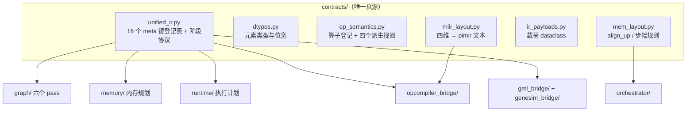

# 存算一体大模型推理编译器 v0.0.6


| 项目     | 内容                                           |
| -------- | ---------------------------------------------- |
| 版本     | v0.0.6                                         |
| 日期     | 2026-10-02                                     |
| 目标模型 | Llama-2-7B                                     |
| 基线     | `pim-compiler-v0.0.5`（`2350ac9`，2026-09-26） |
| 本文范围 | v0.0.5 → v0.0.6 的变化、原理、安装与逐步验证  |

本文档接续 `pim-compiler-v0.0.5.md`，只写 **v0.0.5 → v0.0.6 的变化**。第 6、7 章是
面向新机器的完整操作清单：**安装命令与 v0.0.5 逐条相同**，只有 GML 导出的命令行
跟着本版变了（`--decode-block-only` 反向，见 2.1）。技术方案的完整描述（图编译、
算子编译、主机编排、内存管理的设计原理）仍以 `pim-compiler-v0.0.3.md` 为准。

两条主线：

1. **GML 生成对齐 v2 参考产物**：编号口径、子图边界、激活标定三条一起改，产出的
   200 节点图与甲方 `model_layers_0_decode_v2` 的算子类型分布**完全一致**，不再有
   `sf = 0.0` 这种形式非法的标定因子。
2. **扩增图编译与算子编译的中间表示**：把「算子语义、数据类型、Placement、
   Memory Layout」四个维度从散落各处收敛成一组契约（`contracts/` 新增 6 个模块），
   FlagTree 侧把它落成真正的 MLIR 属性 `#pim.placement` 加四个回写属性，三仓之间
   靠一份载体传递、两处校验。

另有一条收尾线：切分/成本口径与并发写（grid 切分内核、K 循环折叠、原子写），
分散在第 4 章的修复清单里。

## 1. 版本与代码量

### 1.1 三个仓库


| 仓库                | v0.0.5（tag`pim-compiler-v0.0.5`） | v0.0.6                 | 提交数 | 代码量                                                             |
| ------------------- | ---------------------------------- | ---------------------- | -----: | ------------------------------------------------------------------ |
| flagos-pim-compiler | `2350ac9`（2026-09-26）            | `869ea20` + 工作区改动 |      1 | 58 个受控文件，+7441 / -652；新增 19 个文件 10100 行（不含本文档） |
| genesim             | `75235be`（2026-09-26）            | 工作区改动（未提交）   |      0 | 5 文件，+367 / -3                                                  |
| FlagTree            | `10e72e547`（2026-09-26）          | 工作区改动（未提交）   |      0 | 19 个受控文件，+1032 / -49；新增 18 个文件 1304 行                 |

三点口径说明：

- **三个仓库都有 `pim-compiler-v0.0.5` 这个 tag**，分别指向 `2350ac9`、`75235be`、
  `10e72e547`，都是 2026-09-26 v0.0.5 交付当天的状态（v0.0.5 文档里写的三个「工作区
  收尾改动」——SiLU 闭式、alias 恒等、genesim 的 `/dev/shm` 重定向——已经含在这些
  提交里）。所以本版窗口就是**三个 tag 到各自工作区**。
- **本版绝大部分改动还没提交**：pim-compiler 的 58 个受控文件里只有 21 个属于
  已提交的 `869ea20`（GML v2），其余 41 个 + 19 个新文件都在工作区；FlagTree 与
  genesim 的改动**全部**在工作区。交付前要一起提交。
- 本文所有数字取自 **2026-10-02 18:35 的工作区快照**，由本文档作者现场实测（命令与
  输出见第 7 章），不是从别的文档转抄的。写作期间工作区**仍在改动**（`tests/test_pimir_layout.py`、
  `contracts/mlir_layout.py` 等在 18:20 前后又有增量），所以用例数与新增行数会比
  几十分钟前的实测略大；对不上时以「同一命令重跑一遍」为准。

pim-compiler 的 `+7441` 行分两块：已提交的 `869ea20` 是 21 文件 +5480/-162（GML v2），
工作区是 41 文件 +1961/-490（统一 IR 与切分/成本线）。新增的 19 个文件是 6 个契约
模块 + 8 个测试 + 5 份文档：


| 类别 | 文件                                                                                                                                                     | 行数 |
| ---- | -------------------------------------------------------------------------------------------------------------------------------------------------------- | ---: |
| 契约 | `contracts/{unified_ir,ir_payloads,dtypes,op_semantics,mem_layout,mlir_layout}.py`                                                                       | 1170 |
| 测试 | `tests/test_{unified_ir_contract,dtype_carrier,no_bypass,layout_feedback,pimir_layout,stride_parity,op_semantics,mem_layout}.py`（151 个 `test_*` 函数） | 3174 |
| 文档 | `docs/{request,design}-unified-ir-*.md`、`docs/implement-unified-ir-20260930.md`、`docs/{ir-atomic-save,placement-partial-reduce}-20261002.md`           | 5756 |

**没有顶层模块被删除**；`contracts/` 的 `.py` 文件从 14 个增至 20 个（+6），是本版
唯一变大的地基模块。

### 1.2 测试面


| 指标                             | v0.0.5                               | v0.0.6                                    |
| -------------------------------- | ------------------------------------ | ----------------------------------------- |
| `tests/` 下 `.py` 文件           | 70                                   | 79                                        |
| 其中`test_*.py`                  | 67                                   | 76（新增 9 个，无删除）                   |
| 收集到的用例                     | 926                                  | 1265                                      |
| 快速回归（`-k "not llama2_7b"`） | 883 passed, 1 skipped, 42 deselected | **1222 passed, 1 skipped, 42 deselected** |

## 2. 能力变化

### 2.1 GML 生成对齐 v2 参考产物

甲方先后给过两版参考产物：v1 是 `llama2_w4a8_decode_block_0`，v2 是
`model_layers_0_decode_v2`。v0.0.5 已经把 `paths.json` 指向 v2，但产出口径还是照 v1
写的，本版把产出真正对齐到 v2。


| 维度                        | v0.0.5（照 v1）                                        | v0.0.6（照 v2，实测值）                              |
| --------------------------- | ------------------------------------------------------ | ---------------------------------------------------- |
| `relay2gml_version`         | `26.2.1`                                               | `19.2.0`                                             |
| 节点编号                    | 从裁剪剩下的 id 里倒序取，范围 3~206 带空洞            | **1..200 连续无空洞**                                |
| 子图边界                    | 含模型末尾 RMSNorm + lm_head + DQ，出口`[1,1,1,32000]` | 纯 decode block，出口`[1,1,4096]`；裁剪成为默认      |
| IO_info 的 hidden 入口 rank | `[1,1,1,4096]`                                         | `[1,1,4096]`（GML 的边仍是四维）                     |
| IO_info 的`sf`              | 裸`1.0`                                                | numpy 标量（`np.float32(1.0)`），int8 入边是真标定值 |
| 激活标定                    | 全零张量占位 → DQ 四相全 0 →`sf = 0.0`               | 真实标定输入驱动，四相非零                           |
| Kantor Shift                | 一律 0                                                 | 全族`{-8: 39 处, 0: 10 处}`                          |

**改动分三步走**：

1. **补上缺的那一步（主因）**。DQ 的四相公式一直是对的，缺的是输入：`_dq_source`
   原来喂 `np.zeros`，于是 phase0/phase1 一路 0，`output_sf` 算出 0.0——下游反量化
   会除零，是形式非法的值。本版把甲方 `parser_output/` 上层 7 个 fp32 文件的数值
   **固化成源码常数**（新增 `gml_bridge/calib_data.py`，796 行，其中约 680 行是常数
   字面量）：5 个小张量共 5472 个值全量嵌入，KV 缓存 419 万元素装不下，只嵌两个
   absmax 标量（`KEY_CACHE_ABSMAX = 35.222347259521484`、
   `VALUE_CACHE_ABSMAX = 38.6334114074707`），标定因子由 `absmax / 127` 现算。
   这样导出不再依赖外部目录——甲方把目录改名也不影响。
2. **删掉写死的常量**。`output_sf` 恒 `1.0`、IO_info 的 `sf` 恒 `1.0`、Kantor Shift
   恒 0，三处都换成按节点语义取值；取不到就抛错（`_output_scale_of` 的白名单外
   直接 `raise`，不再兜底）。
3. **编号与边界**。`_renumber_from_one` 把 id 压到 `1..N` 连续、`A`（第一处引用）
   从新的 `input0_node_id` 重新派生；`--decode-block-only` 由「可选开关」翻转成
   **默认行为**。

产出实测（`--layers 1 --seq-len 16`，含算子编译器与编排器，见 7.4）：


| 产物                     | 数值                                                                                                       |
| ------------------------ | ---------------------------------------------------------------------------------------------------------- |
| GML                      | 200 节点 / 331 边；落盘 499246 字节（检查用的文本 492676 字节，差额是检查跑完才补的权重指纹）              |
| 与 v2 参考的算子类型分布 | **16 类 / 191 个带 op_type 的节点，逐类数量完全相同**（缺 0 类、多 0 类、数量不同 0 类）                   |
| 运行时`.bin`             | 3122 个 / 240.36 MB                                                                                        |
| 编号连续性               | `node_id` 恰好是 1..200，无缺号                                                                            |
| 入边标定因子             | `in_value_cache` = 0.30420008，`in_key_cache` = 0.2773413（参考是 0.04589387 / 0.00261151，见 8.1 的取舍） |
| 编排产物                 | `net.ini` 422 行 + `txt_files/` 422 份层卡                                                                 |

**一处破坏性变更**：`scripts/export_gml.py` 的 `--decode-block-only` 被
`--no-decode-block-only` 取代（默认裁剪）。老命令行再传 `--decode-block-only` 会
被 argparse 直接拦下报错——这是有意的，宁可报错也不静默换口径。整网导出改用
`--no-decode-block-only`。另新增 `--verbose`，打印每个 DQ 节点的标定中间态。

### 2.2 扩增图编译的中间表示（统一 IR）

要解决的问题是**同一个事实有多个来源**。实测到的腐化点：dtype 与字节宽度散在 6 处、
`align_up` 有两份实现、算子清单有 4 份各自硬编码的副本、meta 键有裸字符串读取
（`graph/kv_dma_pass.py` 直接读 `"pim_head_role"`）、Memory Layout 只有「切分 +
地址」没有「排布（步幅）」层。

本版把它们收敛成**四个维度**：算子语义 / 数据类型 / Placement / Memory Layout。



**统一 IR 不是一个新的数据结构**，而是「一组住在 `contracts/` 的契约 + 挂在
`node.meta` 上的四维载荷」。载体是方案 A：保留 FX 图与 `node.meta`，不另建图级
结构；`contracts/graph_meta.py` 退化成兼容层（键名改从 `unified_ir` 转出，既有
调用方照旧 import），`PIMTensorSpec` 与 `TensorShardDetail` 只在**末尾加带默认值的
字段**，不改签名——末尾这一点是要紧的，`spec_prop.py` 有三处按位置构造，插在中间
会静默错位。

四条硬约束，每条都有测试盯着：


| 约束         | 内容                                                                                                              | 判据                                                                                                 |
| ------------ | ----------------------------------------------------------------------------------------------------------------- | ---------------------------------------------------------------------------------------------------- |
| 键必须登记   | `node.meta` 的 16 个键全在登记表里，含 producer/consumers                                                         | `test_unified_ir_contract.py` 断言键集合**恰好相等**，三种写法（`.setdefault/.pop/.update`）都要识别 |
| 取数必须走门 | dtype 与字节宽度只准从`dtype_bytes()` 取，禁止 `.element_size()`、`.meta["val"].dtype`、`np.dtype(name).itemsize` | `test_no_bypass.py` 全仓扫描，白名单只剩 `spec_prop._dtype_of` 与 `from_fx._cast_dtypes` 两处        |
| 跨维不许漂移 | `spec.dtype == val.dtype`；`shard_dim < len(local_shape)`                                                         | `validate_node_dimensions()` 在 `spec_prop` 出口被真调到（monkeypatch 计数守住）                     |
| 阶段有前驱   | 五个阶段 `exported → partitioned → {specs                                                                       | fused} → planned`，`SPECS`与`FUSED` 是**分叉不是先后**                                              |

**数据类型这一维要特别说明「不合并成一处的六处」**：全仓有 6 处类型名字表，本版不是
一刀切，而是分类处置——1 处改引用（`_BUFFER_DTYPES`）、2 处加「键 ⊆ 真源」交叉校验
（GML 的扩展类型表与编排器的位宽表，两套编号口径不同，强行归一会错）、3 处性质不同
不动（缓冲约束、位宽定标常量、`val` 是派生来源）。另外类型集合补了 **int64 作为索引
类型**：llama 图里有 3 个 int64 张量，其中一个还是要算字节数的 DPU 节点。

还有一个必须记住的三层口径（三者不同且都对）：


| 层                       | 含义              | 例                                 |
| ------------------------ | ----------------- | ---------------------------------- |
| `spec.dtype`             | FX 图上的数值类型 | 动态量化的 alias 节点仍是`float16` |
| `spec.quant`             | 硬件量化语义      | `int8` + per-group `group_size`    |
| GML`output_buffer_dtype` | 落盘类型          | 由 GML 语义单独补                  |

### 2.3 扩增算子编译的中间表示（FlagTree）

方言侧的 op 数**没有变化**（仍是 37 个），变的是属性与校验：`def TTPIM_*` 从 138
增至 147，新增的都是 Placement 一组。

**一个属性承载四维里的两维**：`#pim.placement`（`PIMAttrDefs.td:1364`，9 个参数）。

```
#pim.placement<kind = shard, dim = 1, numDpus = 2>          // 按轴切两份
#pim.placement<kind = replicate, numDpus = 4>               // 四份副本，不切
#pim.placement<kind = partial, numDpus = 2, reduce = sum>   // 切两份，结果还要对端求和
```


| 参数                         | 作用                                                                                                                                         |
| ---------------------------- | -------------------------------------------------------------------------------------------------------------------------------------------- |
| `kind`                       | `shard`（按轴切 N 份）/ `replicate`（每台持完整形状）/ `partial`（切分后要对端归约）                                                         |
| `dim` / `numDpus`            | 切哪根轴、切几份                                                                                                                             |
| `reduce`                     | `partial` 档的归约方式：`none` / `sum` / `mean`（**故意没有 `max`**——sharded softmax 的 max 在图上是一个 `pim.reduce_axis`，不是欠的组合） |
| `dpuIds` / `stage` / `order` | 点名哪几台 DPU、流水级、维序（最内层在前）                                                                                                   |
| `mramOffset` / `alignBytes`  | 起始地址偏移（字节）与对齐要求                                                                                                               |

**放置决策的单一载体 + 两处校验**。图编译器把决策写进 TTIR 模块属性 `pim.placement`，
`-convert-triton-to-pim` 读它、按它写布局编码 `dpusPerDevice`，然后**校验两个载体不许
漂移**：`verifyModulePlacement`（切分宽度与点名的 DPU 不能超过设备实有数）与
`verifyLayoutsMatchPlacement`（模块内张量编码必须与 placement 一致；`shard` 且
`numDpus>1` 时至少要有一个非全 1 编码，否则报 "the cross-DPU decision was dropped"）。
A 路（`-convert-triton-to-pim`）与 B 路（`-pim-verify-gml-contract`）**两条路都查**。

**四个回写属性**把算子在 pass 里的实况写回模块头，供下游消费：


| 属性                      | 含义                                                                                                 |
| ------------------------- | ---------------------------------------------------------------------------------------------------- |
| `pim.placed-shards`       | 该 pass**实际看到**的切分宽度（不是它施加的除数）——掉切分的 pattern 会让它停在 1，好跟「意图」比对 |
| `pim.placed-mram-bytes`   | 本算子**每 DPU** 的 MRAM 占用                                                                        |
| `pim.placed-reduce-bytes` | `partial` 归约的落地区字节（`shard`/`replicate` 为 0）                                               |
| `pim.placed-elem-bytes`   | 计费时真正用的元素宽度（免得上层从类型名猜宽度）                                                     |

**三处算法改动**（`TileToBudget.cpp`，本版最实质的 pass 改动）：

1. **累加器按自己的宽度计费**。f16 操作数配 f32 累加器时，输出 tile 原来按 f16 算，
   少算一半——WRAM 与 MRAM 两个检查都被放松了。同一分块从 49152 涨到 81920 字节，
   FlagGems 那批 kernel 因此从「放得进、不改写」翻成「要改写」。
2. **`partial` 的归约暂存要计入 MRAM**。对端来的是 partial sum，格式是 f32，按
   **累加器宽度**算 `m × n`；这同时让 `replicate` 与 `partial` 从「形状相同、不可
   区分」变成「成本不同」。
3. **grid 切分内核不再重建**。新增 `isGridPartitioned()`：模块里出现
   `tt.get_program_id` 就是 launch grid 切分的内核（FlagGems 的 autotune kernel
   就是），这类内核只回写实测分块、**不重建**——重建出来的是「一个 program 算完整张
   输出」，而启动网格不变，语义就变了。超预算由 `pim.tile-wram-bytes > pim.wram-bytes` 如实体现，而不是被一次改写掩盖。

**一个死字段被救活**：`combineMode` 属性在 v0.0.5 就有，但 5 个生产者全传 null 占位、
全 dialect 无人调用——「写什么值效果都一样：没有效果」。本版给了它第一个消费者
（`skip_connection` 必须配 `EltwiseKind::Add`，乘/除会缩放残差而不是恢复它），并把
ExpandPhases 里 5 处 null 占位换成真实的 `Straightforward`。lit 用例
`expand_phases.mlir` 特意把断言写在同一行——注释点明**没有这条断言时，把 5 处改回
null 整个套件仍然全绿**。

方言侧的 lit 用例从 27 增至 **44 个**（新增 17 个，其中 9 个专测 placement 的负例）。

### 2.4 三仓协同：回传通道与容量核对

**回传通道**把算子编译器的实况带回图侧：`LayoutFeedback`（`pim.tile-*`/`wram`/
`mram`）与 `PlacementBack`（四个 `pim.placed-*`）由 `contracts/ir_payloads.py` 的解析
函数从模块属性字典读出，**五个消费点**：成本模型、内存规划的容量判据、GML 的输出
类型、numpy 执行、仿真 sidecar。

**回传不写回 `node.meta`**——回传发生在图已达 `STAGE_FUSED` 终态之后，再改会破坏
不变式且 `export_graph` 不幂等。纪律沿用 `combine_mode` 的教训：**每个字段必须有
生产方与消费方各一处**，由 `test_layout_feedback.py` 的源码扫描 + 变异测试守住；
死载体 `PhaseSource.layout_back` 已删。

**genesim 侧**新增两条核对（`gene_sim_scheduler.py`，只告警不抛——sidecar 可能来自
不同硬件口径，抛错会把正常仿真拦死）：


| 判据           | 内容                                                                                                                          |
| -------------- | ----------------------------------------------------------------------------------------------------------------------------- |
| 单台 MRAM 占用 | `placed_mram_bytes` + `placed_reduce_bytes` 不超过一台 TensorPU 的常驻容量 `tensor_pu_capacity_bytes`，超了报「切分宽度不足」 |
| 意图 vs 效果   | 期望值 =`shard_dpus`（当且仅当 `shard_kind == "shard"` 且 `shard_dpus > 1`，否则为 1）与 `placed_shards` 必须相等             |

配套的 sidecar 字段：`shard_dim` / `shard_dpus` / `shard_kind` /
`placed_mram_bytes` / `placed_shards` / `placed_reduce_bytes`。**注意成本 sidecar
那条核对依赖 `cost_sidecar_file`，而默认配置没有启用它**——真实运行中生效的是放置
sidecar 那条。

## 3. 技术原理

### 3.1 v2 对齐为什么不是「换个样本重跑」

两版参考产物的差别不在数值细节，而在**产出的一整套口径**：版本号、编号规则、子图
边界、入口 rank、标定因子的写法。三处差异里只有第三处是「算法」，前两处是形式，
而形式对下游是要紧的——编号不连续会让层卡的引用方式跟着变，子图边界不同则整网导出
与层导出的节点集合对不上。

标定那一处才是根因：**公式早就对了，错在喂了全零**。全零进去，四相里两相恒 0，
`sf` 算出 0.0——这不是「精度差一点」，是下游反量化会除零的形式非法值。所以修法不是
调公式，是把真实的标定输入搬进来。搬进来之后，同一份公式自然给出
`in_value_cache = 0.3042`、`in_key_cache = 0.2773` 这样的量级。

### 3.2 统一 IR 的三层含义

文档里「层次」这个词出现在三个地方，不要混：


| 说法               | 指的是                                                                                 | 谁管                                          |
| ------------------ | -------------------------------------------------------------------------------------- | --------------------------------------------- |
| 两级表示的 IR      | 图层统一 IR（`contracts/` 契约 + `node.meta` 载荷）与 PIMMLIR（FlagTree 的 MLIR 方言） | 前者管到算子边界，后者管算子内部              |
| Memory Layout 四层 | ① 切分 ② 地址 ③**排布（本版做）** ④ 介质交错（不做，没有 bank 字段）               | ① 图编译器 ② 编排器 ③ 本版进契约 ④ 待立项 |
| 四个维度           | 算子语义 / 数据类型 / Placement / Memory Layout                                        | 不是层次，是四个正交的取数面                  |

两者的分工是**内存层次**划的：WRAM/MRAM 归图编译器 + 算子编译器（**经** PIMMLIR
表达），L1/L2/DDR 归编排器（**不经** PIMMLIR）。

### 3.3 放置决策为什么必须只有一个载体

改前的事实是：跨 DPU 的切分决策在图上有一份、在 kernel 里没有——布局编码
`dpusPerDevice` 字段早就存在、verifier 与 parse/print 都齐，但**没有任何 builder
能写出非全 1 的值**，等于这个字段从来没被用过。B 路对「4 DPU 的 placement 点名了
7/9/11 但设备只有 2 台 DPU」此前零警告；「声明 4 DPU、编码只散 2」的模块 rc=0 通过。

本版把它做成单一载体 + 两处校验：模块属性 `pim.placement` 是输入，
`dpusPerDevice` 是它在类型系统的投影，两者必须一致。校验写两个地方是有意的——
A 路与 B 路是两条独立的降级链，任何一条都不许把切分悄悄丢掉。

`placed-shards` 数的是**编码**而不是 placement，也是同一个道理：读 placement 会让
「意图 vs 实际」的比较变成恒等式，永远不触发。

### 3.4 累加器宽度如何改变分块选择

分块搜索按 WRAM 预算搜，账目里三笔：输入 tile、权重 tile、输出 tile。改前输出按
**操作数宽度**（f16，2 字节）算，改后按**累加器宽度**（f32，4 字节）算。


| 分块 128x128x32 | 改前                | 改后                |
| --------------- | ------------------- | ------------------- |
| 输入            | 128×32×2 = 8192   | 8192                |
| 权重            | 32×128×2 = 8192   | 8192                |
| 输出            | 128×128×2 = 32768 | 128×128×4 = 65536 |
| 合计            | 49152               | **81920**           |

81920 超过 65536 的 WRAM 预算，于是原本「放得进、不改写」的 kernel 走进改写分支——
这正是 grid 切分缺陷被暴露出来的触发点。同一个改动还带出一个多 dot 模块的 bug：
footprint/staging/elemBytes 原来每次循环覆盖，导致「分块属性来自第一个 dot、footprint
来自最后一个 dot」，现在随 `chosen` 一起绑定。

### 3.5 K 循环折叠与 126 倍的成本低估

`genesim_bridge/ir_cost.py` 的 `_ConstFolder` 原来只用 `arg_values` 的**形参名**做种子
（存成 `%K`），但真实抓到的 TTIR 里 Triton 不保留形参名，参数是 `%arg6` 这种位置名。
于是 `divsi(addi(%arg6,31),32)` 这条链永远折不出来，K 循环被按 1 次计——
实测 GEMM 成本 9.16e7，真值 1.15e10，**低估约 126 倍**，而且不报错。

新增 `_bind_signature()`：数一遍签名里哪些参数是指针、哪些是标量，标量的按顺序取
`arg_values` 的前若干个（指针实参是张量，采集时已被过滤）。这正是 `arg_values` 本来
就承诺的用途（「标量实参，供 ir_cost 求循环次数」），此前只是名字对不上。

### 3.6 B 路产出的 pimir 为什么必须留着 placement

`#pim.placement` 是 PIM dialect 的属性，降到 EmitC 时必须删掉——`mlir-translate`
不加载 PIM dialect，会把 `#pim.placement<...>` 当 unregistered dialect 拒绝。

删的位置是刻意的：**放在 `-pim-lower-to-emitc` 里，而不是更早**。因为 placement 要
活到 `-pim-explicit-dma`，那一阶段产出的 pim mlir 正是 GeneSim 成本模型读取的对象
（`mram_offset` 也在这时回写到结果张量的 DMA 上）。这是它完成使命的第一时刻。

### 3.7 并发写为什么会把流水线打崩

`run_full_pipeline.py` 跑到 `[B+C+D]` 步报
`json.decoder.JSONDecodeError: Expecting value: line 1 column 1 (char 0)`，而磁盘上的
`genesim/models/llama2_7b.ir` 是好的（9844226 字节、合法 JSON）。时间戳对下来：读到
空文件的那一刻，同一份 IR 在 0.45 秒后被另一个进程写完整。

根因是 GeneSim 的 `ModelIR.save()` 是**截断式写入**：`open(path, "w")` 先截成 0 字节，
再慢慢写 9.8 MB，写入的约 0.5 秒内读者看到的文件就是空的。修法是先写同目录临时文件
再 `os.replace` 原子替换——读者拿到的要么是旧文件、要么是新文件，永远不是半个文件；
临时名带 pid，两个进程同时跑也不互相踩。判据是**inode 变化**（截断重写不会换
inode，所以那条测试在旧代码上必红）。

## 4. 这一版修掉的问题

### 4.1 假绿与静默失败


| 问题                                            | 后果                                                               | 改法                                                                                           |
| ----------------------------------------------- | ------------------------------------------------------------------ | ---------------------------------------------------------------------------------------------- |
| `combineMode` 是死字段，5 个生产者全传 null     | 写什么值都没有效果，也没有任何检查                                 | 给定第一个消费者（`skip_connection` 必须配 `add`），ExpandPhases 5 处填真实值                  |
| 布局编码`dpusPerDevice` 从来没有非全 1 的写入点 | 跨 DPU 决策在类型系统里根本不存在，B 路对非法 placement 零警告     | placement-aware builder +`verifyModulePlacement` + `verifyLayoutsMatchPlacement`，A/B 两路都接 |
| placement 说切分、编码全 1                      | 切分被静默丢掉，rc=0                                               | 模块级不变量：`shard` 且 `numDpus>1` 时至少要有一个非全 1 编码                                 |
| 累加器按操作数宽度计费                          | WRAM/MRAM 两个检查都被放松，`pim.tile-wram-bytes` 报小了           | 按`accumBytes` 计费，输出 tile 翻倍                                                            |
| MRAM 占用除以切分因子                           | 预算被按切分倍数放大（实测 7168B/DPU 的 kernel 通过了 5000B 预算） | 不除——到达该 pass 的 shape 已经是单 DPU 的份额                                               |
| `_ConstFolder` 按形参名折循环次数               | GEMM 成本低估约 126 倍且不报错                                     | 新增`_bind_signature()`，按位置绑标量实参                                                      |
| A 路 DMA 字节数再按切分数分摊一次               | 单台流量算成 1/N（实测 3584 vs 7168）                              | 明确不分摊                                                                                     |
| `_dq_source` 喂全零                             | `output_sf = 0.0`，下游反量化除零                                  | 真实标定输入，白名单外直接抛                                                                   |

### 4.2 契约漂移


| 问题                                                                  | 改法                                                                                                                                              |
| --------------------------------------------------------------------- | ------------------------------------------------------------------------------------------------------------------------------------------------- |
| dtype 与字节宽度散在 6 处                                             | `contracts/dtypes.py` 立真源，5 处改引用或加交叉校验，1 处保留；全仓扫描禁止旁路取数                                                              |
| `align_up` 有两份实现，`l2_*_size`/`stride_z` 只在编排器              | 搬进`contracts/mem_layout.py`，`test_stride_parity.py` 用搬家前冻存的基线逐项比对                                                                 |
| 算子清单 4 份各自硬编码，`MNEMONICS ⊂ _OPLEVEL_OPS` 差一个 `convert` | `contracts/op_semantics.py` 24 条目登记，四个派生视图（`oplevel_ops` 15 / `mnemonics` 14 / `aten_to_gml` 28→19 / `role_to_gml`），加算子只改一处 |
| `graph/kv_dma_pass.py` 裸字符串读 `"pim_head_role"`                   | 改用契约常量                                                                                                                                      |
| `split_heads.py` 把角色取值当键名写进 `node.meta`（全仓零读者）       | 删掉                                                                                                                                              |
| meta 键登记 5 个、实际 14 个                                          | 登记表 16 条（含`nn_module_stack`），未登记的键直接抛错                                                                                           |
| 融合目标不在算子登记表里时静默不融合                                  | 导入时校验`_validate_fusion_targets()`                                                                                                            |

### 4.3 产物正确性


| 问题                                                   | 改法                                                                     |
| ------------------------------------------------------ | ------------------------------------------------------------------------ |
| 节点编号从裁剪剩下的 id 里倒序取，3~206 带空洞         | `_renumber_from_one` 压成 1..N，bin 名尾号、边、`A` 全部跟着重派生       |
| `IO_info` 的 `sf` 是裸 `1.0`，读的人要用 `eval`        | 写 numpy 标量；测试显式钉住`ast.literal_eval` 会抛（破坏性变更固定下来） |
| Kantor Shift 一律写 0                                  | 按节点语义取值，全族`{-8: 39, 0: 10}`                                    |
| KV/Split 的标定因子恒 1                                | 按角色取真实值（KV 0.2773/0.3042）                                       |
| `--decode-block-only` 是可选项，不加就与参考层数对不齐 | 翻成默认                                                                 |
| 参考产物路径写死（v0.0.5 修了一半）                    | `paths.json` 指向 v2 参考目录，v1/v2 两套口径在 `paths.py` 里注明        |

### 4.4 环境与并发


| 问题                                          | 改法                                                          |
| --------------------------------------------- | ------------------------------------------------------------- |
| `ModelIR.save()` 截断式写，并发读者拿到空文件 | 临时文件 +`os.replace` 原子替换（genesim 仓）                 |

## 5. 环境与容量要求

**与 v0.0.5 完全相同**，逐条抄录如下（无变化）。


| 项目     | 要求                                                                                                              |
| -------- | ----------------------------------------------------------------------------------------------------------------- |
| 操作系统 | Ubuntu 22.04 或 24.04，x86_64                                                                                     |
| GPU      | **可选**。有 NVIDIA GPU（驱动 570+）用 CUDA 版 torch；无卡用 CPU 版                                               |
| 磁盘     | `flagTree` 约 23 GB、`pytorch` 约 13 GB；模型权重约 14 GB（由甲方提供，放任意目录，见第 6 章第四步）                |
| 内存     | FlagTree 是完整 LLVM/Triton CMake 构建，`MAX_JOBS` 默认 8，低内存机器请调小                                       |
| 网络     | 需访问 GitHub、`oaitriton.blob.core.windows.net`（LLVM）、PyPI、`download.pytorch.org`                            |
| root     | **全程不需要 root**。系统命令需已由管理员预装（清单与自检命令见第 6 章第一步），三个安装脚本与全部验证都不需要 root |

## 6. 安装：一步一步做下来

**本章与 v0.0.5 的第 6 章逐条相同**：三个安装脚本、`paths.json` 的六个键、环境脚本
的 source 方式、以及「不要拷贝已装好的目录」这条限制都没有变。下面只列出照做时要
看的命令，细节与卡点说明请看 `pim-compiler-v0.0.5.md` 第 6 章。

```bash
# 第一步：系统命令自检（不需要 root）
for c in git tar gzip dpkg-deb apt-get awk sed find make cc c++ ar ld curl; do
  command -v "$c" >/dev/null 2>&1 || echo "缺: $c"
done

# 第二步：网络设置（跨境网络建议）
export UV_HTTP_TIMEOUT=600
export PIP_INDEX_URL=https://pypi.tuna.tsinghua.edu.cn/simple
export PIP_TRUSTED_HOST=pypi.tuna.tsinghua.edu.cn

# 第三步：三个安装脚本（直接跑，不需要 root、不需要 GPU）
git clone https://github.com/jingge815/flagOS-installers.git
cd flagOS-installers
bash 0-install-flagtree.sh       # 最慢的一步：编译 LLVM/Triton/PIM pass
bash 1-install-flaggems.sh
bash 2-install-pytorch.sh        # 无卡机器加 --torch-cpu

# 第四步：图编译器与 GeneSim
cd /path
git clone https://github.com/jingge815/flagos-pim-compiler.git
git clone https://github.com/pimtools/genesim.git
cd /path/genesim && ./install.sh --skip-attacc
# 然后按 v0.0.5 文档配好 paths.json 的六个键
source /path/flagOS-installed/pytorch/env-pytorch.sh
python -c 'from genesim_bridge.paths import describe; print(describe())'
```

## 7. 验证：一步一步做下来

### 7.1 验证顺序与判据


| 序 | 验证项                | 覆盖什么                       | 耗时       |
| -- | --------------------- | ------------------------------ | ---------- |
| 1  | pim-compiler 快速回归 | 除 7B 端到端外的全部契约与单测 | 约 3 分钟  |
| 2  | GML 导出（两次）      | GML 产物链与参考产物比对       | 各约 20 秒 |
| 3  | genesim 全套          | 仿真器、预测器、UPMEM checker  | 约 1 分钟  |
| 4  | 全流程闭环            | 三仓串起来的端到端             | 约 12 分钟 |
| 5  | 7B 全量（可选）       | 真实 7B 的逐元素对拍           | 半小时以上 |

### 7.2 pim-compiler 快速回归

```bash
cd /media/disk/fengjingge/src/flagOS/flagos-pim-compiler
source /media/disk/fengjingge/src/flagOS/flagOS-installed/pytorch/env-pytorch.sh

python -m pytest tests/ -q -k "not llama2_7b" -rs
#    预期: 1222 passed, 1 skipped, 42 deselected in 207.77s
#    唯一一条跳过: tests/test_gml_node_parity.py:67  需要参考产物与一次 decode-block 导出
```

`passed` 的具体数字跟着工作区走（本版写作期间工作区一直在改，同一条命令先后跑出
1220 与 1222 两个数），**判据是「1 skipped、0 failed」而不是那个绝对值**。

那一条跳过是因为该文件把「我方产物」的路径写死成开发机上的
`/media/disk/fengjingge/tmp/gml_dbo/relay2gml_graph.gml`，新机器上不存在，整组跳过；
它比对的两个场景由 7.4 的导出验证覆盖。另外，刚装完、还没跑过 7.6 全流程的机器上，
`tests/test_genesim_bridge.py` 里可能**再多**一条因缺 refine 产物而跳过；跑过 7.6
之后就不跳了。**两种状态都是正常的**，`1 skipped` 或 `2 skipped` 都符合预期。

> 数字说明：v0.0.5 时这一步是 883 passed。本版新增的用例主要来自统一 IR 的八份测试
> （3174 行），其中 `test_pimir_layout.py` 一个文件就 1436 行、覆盖到「真实
> `triton-opt` 往返」与「穿过完整 pass 链存活」这一级。

### 7.3 7B 全量（可选，本文档未重跑）

```bash
python -m pytest tests/ -q -k "llama2_7b"
```

命令与 v0.0.5 的第 7.2 节完全相同，判据也相同：**与单卡 PyTorch 逐元素对齐**，
耗时半小时以上。**本版没有重跑这一组**——本文档第 7 章的数字全部来自 7.1 验证顺序表里的快速
回归与产物验证。要发布本版，建议在提交前补跑一次：本版改到了 `runtime/kernels.py`、
`exec_plan_gen.py`、`compile.py` 三条整网执行路径（统一 IR 的接线），而快速回归把这
一组整体排除了，整网对拍是唯一能覆盖到它们组合行为的判据。

`paths.json` 没配模型目录或目录不存在时整组跳过（不是失败）。

### 7.4 GML 导出验证

**本版的命令行变了**：decode block 裁剪是默认行为，不再需要（也不能）传
`--decode-block-only`；要导整网才加 `--no-decode-block-only`。

第一次，只导结构（不跑算子编译器）：

```bash
python scripts/export_gml.py --layers 1 --seq-len 16 --out-dir /tmp/gml_out
```

预期尾部（约 20 秒）：

```text
节点 200 个，边 331 条
检查:
  [通过] GML 结构自检（5 条规则）: 5/5 通过
  [通过] GML dtype 覆盖（参考有则我方有）: 15 类算子，0 类缺 dtype
  [通过] GML 引用集 == 落盘集: 3122 个文件

图: /tmp/gml_out/relay2gml_graph.gml
运行时文件: 3122 个, 240.36 MB

==============================================================
验证全部通过（3 项）
==============================================================
```

第二次，加算子编译器与编排器：

```bash
python scripts/export_gml.py --layers 1 --seq-len 16 --out-dir /tmp/b \
  --use-opcompiler --orchestrate
```

预期尾部（**24 项全部通过**，约 20 秒）：

```text
节点 200 个，边 331 条
融合 4 处，带 contraction 的节点 1 个
检查:
  [通过] GML 结构自检（5 条规则）: 5/5 通过
  [通过] GML dtype 覆盖（参考有则我方有）: 15 类算子，0 类缺 dtype
  [通过] GML 引用集 == 落盘集: 3122 个文件
  [通过] 接算子编译器前后 GML 逐字节相同: 492676 字节，节点 200
  [通过] 算子编译器真的决定 GML（反证）: 38 个 DQ 相位数 4→2，GML 少 58827 字节
编排器:
  [通过] 层展开: 422 层（非逐头 38、逐头 384）
  [通过] 全部 op_type 都能展开: 无未识别
  [通过] Layer ID 唯一: 422 个，唯一 422 个
  [通过] L2 offset 16 字节对齐: 463 块全对齐
  [通过] L2 地址分配: 463 块 → 6 槽（复用率 98.7%），数据区 258720 字节
  [通过] net.ini 列出全部层: 422 行 vs 422 层 txt
  [通过] txt_files 文件数: 422 层 + 2 个版本戳
  [通过] 编排器产物落盘: /tmp/b/prepare_out/net.ini、txt_files/
  [通过] txt 引用的 bin 全部存在: 2010 个引用，缺失 0 个
  [通过] 盘上 bin 全部被 txt 引用（信息项，不计入失败）: 1116 个未被 txt 引用
  [通过] 双输入层 L2 offset 0/1 不重叠: 41 层双输入，0 层重叠
  [通过] 双输入层 L2 size1 为正: 41 层，0 层 size1<=0
  [通过] MatMul 权重按 S×hd 落盘: 64 个 131072B，0 个仍 65536B
  [通过] KV cache 平面按 nh×S×hd 落盘: 2 个 4194304B
  [通过] L2 分配 ≥ 声明尺寸: 513 处声明，0 处欠分配
  [通过] 参考独有文件族都已产出: 缺 0 族，多 4 族
  [通过] 非白名单文件族数量与参考一致: 0 族数量不同
验证全部通过（24 项）
```

四条要说明的事：

**（一）两次导出的 GML 逐字节相同**。这是本仓的硬不变量：加不加 `--use-opcompiler`
导出的 GML 必须逐字节相同（实测两份落盘都是 499246 字节，`cmp` 无差异）。脚本把它
做成了检查项。注意检查里报的 `492676 字节` 是**检查用的文本**——权重指纹是检查跑完
之后才补进 `artifact.text` 的（注释写明：提前补会让不变量检查比的不是同一件事），
落盘文件因此比它大 6570 字节。

**（二）反证也要成立**。光说「相同」不够——把 DQ 的相位数从 4 砍成 2，GML 必须随之
变化（实测少 58827 字节）。两条一起才说明算子编译器**真的在决定** GML。

**（三）本版要额外验三件自己就能查的事**（都用产物本身，不依赖参考目录）：

```bash
python - <<'PY'
import re, pathlib
t = pathlib.Path("/tmp/b/relay2gml_graph.gml").read_text()
ids = sorted({int(m) for m in re.findall(r'^\s+node_id (\d+)', t, re.M)})
assert ids == list(range(1, len(ids) + 1)), "编号必须 1..N 连续"
assert re.findall(r'relay2gml_version "([^"]+)"', t) == ["19.2.0"], "版本号必须是 19.2.0"
io = pathlib.Path("/tmp/b/IO_info.txt").read_text()
sf = re.findall(r"'sf': np\.float32\(([\d.]+)\)", io)
assert sf and all(float(x) > 0 for x in sf), "标定因子不得为 0"
print("节点", len(ids), "；非 1 标定因子", [x for x in sf if x != "1.0"])
PY
#    预期: 节点 200 ；非 1 标定因子 ['0.30420008', '0.2773413', '0.2773413', '0.30420008']
#    （KV 各两次：入边一次、出边一次）
```

**（四）`--use-opcompiler` 之外，还有一处口径要注意**：`/tmp/gml_out`（第一次）
产出的目录里只有结构文件，与甲方的 `parser_output` 比对时缺 `output_buffer`、
`LUT_phase` 这些族——那些值来自算子编译器的相位回读，**必须加 `--use-opcompiler`
才会发**。两次的差异本身就是这条链路的验证点。

### 7.5 GeneSim 验证

```bash
export PATH="$HOME/.local/bin:$PATH"
cd /path/genesim
./run.sh --test
#    预期尾部: [SUCCESS] All test suites passed.
```

`--test` 依次跑三组，全部通过才打上面的 `[SUCCESS]`：


| 组            | 实测                   |
| ------------- | ---------------------- |
| sim           | 38 个文件 / 686 个用例 |
| predictor     | 7 个文件 / 86 个用例   |
| upmem_checker | 49 个用例              |

**前置产物不需要**：`./run.sh --test` 不读 `--config`，不要求 `models/*.ir`，不要求
`traces/*.trace`，也不要求联网。测试文件都是自建微型 IR。

本版新增的两条核对（见 2.4）默认**是惰性的**：`conf/sim.yaml` 里
`cost_sidecar_file` 与 `compiler_placement_file` 都没启用，所以不配就是原行为；
要试的话在 conf 里指向 7.4 或 refine 步骤产出的 sidecar。

按 `docs/llama-2.md` 的默认工作流走一遍仿真（**需要模型目录**）：

```bash
source /media/disk/fengjingge/src/flagOS/flagOS-installed/pytorch/env-pytorch.sh
export PATH="$HOME/.local/bin:$PATH"
export PIM_COMPILER_ROOT=/media/disk/fengjingge/src/flagOS/flagos-pim-compiler

# 1. 生成模型 IR
python scripts/model_parser.py \
  --model_name /media/disk/fengjingge/src/flagOS/flagOS-installed/model-inference/models/Llama-2-7b-hf \
  --output models/llama2_7b.ir

# 2. 生成请求 trace
./run.sh --trace --synthetic --seed 0 --num_requests 10 --output traces/llama2_7b.trace

# 3. 成本精化（PIM MLIR 阶段，conf/sim.yaml 默认指向它的输出）
python scripts/refine_ir_with_flagtree.py \
  --ir models/llama2_7b.ir --out-ir models/llama2_7b_pimir.ir \
  --sidecar models/llama2_7b_pimir_extensions.json \
  --seq-len 128 --ir-level pimir

# 4. 跑默认仿真
./run.sh
```

> 第 3 步会 import flag_gems；共享机器上 `/dev/shm` 被占满时 import 会报
> `OSError: [Errno 28]`（FlagGems 在 import 期为每个算子建 POSIX 命名信号量，
> 固定落在 `/dev/shm`，不看 TMPDIR）。本版 refine 脚本已自带处理：剩余不足 256 MB
> 时在 user+mount namespace 里把它重定向到脚本目录下的 `dev-shm/`，再重启本脚本。
>
> **不要并发跑两个会写同一份 IR 的进程**。本版给 GeneSim 的 `ModelIR.save()` 加了
> 原子写，读者不会再拿到半个文件，但「读到的是哪一次 run 的产物」仍然不保证——
> 并发跑的人请各用各的 IR 路径。
>
> `./run.sh --clean --force` 会**连 `models/*.ir` 一起删掉**，删之前想清楚。

### 7.6 全流程闭环

这是「链路通没通」的唯一判据：

```bash
cd /media/disk/fengjingge/src/flagOS/flagos-pim-compiler
source /media/disk/fengjingge/src/flagOS/flagOS-installed/pytorch/env-pytorch.sh
python scripts/run_full_pipeline.py --num-stages 4
```

实测输出（约 12 分钟）：

```text
[A] HuggingFace config → GeneSim 图骨架 IR
    算子 6852 个，GEMM 224 个，七种投影身份齐全

[0] GeneSim 固定 PU 映射 → PartitionPlan
    方案: llama2_7b_tp2_pp4_plan.json（source=fixed_tp2_pp4）

[B+C+D] 图编译 → 算子编译（真实分块）→ placement sidecar
    条目分两类核对：GEMM 224 条、算子级 6626 条
    放置 224 个 GEMM 与 6626 个算子级节点，本地形状 20 种 pim mlir
    算子编译器选出的分块: [128, 512]（GeneSim 默认常量是 32）
    Cluster 映射已随 sidecar 回传，与方案一致（8 项）

[E] GeneSim 仿真（pimir）
    total_time_s = 1510.447
    tokens/s     = 5.352
    GEMM trace 来源: {'pimir': 448}
    (tile_n, k_iterations) 分布: {(512, 128): 192, (512, 64): 64, (128, 128): 128, (512, 172): 64}

全流程验证通过：模型加载 → 图编译切分 → 算子编译 → GeneSim 代价
```

三行最关键的：

- `算子编译器选出的分块: [128, 512]`——分块由 **WRAM 预算搜出来的**，不是
  `conf/sim.yaml` 里拍的 32。
- `GEMM trace 来源: {'pimir': 448}`——448 = 224 个 GEMM × 2 个分片，**全部**来自算子
  编译产出的 pim mlir。这里若出现 `template`，说明有算子退回手写模板，原语等于没进
  仿真。
- `total_time_s = 1510.447`——绝对耗时不作性能预测，适合同类配置横向比较。

**这四行数字与 v0.0.5 文档里那一版逐位相同**（1510.447 / 5.352 / 448 / 同一个分块
分布）。这不是巧合，而是统一 IR 那条主线想要的结果：改动前后产物必须一致。它同时
也是这条链路的**回归判据**——本版把 dtype、布局、placement 的取数来源换了一遍，仿真
结果一位都没动，说明换的只是来源，不是行为。

脚本退出码非 0 即失败，会把失败步骤的日志尾部直接贴出来。

### 7.7 实测结果汇总


| 验证项                | 命令                                               | 结果                                                                                   |
| --------------------- | -------------------------------------------------- | -------------------------------------------------------------------------------------- |
| 快速回归              | `pytest tests/ -q -k "not llama2_7b" -rs`          | **1222 passed, 1 skipped, 42 deselected**（207.77s）                                   |
| GML 导出（结构）      | `export_gml.py --layers 1 --seq-len 16`            | **3/3 通过**，200 节点 / 3122 文件 / 240.36 MB                                         |
| GML 导出（完整）      | `export_gml.py ... --use-opcompiler --orchestrate` | **24/24 通过**；两次落盘 GML 逐字节相同（499246 字节）                                 |
| genesim 仿真器        | `./run.sh --test sim`                              | **38/38 文件，686 用例**                                                               |
| genesim 预测器        | `./run.sh --test predictor`                        | **7/7 文件，86 用例**                                                                  |
| genesim upmem_checker | `./run.sh --test`                                  | **49 用例通过**                                                                        |
| 全流程闭环            | `run_full_pipeline.py --num-stages 4`              | **通过**，`total_time_s = 1510.447`，`trace 来源 {'pimir': 448}`（与 v0.0.5 逐位相同） |
| 7B 全量               | `pytest tests/ -q -k "llama2_7b"`                  | **本文档未重跑**（半小时以上，见 7.3）                                                 |

## 8. 限制与注意事项

### 8.1 明确取舍（有意为之，非缺陷）


| 条目                                                  | 说明                                                                                                                                |
| ----------------------------------------------------- | ----------------------------------------------------------------------------------------------------------------------------------- |
| KV 标定因子不复现甲方                                 | 甲方是 0.0458939 / 0.00261151，我方按`absmax/127` 得 0.2773 / 0.3042。口径写在 `calib_data.py` 的 docstring 里                      |
| `IO_info` 的 inputs 槽序、非标定类 `output_sf` 的命名 | 维持我方口径（自命名 182 个 vs 参考 146 个）                                                                                        |
| 比参考多 4 个文件族                                   | `self_attn_Reshape_*_cos.bin` / `_sin.bin` 四族在盘上但不被 GML 引用（检查项如实报「多 4 族」）                                     |
| `spec.quant` 目前零消费者                             | 真实 llama 图 91 个带 spec 的节点里 0 个带 quant；字段先立住                                                                        |
| 排布层的生产方恒为行主序                              | 下发的维序恒为默认值，判据靠合成输入用例覆盖                                                                                        |
| A 路 grid 内核的 pimir 如实超预算                     | `pim.tile-wram-bytes > pim.wram-bytes` 是「实测分块放不进 WRAM」的事实；它描述的是**未改写**的执行，要做真正会跑的分块执行得走 B 路 |
| `require_stage` 只接了 2 处入口                       | 设计要求的三处入口断言没全按设计落地，`from_fx.convert` 改成了内容检查                                                              |
| SDPA 仍是单一设备节点                                 | 与 v0.0.5 相同，未动                                                                                                                |

### 8.2 待立项


| 条目                                                  | 现状                                                                                                                                                    |
| ----------------------------------------------------- | ------------------------------------------------------------------------------------------------------------------------------------------------------- |
| 本仓产物的原子写                                      | 只修了 GeneSim 的`ModelIR.save()`；本仓的 `llama2_7b_*_placed.ir`、placement sidecar、精化后的 IR 仍是 `Path.write_text` 式非原子写，并发时会读到空文件 |
| GeneSim 的补丁未上游                                  | 原子写改的是独立仓（origin`pimtools/genesim`），对方合并前只存在于本机工作区，pull 时留意被覆盖                                                         |
| grid 判据用「有没有 program id」                      | 更严谨的做法是判「program id 是否被 dot 的操作数链用到」                                                                                                |
| `_bind_signature` 的位置假设                          | 它假定标量实参顺序与签名一致（成立的前提是采集时`dict(zip(...))` 按位置传）。将来若改关键字传参且顺序不同，会**折出错误的值**而不是折不出来             |
| 掩码操作数从未被读取                                  | 与 v0.0.5 相同，未动                                                                                                                                    |
| `contracts/op_contract.py` 的 `group_size` 一字段五义 | 与 v0.0.5 相同，未动                                                                                                                                    |

### 8.3 环境陷阱（会制造假结果）


| 陷阱                       | 现象                                                                                                        | 规避                                                                                                                                                                                   |
| -------------------------- | ----------------------------------------------------------------------------------------------------------- | -------------------------------------------------------------------------------------------------------------------------------------------------------------------------------------- |
| `/dev/shm` 被占满          | FlagGems 的 `LibEntry` 报 `ENOSPC`；genesim 的 refine 脚本 import flag_gems 报 `Errno 28`                   | refine 脚本已内置重定向（见 7.5）；其它要写 `/dev/shm` 的工具用私有 `/dev/shm` 绕：`unshare --user --map-root-user --mount --propagation private` 之后 `mount -t tmpfs tmpfs /dev/shm` |
| 两份`libtriton.so` 不同源  | `source` 哪个环境决定加载哪一份绑定                                                                         | 已加`_check_inprocess_matches_triton_opt()` 探针                                                                                                                                       |
| 并发跑测试与全流程         | 两方会读写同一份`genesim/models/llama2_7b.ir`                                                               | 分开跑；本版加了原子写，但「读到哪次 run 的产物」仍不保证                                                                                                                              |

### 8.4 文档待同步项


| 位置                                    | 问题                                                                                                                            |
| --------------------------------------- | ------------------------------------------------------------------------------------------------------------------------------- |
| `README.md`                             | 第 34 行仍写「纯 CPU 的 Ubuntu 22.04」；`gml_llama2_reference_dir` 示例仍指向 v1（`llama2_w4a8_decode_block_0`），实际已指向 v2 |
| `docs/pim-compiler-v0.0.5.md` 第 7.3 节 | 命令行已过期：`--decode-block-only` 现在是默认行为，老参数会被 argparse 拒绝                                                    |
| `docs/pim-compiler-v0.0.4.md` 第 5.0 节 | 「预期 714 passed」早已过期（现为 1222）                                                                                        |
| `scripts/verify_cpu_only.sh`            | 仍固定`IMAGE=pim-cputest:22.04`（与宿主机系统版本无关，属已知遗留）                                                             |
| `0-install-flagtree.sh --help`          | 末尾仍写「目标机器必须已经能运行 nvidia-smi」，实际 GPU 已改为可选                                                              |
