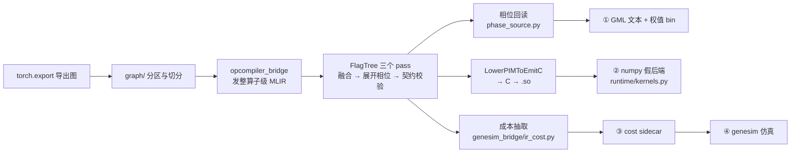
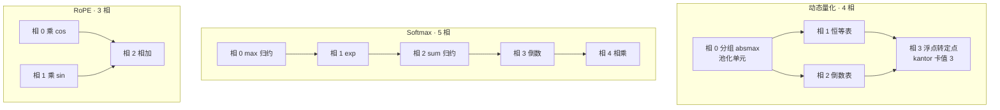

# PIMMLIR 原语落地实现（2026-09-26）

本文归纳 PIMMLIR 原语从方言定义到三条消费路径落地的完整改动，覆盖三个仓库。
此前多轮的评审、修正、复核记录已并入本文第七节，原文删除。

## 一、修改概述

### 1.1 三个仓库的改动范围

| 仓库 | 路径 | 状态 | 规模 |
| --- | --- | --- | --- |
| FlagTree 算子编译器 | `flagOS-installers/FlagTree` | 最新提交 `ec55fb23`（2026-09-25） | 33 文件，+7109 / -276 |
| pim-compiler 集成 | `flagos-pim-compiler` | 未提交 | 78 个已跟踪文件 +7535 / -3467，另有 12 个新增源码/测试文件 |
| genesim 仿真 | `genesim` | 未提交 | 20 文件，+1408 / -150，另有 1 个新增测试文件 |

### 1.2 一条链路，四件产物



四件产物必须同源：同一个算子级 IR 既编出 C，又回读出 GML 字段，又量出成本。
`tests/test_gml_depends_on_opcompiler.py` 用「改动一个相位值，GML 文本必须随之改变」
钉住这条同源关系。

## 二、原理

### 2.1 两条互不降级的路径

| 路径 | 输入 | 经过的 pass | 产物 |
| --- | --- | --- | --- |
| A 路（分块级） | `tt.dot` + `tt.load/store` 的 Triton 核 | `-pim-tile-to-budget` → `-pim-explicit-dma` | 按 tasklet 静态展开的 C |
| B 路（算子级） | 整算子 `pim.*`（张量进、张量出，无 DMA） | `-pim-fuse-activation` → `-pim-expand-phases` → `-pim-verify-gml-contract` → `-pim-lower-to-emitc` | 逐相遍历的 C |

两条路**不允许互相兜底**。A 路产物缺 `pim.dma_*` 就报错，不看它有没有 `tt.dot`——
逐元素核本来就没有 `tt.dot`，用它当「这是 A 路」的代理会让没跑起来的 DMA 静默通过。

### 2.2 相位模型

「相位」是属性而非算子，写在算子级 op 上：

```
#pim.phase_spec<index, bytes, unit, forceConsecutive, reads>
```

| 字段 | 含义 | 校验 |
| --- | --- | --- |
| `index` | 相位号。是**同一条链内**的遍历序号，不是函数级全局编号 | 非负 |
| `bytes` | 该相的逻辑字节数 | 必须为正（不搬东西的相不占一次遍历） |
| `unit` | 落在哪个硬件块 | 展开后的相不得停在 `cstl`（它同时代表六个块） |
| `reads` | 读哪些相 | 只许读严格更早的相，否则描述硬件排不出的环 |

`reads` 表达的是**扇出**而非串行。动态量化的相 1（恒等表）与相 2（倒数）都读相 0；
串行化仍能产出可加载的图，只是倒数错 256 倍。这条由 `VerifyGmlContract.cpp` 的
`verifyDynamicQuantFanOut` 按链强制。

三条标准相位链：



`softmax` 的稳定化 `x - max` 折进 exp 相的 FPSU 仿射，**不占相位**（不带 `phases`）。
`rope` 三相全部 `forceConsecutive`（共用中间缓冲）。

### 2.3 各层数量总览

| 层 | 数量 | 说明 |
| --- | --- | --- |
| FlagTree 方言 op | 37 | 12 个分块级脚手架 + 25 个算子级 |
| 图格式入口原语 | 14 | 方案表 1.2.4 的设备侧助记符 |
| pim-compiler 发射点 | 14 | `genesim_bridge/op_classify.py::MNEMONICS` |
| 走算子编译器的内核 | 16 | 14 个入口 + `linear`（A 路）+ `convert` |
| genesim 新增操作码 | 9 | `0x26`–`0x2E` |

## 三、新增与扩展的原语

### 3.1 本轮提交新增的算子级 op（6 个）

FlagTree 的 op 总数从 31 增至 37。

| op | 类别 | 语义 |
| --- | --- | --- |
| `pim.dynamic_quant` | 量化 | 整算子形态的分组动态量化，展开成四相链；两个结果是量化张量与逐组 scale |
| `pim.fpsu_scale` | 量化 | 定点定标单元的单次仿射扫描：加 f32 偏置、乘 16 位 scale、舍入、右移、饱和 |
| `pim.kantor` | 量化 | 逐元素乘单元的一次变换：乘第二操作数、浮点与定点互转、或移位 |
| `pim.convert` | 量化 | 仅改元素类型的格式转换，不带缩放 |
| `pim.global_pool` | 池化 | 池化单元上的分组归约，把末轴每 `groupSize` 个元素折成一个 |
| `pim.gather` | 搬运 | 按 `indices` 逐行读 `table`，即词嵌入；纯寻址无算术 |

其中 `pim.dynamic_quant` 解决了「GML 的 `DynamicScaling` 字段族在 IR 里没有载体」
这条老问题——此前只能写成 `pim.quantize {dynamic}`。

### 3.2 本轮扩展的既有 op（13 个）

| op | 新增字段 |
| --- | --- |
| `pim.matmul` | `weightScales` 操作数、`lutTable` 操作数、`flpMinExp`/`flpMaxExp`/`flpMantisa`、`activationMode`、`specialOperators`、`weightBinding`、`contraction`、`combineMode`、`stationarity` |
| `pim.conv` | `contraction` |
| `pim.lut` | 插值窗口三元组、`activationMode`、`specialOperators`、`fpsuScale`、`transposePurpose` |
| `pim.eltwise` | 定长 `lhs`/`rhs` 改为变长 `operands`；新增 `perSlotDatapath`、`contraction`、`combineMode`、`rotateHalf`、`transposePurpose`、`sourceSubBlocks`、`sourceBroadcastSpec` |
| `pim.normalize` | `epsilon` 由属性改为**张量操作数**；新增 `vpuParams` |
| `pim.rope` | `tailCardValue`、`subBlocks`、`broadcastSpec` |
| `pim.kv_cache` | `indices`、`updatesSf`/`updatesZp`、`mode`、`inputBufferPolicy`、`fpsuSpec` |
| `pim.mask` | `layout`（`vector` / `causal_tril`） |
| `pim.transpose` / `reshape` / `split` / `concat` / `split_heads` | `onthefly`，`transpose` 另有 `purpose` |

另有 17 个算子级 op 通过新基类 `TTPIM_OperatorAttrs` 统一取得四个字段：

| 字段 | 类型 | 用途 |
| --- | --- | --- |
| `phases` | `OptionalAttr<ArrayAttr>` | 相位链上每相的编号、字节数与扇入 |
| `isPhased` | `UnitAttr` | 上一条的显式标记，与 `phases` 互为两种写法 |
| `fpsu` | `OptionalAttr<TTPIM_FpsuSpecAttr>` | 该相落在定点乘加块上的配置 |
| `kantor` | `OptionalAttr<TTPIM_KantorSpecAttr>` | 该相落在逐元素乘块上的配置 |

### 3.3 新增的结构化属性

上一版用**裸字符串**传的硬件字段，本轮全部收编成带校验器的 ODS 属性。
理由写在代码注释里：类型写错在方言层即报错，否则会在 Python 侧按正则读文本时
表现为「字段静默丢失」。

| 属性 | 载荷 | 关键校验 |
| --- | --- | --- |
| `#pim.phase_spec` | 见 2.2 | 见 2.2 |
| `#pim.fpsu_spec` | `mode`、`spc`/`spcAxis`、`spg`/`spgAxis`/`spgGroupSize` | 置位则轴号非负，组宽为正 |
| `#pim.kantor_spec` | `mode`、`cardValue`、`blocks` | 同一物理块不得配置两次 |
| `#pim.weight_binding` | `format`、`role`、`elemBits`、`groupSize`、`sfMultiplier`、`contentHash` | `elemBits` 只能 4 或 8；`sfMultiplier` 必须是 2 的幂；`contentHash` 是 64 位小写十六进制 |
| `#pim.contraction` | `form`（`named` / `flat`）及各形字段 | 两形互斥 |
| `#pim.broadcast_spec` | `axes`、`repeats` | 必填、非空、等长、每项为正 |
| `#pim.transpose_purpose` | `purpose`、`cardValue` | 纯轴转置不得带卡值 |
| `#pim.vpu_params` | `axis`、`useScaling` | 无校验器，默认值即参考产物实测值 |

新增枚举 13 个，其中两个值得单独说明：

- `FunctionalUnit` 由 4 值扩到 **9 值**。原先一个 `cstl` 代表六个块，成本抽取分不出
  遍历类型；0–3 的序数保持不变以兼容旧汇编往返。
- `ActivationKind` 追加 `identity`（序数 11），排在第 12 位以保住前 11 个序数。
  动态量化相 1 的恒等表原先被误记为 `relu`。

### 3.4 覆盖率：目标格式的原语已全部接上

**判据是集合相等，不是「非零即可」**：

| 判据 | 位置 | 内容 |
| --- | --- | --- |
| 发射侧覆盖 | `tests/test_genesim_bridge.py::test_model_ir_covers_all_mnemonics` | 在整份 `llama2_7b.ir` 上导出，断言覆盖到的助记符集合 **恰好等于** 14 个，多一个少一个都失败 |
| 编译侧覆盖 | `tests/test_runtime_compiled_coverage.py::test_the_compiled_set_is_what_the_docs_claim` | 从源码文本抠出真正调 `compile_op` 的算子，断言 **恰好等于** 16 个 |
| 逐个非零 | `test_every_mnemonic_has_a_representative_ir_and_a_nonzero_cost` | 14 个助记符各量一遍，算力类必须 `flops > 0`，搬运类必须 `mram_traffic_bytes > 0`，且不许留下「循环次数没折叠」这类低估提示 |
| 反向闭合 | `test_unknown_mnemonic_is_rejected` / `test_known_but_unbilled_operator_is_noted` | 表里没有的助记符直接抛；登记了却没有计费规则的必须留一条 note，不许静默记 0 |

**结论**：对目标格式（llama2 7B W4A8）实际用到的算子，FlagTree 方言、算子编译器、
numpy 假后端、genesim 四条链已全部接上（14 个入口原语、16 个编译内核、9 个新操作码）。

方言中**尚无发射点**的算子级 op 有 5 个，它们不属于目标格式的算子集，本不该发：

| op | 状态 |
| --- | --- |
| `pim.conv` | 方言已立，Python 侧无发射点；仅在与 C++ 融合表对拍时被引用 |
| `pim.convert_layout` | Python 侧无发射点，但 TTIR→PIM 类型转换器会**自动插入**（pimir IR 里 4544 处）。零成本是它的语义（NoMemoryEffect、EmitC 降成零代码）；已登记进 `ir_cost.py` 的 `_ZERO_COST_OPS`，此前完整性守卫按「未识别」刷 4544 条 note |
| `pim.dequantize` | 无发射点、无计费规则 |
| `pim.pool` | 无发射点；只作为被融合对象存在（折进主算子的 `fusedPool`） |
| `pim.split` | 无发射点；`pim.split_heads` 才是入口原语。计费表已把它移出「已知」，出现即留 note |

## 四、修改的文件

### 4.1 FlagTree

| 文件 | 改动 |
| --- | --- |
| `include/triton/Dialect/TritonPIM/IR/PIMOps.td` | +522。6 个新 op；`TTPIM_OperatorAttrs` 基类；13 个既有 op 扩字段 |
| `include/triton/Dialect/TritonPIM/IR/PIMAttrDefs.td` | +649。8 个结构化属性、13 个枚举 |
| `include/triton/Dialect/TritonPIM/IR/Dialect.h` | +32。`AttrRtlVersionName`、`HardwareBlock`、`SpcSpg`、`deriveHardwareAxes` 声明 |
| `lib/Dialect/TritonPIM/IR/Dialect.cpp` | +328。属性 verifier 与 `deriveHardwareAxes` 实现 |
| `lib/Dialect/TritonPIM/IR/Ops.cpp` | +669。6 个新 op 的 verifier + 9 个既有 op 扩校验 |
| `lib/Dialect/TritonPIM/Transforms/ExpandPhases.cpp` | +308 / -138。裸字符串属性改为结构化属性；DQ 相 3 改发独立 `pim.kantor` |
| `lib/Dialect/TritonPIM/Transforms/FuseActivation.cpp` | +86。新增 `graphFormatName` 与 `namedContraction`；带表的 matmul 也能折 |
| `lib/Dialect/TritonPIM/Transforms/VerifyGmlContract.cpp` | **新增 342 行**。跨属性不变量，只读不修 |
| `lib/Dialect/TritonPIM/Transforms/LowerPIMToEmitC.cpp` | +1566。拆成「分块级」与「算子级」两个互斥入口 |
| `lib/Dialect/TritonPIM/Transforms/pim_silu_lut.h` | +4。SiLU 查表注入宏 |
| `python/src/passes.cc` | +10。注册 4 个 pass 包装器 |
| `test/Dialect/TritonPIM/*.mlir` | 新增 12 个文件，另改 5 个 |

### 4.2 pim-compiler

| 目录 | 改动 |
| --- | --- |
| `contracts/` | 新增 `fusion_contract.py`（融合条件唯一真源）、`gml_hw_constants.py`（常量表从 `gml_hw_table.py` 拆出）；`gml_hw_table.py` 只留派生算法并新增 `derive_hardware_axes`；`gml_coverage.py` 扩容并纠正 `idx` 语义；`op_contract.py` 新增 6 个请求字段 + `by_value`；`compile_slots.py` 新增 `dq_layout`；`gml_lut.py` 新增 `eval_lut` |
| `gml_bridge/` | `from_fx.py`（+671）。新增 `Convert` 与 `Gather` 两个算子类型；形状推导全链重写（取消 `"unknown"` 兜底、序列轴按值定位、`Split` 按 Q/Kᵀ/V 三种消费者角色分化）；`export.py` 新增 `IO_info.txt` 与 `fill_weight_hashes` |
| `opcompiler_bridge/` | 新增 `oplevel_kernel.py`（362 行，15 个算子的 IR 文本发射器，`driver` 与 `oplevel_emitter` 共用）；`driver.py` 新增 15 个算子分支与 `ToolchainUnavailable`；`phase_source.py` 补 `-pim-verify-gml-contract`；`phase_plan.py` 解析口径改为 ODS 属性 |
| `runtime/` | `kernels.py`（+1027）。白名单从 4 项扩到 34 项；`exec_plan_gen.py` 新增 `dpu_slice` 重分发、SDPA 信息在编译期冻进载荷；新增 `kernels_pim.py`（183 行，助记符级 numpy 镜像，供编译内核逐元素对拍）；`executor.py` 删除主机侧 `_host_softmax` |
| `graph/` | `partition.py` 分区判据从白名单翻转为**黑名单**；`spec_prop.py` 规则表扩到 30 余项，缺规则的设备算子改为当场抛错；`fuse.py`/`fuse_pim.py` 改引 `contracts.fusion_contract` |
| `genesim_bridge/` | `op_classify.py` 配方从 4 个扩到 17 个；`ir_cost.py`（+291）新增助记符归一表与四类计费；零成本表补 `pim.convert_layout`；`flagtree_driver.py` 新增 `lower_oplevel_to_pimir` 与两道工具链自检；`placement_export.py` 新增 B 路条目 |
| `quant/` `comm/` `memory/` `backend/` | `activations.py` 公式改调 `phase_data` 单一真源（两份实现实测 4096 个元素里 23 个差 1）；`comm/plan.py` 的 `local_slice` 从占位改为真正展开；`hal_numpy.py` 新增 `bind_inputs` |

### 4.3 genesim

| 文件 | 改动 |
| --- | --- |
| `src/pim/pimir_trace.py` | +271。新增**整算子级相位链前端**，把 pim mlir 文本翻译成指令序列，替代手写模板 |
| `src/pim/pim_isa.py` | +48。9 个新操作码与便捷构造器 |
| `src/pim/pim_compiler.py` | +86。9 个 `compile_*` 入口 |
| `src/ir/model_ir.py` | +344。`Operator` 新增 `source_name` / `mram_traffic_bytes`；`build_from_hf_config` 重建前向链 |
| `src/scheduler/gene_sim_scheduler.py` | +215。提取 `ATTENTION_OP_TYPES`；新增成本 sidecar 读取；整层视图算子按分片均分 |
| `src/backend/gpu_backend.py` | +11。纯搬运算子的 `flops` 恒为 0，此前被短路成启动开销，访存量再大也不计费 |
| `src/vpu/vpu.py`、`conf/sim.yaml`、`src/config_loader.py` | 补 9 个算子与周期数 |

## 五、关键函数与数据结构

### 5.1 关键函数

| 函数 | 位置 | 职责 |
| --- | --- | --- |
| `deriveHardwareAxes(spec, block)` | FlagTree `Dialect.cpp` | 一份量化决策投影到定点块、池化块、逐元素乘块三处，**派生而非查表** |
| `derive_hardware_axes(layout, block)` | `contracts/gml_hw_table.py` | 上一条的 Python 侧同口径实现，由测试逐格对拍 |
| `verifyIndicesInOneChain` / `verifyDynamicQuantFanOut` / `verifyPhaseUnitIsSpecific` | FlagTree `VerifyGmlContract.cpp` | 单点校验器看不到的跨属性与时序不变量 |
| `lowerFunc` 分派 | FlagTree `LowerPIMToEmitC.cpp` | 按第一个实参类型分流：`!tt.ptr` 走分块级，`RankedTensorType` 走算子级 |
| `compile_op(request, force)` | `opcompiler_bridge/driver.py` | 统一算子编译入口：发 IR → 跑 pass → 翻 C → gcc 出 `.so` |
| `lower_oplevel_to_pimir(text)` | `genesim_bridge/flagtree_driver.py` | 整算子级 IR → 相位链 IR |
| `oplevel_ir(dims, mnemonic, point)` | `genesim_bridge/op_classify.py` | 按助记符发代表形状的 IR；缺名字直接抛 |
| `analyze_ir(...)` 的计费分支 | `genesim_bridge/ir_cost.py` | 四类计费：算力、权值驻留搬运、视图类搬运、相位说明里的字节数 |
| `parse_phase_chain` / `compile_phase_chain` | `genesim/src/pim/pimir_trace.py` | 按 `#pim.phase_spec` 抽相，每相发 `LOADN` + 该单元 opcode + `STOREN` |
| `sdpa_kv_info(node, kv_specs, ...)` | `runtime/kernels.py` | 把 KV 区域信息冻进命令载荷（此前用模块全局变量，连续三种策略互相覆盖） |

### 5.2 关键数据结构

| 结构 | 位置 | 要点 |
| --- | --- | --- |
| `HardwareAxes` | `contracts/gml_hw_table.py` | frozen dataclass：`spc`/`spc_axis`/`spg`/`spg_axis`/`spg_group_size` |
| `OpCompileRequest` 新字段 | `contracts/op_contract.py` | `group_size`、`activation`、`tail_card_value`、`sf_multiplier`、`kind`、`out_dtype` |
| `OpCompileResult.by_value` | 同上 | 标明哪些形参是按值标量，供 ctypes 设真实形参类型 |
| `KernelEntry` | `runtime/kernels.py` | `mirror`（numpy 镜像）+ 可选 `compiled`。**`compiled` 只有 `linear` 一处使用**；B 路内核由各 kernel 函数内部调 `_compiled_*` 工厂，不经过这个字段 |
| `SdpaInfo` 冻入载荷 | `runtime/exec_plan_gen.py` | 取代模块级全局 `kv_specs` |
| `Operator.source_name` / `mram_traffic_bytes` | genesim `src/ir/model_ir.py` | 成本 sidecar 的落点；后者覆盖系数拟合值 |
| `PhaseStep` | genesim `src/pim/pimir_trace.py` | `index` / `op` / `unit` / `in_bytes` / `out_bytes` |

## 六、实验验证

### 6.1 命令与结果

| 层级 | 命令 | 结果 |
| --- | --- | --- |
| 本仓快速回归 | `pytest tests/ -q -k "not llama2_7b"` | **878 passed, 2 skipped, 42 deselected**（167.14 秒） |
| B 路核心验收 | `pytest tests/test_opcompiler_ops.py tests/test_oplevel_emitter_live.py tests/test_phase_plan_live.py tests/test_phase_source.py tests/test_phase_plan.py -q` | **82 passed**，无跳过 |
| 覆盖率与契约 | `pytest tests/test_runtime_compiled_coverage.py tests/test_op_classify.py tests/test_ir_cost.py tests/test_fusion_contract.py tests/test_flagtree_ods_hygiene.py -q` | **33 passed** |
| 桥接与内核 | `pytest tests/test_genesim_bridge.py tests/test_placement_export.py tests/test_kernels.py tests/test_gml_coverage.py tests/test_gml_export.py -q` | **104 passed, 2 skipped** |
| FlagTree 用例 | 按 RUN 行用 `triton-opt` + `FileCheck` 逐条执行 `test/` 全树 | **272 通过 / 0 失败**（其中 `test/Dialect/TritonPIM` 34 条全过） |
| FlagTree pass 存在性 | `triton-opt --help \| grep pim` | 6 个 pass 齐备，含本轮新增的 `--pim-verify-gml-contract` |
| genesim | `.venv/bin/python -m unittest tests.sim.test_pimir_trace tests.sim.test_cost_sidecar tests.sim.test_pim_compiler tests.sim.test_config_loader tests.sim.test_gpu_backend` | **111 项 OK**（0.378 秒） |
| genesim | `.venv/bin/python -m unittest tests.sim.test_model_ir tests.sim.test_compiler_placement tests.predictor.test_collect tests.sim.test_partition_compute_graph_with_runtime` | **123 项 OK**（16.2 秒） |

环境前提：`source /media/disk/fengjingge/src/flagOS/flagOS-installed/pytorch/env-pytorch.sh`。
FlagTree 的二进制在 `flagOS-installed/flagTree/build/flagtree-cmake/`，其
`CMakeCache.txt` 的 `CMAKE_HOME_DIRECTORY` 指向本仓源码树，构建时间（09-25 20:36）
晚于提交时间（09-25 20:25），即被测二进制确实包含本轮改动。

### 6.2 判据设计要点

评审中反复出现的一类问题是「判据自身不可能失败」——测试全绿只说明它没在测东西。
本轮确立并落到代码里的几条：

| 要点 | 例证 |
| --- | --- |
| 判据要比**产物**，不比内部函数 | 「启用算子编译器前后 GML 逐字节相同」 |
| 判据要能红 | 组反量化的定标因子选 2 的幂且**一个元素都不饱和**；落在 ±127 上的元素两种顺序都钳位成 127，那种「相同」来自钳位而非算法 |
| 集合相等优于「非零即可」 | 14 个助记符与 16 个编译内核都是集合相等断言 |
| 缺名字要抛，不许静默记 0 | `ir_cost.py` 分「未识别」与「没有计费规则」两档留 note |
| 编译失败不许回退镜像 | 只有 `ToolchainUnavailable` 允许回退；编译器的 `ValueError`/`RuntimeError` 一律上抛 |

### 6.3 已复现的缺陷修复（举三例）

| 缺陷 | 症状 | 判据 |
| --- | --- | --- |
| `_cache_key` 漏 `out_dtype` | f16→i8 与 f16→f32 落到同一个 `.so`；`ctypes.CDLL` 按路径缓存句柄，第二次拿到第一份代码，数值全错而形状全对 | `tests/test_opcompiler_ops.py` 的 convert 对拍 |
| SDPA 用模块级全局 `kv_specs` | 连续三种切分策略互相覆盖，解码结果错 | `tests/test_strategy_sweep.py` |
| 相位链解析丢相 | 42 份真实展开 IR 声明 197 相，只解析出 51 相（行里带类型属性 `axis = 1 : i64`，按第一个冒号切分会把属性字典腰斩） | `tests/sim/test_pimir_trace.py` 逐相对齐（5 相必须解析出 5 相、顺序、单元、字节数逐项相等） |

## 七、多轮评审收敛的问题（归纳）

此前共 29 份评审/修正/复核记录，按主题去重后的收敛情况如下。

### 7.1 已收敛

| 主题 | 代表问题 | 收敛方式 |
| --- | --- | --- |
| 静默失败 | 不认识的 `pim.*` 记 0 成本；编译失败被吞掉；EmitC 静默填默认 eps | 分档留 note；只捕 `ToolchainUnavailable`；epsilon 改为必填操作数 |
| 假绿判据 | `idx` 从未生成却被标为「不适用」，覆盖率测试因此恒真 | 反向查找 `_stamp_idx`，把它移进已产出集 |
| GML 几何口径 | 序列轴按位置而非按值定位；token 轴与 KV 长度轴混为一谈 | 按值定位 + `Split` 三路按 Q/Kᵀ/V 分化；对参考 dims 差异 124 → 2 |
| 跨仓裸字符串 | `pim.kantor-mode` 改名即静默失效 | 收编为 ODS 属性 `tailCardValue`，校验器只收 0 或 3 |
| 工具链不同源 | 进程内 `libtriton.so` 与 `triton-opt` 分别构建，行为不一致 | 新增 `_check_inprocess_matches_triton_opt()` 探针 |
| 运行时覆盖不足 | 运行时只调用 3 个助记符 | 编译内核从 5 个扩到 16 个，并有集合相等判据钉住 |
| 主机/设备划分 | 37/75 个算子留在主机 | 分区改为黑名单；主机侧降到 10 个，全是编译脚手架 |

### 7.2 评审确立的规范

1. 先让判据能红，再改实现。
2. 不采信自评，逐条实测复现。
3. 注释不是判据，测试才是判据。
4. 不写防御性兜底：形状未知就抛，不猜默认值。
5. 删优于加：零调用点的代码直接删。
6. 跨仓传值不得用裸字符串属性，一律收编进 ODS 带校验器。
7. 属性校验器管「单点性质」，pass 管「时序性质」（如「展开之后」），重复实现无增量。

## 八、当前存在的问题

### 8.1 明确取舍（有意为之）

| # | 条目 | 理由 |
| --- | --- | --- |
| 1 | SDPA 留在主机端 | 蓝图已拆开，运行时未拆。绕开 `make_sdpa_handler` 会让解码从第二个 token 起全错且不报错。**这是三轮「未做」清单里唯一贯穿全线的硬骨头，需要定案** |
| 2 | `pim.convert` 没有发射点 | 方案 §5.20 要求「ODS 先立、展开不发」 |
| 3 | 32 层全量导出不做 | 方案 §9.3 明确不作合入门槛 |
| 4 | sidecar 默认关闭 | `genesim:conf/sim.yaml:41` |
| 5 | `refine_ir_with_flagtree.py` 两仓各一份 | 跨仓不合并合理，但会漂移 |

### 8.2 待立项

| # | 条目 | 现状 |
| --- | --- | --- |
| 1 | 视图族与 `to.dtype` 真下设备 | 基础设施（`local_slice` + 重分布边去重）已有；真下设备后解码对拍变成 `[0,0,0]`，切分维随重排变化、落地缓冲与内核 `out_shape` 对不齐，**已退回主机** |
| 2 | 掩码操作数从未被读取 | 反向验证：把掩码换成全 `-inf` 仍得到相同的 token `[593, 21275, 1007, 5585]`。**这一条不用等拆头定案，可独立修复** |
| 3 | B 路 trace 没有运行时绑定 | 成本由编译期占位形状决定。符号维取 `_SYMBOLIC_DIM = 128`（`genesim_bridge/placement_export.py:137`），代码注释写明「只要不是 1 这种极端退化值即可」——即它不是真实形状；`runtime_parameterized` 是一个只写不读的标志（写在 `gene_sim_scheduler.py:2022`，全仓无读者）；2880 个 trace 里 2432 个没有间接循环 |
| 4 | `contracts/op_contract.py` 的 `group_size` 一字段五义 | matmul 组宽、kv_cache 的 `indexed` 布尔、split_heads 头数、concat 轴号、dynamic_quant 真组宽。改动面大，评审明确排在最后 |
| 5 | `pim.normalize` 的 `vpuParams` 未被读 | int8 权重走 `pim_i8_to_f32`（就是 `(float)v`，**差 128 倍**）且无诊断 |
| 6 | 剩下 2 条边的 Transpose 拓扑差异 | 形状口径已对齐，参考是 Gemm 直连 RoPE，我方多一跳布局节点 |
| 7 | `LowerPIMToEmitC.cpp` 2324 行 | 超方案 §4.4 的 200 行约束 |

### 8.3 悬空字段与无消费者的原语

| 结构 | 状态 |
| --- | --- |
| `pim.rope` 的 `subBlocks` / `broadcastSpec` | 有校验器但无生产方；真源仍在 Python 静态表 `ROPE_UNITS` 里。**两处语义已经不一致**（方案说是 6 个 `#pim.fpsu_spec`，校验器按 6 个名字核对），要先定案 |
| `#pim.combine_mode` | 零生产、零消费 |
| `pim.transpose` 的 `purpose` | 无写入点，语义在 IR 中实际不存在 |
| `pim.fpsu_scale` / `pim.dequantize` / `pim.conv` / `pim.pool` | 四个原语没有任何消费者 |
| `pim.rtl-version` | 仍是裸字符串跨仓传（写侧 `oplevel_emitter.py`，读侧 `phase_source.py` 正则抠） |
| GML 字段源迁移 | 部分完成：相位计数与 7 个相位字段已迁移到算子编译器；`global_pooling_*`、`nmu_mode`、`weight_format`、`vpu_params` 等仍来自常量表 |

### 8.4 环境陷阱（会制造假结果）

| # | 陷阱 | 规避 |
| --- | --- | --- |
| 1 | `/dev/shm` 被占满时 FlagTree 的 lit 与 FlagGems 的 `LibEntry` 都报 `ENOSPC` | 用私有 `/dev/shm`。本次实测该目录 **504G 已 100% 占满**，`unshare` 在当前沙箱内不可用，改用「按 RUN 行直接执行 `triton-opt` + `FileCheck`」的等价方式 |
| 2 | FlagTree lit 的假绿：`$TRITON_BUILD_DIR/test/Dialect/TritonPIM` 是空目录，对着它跑会得到「20 tests, 100% passed」 | 必须对着源码树跑；反假绿验证：假 `triton-opt` 抢 PATH 仍全绿、变异测试能被 `FileCheck` 报错 |
| 3 | 两份 `libtriton.so` 不同源 | `source` 哪个环境决定加载哪一份绑定；已加探针自检 |
| 4 | 全局状态污染：`test_opcompiler_e2e_llama2_7b` 导入 `flag_gems`，后者在导入时替换 aten | 该用例独立运行 |
| 5 | 测试内硬编码绝对路径 | `tests/test_gml_node_parity.py:36` 指向的目录已不存在，该文件整体跳过（本次回归的 2 条 skipped 之一）；`tests/test_gml_export.py:447` 有 skip 兜底 |

### 8.5 挂账

`llama2_7b` 那组有 8 条失败，已排除与本轮改动的关系（把本轮动过数值的三处全部按
改动前写法禁用后，失败的仍是同样那 8 条）。失败信息指向 `tp4_pp2 layer0 dpu0 head0`
的 K 区不匹配（max diff 0.6396），比的是写进 KV 缓存的内容，且**只有 `tp4_pp2`
这一个策略失败**，问题在切分或 KV 布局。这一组未纳入本文的回归命令。
