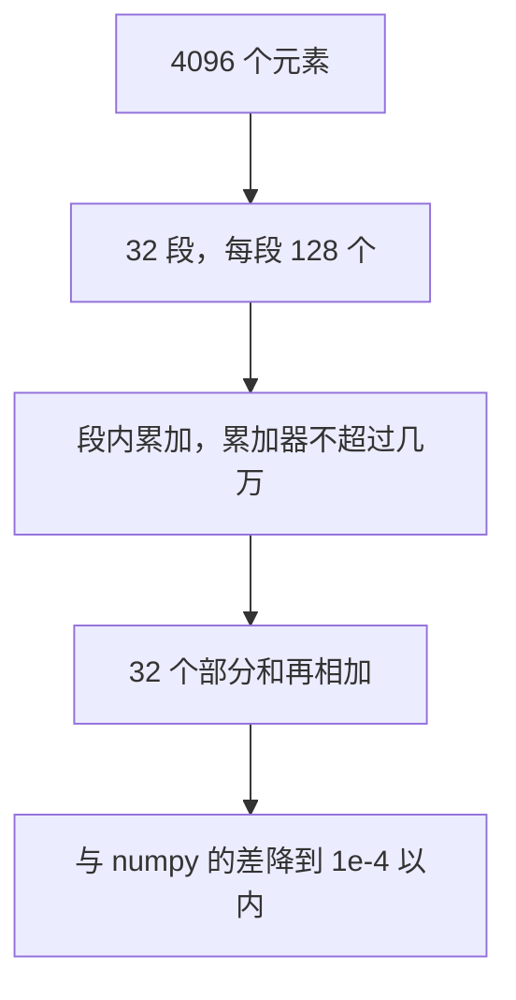

# 长归约分段累加（2026-10-07）

## 改了什么

`tests/test_strategy_llama2_7b.py` 的 `tp8_pp1` 两个用例失败。贪心解码从第一个
token 就偏了（`[11, 12, ...]` 对 `[17, 18, ...]`），KV 区的 K 也跟着对不上。
`tp2_pp4` 和 `tp1_pp8` 不受影响。

原因在 FlagTree 的归约降级。`pim.reduce_axis` 的加法用一个 fp32 累加器从头加到
尾。fp32 尾数只有 23 位，4096 个几百量级的平方加下去，累加器涨到几十万，后面
加进来的数被舍掉。一行的和能偏出 1，均值偏 0.001。RMSNorm 每层都做一次这种
求和，32 层之后把第一个 token 推偏。

修复是把加法拆成两级。每 128 个元素先在自己的累加器里求部分和，再把部分和加进
总和。每段的累加器只到几万，舍入与 numpy 的分块求同一个量级。取最大值不受累加
器量级影响，保持原来的一次循环。

## 改了哪些文件

| 仓库 | 文件 | 改动 |
| --- | --- | --- |
| FlagTree | `lib/Dialect/TritonPIM/Transforms/LowerPIMToEmitC.cpp` | 加法归约按 128 分段累加，末段不满时越界元素乘 0 |
| flagos-pim-compiler | `tests/test_opcompiler_ops.py` | 新增 `test_wide_sum_keeps_numpy_precision`，4096 宽的求和与 fp64 参考比，容差 1e-4 |

行数：FlagTree `+67 / -17`，flagos-pim-compiler `+40 / -0`。

## 为什么只改加法

取最大值的归约（softmax 求最大值）累加器不涨，没有这个精度问题，保持一次循环。
分段循环的部分和初值必须与总累加器一致：加法是 0，取最大是负无穷。调试时一度
把取最大也放进分段循环、内层却一律做加法，softmax 的输入溢出成 inf，第一个
token 变成 0。内层按归约种类选择加法或取最大之后恢复。

## 测试

| 用例 | 结果 |
| --- | --- |
| `test_wide_sum_keeps_numpy_precision` | 通过，4096 宽求和与 fp64 参考差在 1e-4 内 |
| `test_strategy_llama2_7b.py` 三个策略的推理与 KV | 6 个通过 |
| `scripts/run_full_pipeline.py --num-stages 4` | 通过，7138 条 trace 全部来自 pim mlir |

## 不足

分段长度 128 是按 llama2 的 4096 宽度定的。更宽的归约（比如词表维）每段的部分
和还会再涨，到时候要再拆一层。当前图里没有那种归约，没有提前处理。
