# 子图拆分映射修改说明

日期：2026-08-22

本文用于快速理解当前工作区未提交修改。主线是“问题 2：设备映射与切分传播”：在问题 1 已经给每个 FX 节点标好 `device` / `part_id` 的基础上，继续推导每个张量放在主机还是 DPU、是否切分、每个 DPU 持有哪一段，以及哪些边需要重分布。

## 一句话概括

这次修改把“哪些算子能落到 DPU”推进到“每条张量边怎么分布、哪里需要通信”：

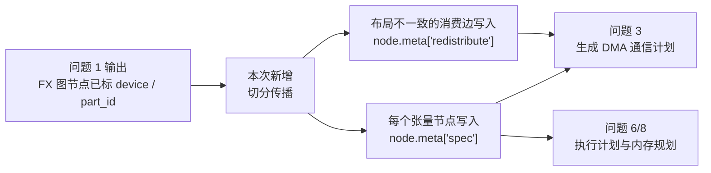

核心思想很简单：每个算子都有“我希望输入是什么布局”和“我会产出什么布局”的规则。传播器按图的拓扑顺序往后推，如果发现上游实际产出的布局和下游要求的布局不同，就在这条边上标一条 `RedistributeEdge`。

## 修改文件总览

### 已跟踪修改

| 文件 | 作用 | 本次变化 |
| --- | --- | --- |
| `contracts/graph_meta.py` | 统一定义 FX 节点 `meta` 里的键名和值 | 新增 `SPEC_META_KEY = "spec"` 和 `REDISTRIBUTE_META_KEY = "redistribute"` |
| `contracts/pim_tensor_spec.py` | 定义张量分布的公共数据结构 | 新增 `RedistributeEdge`，用于描述一条边上的逻辑重分布 |
| `graph/spec_prop.py` | 本次核心：切分传播主流程、规则表、重分布边生成、可读报告 | 从空文件变成问题 2 的主要实现 |

### 未跟踪配套文件

| 文件 | 作用 |
| --- | --- |
| `docs/spec_prop.md` | 模块级短文档，说明公开接口、设计取舍、对应方案章节 |
| `tests/test_spec_prop.py` | 小图和 tiny Llama 的结构测试，还用 `NumpyBackend` 做数值对拍 |
| `tests/test_spec_prop_llama2_7b.py` | 真实 Llama-2-7B 的端到端结构验证，依赖本地权重 |

## 关键概念

### 三种布局

`Placement` 描述一个张量在多台 DPU 上的“空间分布”。

| 布局 | 含义 | 还原完整张量的方法 |
| --- | --- | --- |
| `Replicate` | 每台 DPU 都有完整副本 | 不需要还原 |
| `Shard(dim)` | 沿第 `dim` 维切开，每台 DPU 持有一段 | 按全局顺序拼接 |
| `Partial(reduce_type)` | 每台 DPU 都有完整形状，但数值只是部分结果 | 按 `reduce_type` 做规约，例如求和 |

示意图：

```text
Replicate：
  DPU0: [完整张量]
  DPU1: [完整张量]
  DPU2: [完整张量]

Shard(0)：
  DPU0: [第 0 段]
  DPU1: [第 1 段]
  DPU2: [第 2 段]
  还原 = 按 start_idx 拼接

Partial(sum)：
  DPU0: [完整形状，部分和 0]
  DPU1: [完整形状，部分和 1]
  DPU2: [完整形状，部分和 2]
  还原 = 逐元素相加
```

### 为什么需要重分布

重分布不是运行时立即搬数据，而是编译期标记“这里将来必须搬”。例如下游主机节点要求完整张量 `Replicate@host`，但上游 DPU 节点只产出了 `Partial(sum)@dpu`，两者不一致，就生成一条 `all_reduce`。

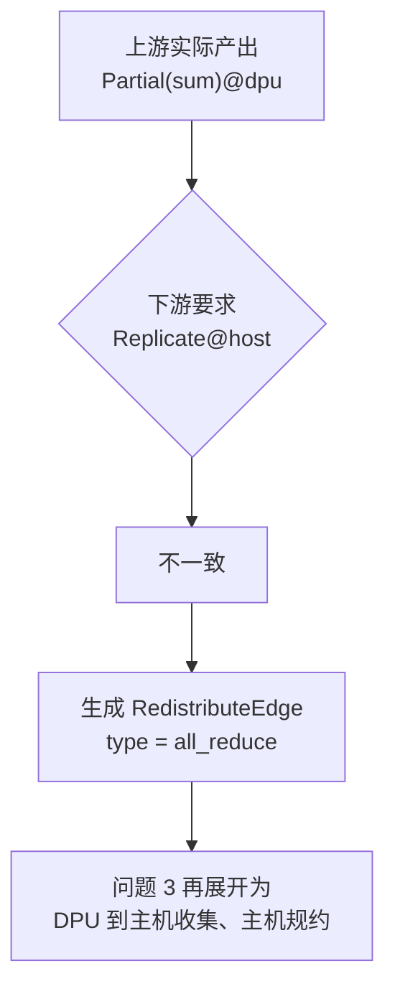

## 文件详解

## `contracts/graph_meta.py`

这个文件是 `node.meta` 键名的唯一来源，避免不同模块私自写字符串。

### 新增键

| 名称 | 字符串值 | 写入方 | 读取方 | 含义 |
| --- | --- | --- | --- | --- |
| `SPEC_META_KEY` | `"spec"` | `propagate_specs` | 通信计划、执行计划、内存规划 | 当前节点输出张量的 `PIMTensorSpec` |
| `REDISTRIBUTE_META_KEY` | `"redistribute"` | `propagate_specs` | 通信计划、调试报告 | 当前消费节点入边上需要的 `RedistributeEdge` 列表 |

原有 `DEVICE_META_KEY` / `PART_ID_META_KEY` 来自问题 1，本次新增的两个键是问题 2 的输出。

## `contracts/pim_tensor_spec.py`

这个文件承载跨模块传递的张量布局契约。

### `Placement`

描述张量布局类型。

| 字段 | 含义 |
| --- | --- |
| `kind` | `Shard`、`Replicate` 或 `Partial` |
| `dim` | `Shard` 时表示沿哪一维切分 |
| `reduce_type` | `Partial` 时表示规约类型，例如 `sum` |

### `TensorShardDetail`

描述某个 DPU 持有的具体分片。

| 字段 | 含义 |
| --- | --- |
| `dpu_id` | 分片所在 DPU |
| `shard_dim` | 沿哪一维切分；非 `Shard` 时为 `-1` |
| `start_idx` / `end_idx` | 该分片在全局张量上的范围 |
| `local_shape` | 该 DPU 本地看到的张量形状 |
| `mram_offset` | 该分片未来在 MRAM 中的偏移，本次传播阶段先保持默认值 |

### `PIMTensorSpec`

描述一个节点输出张量的完整分布状态。

| 字段 | 含义 |
| --- | --- |
| `device` | 张量当前属于主机还是 DPU |
| `placement` | 张量如何在 DPU 间分布 |
| `residency` | `pinned` 表示常驻，不允许传播器改写或重分布；`transient` 表示普通中间张量 |
| `pinned_dpu_id` | 常驻张量固定在哪个 DPU；当前权重按全体 DPU 分片，所以为 `None` |
| `shard_map` | 每个 DPU 的分片明细 |
| `reduce_type` | `Partial` 的规约类型 |

### `RedistributeEdge`

本次新增结构体，描述一条边上的一次逻辑重分布。

| 字段 | 含义 |
| --- | --- |
| `edge_id` | 全图唯一编号，后续通信计划可直接引用 |
| `src` / `dst` | 生产方节点名和消费方节点名 |
| `from_placement` / `to_placement` | 上游实际布局和下游要求布局 |
| `src_spec` / `dst_spec` | 生产方实际输出和消费方所需具化输入的完整 `PIMTensorSpec` |
| `type` | 重分布类型：`all_reduce`、`all_gather`、`all_to_all`、`scatter`、`local_slice` |
| `src_loc` / `dst_loc` | 源端和目标端位置，例如主机或全体 DPU |
| `nbytes` | 逻辑张量总字节数 |
| `reduce_type` | 仅 `all_reduce` 使用，例如 `sum` |

注意：`RedistributeEdge` 只记录“逻辑上要做什么”。具体拆成几段 DMA、每段搬哪一段、写入哪个偏移，是问题 3 根据两端的 `PIMTensorSpec.shard_map` 再展开。特殊地，`Replicate@dpu -> Replicate@host` 仍记为 `all_gather`，但问题 3 必须把它下沉为退化的一份完整副本：仅从 `min(edge.src_spec.shard_map)` 这台物理 DPU DMA 到 host 的 `dst_spec`，绝不能拼接各个副本。

## `graph/spec_prop.py`

这是本次主要实现。文件可以分成四段：

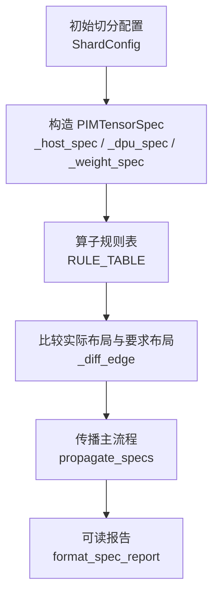

### `ShardConfig`

第 1 阶段的手工切分配置。

| 字段 | 含义 |
| --- | --- |
| `num_dpus` | 参与切分的 DPU 数 |
| `weight_rules` | 权重名子串到切法的映射，切法为 `col` 或 `row` |

`match(weight_name)` 按顺序做子串匹配，找到第一条命中的权重切法。这里不做自动求优，符合第 1 阶段“人工钉死切分”的约束。

### `llama_shard_config`

为 Llama 系模型生成默认切分配置。

规则：

| 权重 | 切法 | 对应布局 |
| --- | --- | --- |
| `q_proj.weight`、`k_proj.weight`、`v_proj.weight` | 列切 | `Shard(0)` |
| `gate_proj.weight`、`up_proj.weight`、`lm_head.weight` | 列切 | `Shard(0)` |
| `o_proj.weight`、`down_proj.weight` | 行切 | `Shard(1)` |

它还会检查切分契约：

| 检查项 | 原因 |
| --- | --- |
| `num_dpus` 必须是 2 的整数次幂 | 简化第 1 阶段切分 |
| `num_heads` / `num_kv_heads` 能被 `num_dpus` 整除 | 保证注意力按头切分时边界对齐 |
| `intermediate_size` 能被 `num_dpus` 整除 | 保证 MLP 中间维均匀切 |
| `vocab_size` 能被 `num_dpus` 整除 | 保证输出词表维均匀切 |

### `_host_spec`

构造主机张量的布局：恒为 `Replicate@host`。主机没有 DPU 分片，所以 `shard_map` 为空。

### `_dpu_spec`

构造 DPU 张量的布局。它接收目标 `Placement`、全局形状、DPU 数和驻留属性，然后调用 `_shard_map` 展开每台 DPU 的分片明细。

### `_shard_map`

把一个全局张量形状展开成逐 DPU 的 `TensorShardDetail`。

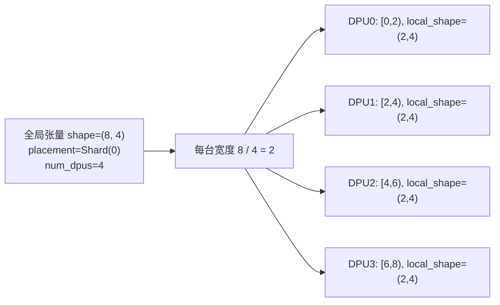

对于 `Shard(dim)`，它要求被切维度长度能被 DPU 数整除，否则直接报错。对于 `Replicate` 和 `Partial`，每台 DPU 都记录完整形状，范围记为摊平后的 `[0, numel)`。

### `_weight_spec`

为 `get_attr` 权重节点生成初始布局。

判定顺序：

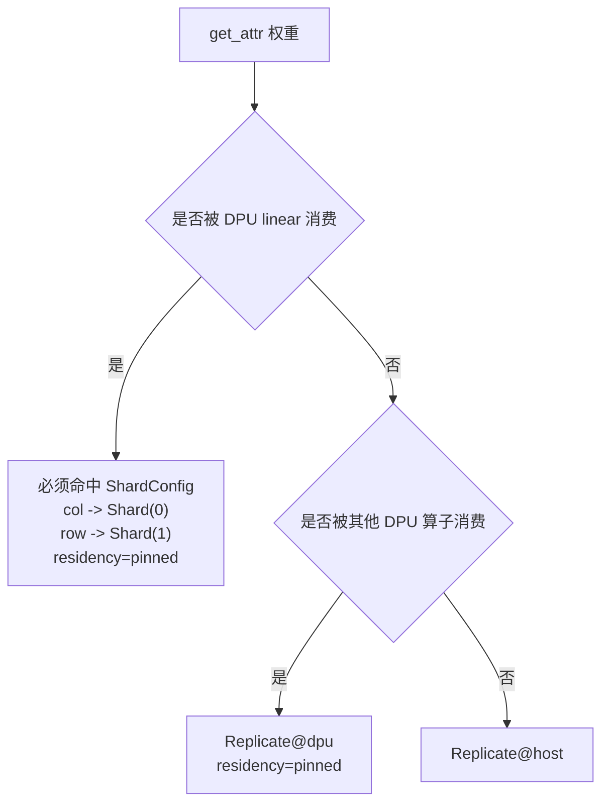

关键约束：被 `linear` 消费的权重如果没有配置切法，会直接报错。权重是 `pinned`，后续不允许被插入重分布边。

### `_Req`

规则表内部使用的小结构，表示某个输入参数“应该是什么”。它只包含两个字段：目标设备和目标布局。

`_Req` 和 `PIMTensorSpec` 的区别是：`_Req` 是消费方的要求，`PIMTensorSpec` 是生产方实际已经拥有的状态。

### `_dpu_req`

辅助函数，把一个布局包装成“要求该输入位于 DPU 上”的 `_Req`。

### `_rule_linear`

处理 `aten.linear(x, w)`，也就是 `Y = X @ W.T`。HuggingFace 权重形状是 `[out, in]`。

| 权重布局 | 输入要求 | 输出布局 | 原理 |
| --- | --- | --- | --- |
| `w = Shard(0)` | `x = Replicate` | `Shard(最后一维)` | 权重按输出维切，每台 DPU 算不同输出列，拼起来就是完整输出 |
| `w = Shard(1)` | `x = Shard(最后一维)` | `Partial(sum)` | 权重按输入维切，矩阵乘的累加维被切开，每台只能算部分和 |

两层线性层示意：

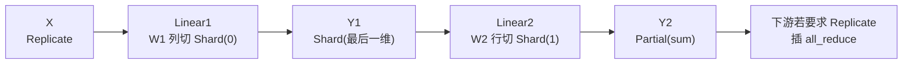

`linear` 带偏置不在第 1 阶段契约内，遇到就抛出 `NotImplementedError`。

### `_rule_addmm`

当前只保留入口，不支持 `aten.addmm`。原因是它带融合加法，相当于带偏置线性层，第 1 阶段没有定义对应切分契约。命中后明确报错，避免静默产出错误布局。

### `_rule_elementwise_binary`

处理二元逐元素算子：`aten.add.Tensor` 和 `aten.mul.Tensor`。

| 输入组合 | 输出布局 | 是否需要重分布 |
| --- | --- | --- |
| `Shard(d)` + `Shard(d)` | `Shard(d)` | 不需要 |
| `Shard(d)` + `Replicate` | `Shard(d)` | `Replicate` 端按目标布局对齐，可能是本地切片 |
| `Replicate` + `Replicate` | `Replicate` | 不需要 |
| `Partial` + `Replicate` | `Replicate` | `Partial` 端先 `all_reduce` 成完整值 |
| `Partial` + `Partial` 且规约类型一致 | `Partial` | 不需要 |
| 标量右操作数 | 透传左输入布局 | `Partial` 上标量操作不支持 |

不能处理的组合会直接报错，例如两个 `Shard` 的维度不同，或者 `Partial` 和 `Shard` 直接相遇。

### `_rule_unary`

处理一元逐元素算子，例如 `tanh`。普通布局直接透传；如果输入是 `Partial`，说明数值还没规约完整，不能直接做非线性计算，所以报错。

### `RULE_TABLE`

算子到规则函数的映射表。当前覆盖：

| 算子 | 规则 |
| --- | --- |
| `torch.ops.aten.linear.default` | `_rule_linear` |
| `torch.ops.aten.addmm.default` | `_rule_addmm` |
| `torch.ops.aten.add.Tensor` | `_rule_elementwise_binary` |
| `torch.ops.aten.mul.Tensor` | `_rule_elementwise_binary` |
| `torch.ops.aten.tanh.default` | `_rule_unary` |

这个表必须和 `graph.partition.DPU_LOWERABLE` 保持一致。否则问题 1 认为某个算子可落 DPU，但问题 2 不知道怎么传播它的布局。

### `_loc_of_spec`

从生产方的 `PIMTensorSpec` 推出源端位置。

| 输入 | 输出 |
| --- | --- |
| 主机张量 | `{"device": "host"}` |
| DPU 张量 | `{"device": "dpu", "dpus": [...]}` |

### 端点位置

`_diff_edge` 会先把消费方要求具化为 `dst_spec`，再和生产方 `src_spec` 分别交给
`_loc_of_spec` 生成 `src_loc` / `dst_loc`。因此位置来自端点的 `shard_map`：DPU 列表
是排序后的真实物理 ID，而不是逻辑的 `range(num_dpus)`。

### `_edge_type`

根据“实际布局、要求布局、设备位置”判断重分布类型。

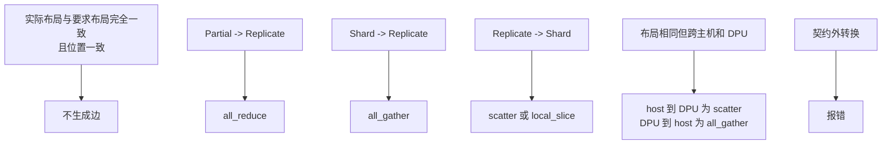

其中 `local_slice` 表示 DPU 本地已有完整副本，只需在本地取对应分片，不发生跨设备通信。

### `_diff_edge`

比较一条边的生产方实际状态和消费方要求：

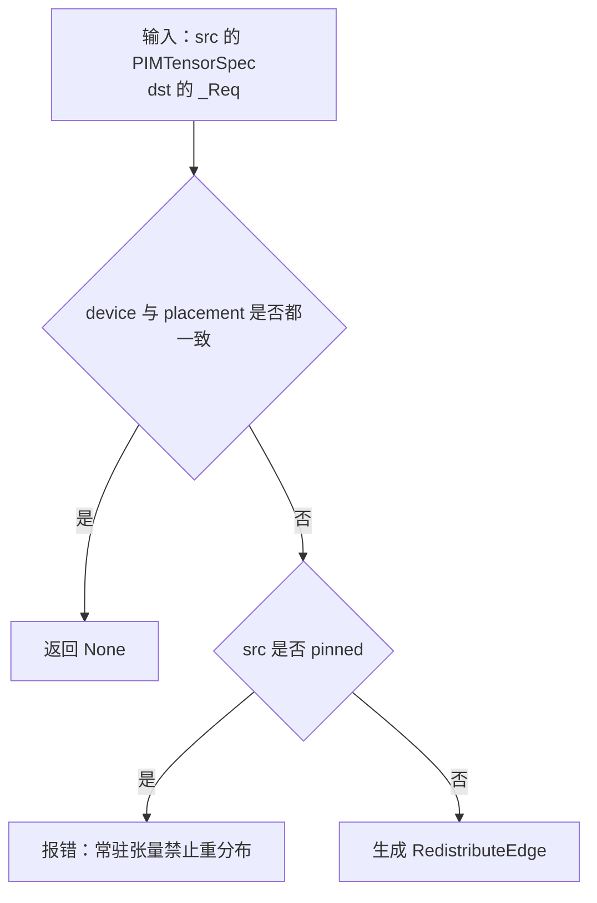

生成边时会写入：

| 信息 | 来源 |
| --- | --- |
| 边编号 | 当前边列表长度 |
| 源节点和目标节点 | FX 边两端 |
| 转换前后布局 | `PIMTensorSpec` 和 `_Req` |
| 重分布类型 | `_edge_type` |
| 源端和目标端位置 | `src_spec` / `dst_spec` 各自经 `_loc_of_spec` 推导 |
| 字节数 | `src.meta["val"].numel() * element_size()` |

### `propagate_specs`

问题 2 的主入口。

输入：

| 参数 | 含义 |
| --- | --- |
| `gm` | 已经过 `partition_graph` 的 FX 图 |
| `config` | 初始切分配置 |

输出：

| 输出 | 含义 |
| --- | --- |
| 返回值 | 全图 `RedistributeEdge` 列表 |
| 写回图上 | 每个张量节点的 `node.meta["spec"]` |
| 写回图上 | 每个消费节点的 `node.meta["redistribute"]` |

完整流程：

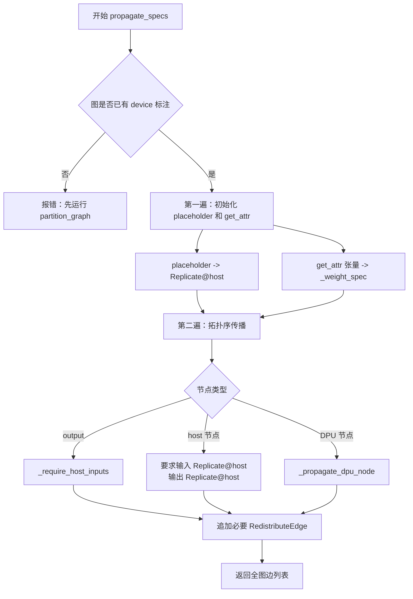

### `_require_host_inputs`

主机节点和图出口都要求输入是 `Replicate@host`。如果上游来自 DPU 或是 `Shard` / `Partial`，这里会自动触发 `all_gather` 或 `all_reduce`。

这让“主机胶水算子”和“主机合并结果”使用同一套机制，不需要在 DPU 子图边界写额外逻辑。

### `_propagate_dpu_node`

处理一个 DPU 节点：

1. 检查 `meta["val"]` 必须是张量，否则无法知道输出形状。
2. 从 `RULE_TABLE` 找到当前算子的传播规则。
3. 收集每个参数的 `PIMTensorSpec`；标量参数记为 `None`。
4. 调规则函数得到输入要求和输出布局。
5. 对每条输入边调用 `_append_edge`。
6. 给当前节点写入新的 `PIMTensorSpec`。

### `_append_edge`

调用 `_diff_edge`，如果确实需要重分布，就把边追加到全图边列表，并同时写入消费方节点的 `node.meta["redistribute"]`。

这样设计后，一个节点可以直接查看自己所有入边需要的通信动作。

### `_fmt_p`

把 `Placement` 转成人能读懂的短字符串，例如：

| 输入 | 输出 |
| --- | --- |
| `Placement("Shard", 2)` | `Shard(2)` |
| `Placement("Partial", reduce_type="sum")` | `Partial(sum)` |
| `Placement("Replicate")` | `Replicate` |

### `_fmt_placement`

把布局和设备合起来格式化，例如 `Shard(2)@dpu` 或 `Replicate@host`。

### `format_spec_report`

生成调试用的多行文本报告，包含：

| 内容 | 用途 |
| --- | --- |
| 节点布局列表 | 快速看每个节点输出是什么布局 |
| 每个节点的入边重分布 | 快速定位通信发生在哪个消费方 |
| 全图重分布边列表 | 查看边编号、类型、字节数、端点 |
| 分类统计 | 看 `all_reduce` / `all_gather` / `scatter` 的数量 |

对大模型可以用 `max_nodes` 只展示前几个节点，避免报告太长。

## 传播原理详解

### 先给已知张量定初始状态

传播开始时，不是所有张量都能从规则推出来。输入和权重必须先定好：

| 节点 | 初始状态 |
| --- | --- |
| `placeholder` | `Replicate@host` |
| 被 `linear` 消费的权重 | 按 `ShardConfig` 列切或行切，且 `pinned` |
| 被 DPU 逐元素算子消费的权重 | `Replicate@dpu`，且 `pinned` |
| 纯主机消费的权重 | `Replicate@host` |

### 再按算子规则传播中间张量

每个 DPU 算子只回答两个问题：

1. 我的输入必须是什么布局？
2. 我算完会产出什么布局？

例如 `linear` 行切权重时，输入必须沿最后一维切分，因为这正好对齐矩阵乘的累加维。每台 DPU 算出完整输出形状的一部分贡献，所以输出不是 `Shard`，而是 `Partial(sum)`。

### 最后比较“实际”和“要求”

每条边上都有两种状态：

| 状态 | 来自哪里 |
| --- | --- |
| 上游实际产出 | 上游节点的 `PIMTensorSpec` |
| 下游输入要求 | 下游算子规则给出的 `_Req` |

二者一致就不需要通信；二者不一致就生成 `RedistributeEdge`。

## 附录 A 两层线性层示例

测试里手工搭了一个最小图：

```text
X:  [1, 4]
W1: [6, 4]，列切
Y1: [1, 6]
W2: [4, 6]，行切
Y2: [1, 4]
```

注意 HuggingFace 的 `linear` 权重是 `[out, in]`，所以“列切输出维”在代码里对应 `Shard(0)`。

流程如下：

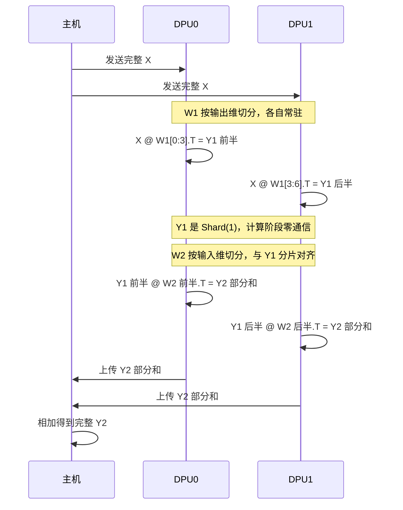

结论：

| 张量 | 布局 | 原因 |
| --- | --- | --- |
| `X` | `Replicate@host`，进 DPU 时触发 `scatter` | 输入从主机进入 DPU |
| `W1` | `Shard(0)@dpu`，`pinned` | 按输出维切 |
| `Y1` | `Shard(1)@dpu` | 每台算不同输出列 |
| `W2` | `Shard(1)@dpu`，`pinned` | 按输入维切 |
| `Y2` | `Partial(sum)@dpu` | 累加维被切，每台只有部分和 |
| `Y2 -> LayerNorm` | `all_reduce` | 主机层归一化要求完整值 |

## 测试文件说明

## `tests/test_spec_prop.py`

这个文件验证小图和 tiny Llama。

| 函数 | 作用 |
| --- | --- |
| `_appendix_a_graph` | 手工构造附录 A 的两层线性层 FX 图，并补齐 `meta["val"]` |
| `_appendix_a_config` | 给 `w1` 配列切，给 `w2` 配行切 |
| `test_appendix_a_placements` | 验证附录 A 的布局推导：`Y1=Shard`、`Y2=Partial`、LayerNorm 前有 `all_reduce` |
| `test_appendix_a_numeric_on_numpy_backend` | 用 `NumpyBackend` 模拟 DPU 分片计算，再和单卡 PyTorch 结果对齐 |
| `_propagate_tiny_llama` | 导出随机 tiny Llama，先跑问题 1，再跑本次问题 2 |
| `test_tiny_llama_weight_initial_sharding` | 验证 tiny Llama 权重初始切分与头边界对齐 |
| `test_tiny_llama_propagation_structure` | 验证每层 `o_proj` / `down_proj` 后有固定 `all_reduce`，最终输出经 `all_gather` 回主机 |
| `test_llama_shard_config_rejects_contract_violations` | 验证非法 DPU 数和不可整除维度会报错 |
| `test_propagate_requires_partition_first` | 验证必须先运行 `partition_graph` |
| `test_linear_weight_must_be_configured` | 验证线性层权重没有切分配置时会报错 |

数值对拍的意义是：不只检查元数据，还实际按 `shard_map` 切权重、搬到模拟 DPU、分片计算、再拼接或累加。如果这里能和 PyTorch 对齐，说明 `start_idx`、`end_idx`、`local_shape` 的含义没有写反。

## `tests/test_spec_prop_llama2_7b.py`

这个文件验证真实 Llama-2-7B。它依赖本地模型目录，不存在时自动跳过。

| 函数 | 作用 |
| --- | --- |
| `annotated_llama2` | 加载真实模型，导出静态图，运行问题 1 和问题 2，模块内复用结果 |
| `_get_attr_node` | 按权重名片段查找 `get_attr` 节点 |
| `test_every_tensor_node_has_spec` | 验证每个张量节点都有 `PIMTensorSpec` |
| `test_weight_initial_sharding_and_dpu_mapping` | 验证真实权重的切分、连续覆盖、头边界对齐 |
| `test_megatron_pattern_holds_for_all_32_layers` | 验证 32 层都保持列切到行切配对，每层两条 `all_reduce` |
| `test_redistribute_edges_well_formed_and_weights_never_moved` | 验证边编号连续、端点合法、权重不会出现在重分布边上 |
| `test_logits_exit_via_all_gather` | 验证最终 `lm_head` 输出经 `all_gather` 回主机 |
| `test_report_printable_and_propagation_idempotent` | 验证报告可打印，重复传播边数稳定 |

真实模型测试里的大量 `scatter` / `all_gather` 是预期现象：当前第 1 阶段白名单很窄，注意力、归一化、位置编码等很多算子还留在主机，所以会出现主机和 DPU 往返。结构性重点不是让通信最少，而是 Megatron 的关键配对不能断。

## `docs/spec_prop.md`

这是短模块文档，面向后续维护者。它记录：

| 内容 | 作用 |
| --- | --- |
| 对外接口 | `ShardConfig`、`llama_shard_config`、`propagate_specs`、`format_spec_report` |
| 关键设计 | 自维护规则表、权重初始切分、主机作为位置、重分布类型 |
| 方案对应 | 对应 `docs/spec.md` 的问题 2 和附录 A |

## 当前边界与注意事项

| 边界 | 当前行为 |
| --- | --- |
| 自动切分求优 | 不做，全部由 `ShardConfig` 手工指定 |
| 真实数据搬运 | 不做，本阶段只写元数据 |
| `addmm` 和带偏置 `linear` | 不支持，命中即报错 |
| `Shard(i) -> Shard(j)` | 不支持通用 `all_to_all`，命中即报错 |
| `Partial -> Shard` | 不支持，命中即报错 |
| `Partial` 上的一元非线性或标量操作 | 不支持，因为数值还没规约完整 |
| 权重重分布 | 禁止，权重是 `pinned` |
| KV 缓存 | 本次还未接入；第 1 阶段导出路径里通常 `use_cache=False` |
| MRAM 地址 | `mram_offset` 仍由问题 8 填 |

## 推荐读代码顺序

1. 先读 `contracts/pim_tensor_spec.py`，理解 `Placement`、`TensorShardDetail`、`PIMTensorSpec`、`RedistributeEdge`。
2. 再读 `graph/spec_prop.py` 顶部注释和 `propagate_specs`，掌握主流程。
3. 接着读 `_rule_linear` 和 `_rule_elementwise_binary`，这是当前最重要的两类规则。
4. 然后读 `_diff_edge` 和 `_edge_type`，理解什么时候生成什么通信边。
5. 最后读 `tests/test_spec_prop.py` 的附录 A 测试，用最小例子核对直觉。

## 下游如何使用本次产物

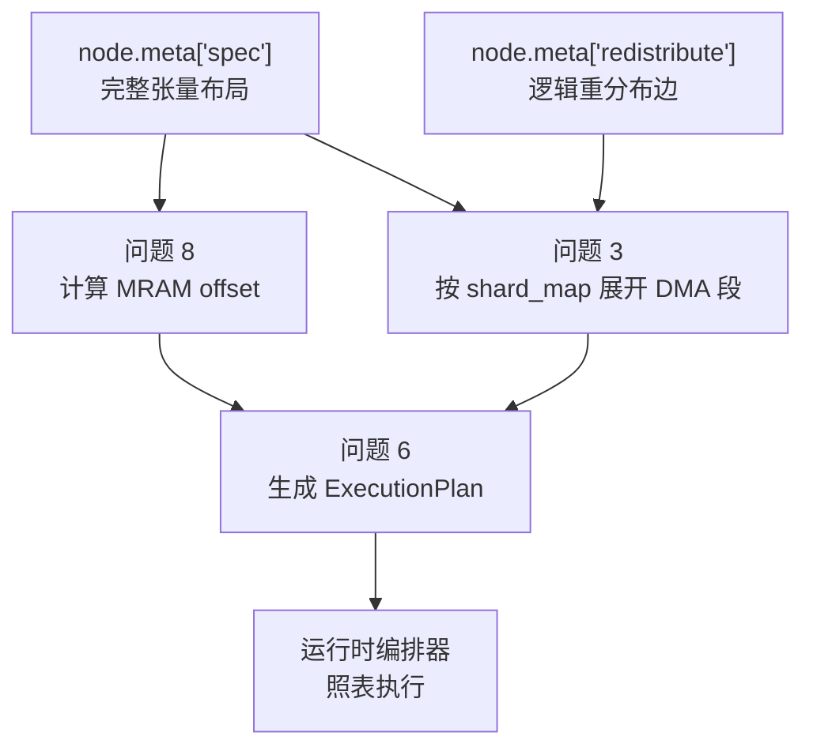

本次修改的关键价值是：下游不需要重新理解图，也不需要重新推导切分。它只读 `PIMTensorSpec` 和 `RedistributeEdge`，就能知道本地计算形状、通信类型、参与 DPU、逻辑字节数以及未来要展开的 DMA 方向。

## 最终行为更新

- `ShardConfig.dpu_ids` 是固定物理 DPU ID；所有 `shard_map` 键和
  `TensorShardDetail.dpu_id` 均直接使用它们，报告也打印物理 ID 与连续分片范围。
- 每条 `RedistributeEdge` 同时携带端点规格：`src_spec` 是生产者实际输出，
  `dst_spec` 是消费方要求的具化输入，供后续 DMA 和内存规划直接使用。
- `Replicate@dpu -> Replicate@host` 保留为 `all_gather`；问题 3 必须只从
  `min(edge.src_spec.shard_map)` 的物理 DPU 传一份完整副本到 host `dst_spec`，不能把
  各 DPU 副本拼接。
- 传播会检查 `args` 与 `kwargs` 中的张量操作数，并在每次运行前清除旧标注；host 节点
  固定为 `Replicate@host`。同位置的 `local_slice` 不表示跨 DPU DMA。
- 验证新增固定物理映射、端点规格、关键字参数和重复运行的覆盖；附录 A 仍由
  NumpyBackend 数值对拍证明，Llama-2-7B 只做 export/partition/propagate 结构验证。
