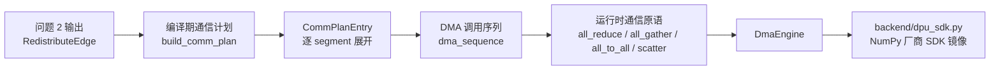
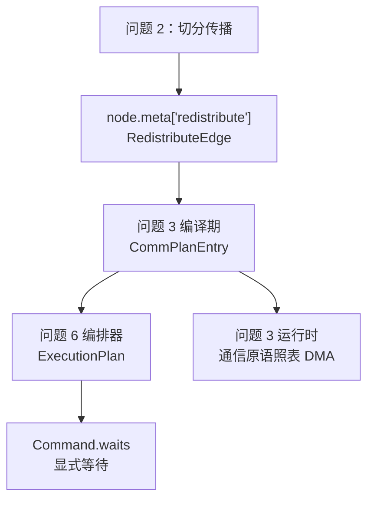
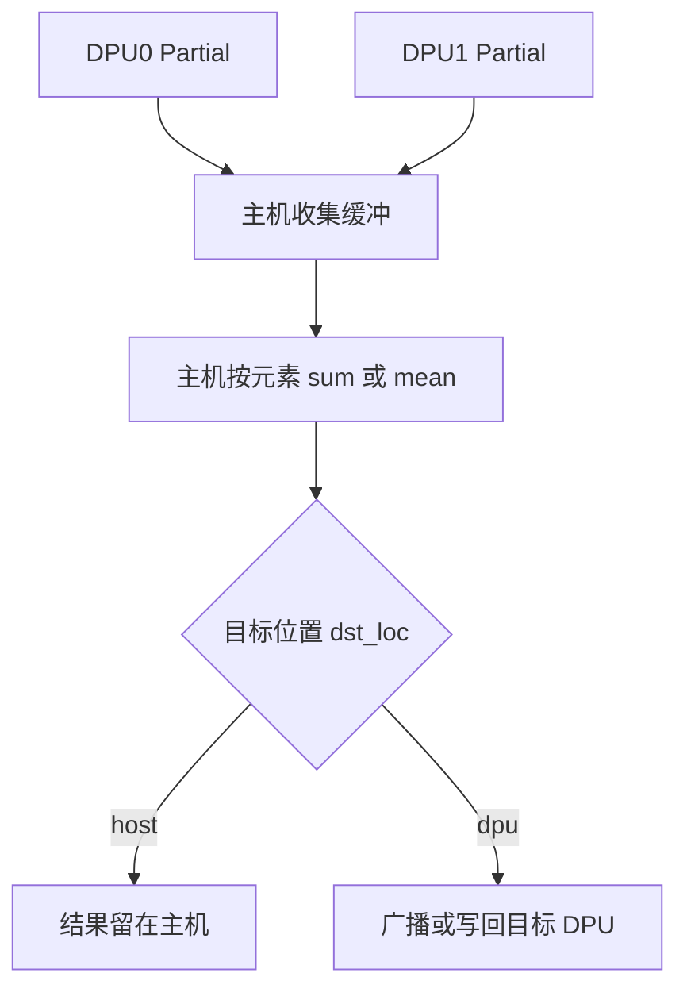
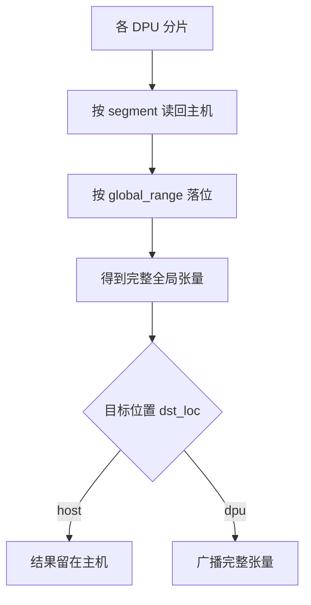
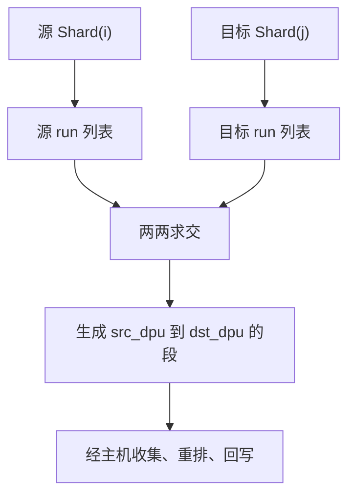
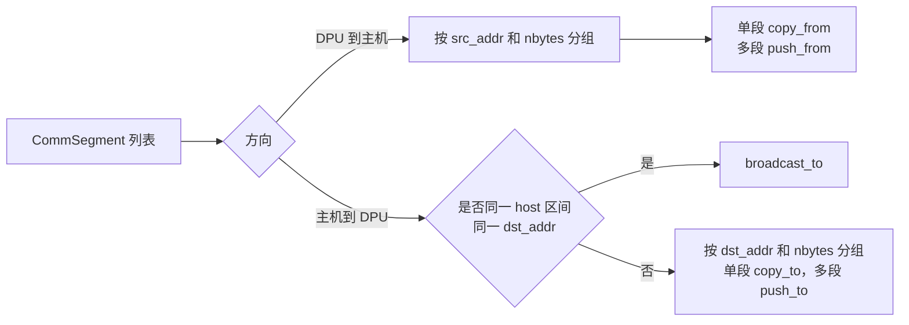

# 通信库修改说明

日期：2026-08-22

本文用于快速理解当前工作区未提交的通信库改动。主线是“问题 3：把问题 2 产生的 `RedistributeEdge` 下沉为经主机中转的显式 DMA 序列”，同时补了一层厂商 SDK 的 NumPy 镜像，让通信库、假后端和后续编排器可以共享同一份伪硬件状态。

## 一句话概括

这次改动把“图上标了需要通信”推进到“每段数据从哪台 DPU 的哪个地址读、写到哪台 DPU 的哪个地址、运行时调用哪类 DMA 原语”：



核心思想很简单：DPU 之间没有直连，所有跨 DPU 数据交换都走“DPU 到主机、主机处理、主机再写回 DPU”。通信类型、参与 DPU、张量形状和地址在编译期定死，运行时只照表执行。

## 修改文件总览

### 已跟踪修改

| 文件 | 本次变化 | 作用 |
| --- | --- | --- |
| `comm/plan.py` | 从空文件新增 413 行实现 | 编译期通信计划表，负责把 `RedistributeEdge` 展开成逐段 `CommSegment`，并生成合批后的 DMA 序列和成本估算。 |
| `comm/lowering.py` | 从空文件新增 194 行实现 | 运行时通信库，按通信计划执行 `all_reduce`、`all_gather`、`all_to_all`、`scatter`、`broadcast`。 |
| `backend/hal_numpy.py` | 改为使用 `backend/dpu_sdk.py` 管理 MRAM 和同步拷贝 | 让问题 6 的异步 HAL 与通信库共享同一份伪硬件状态。 |
| `contracts/pim_tensor_spec.py` | 给 `RedistributeEdge` 新增 `shape`、`dtype` 字段 | 通信计划需要全局形状和数据类型，才能精确计算摊平坐标和字节数。 |
| `graph/spec_prop.py` | `_diff_edge` 写入 `shape`、`dtype` | 问题 2 生成的通信边现在携带问题 3 所需的形状和类型信息。 |
| `docs/hal_numpy.md` | 补充假后端与 SDK 镜像的关系 | 说明 MRAM 和 DMA 已下沉到 `dpu_sdk.py`。 |
| `CLAUDE.md` | 更新 `backend/` 目录职责 | 把 `dpu_sdk.py` 纳入仓库指引中的后端说明。 |

### 未跟踪新增文件

| 文件 | 作用 |
| --- | --- |
| `backend/dpu_sdk.py` | 厂商 SDK 的 NumPy 镜像，提供 `dpu_alloc`、`dpu_copy_to`、`dpu_copy_from`、`dpu_push_xfer`、`dpu_broadcast_to` 等接口。 |
| `docs/comm.md` | 通信模块短文档，列出公开接口、设计要点和验证文件。 |
| `tests/test_dpu_sdk.py` | 验证 SDK 镜像的集合语义、独立地址空间、越界检查、批量传输和 kernel 装载。 |
| `tests/test_comm_plan.py` | 验证编译期通信计划表的段展开、覆盖检查、合批规则和成本估算。 |
| `tests/test_comm_lowering.py` | 验证运行时通信原语的数值结果和搬运行为。 |
| `tests/test_comm_llama2_7b.py` | 在真实 Llama-2-7B 图上验证问题 1 到问题 3 的结构，并抽样验证 MLP、logits gather、scatter 的数值。 |

## 功能概述

### 这次支持了什么

| 通信类型 | 来源布局到目标布局 | 运行时行为 |
| --- | --- | --- |
| `all_reduce` | `Partial` 到 `Replicate` | 每台 DPU 把完整形状的部分和传回主机，主机求和或求均值，再按目标位置决定是否写回 DPU。 |
| `all_gather` | `Shard` 到 `Replicate` | 各 DPU 把自己的分片传回主机，主机按全局位置拼完整张量，再按目标位置决定是否广播回 DPU。 |
| `all_to_all` | `Shard(i)` 到 `Shard(j)` | 主机先收集源分片，再按目标切分维度重排，最后分发到目标 DPU。 |
| `scatter` | 主机完整张量到 DPU 分片或副本 | 主机按目标 `shard_map` 切片，下发到各 DPU；目标是完整副本时退化为广播。 |
| `local_slice` | 本地完整副本到本地分片视图 | 保留一条空计划作为占位，零 DMA。 |

### 和问题 2、问题 6 的关系



通信库本身不判断“要不要通信”，也不自己做等待。等待依赖来自问题 6 的 `Command.waits`；通信库拿到计划条目时，默认前驱已经完成。

## 关键数据结构

### `RedistributeEdge`

这是问题 2 的输出，也是问题 3 的输入。本次新增两个字段：

| 字段 | 含义 |
| --- | --- |
| `shape` | 全局逻辑张量形状，通信计划按它做行主序摊平。 |
| `dtype` | 张量数据类型字符串，例如 `float16`、`float32`，用于换算每段字节数。 |

### `CommSegment`

`CommSegment` 是通信计划表最细的一行，表示一段连续搬运。

| 字段 | 含义 |
| --- | --- |
| `edge_id` | 对应哪条 `RedistributeEdge`。 |
| `type` | 通信类型。 |
| `src_dpu` | 源 DPU；为 `None` 表示源在主机缓冲区。 |
| `src_local_range` | 源端本地摊平元素区间，半开区间。 |
| `global_range` | 这段数据在全局摊平张量里的元素区间。 |
| `dst_dpu` | 目标 DPU；为 `None` 表示目标在主机缓冲区。 |
| `dst_local_offset` | 写入目标本地缓冲区的元素偏移。 |
| `nbytes` | 本段字节数。 |
| `reduce` | 仅 `all_reduce` 使用，例如 `sum` 或 `mean`。 |
| `src_addr` / `dst_addr` | 已烘烤好的绝对字节地址，DPU 侧是 MRAM 偏移，主机侧是缓冲区偏移。 |
| `dst_ready_after` | 预留给问题 8 的写前等待，目前恒为空。 |

### `CommPlanEntry`

一条 `RedistributeEdge` 对应一个 `CommPlanEntry`。

| 字段 | 含义 |
| --- | --- |
| `edge_id` | 通信计划主键。 |
| `type` | 通信类型。 |
| `reduce` | 归约方式，仅 `all_reduce` 有值。 |
| `shape` / `dtype` | 全局形状和 NumPy 数据类型。 |
| `dst_loc` | 目标在主机还是 DPU。 |
| `wait_for` | 边级读前等待，当前等于全部源 DPU；源在主机时为空。 |
| `segments` | 逐段搬运计划。 |

它还提供两个便捷属性：

| 属性 | 含义 |
| --- | --- |
| `collect_segments` | 源端是 DPU 的段，也就是 DPU 到主机的收集段。 |
| `writeback_segments` | 目标端是 DPU 的段，也就是主机写回 DPU 的段。 |

### `DmaOp`

`DmaOp` 是把多个 `CommSegment` 合批后的实际 SDK 调用。

| `kind` | 对应行为 |
| --- | --- |
| `copy_from` | 单段 DPU 到主机。 |
| `copy_to` | 单段主机到 DPU。 |
| `push_from` | 多台 DPU 同地址同长度读回，合并为一次 `dpu_push_xfer`。 |
| `push_to` | 多台 DPU 同地址同长度写入，合并为一次 `dpu_push_xfer`。 |
| `broadcast_to` | 同一份主机数据写入多台 DPU，合并为一次 `dpu_broadcast_to`。 |

### `DpuSet`

`DpuSet` 是 `backend/dpu_sdk.py` 对厂商 `dpu_set_t` 的 NumPy 镜像。它持有一组 DPU 编号，支持迭代单 DPU 子集、取子集、按 `dpu_id` 获取单台 DPU。每台 DPU 有独立 MRAM 字节数组。

## 新增和修改的函数

### `comm/plan.py`

| 函数或类 | 状态 | 作用 |
| --- | --- | --- |
| `CommSegment` | 新增 | 通信计划表的逐段数据结构。 |
| `CommPlanEntry` | 新增 | 一条重分布边的完整计划。 |
| `_runs` | 新增 | 把一个分片展开为全局摊平坐标下的连续段。 |
| `_global_shape` | 新增 | 从 `PIMTensorSpec.shard_map` 反推全局形状。 |
| `_spec_runs` | 新增 | 遍历一个 spec 的全部 DPU 分片段。 |
| `_segment` | 新增 | 构造一条 `CommSegment`，同时计算绝对地址。 |
| `_collect_segments` | 新增 | 生成 DPU 到主机的收集段。 |
| `_writeback_segments` | 新增 | 生成主机到 DPU 的回写段。 |
| `_all_to_all_segments` | 新增 | 对源分片段和目标分片段求交，生成重切分段。 |
| `_check_coverage` | 新增 | 检查段是否完整覆盖全局张量，防止缺口或重叠。 |
| `_entry_of_edge` | 新增 | 把单条 `RedistributeEdge` 转成 `CommPlanEntry`。 |
| `build_comm_plan` | 新增 | 编译期主入口，批量生成通信计划表。 |
| `DmaOp` | 新增 | 合批后的 DMA 调用描述。 |
| `_batch` | 新增 | 按地址和长度把多个段合批。 |
| `dma_sequence` | 新增 | 把计划条目展开为有序 SDK 调用序列。 |
| `HostStarCostModel` | 新增 | 主机星型拓扑成本模型。 |
| `CommCost` | 新增 | 单条通信计划的成本结果。 |
| `plan_cost` | 新增 | 估算通信调用次数、字节数和时间。 |
| `format_comm_plan` | 新增 | 输出便于调试的通信计划文本。 |

### `comm/lowering.py`

| 函数或类 | 状态 | 作用 |
| --- | --- | --- |
| `DmaEngine` | 新增 | 底层 DMA 封装，统一调用 SDK 镜像。 |
| `DmaEngine.copy_from_dpu` | 新增 | 从单台 DPU 读回一段数组。 |
| `DmaEngine.copy_to_dpu` | 新增 | 向单台 DPU 写入一段数组。 |
| `DmaEngine.run_collect` | 新增 | 执行 `copy_from` 或 `push_from`，返回逐段主机缓冲区。 |
| `DmaEngine.run_writeback` | 新增 | 执行 `copy_to`、`push_to` 或 `broadcast_to`。 |
| `_check_entry` | 新增 | 检查原语收到的计划类型是否匹配。 |
| `_collect` | 新增 | 执行一个条目的全部收集方向 DMA。 |
| `_writeback` | 新增 | 执行一个条目的全部回写方向 DMA。 |
| `_merged` | 新增 | 按 `global_range` 把收集段落位为完整主机缓冲区。 |
| `all_reduce` | 新增 | 执行部分和归约，必要时写回 DPU。 |
| `all_gather` | 新增 | 执行分片收集和拼接，必要时广播回 DPU。 |
| `all_to_all` | 新增 | 执行跨切分维度重排。 |
| `scatter` | 新增 | 把主机完整张量切片下发。 |
| `broadcast` | 新增 | 把主机一份数据复制到多个目标 DPU。 |

### `backend/dpu_sdk.py`

| 函数或类 | 状态 | 作用 |
| --- | --- | --- |
| `DpuError` | 新增 | 用异常表示 SDK 错误。 |
| `_Dpu` | 新增 | 单台 DPU 的 MRAM 和已装载程序。 |
| `_Machine` | 新增 | 一组 DPU 和批量传输缓冲区登记表。 |
| `DpuSet` | 新增 | 厂商 `dpu_set_t` 的集合镜像。 |
| `_check_live` | 新增 | 检查集合是否已释放。 |
| `_check_range` | 新增 | 检查 MRAM 访问范围。 |
| `_as_bytes` | 新增 | 把主机缓冲区转成连续字节视图。 |
| `dpu_alloc` / `dpu_free` / `dpu_get_nr_dpus` | 新增 | DPU 分配、释放和数量查询。 |
| `dpu_copy_to` / `dpu_copy_from` | 新增 | 主机和 DPU 之间的同步拷贝。 |
| `dpu_prepare_xfer` / `dpu_push_xfer` | 新增 | 两段式批量传输。 |
| `dpu_broadcast_to` | 新增 | 一份主机数据广播到多个 DPU。 |
| `dpu_load` / `dpu_launch` / `dpu_sync` / `dpu_status` | 新增 | kernel 装载、执行、同步和状态查询。 |
| `dpu_log_read` | 新增 | 日志读取占位。 |

### 其他修改

| 文件 | 函数或结构 | 状态 | 作用 |
| --- | --- | --- | --- |
| `contracts/pim_tensor_spec.py` | `RedistributeEdge.shape`、`RedistributeEdge.dtype` | 修改 | 给通信计划提供形状和类型。 |
| `graph/spec_prop.py` | `_diff_edge` | 修改 | 生成重分布边时填入 `shape` 和 `dtype`。 |
| `backend/hal_numpy.py` | `NumpyBackend.__init__` | 修改 | 改为通过 `dpu_alloc` 创建底层 DPU 集合。 |
| `backend/hal_numpy.py` | `NumpyBackend.dpu_set` | 新增 | 暴露底层 `DpuSet`，供通信库复用。 |
| `backend/hal_numpy.py` | `copy_to_dpu` / `copy_from_dpu` | 修改 | 改为委托 `dpu_copy_to` / `dpu_copy_from`。 |
| `backend/hal_numpy.py` | `DPUDevice` | 删除 | MRAM 状态不再由 HAL 自己维护，统一交给 SDK 镜像。 |

## 原理说明

### 为什么按 segment 展开

不能只记录“哪些 DPU 参与”和“总字节数”。原因是 `Shard` 的拼接顺序由全局张量位置决定，不一定等于 DPU 编号顺序；而且 `Shard(i)` 到 `Shard(j)` 时，一个源 DPU 的数据可能要拆成多段发给多个目标 DPU。

所以计划表按数据段描述，每段都带 `global_range`：

```text
全局张量 [0, 1, 2, 3, 4, 5]

DPU0 持有后半段 [3, 4, 5]  -> global_range = [3, 6)
DPU1 持有前半段 [0, 1, 2]  -> global_range = [0, 3)

all_gather 时必须按 global_range 拼接：
先放 DPU1，再放 DPU0。
```

如果按 DPU 编号拼接，就会得到 `[3, 4, 5, 0, 1, 2]`，不会报错但数值错位。

### 多维切分怎么处理

这次实现统一使用“行主序摊平元素坐标”。一个 `Shard(d)` 分片会被拆成 `prod(shape[:d])` 段连续 run。

例如张量形状是 `(1, 4, 8)`，沿第 2 维切成两半：

```text
每一行长度 8。
DPU0 持有每行前 4 个元素。
DPU1 持有每行后 4 个元素。

摊平后不是一整块连续区间，而是交错的 4 段：
DPU0: [0,4), [8,12), [16,20), [24,28)
DPU1: [4,8), [12,16), [20,24), [28,32)
```

这修正了“只按总字节数搬一整段”的漏洞，使 logits 这类 `Shard(2)` 且序列长度大于 1 的场景可以正确拼接。

### `all_reduce` 流程



### `all_gather` 流程



### `all_to_all` 流程



### DMA 合批规则



合批只改变 SDK 调用次数，不改变每段的逻辑含义。成本估算也按合批后的调用次数计算。

## 使用方法

### 编译期生成通信计划

```python
from comm.plan import build_comm_plan, format_comm_plan

entries = build_comm_plan(edges)
print(format_comm_plan(entries, max_segments=4))
```

`edges` 来自 `graph.spec_prop.propagate_specs`。生成后每个 `entry.edge_id` 对应原来的 `RedistributeEdge.edge_id`。

### 查看 DMA 序列和成本

```python
from comm.plan import dma_sequence, plan_cost

for entry in entries:
    ops = dma_sequence(entry)
    cost = plan_cost(entry)
    print(entry.edge_id, [op.kind for op in ops], cost)
```

### 运行时执行通信

```python
from backend.dpu_sdk import dpu_alloc
from comm.lowering import DmaEngine, all_reduce, all_gather, scatter

dpu_set = dpu_alloc(2, mram_bytes=2**20)
engine = DmaEngine(dpu_set)

# entry.type == "all_reduce"
result = all_reduce(entry, engine)

# entry.type == "all_gather"
full_tensor = all_gather(entry, engine)

# entry.type == "scatter"
scatter(entry, engine, host_tensor)
```

如果已经创建了 `NumpyBackend`，应复用它暴露的 `dpu_set`：

```python
from backend.hal_numpy import NumpyBackend, NumpyBackendConfig
from comm.lowering import DmaEngine

backend = NumpyBackend(NumpyBackendConfig(num_dpus=2, mram_bytes_per_dpu=2**20))
engine = DmaEngine(backend.dpu_set)
```

这样通信库和 HAL 读写的是同一份伪 MRAM。

## 验证方法

每个新 shell 先加载仓库要求的 PyTorch 环境：

```bash
source /media/disk/fengjingge/src/flagOS/flagOS-installed/pytorch/env-pytorch.sh
```

### 快速单元验证

```bash
python -m pytest tests/test_dpu_sdk.py tests/test_comm_plan.py tests/test_comm_lowering.py -q
```

覆盖内容：

| 测试文件 | 验证点 |
| --- | --- |
| `tests/test_dpu_sdk.py` | DPU 分配、独立地址空间、越界报错、批量传输、广播、kernel 装载和无 DPU 直连。 |
| `tests/test_comm_plan.py` | `all_reduce`、`all_gather`、`all_to_all`、`scatter`、`local_slice` 的段展开，覆盖检查，合批和成本估算。 |
| `tests/test_comm_lowering.py` | 通信原语在 SDK 镜像上的数值正确性，包括 Megatron 两层线性的端到端小例子。 |

### 真实 Llama-2-7B 结构和抽样数值验证

```bash
python -m pytest tests/test_comm_llama2_7b.py -q
```

这个测试依赖本机存在：

```text
/media/disk/fengjingge/src/flagOS/flagOS-installed/model-inference/models/Llama-2-7b-hf
```

验证内容包括：

| 场景 | 判据 |
| --- | --- |
| 每条通信边都能生成计划 | `edge_id` 和 `entry.type` 一一对应。 |
| MLP 的 `o_proj`、`down_proj` | 每条 `all_reduce` 展开为 8 个收集段和 8 个回写段，DMA 序列是一次 `push_from` 加一次 `broadcast_to`。 |
| logits 输出 | `Shard(2)` 按每个序列位置展开为逐行段，8 台 DPU、序列长 16 时共 128 个收集段。 |
| MLP 数值 | 伪硬件上的通信归约结果和单卡 PyTorch 参考对齐。 |
| logits gather 与 scatter | 纯搬运要求逐字节相等。 |

### 打印计划辅助排查

```python
from comm.plan import format_comm_plan

print(format_comm_plan(entries, max_segments=2))
```

这会输出每条边的类型、形状、等待 DPU、目标位置和前几段 segment，适合定位“哪条边的分片顺序错了”。

## 当前存在的问题和限制

| 问题 | 当前状态 | 影响 |
| --- | --- | --- |
| 真硬件后端未接入 | `backend/dpu_sdk.py` 是 NumPy 镜像，`hal_vendor.py` 仍是占位。 | 当前只能验证功能和顺序语义，不能代表真实硬件性能。 |
| DPU 之间无直连 | SDK 镜像也刻意不提供 DPU 到 DPU 拷贝。 | 所有跨 DPU 通信都要经主机两跳，性能瓶颈会集中在主机带宽。 |
| `dst_ready_after` 还为空 | 问题 8 的 `pending_readers` 尚未接入通信计划。 | 原地复用地址的写前等待还不能由通信库独立表达，后续要由执行计划统一补齐。 |
| `bfloat16` 可能无法建计划 | `comm/plan.py` 用 `np.dtype(edge.dtype)` 映射类型，NumPy 不一定支持 `bfloat16`。 | 如果图里出现 `bfloat16` 通信边，会直接报错，需要后续加类型映射或字节搬运模式。 |
| 成本模型很粗 | `plan_cost` 只按固定启动开销加主机带宽线性项估算。 | 只能用于早期比较通信量和调用次数，不能当真实性能数据。 |
| SDK 镜像不支持 rank 层级 | 当前 DPU 编号是扁平编号。 | 后续真硬件如果按 rank 暴露拓扑，需要补层次映射。 |
| kernel 二进制不能在 NumPy 镜像执行 | `dpu_load` 可登记 bytes，但 `dpu_launch` 只能执行 Python callable。 | 算子编译器产出的真实二进制还不能在这个镜像里运行。 |
| `dpu_push_xfer` 要求同地址同长度 | 这符合 SDK 批量传输语义，计划生成也按这个约束合批。 | 地址或长度不同的段会拆成多次传输，不能强行合并。 |
| `dpu_prepare_xfer` 应传连续数组 | 当前实现会把输入转为连续数组。 | 如果给的是非连续目标缓冲区，读回方向可能写到临时连续副本里，调用方应传连续数组。 |
| 通信成本尚未进入 GeneSim | 当前 `plan_cost` 在 Python 内可用，但未导出为仿真通信节点。 | 性能评估还看不到 host-star 通信瓶颈。 |

## 阅读代码建议

按下面顺序读最快：

1. 先读 `contracts/pim_tensor_spec.py` 里的 `RedistributeEdge`，确认问题 2 传给问题 3 的信息。
2. 再读 `comm/plan.py` 的 `build_comm_plan`、`_entry_of_edge`、`_runs`，理解“逻辑边到 segment”的展开。
3. 接着读 `dma_sequence`，理解哪些段会变成 `copy_*`、`push_*` 或 `broadcast_to`。
4. 然后读 `comm/lowering.py` 的 `all_reduce`、`all_gather`、`all_to_all`，理解运行时“收集、主机处理、回写”的三段式。
5. 最后读 `backend/dpu_sdk.py`，确认这些 DMA 调用在 NumPy 伪硬件上具体如何读写 MRAM。

## 代码量变化

已跟踪文件当前统计为 `+637 / -20`。未跟踪新增文件合计约 1200 行，其中包括 SDK 镜像、通信短文档和 4 个测试文件。这次净增较多的主要原因是通信库第一次落地，需要同时补齐编译期计划、运行时执行、SDK 镜像和测试闭环。
